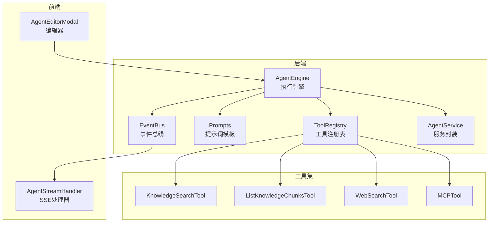
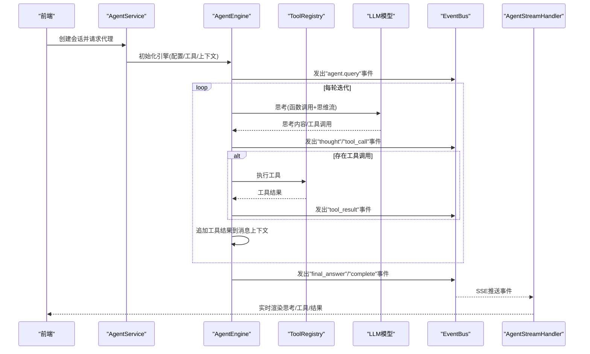
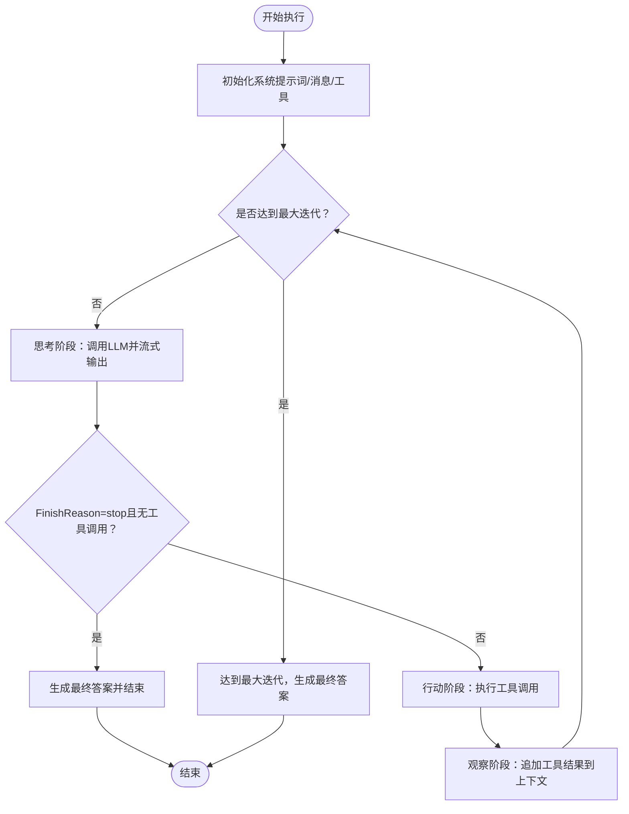
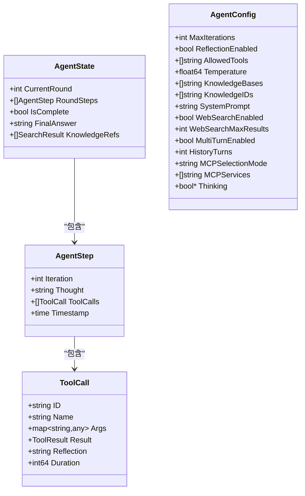
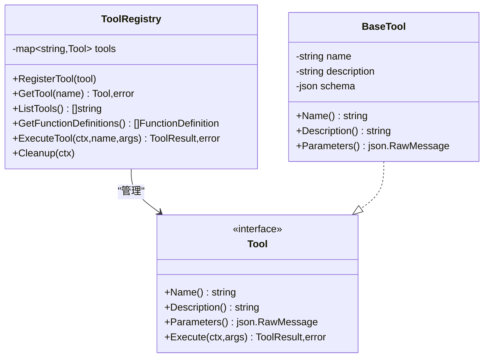
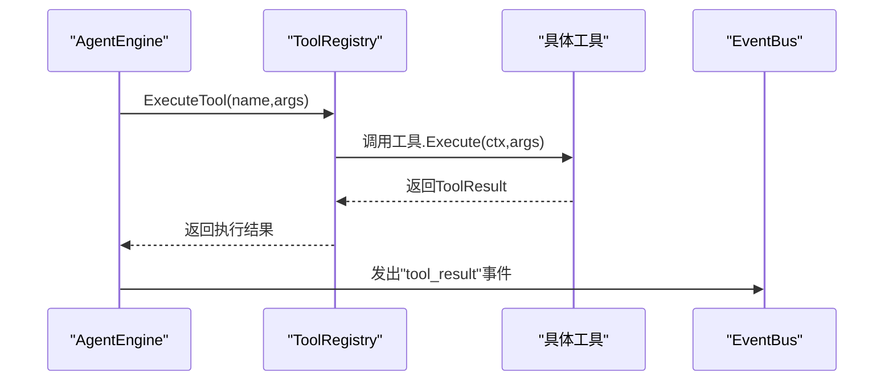
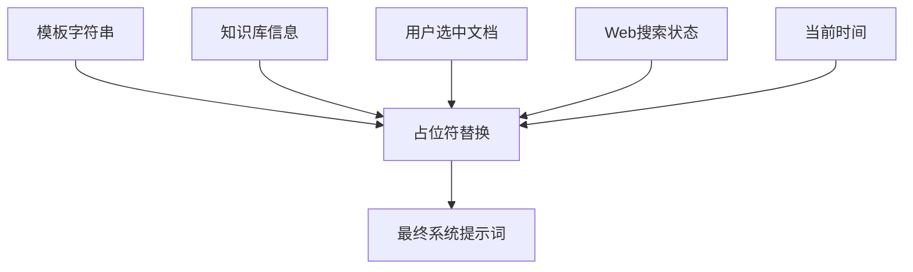
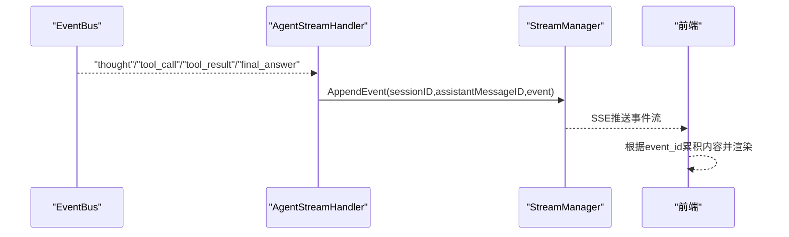
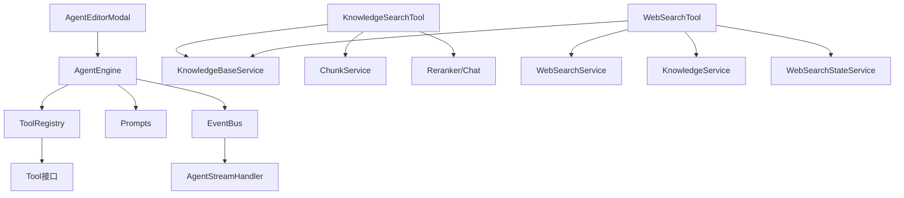

# 智能代理引擎

<cite>
**本文档引用的文件**
- [internal/agent/engine.go](file://internal/agent/engine.go)
- [internal/agent/prompts.go](file://internal/agent/prompts.go)
- [internal/agent/tools/registry.go](file://internal/agent/tools/registry.go)
- [internal/agent/tools/tool.go](file://internal/agent/tools/tool.go)
- [internal/agent/const.go](file://internal/agent/const.go)
- [internal/types/agent.go](file://internal/types/agent.go)
- [internal/agent/tools/knowledge_search.go](file://internal/agent/tools/knowledge_search.go)
- [internal/agent/tools/list_knowledge_chunks.go](file://internal/agent/tools/list_knowledge_chunks.go)
- [internal/agent/tools/web_search.go](file://internal/agent/tools/web_search.go)
- [config/prompt_templates/system_prompt.yaml](file://config/prompt_templates/system_prompt.yaml)
- [frontend/src/views/agent/AgentEditorModal.vue](file://frontend/src/views/agent/AgentEditorModal.vue)
- [internal/event/event.go](file://internal/event/event.go)
- [internal/handler/session/agent_stream_handler.go](file://internal/handler/session/agent_stream_handler.go)
- [internal/application/service/agent_service.go](file://internal/application/service/agent_service.go)
- [internal/agent/tools/mcp_tool.go](file://internal/agent/tools/mcp_tool.go)
- [mcp-server/weknora_mcp_server.py](file://mcp-server/weknora_mcp_server.py)
</cite>

## 目录
1. [简介](#简介)
2. [项目结构](#项目结构)
3. [核心组件](#核心组件)
4. [架构总览](#架构总览)
5. [详细组件分析](#详细组件分析)
6. [依赖关系分析](#依赖关系分析)
7. [性能考量](#性能考量)
8. [故障排查指南](#故障排查指南)
9. [结论](#结论)
10. [附录](#附录)

## 简介
本技术文档面向智能代理引擎（ReAct 架构），系统性阐述其设计与实现，包括思考(Reason)、行动(Action)、观察(Observe)三阶段的执行流程；代理状态管理机制（状态转换、记忆保持、决策树构建）；工具注册表系统（工具接口定义、工具调用流程、错误处理）；代理提示词工程（系统提示词、用户提示词与工具使用示例）；以及代理配置与定制化实践（工具扩展、提示词优化、性能调优）。文档同时提供可视化图示与实操建议，帮助开发者与运维人员高效理解与使用该引擎。

## 项目结构
智能代理引擎位于后端 Go 代码内部，围绕 AgentEngine 核心控制器组织，配合工具注册表、提示词模板、事件总线与前端交互层协同工作。关键模块如下：
- 引擎与状态：AgentEngine、AgentState、AgentStep、AgentConfig
- 工具体系：ToolRegistry、BaseTool、具体工具（知识检索、分块读取、网络搜索等）
- 提示词工程：系统提示词模板渲染、占位符替换、动态 Web 搜索状态注入
- 事件与流式输出：EventBus、SSE 流式处理器
- 前端编辑器：Agent 编辑器模态框支持系统提示词模板选择与占位符插入

**图表来源**
- [internal/agent/engine.go](file://internal/agent/engine.go#L25-L73)
- [internal/agent/tools/registry.go](file://internal/agent/tools/registry.go#L12-L58)
- [internal/agent/prompts.go](file://internal/agent/prompts.go#L301-L330)
- [internal/event/event.go](file://internal/event/event.go#L83-L104)
- [internal/handler/session/agent_stream_handler.go](file://internal/handler/session/agent_stream_handler.go#L15-L54)
- [frontend/src/views/agent/AgentEditorModal.vue](file://frontend/src/views/agent/AgentEditorModal.vue#L107-L189)

**章节来源**
- [internal/agent/engine.go](file://internal/agent/engine.go#L25-L73)
- [internal/agent/tools/registry.go](file://internal/agent/tools/registry.go#L12-L58)
- [internal/agent/prompts.go](file://internal/agent/prompts.go#L301-L330)
- [internal/event/event.go](file://internal/event/event.go#L83-L104)
- [internal/handler/session/agent_stream_handler.go](file://internal/handler/session/agent_stream_handler.go#L15-L54)
- [frontend/src/views/agent/AgentEditorModal.vue](file://frontend/src/views/agent/AgentEditorModal.vue#L107-L189)

## 核心组件
- AgentEngine：ReAct 执行主控制器，负责循环调度思考、行动与观察，维护状态与消息上下文，通过 EventBus 发布事件。
- AgentState/AgentStep：记录每轮迭代的思考内容、工具调用、结果与时间戳，支撑最终合成与回放。
- ToolRegistry：集中管理工具注册、函数定义导出、执行与清理，支持 MCP 工具动态接入。
- Prompts：系统提示词模板渲染，支持知识库列表、用户选中文档、Web 搜索状态注入与占位符替换。
- EventBus：事件总线，统一发布思考、工具调用、工具结果、最终答案等事件，驱动前端实时反馈。
- AgentService：服务封装，负责创建 AgentEngine 并注入模型、检索、重排序、MCP 等依赖。

**章节来源**
- [internal/types/agent.go](file://internal/types/agent.go#L107-L178)
- [internal/agent/engine.go](file://internal/agent/engine.go#L25-L155)
- [internal/agent/tools/registry.go](file://internal/agent/tools/registry.go#L12-L114)
- [internal/agent/prompts.go](file://internal/agent/prompts.go#L301-L330)
- [internal/event/event.go](file://internal/event/event.go#L70-L88)
- [internal/application/service/agent_service.go](file://internal/application/service/agent_service.go#L71-L81)

## 架构总览
ReAct 引擎采用“思考-行动-观察”循环，结合工具函数调用与消息上下文持久化，形成可追踪、可回放的推理链路。系统通过事件总线实现前后端解耦，前端通过 SSE 实时接收思考过程、工具调用与结果。

**图表来源**
- [internal/agent/engine.go](file://internal/agent/engine.go#L157-L521)
- [internal/agent/tools/registry.go](file://internal/agent/tools/registry.go#L60-L103)
- [internal/event/event.go](file://internal/event/event.go#L42-L68)
- [internal/handler/session/agent_stream_handler.go](file://internal/handler/session/agent_stream_handler.go#L56-L69)

**章节来源**
- [internal/agent/engine.go](file://internal/agent/engine.go#L157-L521)
- [internal/agent/tools/registry.go](file://internal/agent/tools/registry.go#L60-L103)
- [internal/event/event.go](file://internal/event/event.go#L42-L68)
- [internal/handler/session/agent_stream_handler.go](file://internal/handler/session/agent_stream_handler.go#L56-L69)

## 详细组件分析

### ReAct 执行引擎（AgentEngine）
- 初始化与状态管理
  - 构建系统提示词（支持知识库列表、用户选中文档、Web 搜索状态），准备消息上下文与工具定义。
  - 维护 AgentState，记录每轮思考、工具调用、最终答案与知识引用。
- 循环执行
  - 思考阶段：调用 LLM 进行函数调用与思维流式输出，通过 EventBus 发布“thought”事件。
  - 行动阶段：解析工具调用，执行工具并发布“tool_call”“tool_result”事件；对 show_options 等需要用户输入的工具，中断循环等待。
  - 观察阶段：将工具结果追加到消息上下文并持久化，准备下一轮思考。
  - 终止条件：达到最大迭代次数或 LLM 返回“stop”且无工具调用时生成最终答案。
- 事件与日志
  - 全流程通过 EventBus 发布事件，便于监控与前端实时渲染；失败时发出“error”事件。

**图表来源**
- [internal/agent/engine.go](file://internal/agent/engine.go#L75-L155)
- [internal/agent/engine.go](file://internal/agent/engine.go#L157-L521)

**章节来源**
- [internal/agent/engine.go](file://internal/agent/engine.go#L75-L155)
- [internal/agent/engine.go](file://internal/agent/engine.go#L157-L521)

### 代理状态管理机制
- AgentState
  - 字段：当前轮次、每轮步骤、是否完成、最终答案、知识引用。
  - 作用：承载一次完整推理过程的状态快照，支持最终合成与历史回放。
- AgentStep
  - 字段：迭代号、思考内容、工具调用列表、时间戳。
  - 作用：记录单轮内所有思考与工具调用，便于溯源与调试。
- AgentConfig
  - 字段：最大迭代次数、温度、允许工具列表、Web 搜索开关、MCP 选择模式等。
  - 作用：统一控制代理行为与提示词模板选择。

**图表来源**
- [internal/types/agent.go](file://internal/types/agent.go#L163-L178)
- [internal/types/agent.go](file://internal/types/agent.go#L140-L146)
- [internal/types/agent.go](file://internal/types/agent.go#L130-L138)
- [internal/types/agent.go](file://internal/types/agent.go#L107-L120)

**章节来源**
- [internal/types/agent.go](file://internal/types/agent.go#L107-L178)

### 工具注册表系统
- 注册与检索
  - 注册：RegisterTool 将工具加入映射。
  - 获取：GetTool 按名称检索；GetFunctionDefinitions 导出函数定义供 LLM 函数调用。
- 执行与清理
  - ExecuteTool：按名称执行工具，记录执行结果与错误；支持 DataAnalysis 工具的专用清理。
- 工具接口与基类
  - Tool 接口：Name、Description、Parameters、Execute。
  - BaseTool：封装名称、描述、参数 Schema 的通用实现。

**图表来源**
- [internal/agent/tools/registry.go](file://internal/agent/tools/registry.go#L12-L114)
- [internal/agent/tools/tool.go](file://internal/agent/tools/tool.go#L10-L47)
- [internal/types/agent.go](file://internal/types/agent.go#L107-L120)

**章节来源**
- [internal/agent/tools/registry.go](file://internal/agent/tools/registry.go#L12-L114)
- [internal/agent/tools/tool.go](file://internal/agent/tools/tool.go#L10-L86)
- [internal/types/agent.go](file://internal/types/agent.go#L107-L120)

### 工具实现与调用流程
- 知识检索工具（知识搜索）
  - 输入：queries（1–5 个语义查询）、可选知识库 ID 列表。
  - 处理：并发按目标搜索、去重、重排（优先 LLM 重排，其次模型重排）、MMR 去冗余、复合评分。
  - 输出：结构化结果与人类可读摘要。
- 分块读取工具（list_knowledge_chunks）
  - 输入：knowledge_id、limit、offset。
  - 处理：分页获取文本/FAQ 分块，补充图片信息，构建输出。
- 网络搜索工具（web_search）
  - 输入：query。
  - 处理：调用 WebSearchService，支持 RAG 压缩与会话级临时知识库缓存，返回结构化结果。
- MCP 工具（MCPTool）
  - 动态接入外部 MCP 服务工具，参数 Schema 由服务端提供，运行时通过 MCPManager 获取客户端并执行。

**图表来源**
- [internal/agent/tools/registry.go](file://internal/agent/tools/registry.go#L60-L103)
- [internal/agent/tools/knowledge_search.go](file://internal/agent/tools/knowledge_search.go#L154-L407)
- [internal/agent/tools/list_knowledge_chunks.go](file://internal/agent/tools/list_knowledge_chunks.go#L84-L206)
- [internal/agent/tools/web_search.go](file://internal/agent/tools/web_search.go#L110-L284)
- [internal/agent/tools/mcp_tool.go](file://internal/agent/tools/mcp_tool.go#L64-L103)

**章节来源**
- [internal/agent/tools/knowledge_search.go](file://internal/agent/tools/knowledge_search.go#L154-L407)
- [internal/agent/tools/list_knowledge_chunks.go](file://internal/agent/tools/list_knowledge_chunks.go#L84-L206)
- [internal/agent/tools/web_search.go](file://internal/agent/tools/web_search.go#L110-L284)
- [internal/agent/tools/mcp_tool.go](file://internal/agent/tools/mcp_tool.go#L64-L103)

### 代理提示词工程
- 系统提示词模板
  - ProgressiveRAGSystemPrompt：统一模板，动态注入 Web 搜索状态与当前时间，支持知识库列表与用户选中文档。
  - PureAgentSystemPrompt：纯代理模式（无知识库）模板。
  - 占位符：{{knowledge_bases}}、{{web_search_status}}、{{current_time}}。
- 模板渲染
  - formatKnowledgeBaseList/formatSelectedDocuments：格式化知识库与用户选中文档信息。
  - renderPromptPlaceholders/renderPromptPlaceholdersWithStatus：替换占位符并注入状态。
- 前端编辑器
  - 支持模板选择、占位符插入、系统提示词编辑，Agent 模式使用统一提示词（含 {{web_search_status}}）。

**图表来源**
- [internal/agent/prompts.go](file://internal/agent/prompts.go#L301-L330)
- [internal/agent/prompts.go](file://internal/agent/prompts.go#L106-L179)
- [internal/agent/prompts.go](file://internal/agent/prompts.go#L181-L251)
- [config/prompt_templates/system_prompt.yaml](file://config/prompt_templates/system_prompt.yaml#L1-L114)
- [frontend/src/views/agent/AgentEditorModal.vue](file://frontend/src/views/agent/AgentEditorModal.vue#L107-L189)

**章节来源**
- [internal/agent/prompts.go](file://internal/agent/prompts.go#L301-L330)
- [internal/agent/prompts.go](file://internal/agent/prompts.go#L106-L179)
- [internal/agent/prompts.go](file://internal/agent/prompts.go#L181-L251)
- [config/prompt_templates/system_prompt.yaml](file://config/prompt_templates/system_prompt.yaml#L1-L114)
- [frontend/src/views/agent/AgentEditorModal.vue](file://frontend/src/views/agent/AgentEditorModal.vue#L107-L189)

### 事件系统与流式输出
- 事件类型
  - Agent 思考、工具调用、工具结果、最终答案、完成等事件类型。
- 事件总线
  - EventBus 支持同步/异步模式，自动分配事件 ID，订阅者按类型接收。
- SSE 处理器
  - AgentStreamHandler 订阅 AgentStreaming 事件，将事件写入 StreamManager，前端按事件 ID 累积内容并渲染。

**图表来源**
- [internal/event/event.go](file://internal/event/event.go#L42-L68)
- [internal/handler/session/agent_stream_handler.go](file://internal/handler/session/agent_stream_handler.go#L56-L69)
- [internal/handler/session/agent_stream_handler.go](file://internal/handler/session/agent_stream_handler.go#L71-L117)
- [internal/handler/session/agent_stream_handler.go](file://internal/handler/session/agent_stream_handler.go#L119-L200)

**章节来源**
- [internal/event/event.go](file://internal/event/event.go#L42-L68)
- [internal/handler/session/agent_stream_handler.go](file://internal/handler/session/agent_stream_handler.go#L56-L200)

### 配置与定制化实践
- 代理配置
  - AgentConfig：最大迭代、温度、允许工具、Web 搜索开关、MCP 选择模式、是否启用思维模式等。
  - 默认值：温度、最大迭代、反射开关、是否使用自定义系统提示词。
- 提示词定制
  - 使用统一系统提示词字段（含 {{web_search_status}}），支持模板选择与占位符插入。
  - 前端编辑器提供模板选择器与占位符提示，提升提示词可维护性。
- 工具扩展
  - 新增工具需实现 Tool 接口并注册到 ToolRegistry；如需 MCP 工具，通过 RegisterMCPTools 动态接入。
- 性能调优
  - 控制最大迭代次数与温度，合理设置工具调用频率与上下文长度。
  - 使用重排与 MMR 降低冗余，提高检索质量与响应速度。

**章节来源**
- [internal/types/agent.go](file://internal/types/agent.go#L10-L36)
- [internal/agent/const.go](file://internal/agent/const.go#L3-L12)
- [frontend/src/views/agent/AgentEditorModal.vue](file://frontend/src/views/agent/AgentEditorModal.vue#L107-L189)
- [internal/agent/tools/registry.go](file://internal/agent/tools/registry.go#L24-L58)
- [internal/agent/tools/mcp_tool.go](file://internal/agent/tools/mcp_tool.go#L191-L224)

## 依赖关系分析
- AgentEngine 依赖 ToolRegistry、Prompts、EventBus、Chat 模型与上下文管理器。
- ToolRegistry 依赖 types.Tool 接口与 ToolResult。
- 知识检索工具依赖知识库服务、分块服务、重排模型与聊天模型。
- Web 搜索工具依赖 WebSearchService、知识库服务、知识服务与 WebSearchStateService。
- 前端通过 SSE 与后端事件总线对接，实现实时反馈。

**图表来源**
- [internal/agent/engine.go](file://internal/agent/engine.go#L25-L36)
- [internal/agent/tools/registry.go](file://internal/agent/tools/registry.go#L12-L58)
- [internal/agent/tools/knowledge_search.go](file://internal/agent/tools/knowledge_search.go#L121-L152)
- [internal/agent/tools/web_search.go](file://internal/agent/tools/web_search.go#L76-L108)
- [frontend/src/views/agent/AgentEditorModal.vue](file://frontend/src/views/agent/AgentEditorModal.vue#L107-L189)
- [internal/handler/session/agent_stream_handler.go](file://internal/handler/session/agent_stream_handler.go#L15-L54)

**章节来源**
- [internal/agent/engine.go](file://internal/agent/engine.go#L25-L36)
- [internal/agent/tools/knowledge_search.go](file://internal/agent/tools/knowledge_search.go#L121-L152)
- [internal/agent/tools/web_search.go](file://internal/agent/tools/web_search.go#L76-L108)
- [internal/agent/tools/registry.go](file://internal/agent/tools/registry.go#L12-L58)
- [frontend/src/views/agent/AgentEditorModal.vue](file://frontend/src/views/agent/AgentEditorModal.vue#L107-L189)
- [internal/handler/session/agent_stream_handler.go](file://internal/handler/session/agent_stream_handler.go#L15-L54)

## 性能考量
- 迭代与上下文
  - 合理设置 MaxIterations 与 HistoryTurns，避免上下文过长导致延迟与成本上升。
- 检索与重排
  - 使用 RRF 与 MMR 降低冗余，减少无效工具调用；在知识库规模较大时优先关键词检索再向量检索。
- 工具执行
  - 对耗时工具（如网络搜索、数据分析）增加超时与重试策略；对需要用户输入的工具及时中断，避免无效轮询。
- 事件与流式
  - SSE 推送应避免过度频繁的小事件，合并必要信息以减少前端渲染压力。

## 故障排查指南
- 事件总线
  - 若前端无实时反馈，检查 EventBus 是否正确订阅 AgentStreaming 事件类型。
- 工具执行
  - 工具返回错误时，关注 ToolResult.Error 与事件中的错误字段；确认工具参数 Schema 与实际输入一致。
- 提示词
  - 系统提示词未生效时，检查是否使用统一 SystemPrompt 字段及占位符是否正确替换。
- MCP 工具
  - MCP 服务连接失败时，检查 MCP 服务配置与客户端初始化超时设置。

**章节来源**
- [internal/event/event.go](file://internal/event/event.go#L42-L68)
- [internal/agent/tools/registry.go](file://internal/agent/tools/registry.go#L60-L103)
- [internal/agent/prompts.go](file://internal/agent/prompts.go#L181-L251)
- [internal/agent/tools/mcp_tool.go](file://internal/agent/tools/mcp_tool.go#L191-L224)

## 结论
智能代理引擎以 ReAct 架构为核心，通过清晰的思考-行动-观察循环、完善的工具注册与执行机制、可扩展的提示词工程与事件驱动的流式输出，实现了可追踪、可解释、可定制的智能代理。结合合理的配置与性能调优策略，可在多场景下稳定落地应用。

## 附录
- MCP 工具服务端示例：列出可用工具及其输入 Schema，便于外部服务集成。
- 前端编辑器：提供系统提示词模板选择与占位符插入，简化提示词定制流程。

**章节来源**
- [mcp-server/weknora_mcp_server.py](file://mcp-server/weknora_mcp_server.py#L253-L282)
- [frontend/src/views/agent/AgentEditorModal.vue](file://frontend/src/views/agent/AgentEditorModal.vue#L107-L189)