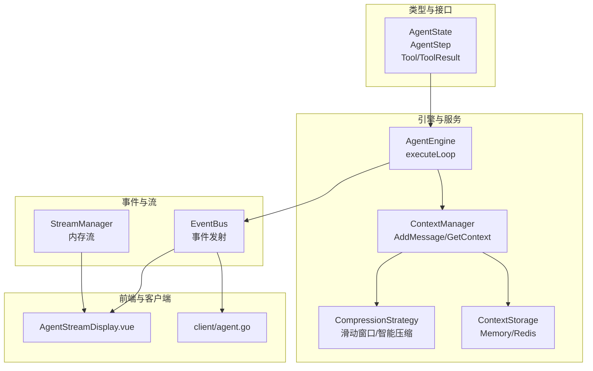
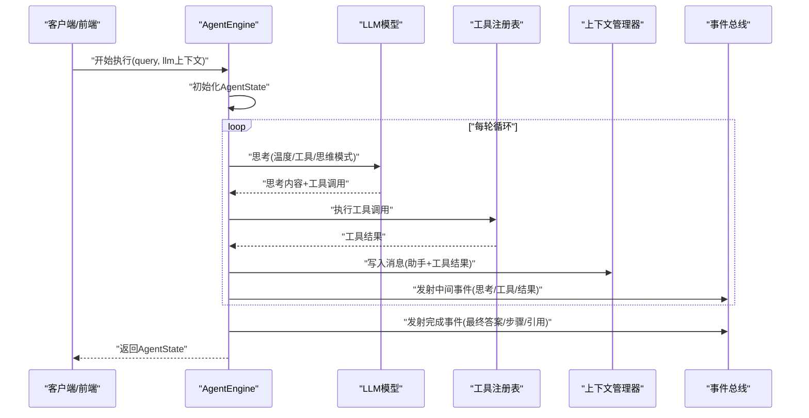
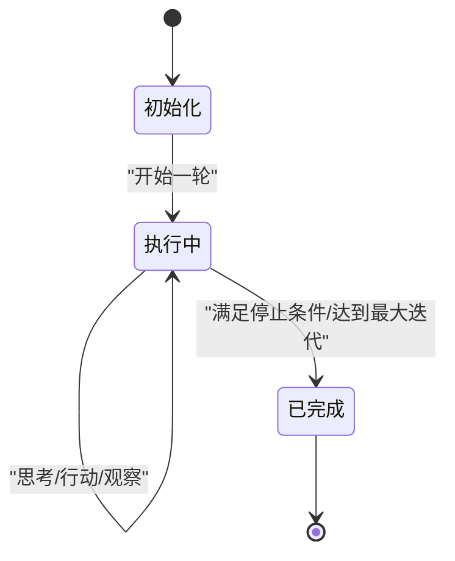
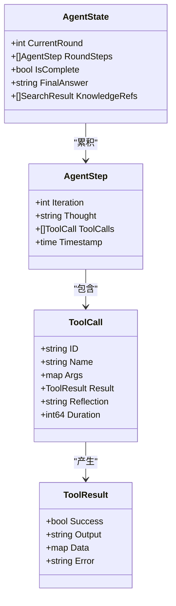
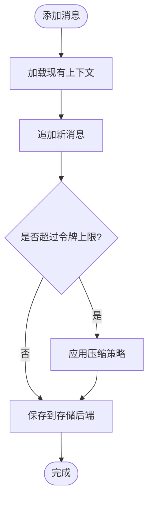
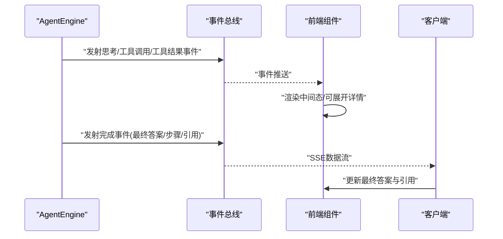
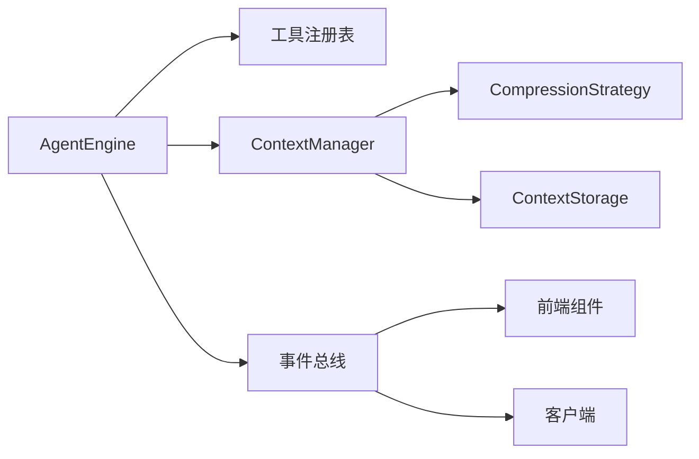

# 状态管理

<cite>
**本文引用的文件**
- [internal/types/agent.go](file://internal/types/agent.go)
- [internal/agent/engine.go](file://internal/agent/engine.go)
- [internal/application/service/llmcontext/context_manager.go](file://internal/application/service/llmcontext/context_manager.go)
- [internal/application/service/llmcontext/compression_strategies.go](file://internal/application/service/llmcontext/compression_strategies.go)
- [internal/application/service/llmcontext/memory_storage.go](file://internal/application/service/llmcontext/memory_storage.go)
- [internal/application/service/llmcontext/redis_storage.go](file://internal/application/service/llmcontext/redis_storage.go)
- [internal/types/interfaces/context_manager.go](file://internal/types/interfaces/context_manager.go)
- [internal/types/session.go](file://internal/types/session.go)
- [internal/application/service/session.go](file://internal/application/service/session.go)
- [internal/stream/memory_manager.go](file://internal/stream/memory_manager.go)
- [internal/common/tools.go](file://internal/common/tools.go)
- [internal/event/middleware.go](file://internal/event/middleware.go)
- [internal/tracing/init.go](file://internal/tracing/init.go)
- [internal/middleware/trace.go](file://internal/middleware/trace.go)
- [frontend/src/views/chat/components/AgentStreamDisplay.vue](file://frontend/src/views/chat/components/AgentStreamDisplay.vue)
- [client/agent.go](file://client/agent.go)
</cite>

## 目录
1. [简介](#简介)
2. [项目结构](#项目结构)
3. [核心组件](#核心组件)
4. [架构总览](#架构总览)
5. [详细组件分析](#详细组件分析)
6. [依赖关系分析](#依赖关系分析)
7. [性能考量](#性能考量)
8. [故障排查指南](#故障排查指南)
9. [结论](#结论)
10. [附录](#附录)

## 简介
本文件聚焦于代理状态管理的技术细节，围绕 AgentState 数据结构展开，系统性阐述其设计目标与实现方式；覆盖回合步骤、知识引用、完成状态与当前回合号的管理机制；详解从初始化到执行完成的完整生命周期与状态转换逻辑；给出会话状态保存、上下文管理与恢复策略；并提供状态监控与调试方法、配置与优化建议以及异常处理与故障恢复最佳实践。

## 项目结构
本项目采用分层与按领域划分的组织方式：
- 类型与接口层：定义 AgentState、AgentStep、工具与事件等核心类型与接口
- 引擎与服务层：实现 ReAct 循环引擎、上下文管理器、会话服务等
- 流与事件层：通过事件总线驱动状态流转与前端渲染
- 前端与客户端：消费事件流，展示中间态与最终态

图表来源
- [internal/types/agent.go](file://internal/types/agent.go#L163-L170)
- [internal/agent/engine.go](file://internal/agent/engine.go#L75-L155)
- [internal/application/service/llmcontext/context_manager.go](file://internal/application/service/llmcontext/context_manager.go#L45-L103)
- [internal/application/service/llmcontext/compression_strategies.go](file://internal/application/service/llmcontext/compression_strategies.go#L25-L80)
- [internal/application/service/llmcontext/memory_storage.go](file://internal/application/service/llmcontext/memory_storage.go#L24-L36)
- [internal/application/service/llmcontext/redis_storage.go](file://internal/application/service/llmcontext/redis_storage.go#L49-L58)
- [frontend/src/views/chat/components/AgentStreamDisplay.vue](file://frontend/src/views/chat/components/AgentStreamDisplay.vue#L831-L859)
- [client/agent.go](file://client/agent.go#L101-L143)

章节来源
- [internal/types/agent.go](file://internal/types/agent.go#L163-L170)
- [internal/agent/engine.go](file://internal/agent/engine.go#L75-L155)
- [internal/application/service/llmcontext/context_manager.go](file://internal/application/service/llmcontext/context_manager.go#L45-L103)

## 核心组件
- AgentState：代理执行状态的核心载体，包含当前回合号、回合内步骤集合、完成标志、最终答案与知识引用列表
- AgentStep：一次 ReAct 轮次内的思考与工具调用集合，包含思考内容、工具调用序列与时间戳
- AgentEngine：ReAct 执行引擎，负责循环控制、事件发射、工具调用与上下文写入
- ContextManager：会话级上下文管理器，负责消息追加、压缩策略与持久化
- CompressionStrategy：上下文压缩策略（滑动窗口、智能压缩）
- ContextStorage：上下文存储抽象（内存/Redis），配合 ContextManager 实现持久化
- StreamManager：事件流内存管理，支持增量拉取与事件聚合
- 事件与前端：通过 EventBus 发射事件，前端消费并渲染中间态与最终态

章节来源
- [internal/types/agent.go](file://internal/types/agent.go#L163-L170)
- [internal/agent/engine.go](file://internal/agent/engine.go#L157-L521)
- [internal/application/service/llmcontext/context_manager.go](file://internal/application/service/llmcontext/context_manager.go#L45-L103)
- [internal/application/service/llmcontext/compression_strategies.go](file://internal/application/service/llmcontext/compression_strategies.go#L25-L80)
- [internal/application/service/llmcontext/memory_storage.go](file://internal/application/service/llmcontext/memory_storage.go#L24-L36)
- [internal/application/service/llmcontext/redis_storage.go](file://internal/application/service/llmcontext/redis_storage.go#L49-L58)
- [internal/stream/memory_manager.go](file://internal/stream/memory_manager.go#L62-L115)

## 架构总览
代理状态管理贯穿“思考-行动-观察-反思”的 ReAct 循环，AgentEngine 在每轮中：
- 思考阶段：调用 LLM 生成思考内容与工具调用计划
- 行动阶段：执行工具调用，收集结果并记录到 AgentStep
- 观察阶段：将工具结果写入消息历史与上下文管理器
- 判断阶段：根据结束原因或最大迭代次数决定是否终止或生成最终答案

图表来源
- [internal/agent/engine.go](file://internal/agent/engine.go#L75-L155)
- [internal/agent/engine.go](file://internal/agent/engine.go#L157-L521)
- [internal/agent/engine.go](file://internal/agent/engine.go#L541-L620)

## 详细组件分析

### AgentState 数据结构与生命周期
- 设计要点
  - 当前回合号：用于标识当前轮次，便于事件关联与上下文压缩
  - 回合步骤：按轮次累积，包含思考内容与工具调用序列
  - 完成状态：当 LLM 结束原因指示无需进一步工具调用时置位
  - 最终答案：在终止条件满足或达到最大迭代后生成
  - 知识引用：收集检索/搜索结果引用，供最终答案标注来源
- 生命周期
  - 初始化：创建空状态，清零回合号，标记未完成
  - 执行：每轮生成 AgentStep 并追加到回合步骤列表
  - 终止：满足停止条件或达到最大迭代，生成最终答案并标记完成
  - 完成事件：通过事件总线广播最终答案、步骤与引用

图表来源
- [internal/types/agent.go](file://internal/types/agent.go#L163-L170)
- [internal/agent/engine.go](file://internal/agent/engine.go#L157-L521)

章节来源
- [internal/types/agent.go](file://internal/types/agent.go#L163-L170)
- [internal/agent/engine.go](file://internal/agent/engine.go#L96-L102)
- [internal/agent/engine.go](file://internal/agent/engine.go#L229-L259)
- [internal/agent/engine.go](file://internal/agent/engine.go#L479-L496)

### AgentStep 与工具调用
- AgentStep 记录单轮思考与工具调用序列，包含时间戳以便追踪
- 工具调用结果被汇总到 Step 中，事件总线同时发出“工具调用”和“工具结果”两类事件，便于前端渲染与监控
- 对于需要用户输入的工具（如选项展示），会在该轮结束后标记完成，等待用户响应

图表来源
- [internal/types/agent.go](file://internal/types/agent.go#L140-L170)
- [internal/types/agent.go](file://internal/types/agent.go#L122-L138)

章节来源
- [internal/types/agent.go](file://internal/types/agent.go#L140-L170)
- [internal/agent/engine.go](file://internal/agent/engine.go#L261-L469)
- [internal/agent/engine.go](file://internal/agent/engine.go#L402-L436)

### 上下文管理与持久化
- 上下文管理器职责
  - 追加消息：将助手与工具结果消息写入会话上下文
  - 压缩策略：当消息总量超过阈值时，应用滑动窗口或智能压缩策略
  - 持久化：通过存储后端（内存/Redis）保存上下文
- 存储实现
  - 内存存储：适合单实例与测试场景，读写带锁保护
  - Redis 存储：支持分布式部署，具备 TTL 与键前缀配置
- 会话配置
  - 支持租户级与会话级上下文配置，动态选择合适的压缩策略与令牌上限

图表来源
- [internal/application/service/llmcontext/context_manager.go](file://internal/application/service/llmcontext/context_manager.go#L45-L103)
- [internal/application/service/llmcontext/compression_strategies.go](file://internal/application/service/llmcontext/compression_strategies.go#L25-L80)
- [internal/application/service/llmcontext/compression_strategies.go](file://internal/application/service/llmcontext/compression_strategies.go#L102-L182)
- [internal/application/service/llmcontext/memory_storage.go](file://internal/application/service/llmcontext/memory_storage.go#L24-L36)
- [internal/application/service/llmcontext/redis_storage.go](file://internal/application/service/llmcontext/redis_storage.go#L49-L58)
- [internal/application/service/session.go](file://internal/application/service/session.go#L1310-L1336)

章节来源
- [internal/application/service/llmcontext/context_manager.go](file://internal/application/service/llmcontext/context_manager.go#L45-L103)
- [internal/application/service/llmcontext/compression_strategies.go](file://internal/application/service/llmcontext/compression_strategies.go#L25-L80)
- [internal/application/service/llmcontext/compression_strategies.go](file://internal/application/service/llmcontext/compression_strategies.go#L102-L182)
- [internal/application/service/llmcontext/memory_storage.go](file://internal/application/service/llmcontext/memory_storage.go#L24-L36)
- [internal/application/service/llmcontext/redis_storage.go](file://internal/application/service/llmcontext/redis_storage.go#L49-L58)
- [internal/application/service/session.go](file://internal/application/service/session.go#L1310-L1336)

### 事件流与前端渲染
- 事件总线
  - 发射思考、工具调用、工具结果、最终答案与完成事件
  - 提供中间事件以支撑前端实时渲染与交互
- 前端消费
  - 通过 SSE 流解析事件，按事件类型与 ID 展示中间态与最终态
  - 支持展开/折叠中间步骤，便于调试与审计

图表来源
- [internal/agent/engine.go](file://internal/agent/engine.go#L184-L220)
- [internal/agent/engine.go](file://internal/agent/engine.go#L402-L436)
- [internal/agent/engine.go](file://internal/agent/engine.go#L498-L520)
- [frontend/src/views/chat/components/AgentStreamDisplay.vue](file://frontend/src/views/chat/components/AgentStreamDisplay.vue#L831-L859)
- [client/agent.go](file://client/agent.go#L101-L143)

章节来源
- [internal/agent/engine.go](file://internal/agent/engine.go#L184-L220)
- [internal/agent/engine.go](file://internal/agent/engine.go#L402-L436)
- [internal/agent/engine.go](file://internal/agent/engine.go#L498-L520)
- [frontend/src/views/chat/components/AgentStreamDisplay.vue](file://frontend/src/views/chat/components/AgentStreamDisplay.vue#L831-L859)
- [client/agent.go](file://client/agent.go#L101-L143)

## 依赖关系分析
- AgentEngine 依赖工具注册表执行工具调用，依赖上下文管理器写入消息，依赖事件总线发射事件
- ContextManager 依赖 CompressionStrategy 与 ContextStorage 实现业务逻辑与持久化解耦
- 前端与客户端通过事件总线与 SSE 获取实时状态

图表来源
- [internal/agent/engine.go](file://internal/agent/engine.go#L26-L73)
- [internal/application/service/llmcontext/context_manager.go](file://internal/application/service/llmcontext/context_manager.go#L12-L31)
- [internal/types/interfaces/context_manager.go](file://internal/types/interfaces/context_manager.go#L9-L31)

章节来源
- [internal/agent/engine.go](file://internal/agent/engine.go#L26-L73)
- [internal/application/service/llmcontext/context_manager.go](file://internal/application/service/llmcontext/context_manager.go#L12-L31)
- [internal/types/interfaces/context_manager.go](file://internal/types/interfaces/context_manager.go#L9-L31)

## 性能考量
- 上下文压缩
  - 滑动窗口：保留系统消息与最近 N 条消息，成本低、确定性强
  - 智能压缩：对旧消息做 LLM 总结，减少令牌占用但引入额外推理开销
- 存储后端
  - 内存存储：读写速度快，适合单实例；注意并发读写锁与内存占用
  - Redis 存储：支持分布式与 TTL，需关注网络延迟与序列化开销
- 事件与流
  - 事件发射频率高，建议在前端侧做事件聚合与去抖，避免过度渲染
  - SSE 流解析与前端渲染应异步处理，避免阻塞主线程

章节来源
- [internal/application/service/llmcontext/compression_strategies.go](file://internal/application/service/llmcontext/compression_strategies.go#L25-L80)
- [internal/application/service/llmcontext/compression_strategies.go](file://internal/application/service/llmcontext/compression_strategies.go#L102-L182)
- [internal/application/service/llmcontext/memory_storage.go](file://internal/application/service/llmcontext/memory_storage.go#L24-L36)
- [internal/application/service/llmcontext/redis_storage.go](file://internal/application/service/llmcontext/redis_storage.go#L49-L58)
- [internal/stream/memory_manager.go](file://internal/stream/memory_manager.go#L62-L115)

## 故障排查指南
- 事件处理异常
  - 使用事件中间件进行 panic 恢复与错误包装，确保异常不中断事件总线
- 日志与管道指标
  - 通过结构化管道日志记录关键阶段与字段，便于定位瓶颈与异常
- 链路追踪
  - Gin 中间件集成 OpenTelemetry，为每个请求创建 Span，采集属性与错误码
- 常见问题
  - 工具重复调用：引擎对同一轮内多次调用 thinking 工具进行防护，避免死循环
  - 用户输入等待：某些工具返回 requires_user_input 时，引擎会暂停并等待用户响应
  - 上下文溢出：启用压缩策略或调整令牌上限，避免 LLM 输入超限

章节来源
- [internal/event/middleware.go](file://internal/event/middleware.go#L55-L69)
- [internal/common/tools.go](file://internal/common/tools.go#L184-L197)
- [internal/tracing/init.go](file://internal/tracing/init.go#L31-L95)
- [internal/middleware/trace.go](file://internal/middleware/trace.go#L28-L48)
- [internal/agent/engine.go](file://internal/agent/engine.go#L277-L291)
- [internal/agent/engine.go](file://internal/agent/engine.go#L440-L447)

## 结论
本状态管理体系以 AgentState 为核心，结合 AgentEngine 的 ReAct 循环、上下文管理器与事件总线，实现了从初始化到完成的完整生命周期管理。通过可插拔的压缩策略与存储后端，系统在性能与一致性之间取得平衡；通过事件与前端的解耦设计，提供了良好的可观测性与用户体验。建议在生产环境中结合链路追踪与监控埋点，持续优化上下文策略与并发控制。

## 附录
- 状态清理与资源回收
  - 使用资源清理器在进程退出或会话结束时统一回收资源，避免泄漏
- 并发安全
  - 内存存储与上下文管理器均采用读写锁保护，避免竞态
- 配置建议
  - 根据业务规模选择 Redis 存储与智能压缩策略
  - 合理设置最大迭代次数与温度，权衡准确性与稳定性
  - 前端侧对事件流进行节流与聚合，提升交互体验

章节来源
- [internal/container/cleanup.go](file://internal/container/cleanup.go#L58-L78)
- [internal/application/service/llmcontext/memory_storage.go](file://internal/application/service/llmcontext/memory_storage.go#L24-L36)
- [internal/application/service/llmcontext/context_manager.go](file://internal/application/service/llmcontext/context_manager.go#L45-L103)