# 核心组件

<cite>
**本文引用的文件**
- [cmd/server/main.go](file://cmd/server/main.go)
- [internal/router/router.go](file://internal/router/router.go)
- [internal/handler/session/handler.go](file://internal/handler/session/handler.go)
- [internal/agent/engine.go](file://internal/agent/engine.go)
- [internal/agent/tools/registry.go](file://internal/agent/tools/registry.go)
- [internal/agent/tools/tool.go](file://internal/agent/tools/tool.go)
- [internal/application/service/agent_service.go](file://internal/application/service/agent_service.go)
- [internal/application/service/chat_pipline/chat_pipline.go](file://internal/application/service/chat_pipline/chat_pipline.go)
- [internal/application/service/chat_pipline/chat_completion.go](file://internal/application/service/chat_pipline/chat_completion.go)
- [internal/models/chat/provider_chat.go](file://internal/models/chat/provider_chat.go)
- [internal/config/config.go](file://internal/config/config.go)
- [internal/types/agent.go](file://internal/types/agent.go)
- [docreader/main.py](file://docreader/main.py)
- [frontend/src/api/chat/index.ts](file://frontend/src/api/chat/index.ts)
</cite>

## 目录
1. [引言](#引言)
2. [项目结构](#项目结构)
3. [核心组件](#核心组件)
4. [架构总览](#架构总览)
5. [详细组件分析](#详细组件分析)
6. [依赖分析](#依赖分析)
7. [性能考虑](#性能考虑)
8. [故障排查指南](#故障排查指南)
9. [结论](#结论)
10. [附录](#附录)

## 引言
本文件面向WiseDx核心组件，围绕以下目标进行系统化说明：
- 智能代理引擎的ReACT架构实现：代理状态管理、工具调用机制与决策流程
- 聊天管道系统设计：流式响应处理、对话历史管理与上下文窗口管理
- 文档处理系统：多格式解析、OCR识别、文本分割与嵌入生成
- 知识图谱系统：实体关系抽取与图查询功能
- API接口设计与实现：RESTful API与WebSocket通信
- 每个组件的使用示例与集成指南

## 项目结构
WiseDx采用分层与模块化架构：
- 服务入口与容器：启动器负责环境加载、依赖注入容器构建与HTTP服务启动
- 路由与中间件：统一注册路由、CORS、鉴权、日志、追踪等中间件
- 业务服务：代理服务、聊天管道插件、模型与检索、文件与流管理等
- 模型适配：多供应商聊天模型适配与参数定制
- 文档阅读器：独立的Python gRPC服务，负责多格式解析与分块
- 前端：提供REST API调用封装，支持流式聊天

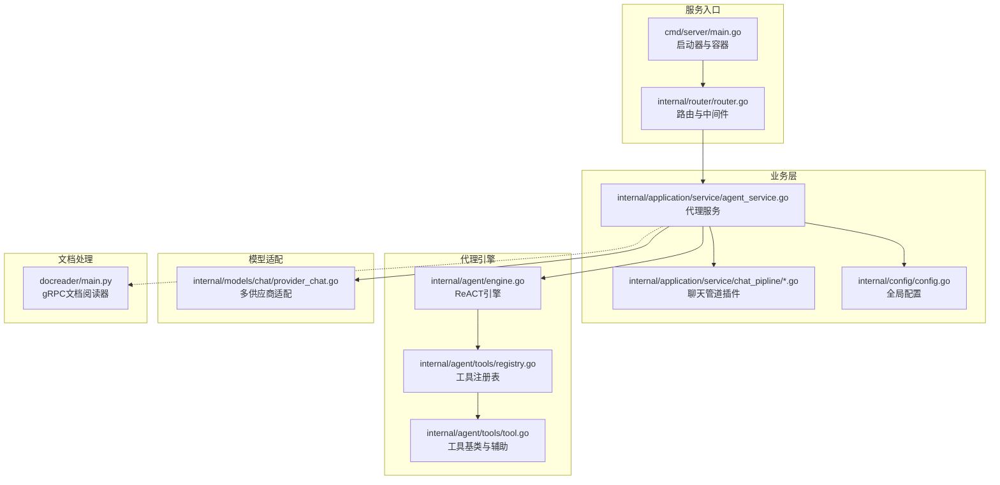

**图表来源**
- [cmd/server/main.go](file://cmd/server/main.go#L88-L192)
- [internal/router/router.go](file://internal/router/router.go#L54-L118)
- [internal/application/service/agent_service.go](file://internal/application/service/agent_service.go#L71-L201)
- [internal/agent/engine.go](file://internal/agent/engine.go#L25-L73)
- [internal/agent/tools/registry.go](file://internal/agent/tools/registry.go#L12-L27)
- [internal/application/service/chat_pipline/chat_pipline.go](file://internal/application/service/chat_pipline/chat_pipline.go#L9-L21)
- [internal/models/chat/provider_chat.go](file://internal/models/chat/provider_chat.go#L11-L34)
- [docreader/main.py](file://docreader/main.py#L276-L315)

**章节来源**
- [cmd/server/main.go](file://cmd/server/main.go#L47-L123)
- [internal/router/router.go](file://internal/router/router.go#L53-L118)

## 核心组件
- 智能代理引擎（ReACT）：执行思考-行动循环，管理状态与工具调用，通过事件总线驱动前端流式展示
- 聊天管道插件：以插件化方式串联“加载历史-检索-重排-补全-追踪”等步骤
- 工具注册表：集中注册与执行工具，支持动态启用/过滤工具集合
- 文档阅读器：gRPC服务，支持多格式解析、分块、OCR与图像信息回传
- 知识图谱：实体关系抽取、权重计算与图查询
- API层：统一REST路由、鉴权、CORS与中间件；前端通过封装的API函数发起请求

**章节来源**
- [internal/agent/engine.go](file://internal/agent/engine.go#L75-L155)
- [internal/application/service/chat_pipline/chat_pipline.go](file://internal/application/service/chat_pipline/chat_pipline.go#L9-L21)
- [internal/agent/tools/registry.go](file://internal/agent/tools/registry.go#L12-L27)
- [docreader/main.py](file://docreader/main.py#L130-L241)
- [internal/application/service/graph.go](file://internal/application/service/graph.go#L667-L689)

## 架构总览
WiseDx后端以Gin框架承载HTTP服务，通过依赖注入容器装配各服务组件。代理服务根据会话配置动态注册工具，构建ReACT引擎；聊天管道插件按事件顺序执行检索、重排与补全；模型适配层屏蔽不同供应商差异；文档阅读器作为独立服务提供多格式解析。

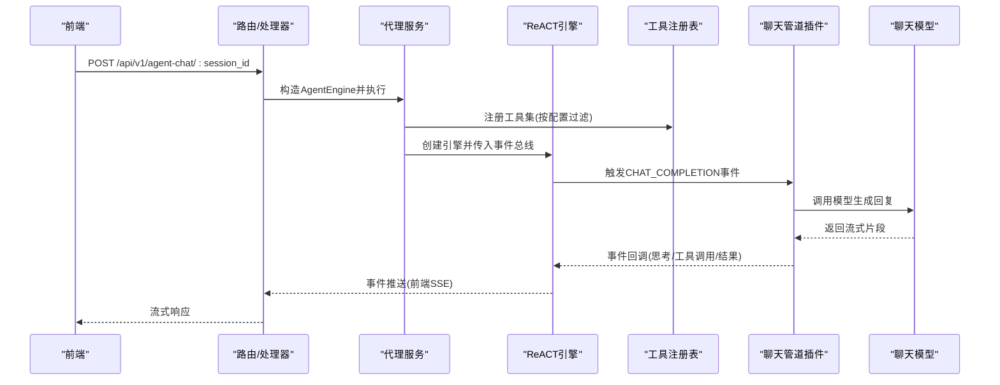

**图表来源**
- [internal/router/router.go](file://internal/router/router.go#L274-L292)
- [internal/handler/session/handler.go](file://internal/handler/session/handler.go#L1-L300)
- [internal/application/service/agent_service.go](file://internal/application/service/agent_service.go#L71-L201)
- [internal/agent/engine.go](file://internal/agent/engine.go#L75-L155)
- [internal/application/service/chat_pipline/chat_completion.go](file://internal/application/service/chat_pipline/chat_completion.go#L31-L76)

## 详细组件分析

### 智能代理引擎（ReACT）
- 代理状态管理：维护当前轮次、步骤、最终答案与知识引用，支持最大迭代次数控制
- 工具调用机制：构建工具函数定义，按轮次执行工具，记录工具调用与结果，并写入上下文
- 决策流程：思考阶段流式输出思维片段；行动阶段执行工具并回填观察；终止条件为停止且无工具调用或达到最大轮次
- 事件驱动：通过事件总线向订阅者推送“思考/工具调用/工具结果/完成”等事件，前端以SSE消费

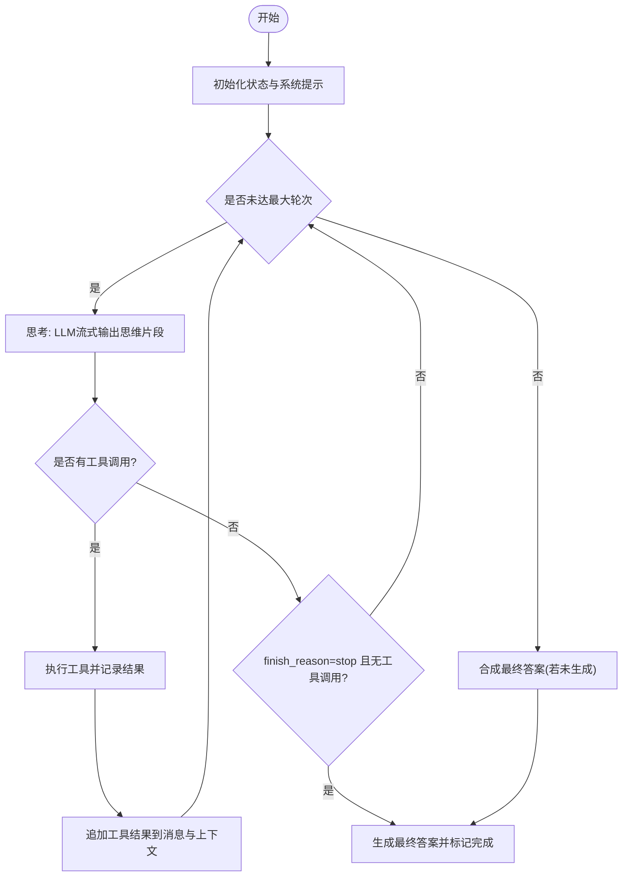

**图表来源**
- [internal/agent/engine.go](file://internal/agent/engine.go#L157-L521)

**章节来源**
- [internal/agent/engine.go](file://internal/agent/engine.go#L75-L155)
- [internal/agent/engine.go](file://internal/agent/engine.go#L157-L521)
- [internal/types/agent.go](file://internal/types/agent.go#L163-L170)

### 工具注册与执行
- 注册表：集中注册工具，提供函数定义导出与执行入口
- 工具过滤：根据是否配置知识库/知识ID与是否启用网络搜索，动态过滤知识相关工具
- 执行链路：解析参数、执行工具、记录结果与耗时，支持结构化数据返回

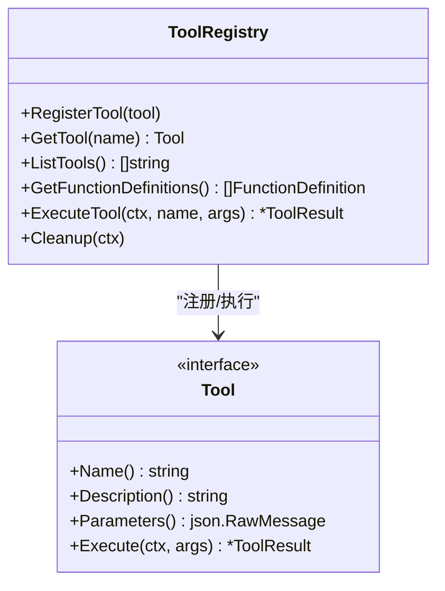

**图表来源**
- [internal/agent/tools/registry.go](file://internal/agent/tools/registry.go#L12-L27)
- [internal/agent/tools/registry.go](file://internal/agent/tools/registry.go#L60-L103)
- [internal/agent/tools/tool.go](file://internal/agent/tools/tool.go#L108-L120)

**章节来源**
- [internal/agent/tools/registry.go](file://internal/agent/tools/registry.go#L12-L27)
- [internal/agent/tools/registry.go](file://internal/agent/tools/registry.go#L60-L103)
- [internal/agent/tools/tool.go](file://internal/agent/tools/tool.go#L10-L24)

### 代理服务与工具装配
- 动态装配：依据Agent配置决定允许工具集，自动注册知识检索、网络搜索、数据库查询、数据分析等工具
- MCP工具：按配置选择“全部/选定/关闭”，从MCP服务注册远程工具
- 知识库信息：为系统提示注入知识库名称、文档数与近期文档摘要

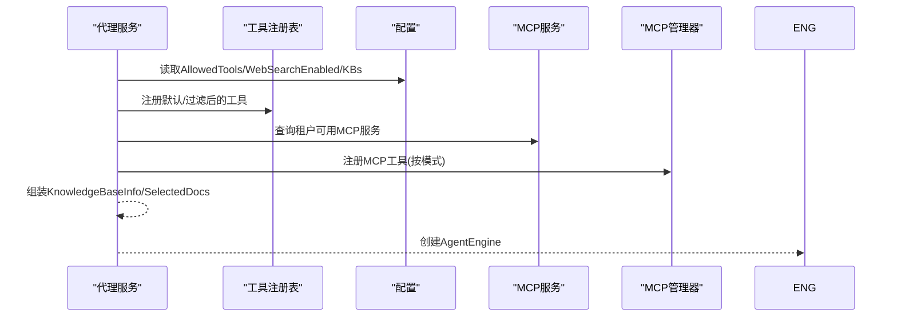

**图表来源**
- [internal/application/service/agent_service.go](file://internal/application/service/agent_service.go#L203-L335)
- [internal/application/service/agent_service.go](file://internal/application/service/agent_service.go#L103-L157)

**章节来源**
- [internal/application/service/agent_service.go](file://internal/application/service/agent_service.go#L71-L201)
- [internal/application/service/agent_service.go](file://internal/application/service/agent_service.go#L203-L335)

### 聊天管道插件系统
- 插件接口：定义OnEvent与激活事件集合，支持链式组合
- 事件管理：按事件类型查找插件列表，构建处理链
- 补全插件：准备消息与模型选项，调用模型生成响应，记录用量与完成原因

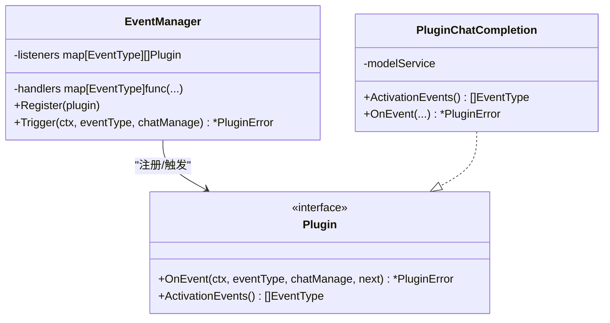

**图表来源**
- [internal/application/service/chat_pipline/chat_pipline.go](file://internal/application/service/chat_pipline/chat_pipline.go#L9-L21)
- [internal/application/service/chat_pipline/chat_pipline.go](file://internal/application/service/chat_pipline/chat_pipline.go#L39-L68)
- [internal/application/service/chat_pipline/chat_completion.go](file://internal/application/service/chat_pipline/chat_completion.go#L10-L24)

**章节来源**
- [internal/application/service/chat_pipline/chat_pipline.go](file://internal/application/service/chat_pipline/chat_pipline.go#L9-L21)
- [internal/application/service/chat_pipline/chat_completion.go](file://internal/application/service/chat_pipline/chat_completion.go#L31-L76)

### 模型适配与参数定制
- 多供应商适配：针对不支持tool_choice的模型（如DeepSeek）移除该参数；通用模型通过ChatTemplateKwargs传递thinking开关
- RemoteAPIChat：统一远端API调用封装，便于扩展新供应商

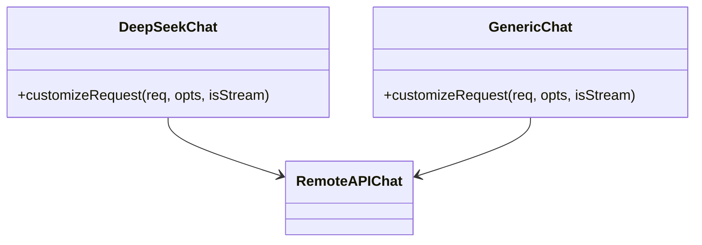

**图表来源**
- [internal/models/chat/provider_chat.go](file://internal/models/chat/provider_chat.go#L11-L34)
- [internal/models/chat/provider_chat.go](file://internal/models/chat/provider_chat.go#L46-L82)

**章节来源**
- [internal/models/chat/provider_chat.go](file://internal/models/chat/provider_chat.go#L11-L34)
- [internal/models/chat/provider_chat.go](file://internal/models/chat/provider_chat.go#L46-L82)

### 文档处理系统（docreader）
- gRPC服务：提供ReadFromFile与ReadFromURL两类解析接口
- 解析流程：根据ReadConfig构造ChunkingConfig，调用Parser解析文件/URL，返回Chunk列表（含图像信息）
- 存储与VLM：支持对象存储配置与视觉语言模型配置，确保UTF-8安全字符串

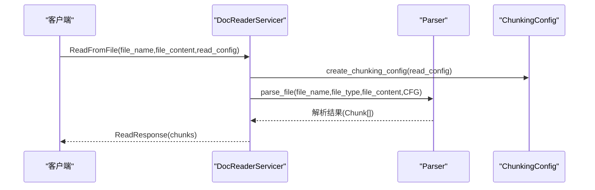

**图表来源**
- [docreader/main.py](file://docreader/main.py#L130-L192)
- [docreader/main.py](file://docreader/main.py#L130-L241)

**章节来源**
- [docreader/main.py](file://docreader/main.py#L130-L192)
- [docreader/main.py](file://docreader/main.py#L242-L274)

### 知识图谱系统
- 实体抽取：对每块内容调用LLM抽取实体，去重合并，统计频次与所属块ID
- 关系抽取：基于实体与合并后的内容，调用LLM抽取关系，合并相同关系并更新强度
- 权重与度数：计算PMI与强度归一化权重，统计实体入/出度，构建块级关系图
- 查询接口：提供直接与间接关系查询，按权重与度数排序返回TopK

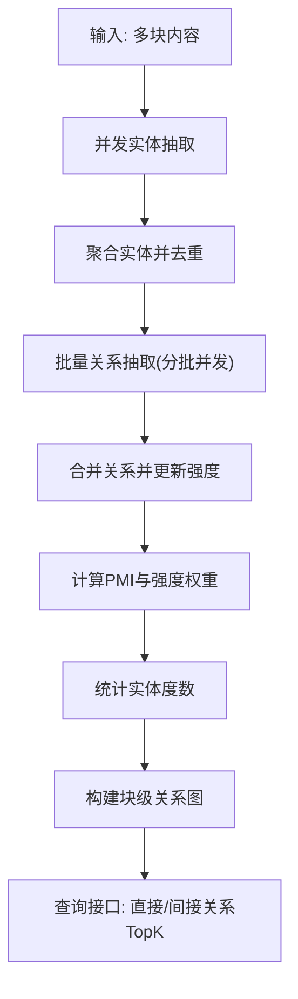

**图表来源**
- [internal/application/service/graph.go](file://internal/application/service/graph.go#L365-L489)
- [internal/application/service/graph.go](file://internal/application/service/graph.go#L667-L754)

**章节来源**
- [internal/application/service/graph.go](file://internal/application/service/graph.go#L88-L181)
- [internal/application/service/graph.go](file://internal/application/service/graph.go#L183-L307)
- [internal/application/service/graph.go](file://internal/application/service/graph.go#L468-L489)
- [internal/application/service/graph.go](file://internal/application/service/graph.go#L667-L754)

### API接口设计与实现
- 路由注册：统一在router中注册认证、知识库、会话、消息、模型、评估、初始化、系统、MCP、网页搜索、自定义代理等路由
- 会话处理器：提供创建、获取、分页、更新、删除、生成标题、停止流、继续流等接口
- 前端API封装：提供会话、知识问答、代理问答、消息加载、停止会话等方法

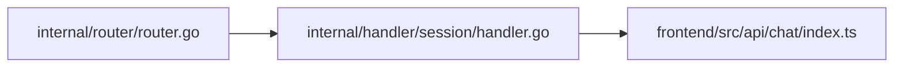

**图表来源**
- [internal/router/router.go](file://internal/router/router.go#L274-L292)
- [internal/handler/session/handler.go](file://internal/handler/session/handler.go#L44-L105)
- [frontend/src/api/chat/index.ts](file://frontend/src/api/chat/index.ts#L5-L33)

**章节来源**
- [internal/router/router.go](file://internal/router/router.go#L53-L118)
- [internal/handler/session/handler.go](file://internal/handler/session/handler.go#L44-L105)
- [frontend/src/api/chat/index.ts](file://frontend/src/api/chat/index.ts#L5-L33)

## 依赖分析
- 启动器依赖容器构建与资源清理，路由依赖中间件栈，代理服务依赖模型、检索、知识库、MCP与事件总线
- 代理引擎依赖工具注册表、上下文管理器与事件总线
- 聊天管道插件依赖模型服务与消息准备
- 文档阅读器独立运行，通过gRPC与主服务交互

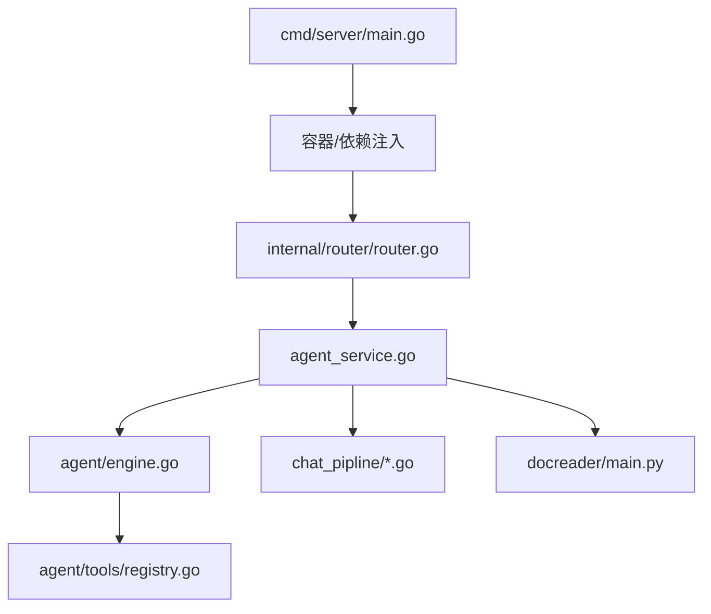

**图表来源**
- [cmd/server/main.go](file://cmd/server/main.go#L124-L133)
- [internal/router/router.go](file://internal/router/router.go#L54-L118)
- [internal/application/service/agent_service.go](file://internal/application/service/agent_service.go#L71-L201)
- [internal/agent/engine.go](file://internal/agent/engine.go#L25-L73)
- [internal/agent/tools/registry.go](file://internal/agent/tools/registry.go#L12-L27)
- [internal/application/service/chat_pipline/chat_pipline.go](file://internal/application/service/chat_pipline/chat_pipline.go#L9-L21)
- [docreader/main.py](file://docreader/main.py#L276-L315)

**章节来源**
- [cmd/server/main.go](file://cmd/server/main.go#L124-L133)
- [internal/router/router.go](file://internal/router/router.go#L54-L118)

## 性能考虑
- 并发与限流：知识图谱关系抽取采用分批并发，限制实体/关系抽取并发度，避免资源争用
- 上下文压缩：通过上下文管理器与压缩策略控制消息长度，减少无效重复
- 流式传输：代理思考与模型补全均采用流式输出，降低首字节延迟
- 缓存与索引：向量数据库与重排模型配合，提升检索效率与相关性

[本节为通用指导，无需特定文件引用]

## 故障排查指南
- 代理执行失败：查看事件总线错误事件与流水线错误日志，定位工具执行异常或模型调用失败
- 工具未注册：确认Agent配置的AllowedTools与知识库/网络搜索开关，检查工具过滤逻辑
- 模型参数不兼容：针对不支持tool_choice的模型，确保请求被正确定制
- 文档解析异常：检查gRPC服务健康状态、ChunkingConfig参数与存储/VLM配置

**章节来源**
- [internal/agent/engine.go](file://internal/agent/engine.go#L129-L143)
- [internal/application/service/agent_service.go](file://internal/application/service/agent_service.go#L223-L255)
- [internal/models/chat/provider_chat.go](file://internal/models/chat/provider_chat.go#L36-L44)
- [docreader/main.py](file://docreader/main.py#L280-L315)

## 结论
WiseDx通过模块化的代理引擎、插件化的聊天管道、可扩展的工具体系与独立的文档处理服务，实现了从“思考-行动-反馈”的闭环智能问答。结合流式响应与事件驱动，系统在可维护性与可扩展性上具备良好基础；建议在生产环境中进一步完善可观测性、缓存与限流策略。

[本节为总结性内容，无需特定文件引用]

## 附录

### 使用示例与集成指南

- 启动与部署
  - 环境变量加载与校验：在启动前加载.env并校验数据库等关键变量
  - 容器构建与HTTP服务：通过依赖注入容器装配组件，启动HTTP服务并注册资源清理
  - 参考路径：[cmd/server/main.go](file://cmd/server/main.go#L47-L123)

- 路由与中间件
  - 统一注册认证、CORS、日志、追踪与Swagger文档
  - 参考路径：[internal/router/router.go](file://internal/router/router.go#L53-L118)

- 会话与聊天
  - 创建会话、获取会话、分页查询、更新/删除、生成标题、停止流、继续流
  - 参考路径：[internal/handler/session/handler.go](file://internal/handler/session/handler.go#L44-L105)
  - 前端API封装：会话、知识问答、代理问答、消息加载、停止会话
  - 参考路径：[frontend/src/api/chat/index.ts](file://frontend/src/api/chat/index.ts#L5-L33)

- 代理工具装配
  - 根据配置动态注册工具，支持MCP工具注册与知识库/网络搜索过滤
  - 参考路径：[internal/application/service/agent_service.go](file://internal/application/service/agent_service.go#L203-L335)

- 聊天管道
  - 事件驱动的插件化补全流程，记录用量与完成原因
  - 参考路径：[internal/application/service/chat_pipline/chat_completion.go](file://internal/application/service/chat_pipline/chat_completion.go#L31-L76)

- 模型适配
  - 不同供应商参数定制，保证tool_choice与thinking开关的兼容性
  - 参考路径：[internal/models/chat/provider_chat.go](file://internal/models/chat/provider_chat.go#L36-L82)

- 文档阅读器
  - gRPC服务：文件/URL解析、分块、图像信息与UTF-8安全字符串处理
  - 参考路径：[docreader/main.py](file://docreader/main.py#L130-L241)

- 知识图谱
  - 实体/关系抽取、权重计算、度数统计与图查询
  - 参考路径：[internal/application/service/graph.go](file://internal/application/service/graph.go#L365-L489)