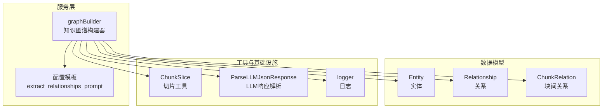
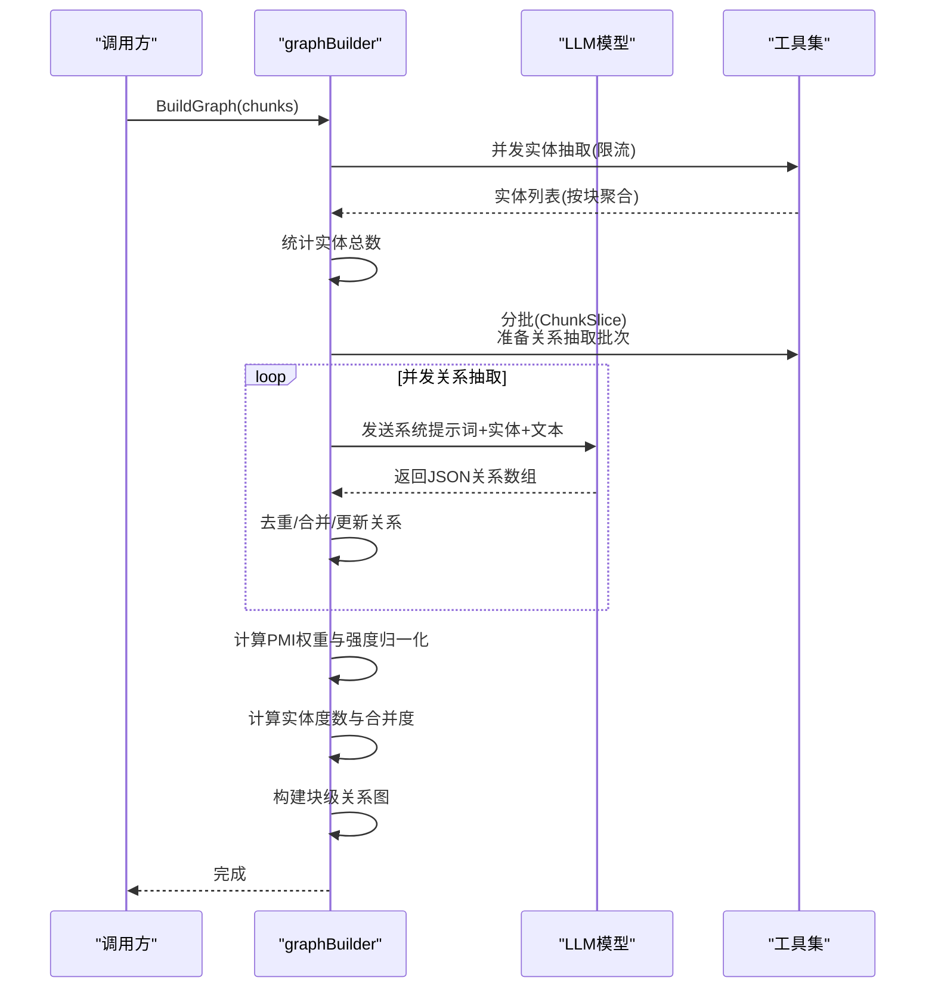
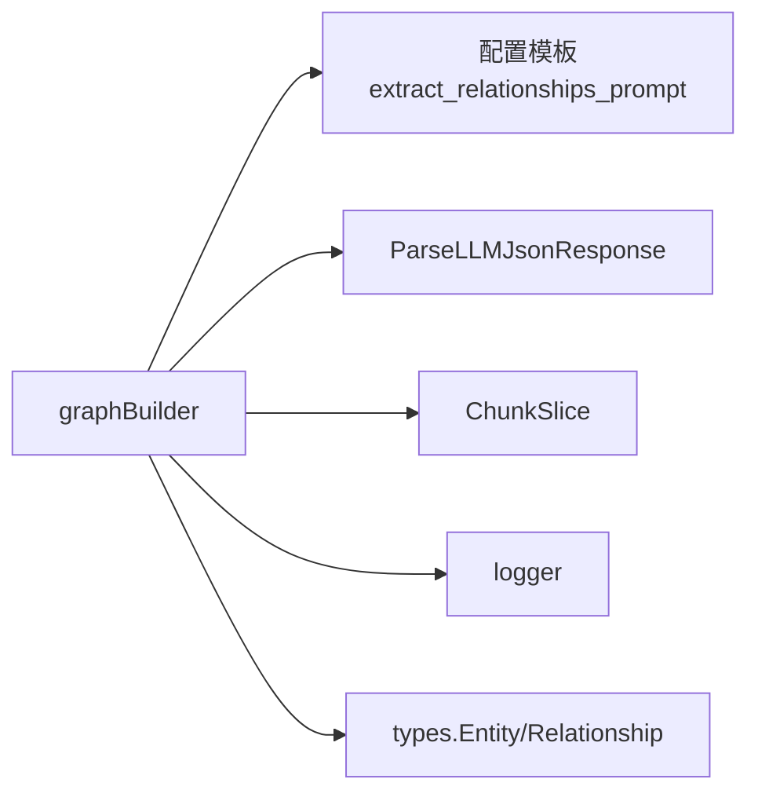

# 关系抽取算法

<cite>
**本文引用的文件**
- [internal/application/service/graph.go](file://internal/application/service/graph.go)
- [internal/types/graph.go](file://internal/types/graph.go)
- [config/config.yaml](file://config/config.yaml)
- [internal/models/utils/slices.go](file://internal/models/utils/slices.go)
- [internal/common/tools.go](file://internal/common/tools.go)
- [internal/logger/logger.go](file://internal/logger/logger.go)
</cite>

## 目录
1. [简介](#简介)
2. [项目结构](#项目结构)
3. [核心组件](#核心组件)
4. [架构总览](#架构总览)
5. [详细组件分析](#详细组件分析)
6. [依赖分析](#依赖分析)
7. [性能考量](#性能考量)
8. [故障排查指南](#故障排查指南)
9. [结论](#结论)
10. [附录](#附录)

## 简介
本技术文档围绕基于语义分析的关系抽取算法展开，系统性阐述从文档块中抽取实体与关系的完整流程，包括实体对组合策略、上下文窗口构建、关系强度评估、PMI（互信息）加权、权重归一化与综合评分机制、批量关系抽取的并发处理策略、错误容错与进度跟踪、关系质量控制（最小实体数阈值、共同Chunk检测、重复关系去重）、以及性能调优参数与最佳实践。

## 项目结构
关系抽取能力位于后端服务层，核心实现集中在知识图谱构建模块，配合通用工具与配置模板完成端到端流程。

图表来源
- [internal/application/service/graph.go](file://internal/application/service/graph.go#L64-L86)
- [internal/types/graph.go](file://internal/types/graph.go#L6-L29)
- [config/config.yaml](file://config/config.yaml#L295-L332)
- [internal/models/utils/slices.go](file://internal/models/utils/slices.go#L3-L27)
- [internal/common/tools.go](file://internal/common/tools.go#L93-L117)
- [internal/logger/logger.go](file://internal/logger/logger.go#L175-L196)

章节来源
- [internal/application/service/graph.go](file://internal/application/service/graph.go#L64-L86)
- [internal/types/graph.go](file://internal/types/graph.go#L6-L29)
- [config/config.yaml](file://config/config.yaml#L295-L332)

## 核心组件
- graphBuilder：知识图谱构建器，负责实体抽取、关系抽取、权重计算、度数统计、块级关系图构建与查询。
- Entity/Relationship/ChunkRelation：三类核心数据结构，分别表示实体、关系及文档块间的连接关系。
- 配置模板：通过系统提示词约束LLM关系抽取行为，确保输出结构化、可解析的JSON。
- 工具函数：切片分批、LLM响应解析、日志记录等。

章节来源
- [internal/application/service/graph.go](file://internal/application/service/graph.go#L64-L86)
- [internal/types/graph.go](file://internal/types/graph.go#L6-L29)
- [config/config.yaml](file://config/config.yaml#L295-L332)

## 架构总览
关系抽取采用“实体先行、关系并行”的流水线式架构：先并发抽取各块实体，再按批次合并实体集合进行关系抽取，最后统一计算权重与度数并构建块级关系图。

图表来源
- [internal/application/service/graph.go](file://internal/application/service/graph.go#L367-L489)
- [internal/models/utils/slices.go](file://internal/models/utils/slices.go#L3-L27)
- [internal/common/tools.go](file://internal/common/tools.go#L93-L117)

## 详细组件分析

### 实体抽取与实体映射
- 输入：单个文档块内容。
- 流程：构造系统提示词与用户消息，调用LLM抽取实体；解析JSON响应；去重与合并，维护按ID与标题索引的实体映射表；记录出现的文档块ID与频率。
- 关键点：
  - 最小实体数阈值：关系抽取阶段要求至少2个实体。
  - 去重策略：同标题实体合并，追加ChunkID并增加频率。
  - 错误处理：空内容跳过；LLM失败返回错误；解析失败返回错误。

章节来源
- [internal/application/service/graph.go](file://internal/application/service/graph.go#L88-L181)

### 上下文窗口构建
- 合并策略：按块顺序拼接内容，避免重叠部分重复；当后一块起始位置早于前一块结束位置时，仅追加非重叠部分。
- 作用：为关系抽取提供连贯的上下文文本，提升LLM对实体间关系的识别能力。

章节来源
- [internal/application/service/graph.go](file://internal/application/service/graph.go#L337-L363)

### 实体对组合策略与关系抽取
- 组合策略：将当前批次的所有实体作为候选，供LLM在统一上下文中识别实体间关系。
- 抽取约束：系统提示词严格限定输出格式与字段，要求仅输出明确存在于文本中的关系；对双向/单向关系进行一致性检查；强度打分遵循预设规则。
- 解析与入库：解析LLM返回的JSON数组；计算共同ChunkID；若新关系则新建，否则更新现有关系的ChunkID集合与强度（加权平均）。

章节来源
- [internal/application/service/graph.go](file://internal/application/service/graph.go#L183-L307)
- [config/config.yaml](file://config/config.yaml#L295-L332)
- [internal/common/tools.go](file://internal/common/tools.go#L93-L117)

### 关系强度评估与PMI加权
- 强度来源：LLM输出的强度字段（5-10分）。
- PMI计算：
  - 统计实体与关系的出现频次，计算联合概率与边缘概率，得到PMI值。
  - 归一化：分别对PMI与强度取最大值，做0-1归一化。
  - 综合评分：按配置权重线性组合归一化的PMI与强度，再缩放到1-10范围。
- 作用：结合统计信号与语义强度，给出稳健的关系权重。

章节来源
- [internal/application/service/graph.go](file://internal/application/service/graph.go#L491-L581)

### 权重归一化与综合评分机制
- 步骤：
  - 计算实体与关系的总出现次数。
  - 计算PMI并记录最大值；记录强度最大值。
  - 对每个关系进行归一化与加权组合，再线性映射至1-10区间。
- 参数：
  - PMI权重比例、强度权重比例、权重缩放因子、最小权重值等。

章节来源
- [internal/application/service/graph.go](file://internal/application/service/graph.go#L27-L53)
- [internal/application/service/graph.go](file://internal/application/service/graph.go#L559-L578)

### 批量关系抽取的并发处理策略
- 并发模型：
  - 实体抽取：使用带限流的并发组，限制最大并发数。
  - 关系抽取：按固定批次大小切分文档块，独立批次并发执行，失败不影响其他批次继续。
- 批次大小优化：
  - 默认批次大小用于平衡吞吐与内存占用；可根据实体密度与LLM上下文长度动态调整。
- 错误容错：
  - 单个批次失败不阻塞整体流程；记录错误并继续后续批次。
- 进度跟踪：
  - 日志记录批次索引、实体数量、关系数量、耗时等关键指标。

章节来源
- [internal/application/service/graph.go](file://internal/application/service/graph.go#L367-L489)
- [internal/models/utils/slices.go](file://internal/models/utils/slices.go#L3-L27)
- [internal/logger/logger.go](file://internal/logger/logger.go#L175-L196)

### 关系质量控制
- 最小实体数阈值：关系抽取前校验实体数量，不足则跳过。
- 共同Chunk检测：通过实体的ChunkID交集确定关系涉及的文档块，缺失则跳过该关系。
- 重复关系去重：以“源#目标”为键去重；若已有关系，仅追加新的ChunkID并按Chunk数量加权更新强度。

章节来源
- [internal/application/service/graph.go](file://internal/application/service/graph.go#L191-L194)
- [internal/application/service/graph.go](file://internal/application/service/graph.go#L309-L335)
- [internal/application/service/graph.go](file://internal/application/service/graph.go#L257-L302)

### 块级关系图与间接关系扩展
- 块级关系图：基于实体关系，连接涉及相同实体的文档块，存储关系权重与度数。
- 间接关系扩展：通过第一度连接的“中间块”，计算第二度路径的权重（两段权重乘积并乘以衰减系数），取最高权重去重后排序返回TopK。

章节来源
- [internal/application/service/graph.go](file://internal/application/service/graph.go#L622-L665)
- [internal/application/service/graph.go](file://internal/application/service/graph.go#L756-L862)

### 数据模型与接口
- Entity：实体标识、ChunkID集合、频率、度数、标题、类型、描述。
- Relationship：关系标识、ChunkID集合、合并度、权重、源/目标实体标题、描述、强度。
- GraphBuilder：构建图谱、查询直接/间接相关块、导出实体与关系列表。

章节来源
- [internal/types/graph.go](file://internal/types/graph.go#L6-L29)
- [internal/types/graph.go](file://internal/types/graph.go#L31-L53)

## 依赖分析
- 内部依赖：
  - graphBuilder依赖配置模板（系统提示词）、工具切片函数、LLM响应解析、日志记录。
  - 数据结构依赖types包。
- 外部依赖：
  - LLM模型（通过聊天接口调用）。
  - 并发控制（errgroup、带限流的并发组）。

图表来源
- [internal/application/service/graph.go](file://internal/application/service/graph.go#L23-L53)
- [config/config.yaml](file://config/config.yaml#L295-L332)
- [internal/common/tools.go](file://internal/common/tools.go#L93-L117)
- [internal/models/utils/slices.go](file://internal/models/utils/slices.go#L3-L27)
- [internal/logger/logger.go](file://internal/logger/logger.go#L175-L196)
- [internal/types/graph.go](file://internal/types/graph.go#L6-L29)

## 性能考量
- 并发与限流
  - 实体抽取并发上限与关系抽取并发上限可调，建议根据LLM上下文长度与资源情况平衡。
  - 关系抽取批次大小需兼顾实体密度与LLM上下文窗口，避免过长导致超限。
- 内存与I/O
  - 合并上下文时避免重复拼接重叠部分；实体与关系映射使用哈希表，查找与插入均摊O(1)。
- 稳定性
  - 关系抽取失败不影响其他批次；日志记录关键指标便于定位瓶颈。
- 可观测性
  - 生成Mermaid可视化图谱，辅助诊断子图连通性与权重分布。

章节来源
- [internal/application/service/graph.go](file://internal/application/service/graph.go#L367-L489)
- [internal/application/service/graph.go](file://internal/application/service/graph.go#L894-L1050)

## 故障排查指南
- 实体抽取失败
  - 检查LLM调用是否成功、响应是否为空、JSON解析是否报错。
  - 关注空内容块与无效实体（标题/描述为空）的日志。
- 关系抽取失败
  - 检查系统提示词是否正确注入、实体序列化是否成功、LLM响应是否为合法JSON。
  - 若返回为空数组，确认实体数量是否满足最小阈值。
- 权重计算异常
  - 当实体或关系出现次数为0时会跳过权重计算，检查实体映射与关系ChunkID集合。
- 并发问题
  - 关注errgroup等待后的错误汇总；必要时降低并发上限或增大批次大小。

章节来源
- [internal/application/service/graph.go](file://internal/application/service/graph.go#L112-L128)
- [internal/application/service/graph.go](file://internal/application/service/graph.go#L223-L239)
- [internal/application/service/graph.go](file://internal/application/service/graph.go#L519-L523)
- [internal/application/service/graph.go](file://internal/application/service/graph.go#L392-L395)
- [internal/application/service/graph.go](file://internal/application/service/graph.go#L463-L466)

## 结论
该关系抽取算法以实体抽取为基础，通过系统提示词约束与LLM结构化输出，结合PMI统计信号与强度归一化，形成稳健的关系权重体系。并发与批次策略提升了吞吐，质量控制保障了结果一致性。建议在实际部署中依据数据规模与LLM上下文长度动态调整并发与批次参数，并持续监控日志与可视化图谱以优化效果。

## 附录

### 关键参数与配置要点
- 温度与确定性：抽取阶段使用低温度以获得更稳定的JSON输出。
- 权重配置：PMI权重比例、强度权重比例、权重缩放因子、最小权重值。
- 并发与批次：实体抽取并发上限、关系抽取并发上限、关系抽取默认批次大小。
- 最小实体数：关系抽取阈值。
- 系统提示词：严格约束输出格式、字段与强度打分规则。

章节来源
- [internal/application/service/graph.go](file://internal/application/service/graph.go#L23-L53)
- [config/config.yaml](file://config/config.yaml#L295-L332)