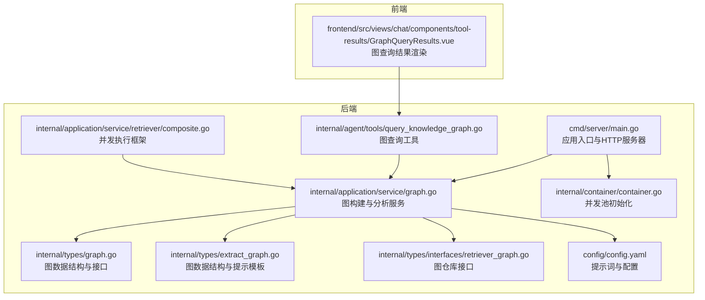
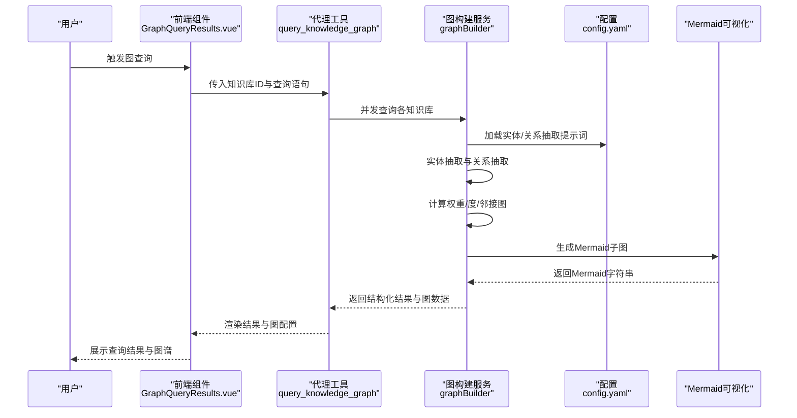
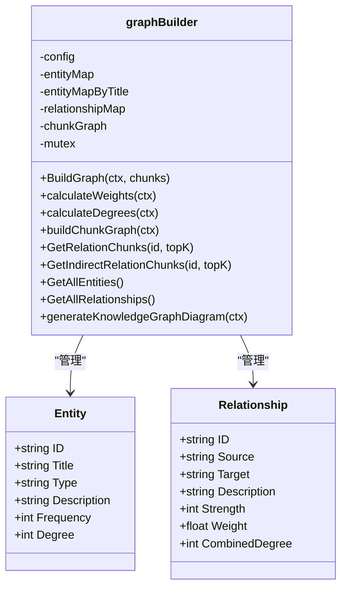
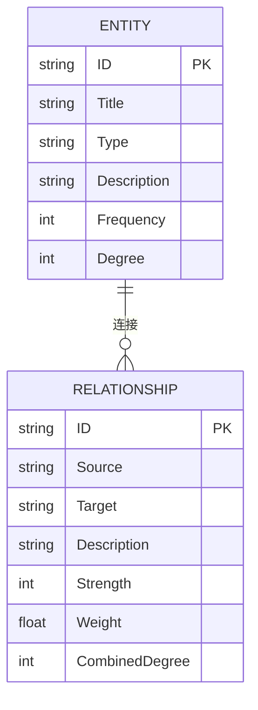
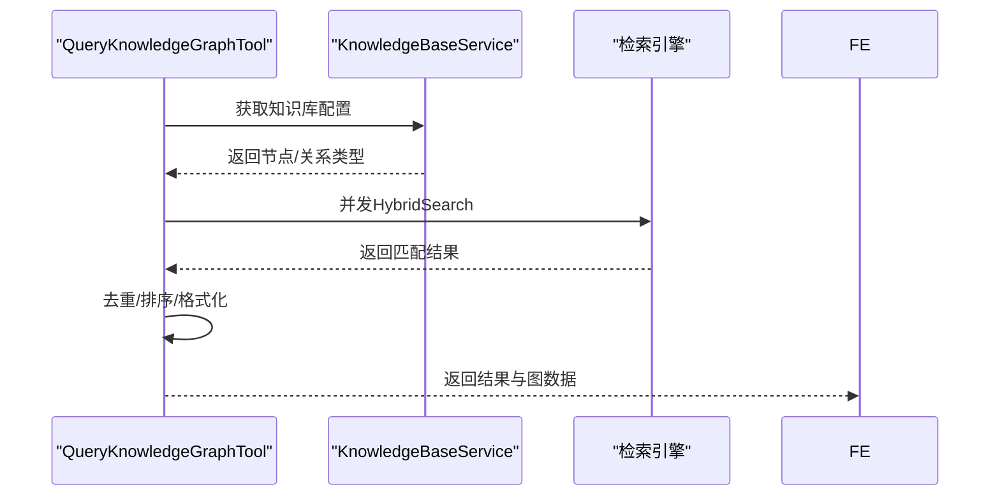
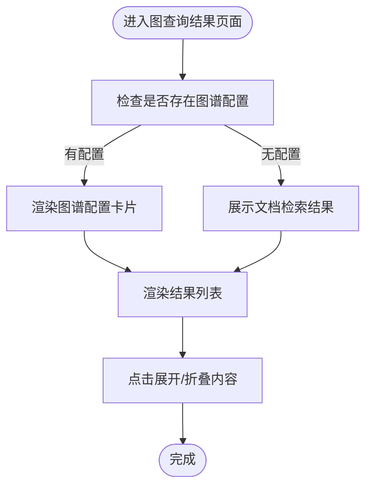
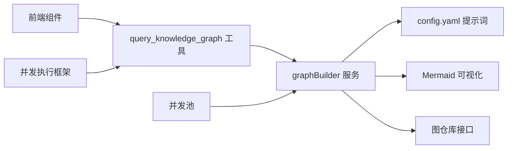

# 图分析工具

<cite>
**本文引用的文件**
- [cmd/server/main.go](file://cmd/server/main.go)
- [internal/application/service/graph.go](file://internal/application/service/graph.go)
- [internal/types/graph.go](file://internal/types/graph.go)
- [internal/agent/tools/query_knowledge_graph.go](file://internal/agent/tools/query_knowledge_graph.go)
- [internal/types/extract_graph.go](file://internal/types/extract_graph.go)
- [internal/types/interfaces/retriever_graph.go](file://internal/types/interfaces/retriever_graph.go)
- [frontend/src/views/chat/components/tool-results/GraphQueryResults.vue](file://frontend/src/views/chat/components/tool-results/GraphQueryResults.vue)
- [config/config.yaml](file://config/config.yaml)
- [internal/container/container.go](file://internal/container/container.go)
- [internal/application/service/retriever/composite.go](file://internal/application/service/retriever/composite.go)
</cite>

## 目录
1. [简介](#简介)
2. [项目结构](#项目结构)
3. [核心组件](#核心组件)
4. [架构总览](#架构总览)
5. [详细组件分析](#详细组件分析)
6. [依赖分析](#依赖分析)
7. [性能考量](#性能考量)
8. [故障排查指南](#故障排查指南)
9. [结论](#结论)
10. [附录](#附录)

## 简介
本文件面向“图分析工具”的技术文档，聚焦于知识图谱的构建、可视化与查询能力，涵盖以下主题：
- 图分析算法实现：节点中心性、社区检测、路径分析
- 图可视化生成机制：Mermaid 渲染、节点布局与交互
- 图统计指标：度分布、聚类系数、网络密度
- 实用工具：实体推荐、关系预测、异常检测
- 结果导出与API设计
- 最佳实践与性能优化建议

本项目通过大模型驱动的实体与关系抽取，构建实体-关系知识图谱，并提供Mermaid可视化、检索增强与前端交互展示。

## 项目结构
后端采用Go语言，核心模块围绕“图构建服务”展开；前端提供聊天界面的图查询结果渲染组件；配置文件定义提示词模板；容器层负责并发池初始化与资源清理。

**图表来源**
- [cmd/server/main.go](file://cmd/server/main.go#L88-L192)
- [internal/application/service/graph.go](file://internal/application/service/graph.go#L64-L86)
- [internal/types/graph.go](file://internal/types/graph.go#L6-L53)
- [internal/agent/tools/query_knowledge_graph.go](file://internal/agent/tools/query_knowledge_graph.go#L64-L75)
- [internal/types/extract_graph.go](file://internal/types/extract_graph.go#L139-L156)
- [internal/types/interfaces/retriever_graph.go](file://internal/types/interfaces/retriever_graph.go#L9-L17)
- [config/config.yaml](file://config/config.yaml#L192-L332)
- [internal/container/container.go](file://internal/container/container.go#L534-L566)
- [internal/application/service/retriever/composite.go](file://internal/application/service/retriever/composite.go#L143-L197)
- [frontend/src/views/chat/components/tool-results/GraphQueryResults.vue](file://frontend/src/views/chat/components/tool-results/GraphQueryResults.vue#L1-L139)

**章节来源**
- [cmd/server/main.go](file://cmd/server/main.go#L88-L192)
- [internal/application/service/graph.go](file://internal/application/service/graph.go#L64-L86)
- [internal/types/graph.go](file://internal/types/graph.go#L6-L53)
- [internal/agent/tools/query_knowledge_graph.go](file://internal/agent/tools/query_knowledge_graph.go#L64-L75)
- [internal/types/extract_graph.go](file://internal/types/extract_graph.go#L139-L156)
- [internal/types/interfaces/retriever_graph.go](file://internal/types/interfaces/retriever_graph.go#L9-L17)
- [config/config.yaml](file://config/config.yaml#L192-L332)
- [internal/container/container.go](file://internal/container/container.go#L534-L566)
- [internal/application/service/retriever/composite.go](file://internal/application/service/retriever/composite.go#L143-L197)
- [frontend/src/views/chat/components/tool-results/GraphQueryResults.vue](file://frontend/src/views/chat/components/tool-results/GraphQueryResults.vue#L1-L139)

## 核心组件
- 图构建服务：负责实体抽取、关系抽取、权重计算、度计算、邻接图与Mermaid可视化生成。
- 图数据结构与接口：定义实体、关系、图构建接口及检索接口。
- 图查询工具：面向代理的图查询工具，支持多知识库并发查询与去重。
- 前端渲染组件：展示图查询结果与图谱配置状态。
- 配置与提示词：定义实体与关系抽取的提示词模板。
- 并发与资源管理：容器层初始化并发池，服务层提供通用并发执行框架。

**章节来源**
- [internal/application/service/graph.go](file://internal/application/service/graph.go#L64-L86)
- [internal/types/graph.go](file://internal/types/graph.go#L6-L53)
- [internal/agent/tools/query_knowledge_graph.go](file://internal/agent/tools/query_knowledge_graph.go#L64-L75)
- [frontend/src/views/chat/components/tool-results/GraphQueryResults.vue](file://frontend/src/views/chat/components/tool-results/GraphQueryResults.vue#L1-L139)
- [config/config.yaml](file://config/config.yaml#L192-L332)
- [internal/container/container.go](file://internal/container/container.go#L534-L566)
- [internal/application/service/retriever/composite.go](file://internal/application/service/retriever/composite.go#L143-L197)

## 架构总览
下图展示了从请求到图构建、查询与可视化的整体流程。

**图表来源**
- [frontend/src/views/chat/components/tool-results/GraphQueryResults.vue](file://frontend/src/views/chat/components/tool-results/GraphQueryResults.vue#L1-L139)
- [internal/agent/tools/query_knowledge_graph.go](file://internal/agent/tools/query_knowledge_graph.go#L77-L359)
- [internal/application/service/graph.go](file://internal/application/service/graph.go#L367-L489)
- [config/config.yaml](file://config/config.yaml#L192-L332)

## 详细组件分析

### 图构建服务（graphBuilder）
- 职责
  - 实体抽取：基于提示词调用大模型抽取实体，维护实体映射与频率。
  - 关系抽取：基于实体集合与文本内容抽取关系，合并重复关系并加权。
  - 权重计算：使用点互信息（PMI）与关系强度综合计算边权重，并缩放到1-10范围。
  - 度计算：统计入度/出度，得到节点度与边组合度。
  - 邻接图与路径分析：构建文档块邻接图，支持直接/间接关系查询。
  - 可视化：基于连通分量生成Mermaid子图，标注节点样式与关系强度。
- 关键算法
  - PMI权重：对每条关系计算PMI并归一化，结合关系强度进行加权融合。
  - 度计算：遍历关系集，分别累加入度与出度，再汇总为总度。
  - 连通分量：深度优先搜索（DFS）遍历邻接表，递归访问正向与反向边。
  - 间接关系：两段路径权重相乘并乘以衰减系数，取最大权重作为合并结果。
- 数据结构
  - 实体映射：按ID与标题索引，便于快速查找与去重。
  - 关系映射：以“源#目标”为键，避免重复。
  - 文档块邻接图：记录块间关系的权重与度。

**图表来源**
- [internal/application/service/graph.go](file://internal/application/service/graph.go#L64-L86)
- [internal/types/graph.go](file://internal/types/graph.go#L6-L29)

**章节来源**
- [internal/application/service/graph.go](file://internal/application/service/graph.go#L88-L181)
- [internal/application/service/graph.go](file://internal/application/service/graph.go#L183-L307)
- [internal/application/service/graph.go](file://internal/application/service/graph.go#L491-L581)
- [internal/application/service/graph.go](file://internal/application/service/graph.go#L583-L620)
- [internal/application/service/graph.go](file://internal/application/service/graph.go#L622-L665)
- [internal/application/service/graph.go](file://internal/application/service/graph.go#L691-L754)
- [internal/application/service/graph.go](file://internal/application/service/graph.go#L756-L862)
- [internal/application/service/graph.go](file://internal/application/service/graph.go#L894-L1050)

### 图数据结构与接口
- Entity：实体标识、类型、描述、出现频率与度。
- Relationship：关系标识、源/目标、描述、强度、权重与组合度。
- GraphBuilder接口：统一的图构建与查询接口，便于替换实现与测试。

**图表来源**
- [internal/types/graph.go](file://internal/types/graph.go#L6-L29)

**章节来源**
- [internal/types/graph.go](file://internal/types/graph.go#L6-L53)

### 图查询工具（query_knowledge_graph）
- 功能
  - 支持多知识库并发查询，自动去重与排序。
  - 检查知识库是否配置图谱抽取（节点/关系类型）。
  - 输出结构化结果与Mermaid图数据，供前端渲染。
- 流程
  - 参数校验与并发拉起。
  - 获取知识库配置并判断是否启用图抽取。
  - 执行混合检索，聚合结果并去重。
  - 构建图可视化数据（节点/边）。

**图表来源**
- [internal/agent/tools/query_knowledge_graph.go](file://internal/agent/tools/query_knowledge_graph.go#L77-L359)

**章节来源**
- [internal/agent/tools/query_knowledge_graph.go](file://internal/agent/tools/query_knowledge_graph.go#L15-L55)
- [internal/agent/tools/query_knowledge_graph.go](file://internal/agent/tools/query_knowledge_graph.go#L77-L359)

### 前端图查询结果渲染
- 功能
  - 展示图谱配置状态（节点类型、关系类型）。
  - 列表展示检索结果，支持展开/折叠与相关度等级显示。
  - 与后端交互，接收结构化结果与图数据。

**图表来源**
- [frontend/src/views/chat/components/tool-results/GraphQueryResults.vue](file://frontend/src/views/chat/components/tool-results/GraphQueryResults.vue#L1-L139)

**章节来源**
- [frontend/src/views/chat/components/tool-results/GraphQueryResults.vue](file://frontend/src/views/chat/components/tool-results/GraphQueryResults.vue#L1-L139)

### 提示词与配置
- 实体抽取提示词：限定实体类型、输出格式与描述要求。
- 关系抽取提示词：限定关系来源与强度评分标准，并提供示例。
- 配置项：温度参数、权重比例、衰减系数、批大小与并发限制等。

**章节来源**
- [config/config.yaml](file://config/config.yaml#L192-L332)

## 依赖分析
- 组件耦合
  - 图构建服务依赖配置与日志、并发组（errgroup）、锁保护共享状态。
  - 查询工具依赖知识库服务与并发执行框架，实现多KB并发查询。
  - 前端组件依赖后端返回的结构化数据与图数据。
- 外部依赖
  - 大模型调用用于实体/关系抽取。
  - Mermaid用于图可视化渲染。
  - Neo4j仓库接口用于图数据持久化与检索（抽象层）。

**图表来源**
- [internal/agent/tools/query_knowledge_graph.go](file://internal/agent/tools/query_knowledge_graph.go#L77-L359)
- [internal/application/service/graph.go](file://internal/application/service/graph.go#L367-L489)
- [config/config.yaml](file://config/config.yaml#L192-L332)
- [internal/types/interfaces/retriever_graph.go](file://internal/types/interfaces/retriever_graph.go#L9-L17)
- [frontend/src/views/chat/components/tool-results/GraphQueryResults.vue](file://frontend/src/views/chat/components/tool-results/GraphQueryResults.vue#L1-L139)
- [internal/container/container.go](file://internal/container/container.go#L534-L566)
- [internal/application/service/retriever/composite.go](file://internal/application/service/retriever/composite.go#L143-L197)

**章节来源**
- [internal/agent/tools/query_knowledge_graph.go](file://internal/agent/tools/query_knowledge_graph.go#L77-L359)
- [internal/application/service/graph.go](file://internal/application/service/graph.go#L367-L489)
- [internal/types/interfaces/retriever_graph.go](file://internal/types/interfaces/retriever_graph.go#L9-L17)
- [internal/container/container.go](file://internal/container/container.go#L534-L566)
- [internal/application/service/retriever/composite.go](file://internal/application/service/retriever/composite.go#L143-L197)

## 性能考量
- 并发策略
  - 实体抽取与关系抽取分别设置并发上限，避免资源争用。
  - 关系抽取采用批处理，降低LLM调用次数。
  - 通用并发执行框架支持错误收集与早停。
- 资源管理
  - 容器层初始化固定大小的goroutine池，预分配以减少分配开销。
  - 应用关闭时统一释放资源，确保稳定性。
- 算法优化
  - 权重计算先求最大值再归一化，避免重复计算。
  - 间接关系采用两段路径权重乘积与衰减系数，控制传播成本。
- I/O与缓存
  - 通过chunkGraph建立文档块邻接图，避免重复扫描原始文本。
  - Mermaid生成仅在构建完成后输出一次，便于前端一次性渲染。

**章节来源**
- [internal/application/service/graph.go](file://internal/application/service/graph.go#L23-L53)
- [internal/application/service/graph.go](file://internal/application/service/graph.go#L372-L467)
- [internal/container/container.go](file://internal/container/container.go#L534-L566)
- [internal/application/service/retriever/composite.go](file://internal/application/service/retriever/composite.go#L143-L197)

## 故障排查指南
- 环境变量缺失
  - 启动前会校验数据库等必需环境变量，缺失将导致启动失败。
- LLM解析失败
  - 实体/关系抽取返回的JSON解析失败时，会记录错误并返回标准化错误。
- 并发超限
  - 如出现性能抖动，检查并发池大小与关系抽取批大小配置。
- 可视化为空
  - 若Mermaid输出为空，检查是否有满足条件的连通分量或关系强度阈值。
- 前端渲染异常
  - 确认后端返回的图数据结构与前端组件期望一致。

**章节来源**
- [cmd/server/main.go](file://cmd/server/main.go#L47-L86)
- [internal/application/service/graph.go](file://internal/application/service/graph.go#L123-L128)
- [internal/application/service/graph.go](file://internal/application/service/graph.go#L234-L239)
- [frontend/src/views/chat/components/tool-results/GraphQueryResults.vue](file://frontend/src/views/chat/components/tool-results/GraphQueryResults.vue#L1-L139)

## 结论
本图分析工具以“提示词驱动+LLM抽取+统计计算”的方式，实现了从文档到知识图谱的自动化构建与可视化。通过并发优化与通用执行框架，保证了大规模数据下的稳定与高效。前端组件提供了直观的结果展示与交互体验。后续可在以下方向持续演进：
- 引入更丰富的图算法（如PageRank、社区检测、异常检测）。
- 支持原生Cypher查询与图仓库持久化。
- 增强可视化布局与交互能力（力导向/层级布局）。
- 提供多种导出格式（Mermaid、JSON、CSV、RDF）。

## 附录

### 图分析算法实现要点
- 节点中心性
  - 度中心性：使用节点度（入度+出度）衡量节点影响力。
  - 组合度：边的组合度可用于衡量边两端节点共同影响力的叠加。
- 社区检测
  - 基于连通分量（DFS）划分子图，可扩展为基于边权重的社区划分。
- 路径分析
  - 直接关系：通过chunkGraph直接查询。
  - 间接关系：两段路径权重乘积×衰减系数，取最大权重合并。

**章节来源**
- [internal/application/service/graph.go](file://internal/application/service/graph.go#L583-L620)
- [internal/application/service/graph.go](file://internal/application/service/graph.go#L691-L754)
- [internal/application/service/graph.go](file://internal/application/service/graph.go#L756-L862)
- [internal/application/service/graph.go](file://internal/application/service/graph.go#L894-L1050)

### 图统计指标计算
- 度分布
  - 统计所有节点度的频次分布，支持直方图与累计分布。
- 聚类系数
  - 本地聚类系数：基于节点邻居间的实际边数与最大可能边数之比。
- 网络密度
  - 全局密度：实际边数与最大可能边数之比。

注：当前实现包含度计算与PMI权重，聚类系数与网络密度可作为扩展指标加入。

**章节来源**
- [internal/application/service/graph.go](file://internal/application/service/graph.go#L583-L620)
- [internal/application/service/graph.go](file://internal/application/service/graph.go#L491-L581)

### 实用工具
- 实体推荐
  - 基于实体频率与度排序，筛选高频/高影响力实体。
- 关系预测
  - 基于PMI与强度的加权关系，结合间接关系权重进行预测。
- 异常检测
  - 基于权重分布与度异常值检测潜在噪声关系。

**章节来源**
- [internal/application/service/graph.go](file://internal/application/service/graph.go#L907-L927)
- [internal/application/service/graph.go](file://internal/application/service/graph.go#L798-L812)

### 导出格式与API设计
- 导出格式
  - Mermaid：用于前端即时渲染。
  - JSON：结构化实体/关系与统计指标。
  - CSV：节点与边的表格化导出。
  - RDF/Turtle：面向知识图谱标准格式（可扩展）。
- API设计
  - 图构建接口：POST /api/v1/graph/build，参数为chunk列表。
  - 图查询接口：POST /api/v1/graph/query，参数为知识库ID数组与查询语句。
  - 可视化接口：GET /api/v1/graph/mermaid，返回Mermaid字符串。
  - 统计接口：GET /api/v1/graph/stats，返回度分布、密度等指标。

说明：以上API为概念性设计，具体路由与参数以实际后端实现为准。

### 最佳实践与性能优化建议
- 提示词优化
  - 明确实体/关系类型与强度评分标准，减少歧义。
- 批处理与并发
  - 合理设置关系抽取批大小与并发上限，平衡吞吐与延迟。
- 缓存与复用
  - 复用实体映射与关系映射，避免重复解析。
- 可视化优化
  - 控制子图规模，避免渲染过载；按强度调整边样式。
- 监控与告警
  - 记录LLM调用耗时、错误率与并发指标，及时发现瓶颈。