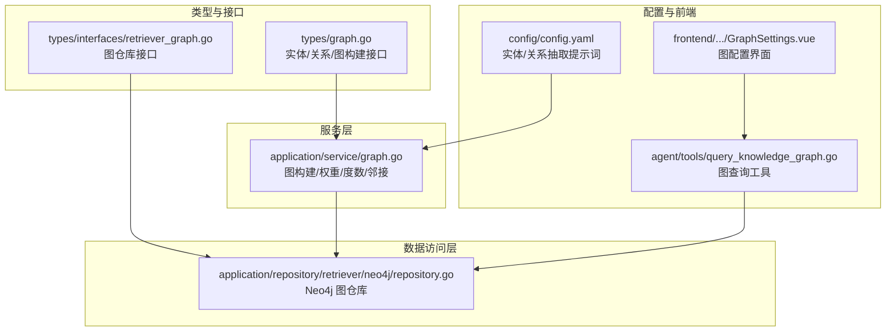
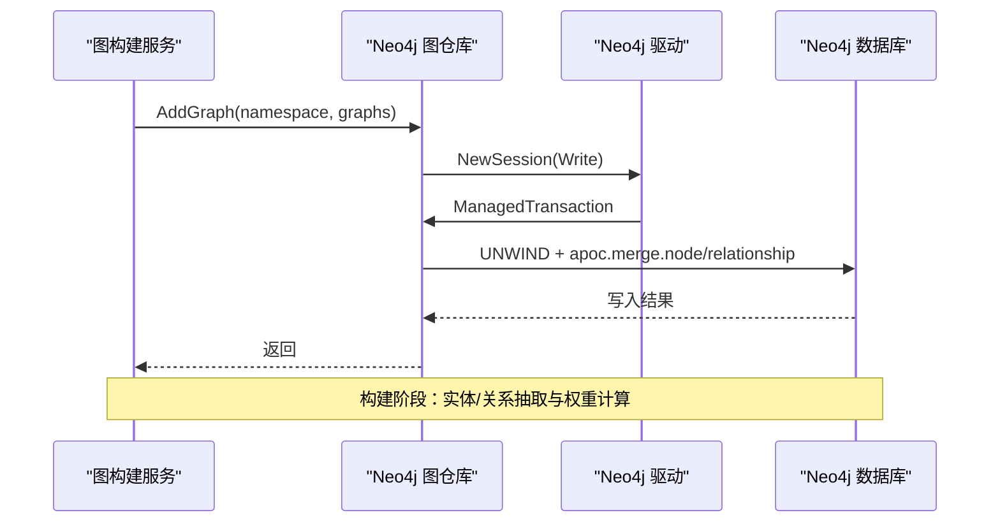
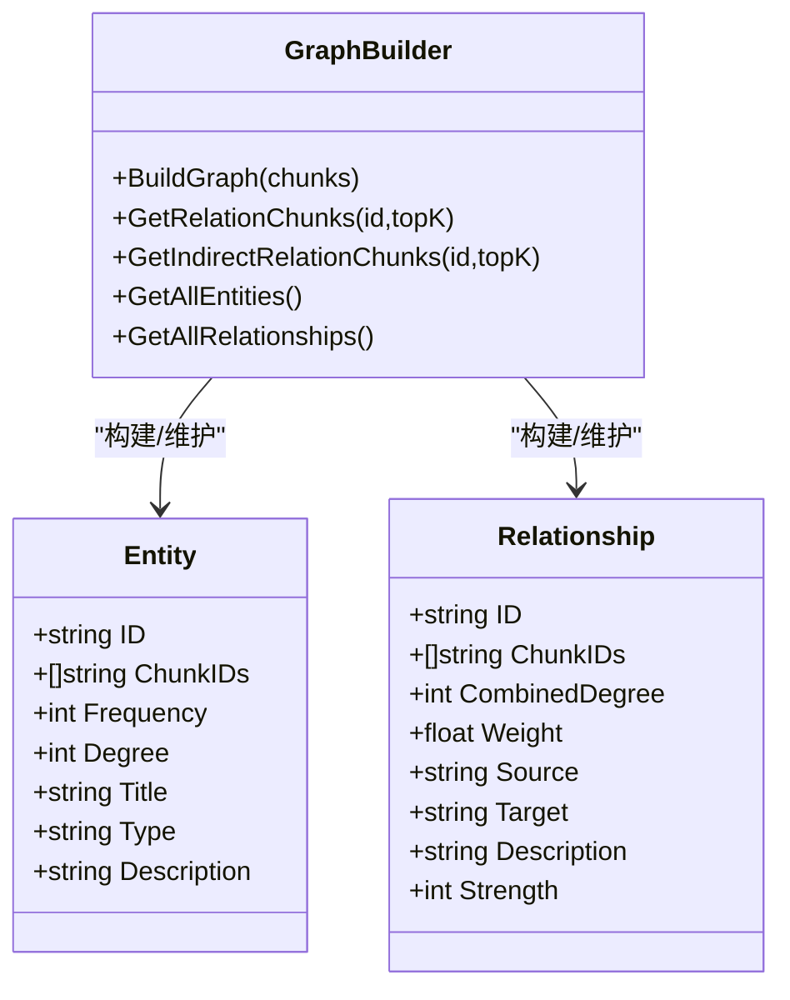
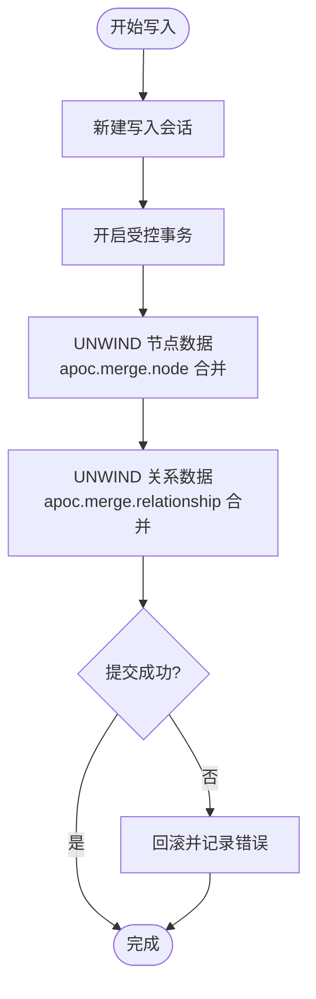
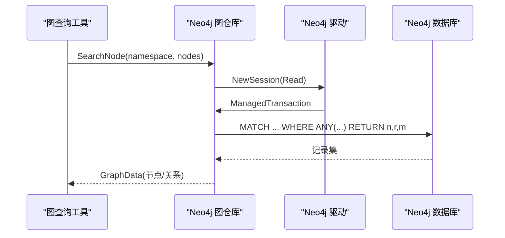
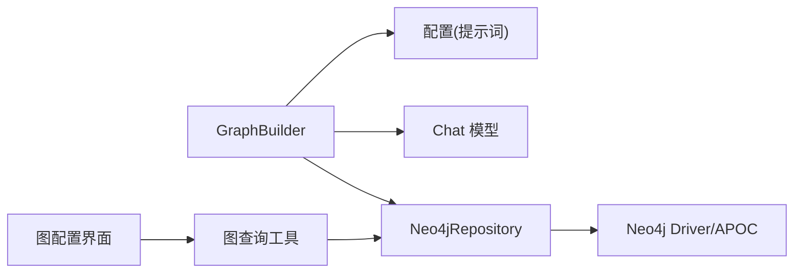

# 图存储设计

<cite>
**本文引用的文件**
- [internal/application/repository/retriever/neo4j/repository.go](file://internal/application/repository/retriever/neo4j/repository.go)
- [internal/types/interfaces/retriever_graph.go](file://internal/types/interfaces/retriever_graph.go)
- [internal/types/graph.go](file://internal/types/graph.go)
- [internal/application/service/graph.go](file://internal/application/service/graph.go)
- [config/config.yaml](file://config/config.yaml)
- [internal/agent/tools/query_knowledge_graph.go](file://internal/agent/tools/query_knowledge_graph.go)
- [frontend/src/views/knowledge/settings/GraphSettings.vue](file://frontend/src/views/knowledge/settings/GraphSettings.vue)
- [helm/templates/neo4j.yaml](file://helm/templates/neo4j.yaml)
</cite>

## 目录
1. [简介](#简介)
2. [项目结构](#项目结构)
3. [核心组件](#核心组件)
4. [架构概览](#架构概览)
5. [详细组件分析](#详细组件分析)
6. [依赖分析](#依赖分析)
7. [性能考量](#性能考量)
8. [故障排查指南](#故障排查指南)
9. [结论](#结论)
10. [附录](#附录)

## 简介
本文件面向图存储设计，系统性阐述基于 Neo4j 的知识图谱建模与持久化方案，涵盖实体节点属性设计、关系边类型定义、索引策略优化；说明图数据的持久化机制（事务处理、批量写入、一致性保证）；介绍图查询接口设计（Cypher 查询封装、参数绑定、结果映射）；提供增量更新策略（实时同步、冲突检测、版本管理）；并给出性能优化方案（索引优化、查询计划分析、内存管理）与运维最佳实践。

## 项目结构
本项目采用多层架构，图存储相关能力主要分布在以下模块：
- 类型与接口层：定义图数据模型与图仓库接口
- 服务层：实现知识图谱构建与权重计算
- 数据访问层：实现 Neo4j 图仓库，提供增删查操作
- 配置层：提供实体/关系抽取提示词与图配置开关
- 前端与工具层：提供图配置界面与图查询工具

**图表来源**
- [internal/types/graph.go](file://internal/types/graph.go#L6-L53)
- [internal/types/interfaces/retriever_graph.go](file://internal/types/interfaces/retriever_graph.go#L9-L17)
- [internal/application/service/graph.go](file://internal/application/service/graph.go#L64-L86)
- [internal/application/repository/retriever/neo4j/repository.go](file://internal/application/repository/retriever/neo4j/repository.go#L14-L23)
- [config/config.yaml](file://config/config.yaml#L193-L476)
- [frontend/src/views/knowledge/settings/GraphSettings.vue](file://frontend/src/views/knowledge/settings/GraphSettings.vue#L1-L35)
- [internal/agent/tools/query_knowledge_graph.go](file://internal/agent/tools/query_knowledge_graph.go#L38-L55)

**章节来源**
- [internal/types/graph.go](file://internal/types/graph.go#L6-L53)
- [internal/types/interfaces/retriever_graph.go](file://internal/types/interfaces/retriever_graph.go#L9-L17)
- [internal/application/service/graph.go](file://internal/application/service/graph.go#L64-L86)
- [internal/application/repository/retriever/neo4j/repository.go](file://internal/application/repository/retriever/neo4j/repository.go#L14-L23)
- [config/config.yaml](file://config/config.yaml#L193-L476)
- [frontend/src/views/knowledge/settings/GraphSettings.vue](file://frontend/src/views/knowledge/settings/GraphSettings.vue#L1-L35)
- [internal/agent/tools/query_knowledge_graph.go](file://internal/agent/tools/query_knowledge_graph.go#L38-L55)

## 核心组件
- 图数据模型
  - 实体（Entity）：唯一标识、所属文档分块集合、频率、度数、显示名、类型、描述
  - 关系（Relationship）：唯一标识、连接实体、权重、强度、描述
  - 图构建器（GraphBuilder）：从分块构建图、查询邻接与间接邻接、导出实体/关系
- 图仓库接口（RetrieveGraphRepository）
  - AddGraph：批量导入节点与关系
  - DelGraph：按命名空间删除节点与关系
  - SearchNode：按节点名关键字检索邻接子图
- Neo4j 图仓库实现
  - 使用 apoc.merge.node/relationship 进行幂等合并
  - 通过命名空间标签隔离不同知识库
  - 读写分离与事务封装

**章节来源**
- [internal/types/graph.go](file://internal/types/graph.go#L6-L53)
- [internal/types/interfaces/retriever_graph.go](file://internal/types/interfaces/retriever_graph.go#L9-L17)
- [internal/application/repository/retriever/neo4j/repository.go](file://internal/application/repository/retriever/neo4j/repository.go#L45-L115)
- [internal/application/repository/retriever/neo4j/repository.go](file://internal/application/repository/retriever/neo4j/repository.go#L163-L228)

## 架构概览
下图展示了从“图构建服务”到“Neo4j 存储”的端到端流程，以及查询路径与前端交互。

**图表来源**
- [internal/application/service/graph.go](file://internal/application/service/graph.go#L367-L489)
- [internal/application/repository/retriever/neo4j/repository.go](file://internal/application/repository/retriever/neo4j/repository.go#L60-L114)

## 详细组件分析

### 图数据模型与建模
- 节点建模
  - 节点标签：基于命名空间（知识库）动态生成，避免跨库污染
  - 节点属性：name、kg（知识库标识）、attributes（字符串属性列表）、chunks（分块ID列表）
  - 幂等合并：apoc.merge.node 以标签+唯一键合并，自动去重并合并属性
- 边建模
  - 关系类型：来源于实体关系抽取的类型（如“作者”、“别名”等）
  - 关系属性：可扩展（当前实现未显式传入，但预留字段）
  - 幂等合并：apoc.merge.relationship 以源/目标节点与关系类型合并
- 命名空间隔离
  - 通过标签前缀与 hyphen 替换，确保不同知识库/实体类型隔离

**图表来源**
- [internal/types/graph.go](file://internal/types/graph.go#L6-L53)
- [internal/application/service/graph.go](file://internal/application/service/graph.go#L64-L86)

**章节来源**
- [internal/types/graph.go](file://internal/types/graph.go#L6-L53)
- [internal/application/service/graph.go](file://internal/application/service/graph.go#L491-L620)

### 持久化机制与事务处理
- 事务封装
  - 写入：ExecuteWrite + ManagedTransaction，保证节点与关系写入原子性
  - 读取：ExecuteRead + ManagedTransaction，保证查询一致性
- 批量写入
  - UNWIND 批量参数，减少往返
  - apoc.merge.node/relationship 幂等合并，避免重复
- 删除策略
  - 按知识库标识（kg）删除节点与关系，支持周期性清理
  - 使用 apoc.periodic.iterate 并行批处理，提升删除效率

**图表来源**
- [internal/application/repository/retriever/neo4j/repository.go](file://internal/application/repository/retriever/neo4j/repository.go#L60-L114)
- [internal/application/repository/retriever/neo4j/repository.go](file://internal/application/repository/retriever/neo4j/repository.go#L118-L161)

**章节来源**
- [internal/application/repository/retriever/neo4j/repository.go](file://internal/application/repository/retriever/neo4j/repository.go#L60-L114)
- [internal/application/repository/retriever/neo4j/repository.go](file://internal/application/repository/retriever/neo4j/repository.go#L118-L161)

### 图查询接口设计
- Cypher 查询封装
  - SearchNode：按节点名关键字匹配，返回邻接节点与关系
  - 参数绑定：nodes 数组通过参数传入，避免拼接风险
  - 结果映射：将原生节点/关系属性映射为 GraphNode/GraphRelation
- 前端可视化
  - 工具输出包含“图配置”与“图数据”，供前端渲染

**图表来源**
- [internal/agent/tools/query_knowledge_graph.go](file://internal/agent/tools/query_knowledge_graph.go#L331-L359)
- [internal/application/repository/retriever/neo4j/repository.go](file://internal/application/repository/retriever/neo4j/repository.go#L163-L228)

**章节来源**
- [internal/agent/tools/query_knowledge_graph.go](file://internal/agent/tools/query_knowledge_graph.go#L331-L359)
- [internal/application/repository/retriever/neo4j/repository.go](file://internal/application/repository/retriever/neo4j/repository.go#L163-L228)

### 增量更新策略
- 实时同步
  - 新增：AddGraph 在事务中批量写入，apoc.merge 保证幂等
  - 删除：DelGraph 按知识库标识删除，避免误删
- 冲突检测与版本管理
  - 节点属性：apoc.coll.union 合并 chunks，避免重复
  - 关系强度：加权平均更新，结合出现次数平滑强度
- 版本化思路
  - 建议引入知识库版本字段（kg:version），配合标签前缀实现多版本隔离与回溯

**章节来源**
- [internal/application/repository/retriever/neo4j/repository.go](file://internal/application/repository/retriever/neo4j/repository.go#L66-L107)
- [internal/application/service/graph.go](file://internal/application/service/graph.go#L289-L301)

### 索引策略与优化
- 节点属性索引
  - name：高频匹配字段，建议建立索引
  - kg：知识库隔离字段，建议建立索引
  - attributes：属性列表，建议建立索引或使用全文索引（取决于查询模式）
- 关系类型索引
  - 关系类型：按类型过滤时建议建立索引
- 查询优化
  - 使用命名空间标签精确匹配，减少扫描范围
  - 使用 apoc.periodic.iterate 并行批处理大范围删除/更新
- 配置开关
  - 前端提供“启用图谱抽取”开关，便于按需开启

**章节来源**
- [config/config.yaml](file://config/config.yaml#L193-L476)
- [frontend/src/views/knowledge/settings/GraphSettings.vue](file://frontend/src/views/knowledge/settings/GraphSettings.vue#L22-L35)

## 依赖分析
- 组件耦合
  - GraphBuilder 依赖 Chat 模型与配置，负责实体/关系抽取与权重计算
  - Neo4jRepository 依赖 Neo4j 驱动，提供图数据的持久化能力
  - 工具层通过接口调用图仓库，实现查询与可视化
- 外部依赖
  - Neo4j 驱动与 APOC 扩展（apoc.merge.*、apoc.periodic.iterate）

**图表来源**
- [internal/application/service/graph.go](file://internal/application/service/graph.go#L76-L86)
- [internal/application/repository/retriever/neo4j/repository.go](file://internal/application/repository/retriever/neo4j/repository.go#L21-L23)
- [internal/agent/tools/query_knowledge_graph.go](file://internal/agent/tools/query_knowledge_graph.go#L64-L67)

**章节来源**
- [internal/application/service/graph.go](file://internal/application/service/graph.go#L76-L86)
- [internal/application/repository/retriever/neo4j/repository.go](file://internal/application/repository/retriever/neo4j/repository.go#L21-L23)
- [internal/agent/tools/query_knowledge_graph.go](file://internal/agent/tools/query_knowledge_graph.go#L64-L67)

## 性能考量
- 并发与批处理
  - 实体/关系抽取并发上限与批大小可控，避免过载
  - apoc.periodic.iterate 并行批处理，提升大规模删除/更新性能
- 内存管理
  - 通过批处理与限流控制内存峰值
  - 关系权重与度数计算使用局部变量，避免全局膨胀
- 查询计划
  - 使用命名空间标签精确匹配，减少回溯
  - 对高频字段建立索引，避免全表扫描

**章节来源**
- [internal/application/service/graph.go](file://internal/application/service/graph.go#L367-L489)
- [internal/application/repository/retriever/neo4j/repository.go](file://internal/application/repository/retriever/neo4j/repository.go#L130-L153)

## 故障排查指南
- 常见问题
  - Neo4j 驱动为空：检查初始化与配置，确保驱动可用
  - apoc.merge 失败：确认标签与唯一键组合是否一致
  - 查询无结果：检查命名空间标签与节点名匹配条件
- 日志与告警
  - 写入/删除失败会记录错误日志，便于定位
  - 建议增加慢查询监控与重试策略

**章节来源**
- [internal/application/repository/retriever/neo4j/repository.go](file://internal/application/repository/retriever/neo4j/repository.go#L47-L50)
- [internal/application/repository/retriever/neo4j/repository.go](file://internal/application/repository/retriever/neo4j/repository.go#L110-L113)
- [internal/application/repository/retriever/neo4j/repository.go](file://internal/application/repository/retriever/neo4j/repository.go#L184-L187)

## 结论
本设计以 Neo4j 为核心，结合 apoc 扩展实现了图数据的幂等合并、事务一致性与高效批处理。通过命名空间标签隔离与严格的参数绑定，保障了跨知识库的独立性与安全性。建议在生产环境中配合索引策略、查询计划分析与监控告警，持续优化吞吐与稳定性。

## 附录

### 存储配置示例（Neo4j 服务暴露）
- 服务端口：HTTP 7474、Bolt 7687
- 建议在 Helm 中为 Neo4j 配置持久卷与资源限制，确保高可用

**章节来源**
- [helm/templates/neo4j.yaml](file://helm/templates/neo4j.yaml#L116-L136)