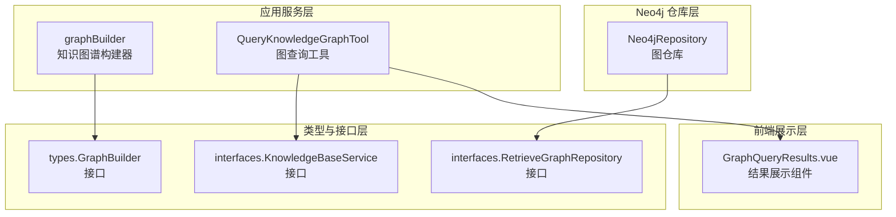
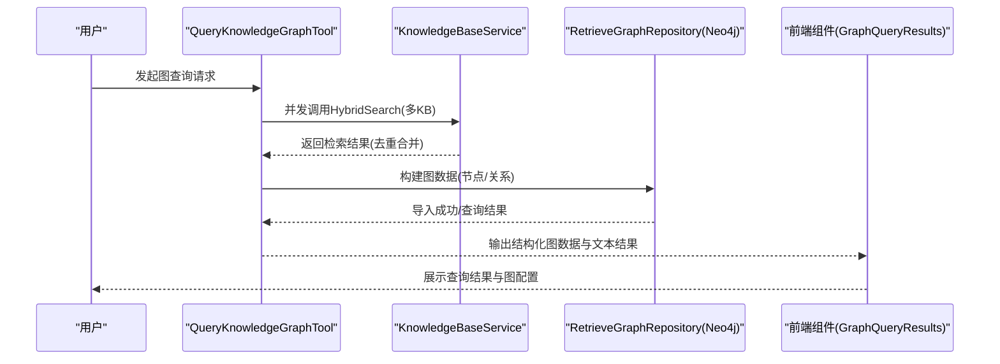
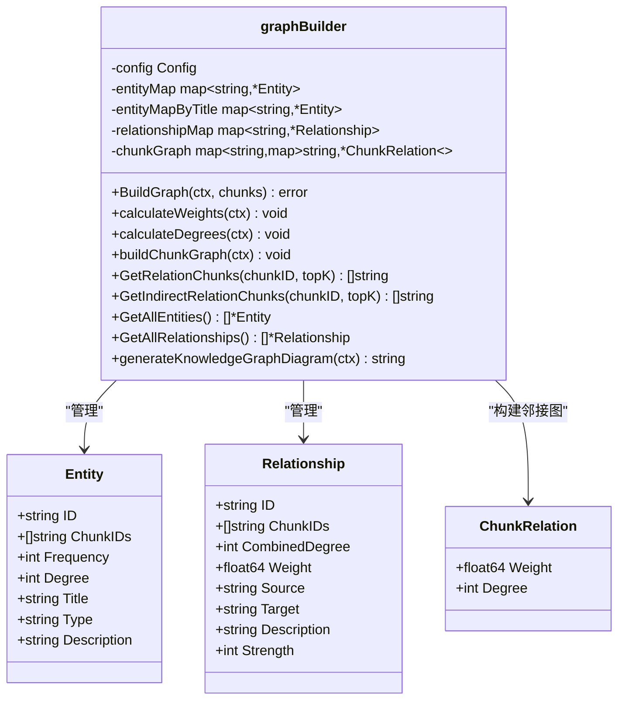
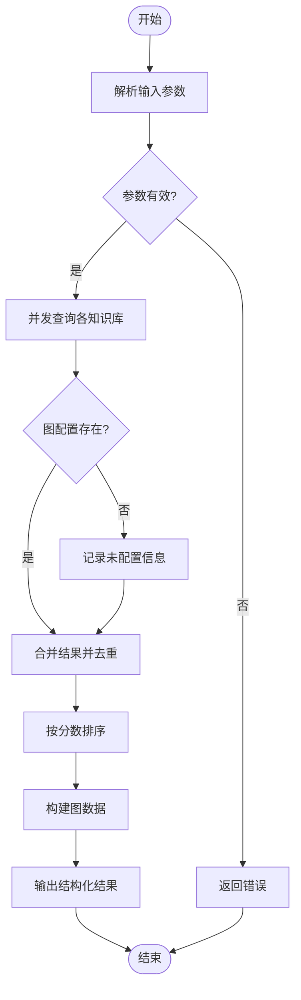
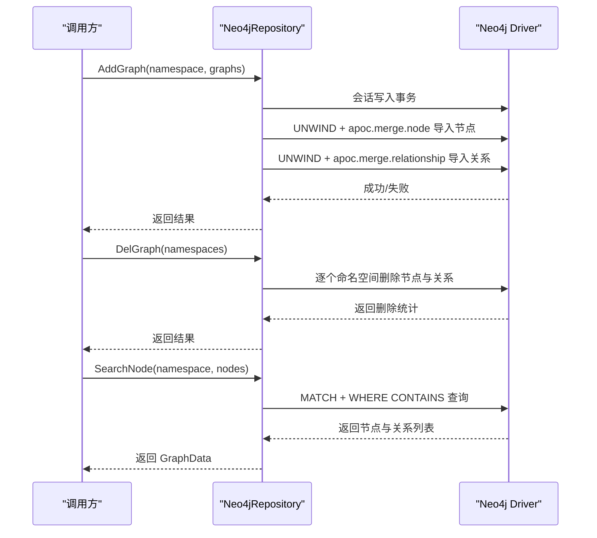
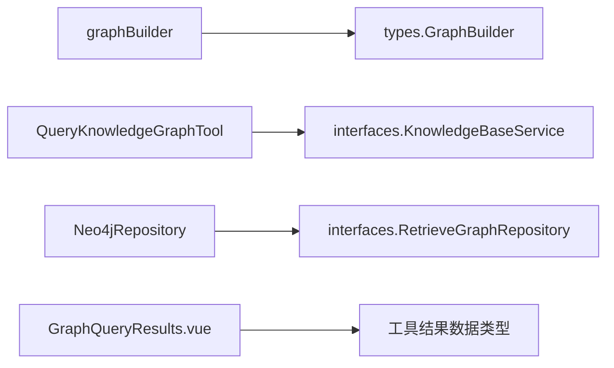

# 图查询实现

<cite>
**本文档引用的文件**
- [internal/application/service/graph.go](file://internal/application/service/graph.go)
- [internal/agent/tools/query_knowledge_graph.go](file://internal/agent/tools/query_knowledge_graph.go)
- [internal/application/repository/retriever/neo4j/repository.go](file://internal/application/repository/retriever/neo4j/repository.go)
- [internal/types/graph.go](file://internal/types/graph.go)
- [internal/types/interfaces/retriever_graph.go](file://internal/types/interfaces/retriever_graph.go)
- [internal/types/interfaces/knowledgebase.go](file://internal/types/interfaces/knowledgebase.go)
- [frontend/src/views/chat/components/tool-results/GraphQueryResults.vue](file://frontend/src/views/chat/components/tool-results/GraphQueryResults.vue)
</cite>

## 目录
1. [简介](#简介)
2. [项目结构](#项目结构)
3. [核心组件](#核心组件)
4. [架构总览](#架构总览)
5. [详细组件分析](#详细组件分析)
6. [依赖分析](#依赖分析)
7. [性能考虑](#性能考虑)
8. [故障排查指南](#故障排查指南)
9. [结论](#结论)
10. [附录](#附录)

## 简介
本文件面向图查询与知识图谱构建的技术实现，围绕以下目标展开：  
- 解释 Cypher 查询语言在知识图谱中的应用现状与扩展方向  
- 深入阐述路径查找算法（广度优先搜索、深度优先搜索、最短路径）、聚合计算与过滤条件优化  
- 说明图遍历策略与复杂查询（多跳关系、子图匹配、约束满足问题）的实现思路  
- 提供查询性能优化技术（索引使用、查询计划优化、缓存策略）  
- 给出图分析查询示例（中心性分析、社区发现、异常检测）  
- 提供查询调试工具与性能监控方法  

当前系统已具备基于文档块的实体与关系抽取、权重计算、度数统计、邻接图构建与可视化生成能力；同时提供基于 Neo4j 的图数据导入与查询能力，并通过前端组件展示图谱查询结果。

## 项目结构
本项目采用分层架构，知识图谱相关能力主要分布在以下模块：
- 应用服务层：负责知识图谱构建、权重与度数计算、邻接图构建、可视化生成等
- 代理工具层：提供图查询工具，支持并发查询多个知识库并去重合并
- Neo4j 仓库层：提供节点与关系导入、删除、查询能力
- 类型与接口层：定义实体、关系、图构建器、图仓库接口等
- 前端展示层：提供图查询结果的可视化卡片组件

图表来源
- [internal/application/service/graph.go](file://internal/application/service/graph.go#L64-L86)
- [internal/agent/tools/query_knowledge_graph.go](file://internal/agent/tools/query_knowledge_graph.go#L63-L75)
- [internal/application/repository/retriever/neo4j/repository.go](file://internal/application/repository/retriever/neo4j/repository.go#L14-L23)
- [internal/types/interfaces/retriever_graph.go](file://internal/types/interfaces/retriever_graph.go#L9-L17)
- [internal/types/interfaces/knowledgebase.go](file://internal/types/interfaces/knowledgebase.go#L14-L100)
- [frontend/src/views/chat/components/tool-results/GraphQueryResults.vue](file://frontend/src/views/chat/components/tool-results/GraphQueryResults.vue#L1-L53)

章节来源
- [internal/application/service/graph.go](file://internal/application/service/graph.go#L64-L86)
- [internal/agent/tools/query_knowledge_graph.go](file://internal/agent/tools/query_knowledge_graph.go#L63-L75)
- [internal/application/repository/retriever/neo4j/repository.go](file://internal/application/repository/retriever/neo4j/repository.go#L14-L23)
- [internal/types/interfaces/retriever_graph.go](file://internal/types/interfaces/retriever_graph.go#L9-L17)
- [internal/types/interfaces/knowledgebase.go](file://internal/types/interfaces/knowledgebase.go#L14-L100)
- [frontend/src/views/chat/components/tool-results/GraphQueryResults.vue](file://frontend/src/views/chat/components/tool-results/GraphQueryResults.vue#L1-L53)

## 核心组件
- 知识图谱构建器（graphBuilder）：负责从文档块提取实体与关系、计算权重与度数、构建邻接图、生成可视化图示
- 图查询工具（QueryKnowledgeGraphTool）：并发查询多个知识库，合并去重结果，输出结构化图数据用于前端展示
- Neo4j 仓库（Neo4jRepository）：提供节点与关系的导入、删除、查询能力，支持命名空间隔离
- 类型与接口：定义实体、关系、图构建器接口、图仓库接口以及知识库服务接口

章节来源
- [internal/types/graph.go](file://internal/types/graph.go#L6-L53)
- [internal/types/interfaces/retriever_graph.go](file://internal/types/interfaces/retriever_graph.go#L9-L17)
- [internal/types/interfaces/knowledgebase.go](file://internal/types/interfaces/knowledgebase.go#L14-L100)
- [internal/application/service/graph.go](file://internal/application/service/graph.go#L64-L86)
- [internal/agent/tools/query_knowledge_graph.go](file://internal/agent/tools/query_knowledge_graph.go#L63-L75)
- [internal/application/repository/retriever/neo4j/repository.go](file://internal/application/repository/retriever/neo4j/repository.go#L14-L23)

## 架构总览
下图展示了从用户发起图查询到结果可视化的整体流程，以及与 Neo4j 的交互：

图表来源
- [internal/agent/tools/query_knowledge_graph.go](file://internal/agent/tools/query_knowledge_graph.go#L77-L167)
- [internal/types/interfaces/knowledgebase.go](file://internal/types/interfaces/knowledgebase.go#L65-L73)
- [internal/application/repository/retriever/neo4j/repository.go](file://internal/application/repository/retriever/neo4j/repository.go#L45-L115)
- [frontend/src/views/chat/components/tool-results/GraphQueryResults.vue](file://frontend/src/views/chat/components/tool-results/GraphQueryResults.vue#L1-L53)

## 详细组件分析

### 知识图谱构建器（graphBuilder）
graphBuilder 负责从文档块中抽取实体与关系，计算权重与度数，构建邻接图，并生成可视化图示。其关键能力包括：
- 实体抽取：对每个文档块调用 LLM 提取实体，维护实体映射与出现频率
- 关系抽取：基于实体集合与文档内容，调用 LLM 提取关系，合并相同关系并更新强度
- 权重计算：使用点互信息（PMI）与关系强度，归一化后加权缩放到 1-10 区间
- 度数统计：分别统计入度与出度，得到实体度数与关系组合度数
- 邻接图构建：基于实体关系建立文档块之间的邻接关系，支持直接与间接连接查询
- 可视化生成：生成 Mermaid 图示，按连通分量拆分子图并标注节点样式

图表来源
- [internal/application/service/graph.go](file://internal/application/service/graph.go#L64-L86)
- [internal/types/graph.go](file://internal/types/graph.go#L6-L29)

章节来源
- [internal/application/service/graph.go](file://internal/application/service/graph.go#L88-L181)
- [internal/application/service/graph.go](file://internal/application/service/graph.go#L183-L307)
- [internal/application/service/graph.go](file://internal/application/service/graph.go#L491-L581)
- [internal/application/service/graph.go](file://internal/application/service/graph.go#L583-L620)
- [internal/application/service/graph.go](file://internal/application/service/graph.go#L622-L665)
- [internal/application/service/graph.go](file://internal/application/service/graph.go#L667-L754)
- [internal/application/service/graph.go](file://internal/application/service/graph.go#L756-L813)
- [internal/application/service/graph.go](file://internal/application/service/graph.go#L894-L1050)

### 图查询工具（QueryKnowledgeGraphTool）
该工具支持对多个知识库并发查询，自动检查图配置状态，合并去重结果，并输出结构化图数据用于前端可视化。其工作流程如下：
- 参数校验：知识库 ID 数量限制、查询内容必填
- 并发查询：对每个知识库并发执行 HybridSearch
- 图配置检查：若未配置实体/关系类型，则返回相应提示
- 结果合并：跨知识库去重并按分数排序
- 可视化数据：构建节点与边结构，便于前端渲染

图表来源
- [internal/agent/tools/query_knowledge_graph.go](file://internal/agent/tools/query_knowledge_graph.go#L77-L167)
- [internal/agent/tools/query_knowledge_graph.go](file://internal/agent/tools/query_knowledge_graph.go#L361-L393)

章节来源
- [internal/agent/tools/query_knowledge_graph.go](file://internal/agent/tools/query_knowledge_graph.go#L77-L167)
- [internal/agent/tools/query_knowledge_graph.go](file://internal/agent/tools/query_knowledge_graph.go#L168-L218)
- [internal/agent/tools/query_knowledge_graph.go](file://internal/agent/tools/query_knowledge_graph.go#L220-L358)
- [internal/agent/tools/query_knowledge_graph.go](file://internal/agent/tools/query_knowledge_graph.go#L361-L393)

### Neo4j 仓库（Neo4jRepository）
Neo4j 仓库提供节点与关系的导入、删除与查询能力，支持命名空间隔离与标签转换。关键操作包括：
- 添加图：批量导入节点与关系，使用 apoc.merge 进行节点与关系合并
- 删除图：按知识标识符删除对应节点与关系
- 查询节点：根据节点名模糊匹配，返回节点与邻接关系

图表来源
- [internal/application/repository/retriever/neo4j/repository.go](file://internal/application/repository/retriever/neo4j/repository.go#L45-L115)
- [internal/application/repository/retriever/neo4j/repository.go](file://internal/application/repository/retriever/neo4j/repository.go#L117-L161)
- [internal/application/repository/retriever/neo4j/repository.go](file://internal/application/repository/retriever/neo4j/repository.go#L163-L228)

章节来源
- [internal/application/repository/retriever/neo4j/repository.go](file://internal/application/repository/retriever/neo4j/repository.go#L45-L115)
- [internal/application/repository/retriever/neo4j/repository.go](file://internal/application/repository/retriever/neo4j/repository.go#L117-L161)
- [internal/application/repository/retriever/neo4j/repository.go](file://internal/application/repository/retriever/neo4j/repository.go#L163-L228)

### 前端图查询结果组件（GraphQueryResults）
前端组件负责展示图查询结果，包括图配置状态、结果列表与内容展开/收起。组件特性：
- 展示图配置：实体类型与关系类型
- 结果列表：按相关度排序，支持展开查看完整内容
- 国际化与样式：使用 Less 样式与国际化文案

章节来源
- [frontend/src/views/chat/components/tool-results/GraphQueryResults.vue](file://frontend/src/views/chat/components/tool-results/GraphQueryResults.vue#L1-L53)
- [frontend/src/views/chat/components/tool-results/GraphQueryResults.vue](file://frontend/src/views/chat/components/tool-results/GraphQueryResults.vue#L55-L96)
- [frontend/src/views/chat/components/tool-results/GraphQueryResults.vue](file://frontend/src/views/chat/components/tool-results/GraphQueryResults.vue#L98-L139)

## 依赖分析
- graphBuilder 依赖类型定义（Entity、Relationship、GraphBuilder 接口），并使用并发控制与日志记录
- QueryKnowledgeGraphTool 依赖 KnowledgeBaseService 接口，实现并发查询与结果合并
- Neo4jRepository 依赖 Neo4j Go Driver 与 APOC 扩展，实现节点与关系的导入与查询
- 前端组件依赖工具结果类型与国际化资源

图表来源
- [internal/application/service/graph.go](file://internal/application/service/graph.go#L64-L86)
- [internal/agent/tools/query_knowledge_graph.go](file://internal/agent/tools/query_knowledge_graph.go#L63-L75)
- [internal/application/repository/retriever/neo4j/repository.go](file://internal/application/repository/retriever/neo4j/repository.go#L14-L23)
- [frontend/src/views/chat/components/tool-results/GraphQueryResults.vue](file://frontend/src/views/chat/components/tool-results/GraphQueryResults.vue#L1-L53)

章节来源
- [internal/types/interfaces/retriever_graph.go](file://internal/types/interfaces/retriever_graph.go#L9-L17)
- [internal/types/interfaces/knowledgebase.go](file://internal/types/interfaces/knowledgebase.go#L14-L100)
- [internal/application/service/graph.go](file://internal/application/service/graph.go#L64-L86)
- [internal/agent/tools/query_knowledge_graph.go](file://internal/agent/tools/query_knowledge_graph.go#L63-L75)
- [internal/application/repository/retriever/neo4j/repository.go](file://internal/application/repository/retriever/neo4j/repository.go#L14-L23)
- [frontend/src/views/chat/components/tool-results/GraphQueryResults.vue](file://frontend/src/views/chat/components/tool-results/GraphQueryResults.vue#L1-L53)

## 性能考虑
- 并发控制与限流
  - 实体抽取与关系抽取分别设置最大并发度，避免资源争用
  - 关系抽取按批次处理，降低内存峰值与 GC 压力
- 计算优化
  - 权重计算先求最大值再归一化，减少重复计算
  - 度数统计一次遍历完成入度/出度累加
- 数据结构选择
  - 使用哈希表快速定位实体与关系，提升查找效率
  - 邻接图采用嵌套映射，便于直接/间接连接查询
- I/O 优化
  - Neo4j 导入使用 UNWIND + APOC 批量合并，减少往返开销
  - 删除操作使用 apoc.periodic.iterate 并行批处理
- 缓存与复用
  - 建议在服务层引入轻量缓存（如 Redis）存放热点实体/关系属性，减少重复计算
  - 对高频查询结果进行短期缓存，结合 TTL 控制一致性

[本节为通用性能建议，不直接分析具体文件]

## 故障排查指南
- 图查询工具常见问题
  - 参数缺失：检查知识库 ID 数组长度与查询内容是否为空
  - 图配置缺失：确认知识库是否配置实体类型与关系类型
  - 并发错误：关注并发查询返回的错误列表，逐项定位失败原因
- Neo4j 仓库常见问题
  - 驱动未初始化：当 driver 为空时返回“不支持图检索”，需检查连接配置
  - 导入失败：核对节点/关系数据格式与标签转换逻辑
  - 查询异常：检查 CONTAINS 条件与命名空间标签表达式
- 可视化与前端
  - 结果为空：确认去重后是否仍有命中
  - 样式异常：检查 Mermaid 图示生成逻辑与节点样式类映射

章节来源
- [internal/agent/tools/query_knowledge_graph.go](file://internal/agent/tools/query_knowledge_graph.go#L88-L110)
- [internal/agent/tools/query_knowledge_graph.go](file://internal/agent/tools/query_knowledge_graph.go#L134-L149)
- [internal/application/repository/retriever/neo4j/repository.go](file://internal/application/repository/retriever/neo4j/repository.go#L47-L50)
- [internal/application/repository/retriever/neo4j/repository.go](file://internal/application/repository/retriever/neo4j/repository.go#L169-L172)

## 结论
本项目在知识图谱构建与查询方面已形成较为完整的链路：从文档块抽取实体与关系，到权重与度数计算，再到邻接图构建与可视化生成；并通过 Neo4j 提供持久化与查询能力。当前图查询工具支持跨知识库并发查询与结果去重，前端组件提供直观的结果展示。未来可进一步完善 Cypher 查询语言支持、路径算法与图分析能力，持续优化性能与可运维性。

[本节为总结性内容，不直接分析具体文件]

## 附录

### Cypher 查询语言在知识图谱中的应用现状与扩展方向
- 现状
  - 系统已提供基于 Neo4j 的节点与关系导入、删除与查询能力，支持命名空间隔离
  - 图查询工具当前返回混合检索结果与结构化图数据，Cypher 支持处于开发中
- 扩展方向
  - 引入 Cypher 查询解析器与参数绑定，支持多跳关系、子图匹配与约束满足
  - 在 graphBuilder 中增加路径查找算法（BFS/DFS/最短路径），并与权重/度数结合
  - 将图分析指标（中心性、社区发现、异常检测）作为查询扩展能力

章节来源
- [internal/application/repository/retriever/neo4j/repository.go](file://internal/application/repository/retriever/neo4j/repository.go#L163-L228)
- [internal/agent/tools/query_knowledge_graph.go](file://internal/agent/tools/query_knowledge_graph.go#L335-L338)

### 图遍历策略与复杂查询实现思路
- 广度优先搜索（BFS）
  - 适用于最短路径与层级扩展，可结合权重阈值与度数排序
- 深度优先搜索（DFS）
  - 适用于连通分量识别与子图提取，可用于生成 Mermaid 可视化
- 最短路径算法
  - 可基于权重（如 PMI 与强度加权）计算边权，使用 Dijkstra 或 A* 等算法
- 复杂查询
  - 多跳关系：在 graphBuilder 中扩展邻接图，支持 k-hop 连接与权重衰减
  - 子图匹配：结合命名空间与标签，限定查询范围
  - 约束满足：在 Cypher 中加入属性与关系类型约束，确保语义正确性

章节来源
- [internal/application/service/graph.go](file://internal/application/service/graph.go#L869-L892)
- [internal/application/service/graph.go](file://internal/application/service/graph.go#L756-L813)

### 查询性能优化技术
- 索引使用
  - Neo4j 节点名称与知识标识符建立索引，加速 CONTAINS 与匹配查询
- 查询计划优化
  - 合理使用标签与范围查询，避免全量扫描
  - 批量导入时统一命名空间标签，减少动态拼接成本
- 缓存策略
  - 对热点实体/关系属性与查询结果进行短期缓存
  - 利用增量更新与失效策略保持一致性

章节来源
- [internal/application/repository/retriever/neo4j/repository.go](file://internal/application/repository/retriever/neo4j/repository.go#L163-L228)
- [internal/application/repository/retriever/neo4j/repository.go](file://internal/application/repository/retriever/neo4j/repository.go#L64-L115)

### 图分析查询示例
- 中心性分析
  - 基于度数与权重，计算节点中心性并排序，辅助关键概念识别
- 社区发现
  - 基于连通分量与关系强度，识别知识网络中的主题社区
- 异常检测
  - 基于权重分布与度数异常，识别孤立或异常关系

章节来源
- [internal/application/service/graph.go](file://internal/application/service/graph.go#L583-L620)
- [internal/application/service/graph.go](file://internal/application/service/graph.go#L894-L1050)

### 查询调试工具与性能监控
- 日志与追踪
  - 使用结构化日志记录实体/关系数量、权重计算耗时、邻接图规模
  - 结合 OpenTelemetry 进行端到端追踪，定位慢查询环节
- 前端调试
  - GraphQueryResults 组件展示图配置与结果统计，辅助验证查询效果
- Neo4j 监控
  - 监控 apoc 导入批大小与并行度，调整以平衡吞吐与稳定性

章节来源
- [internal/application/service/graph.go](file://internal/application/service/graph.go#L367-L489)
- [internal/agent/tools/query_knowledge_graph.go](file://internal/agent/tools/query_knowledge_graph.go#L220-L358)
- [internal/application/repository/retriever/neo4j/repository.go](file://internal/application/repository/retriever/neo4j/repository.go#L117-L161)