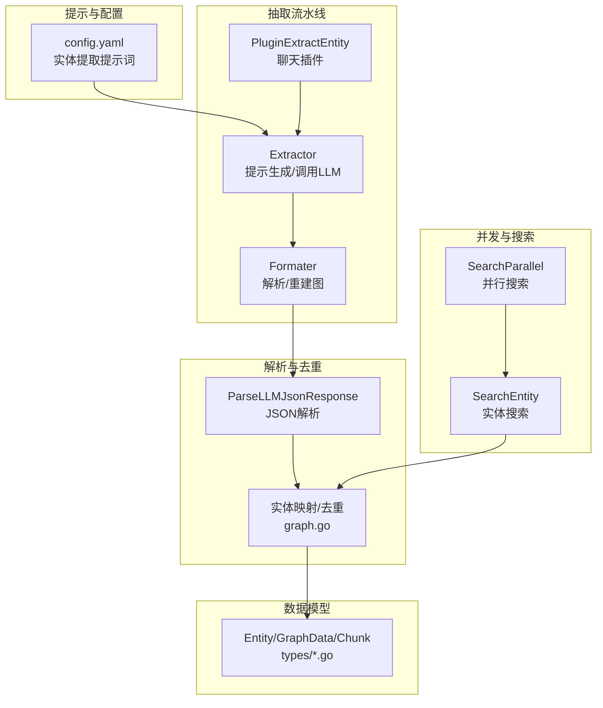
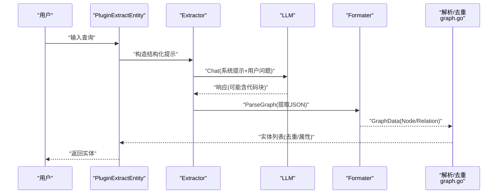
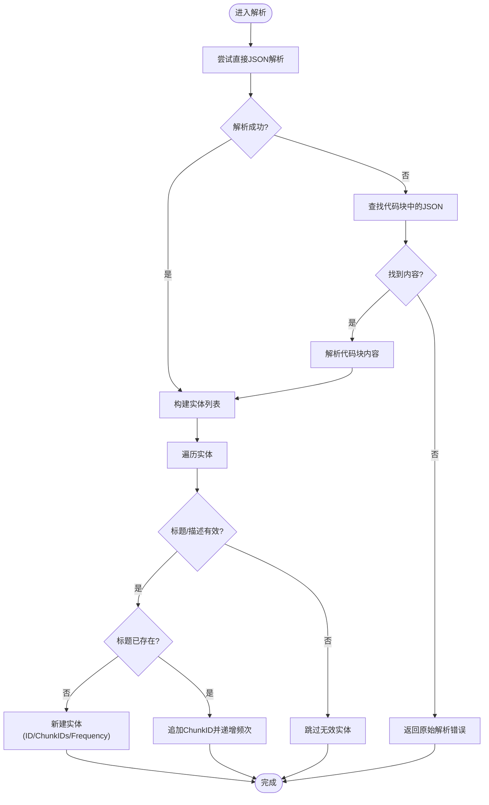
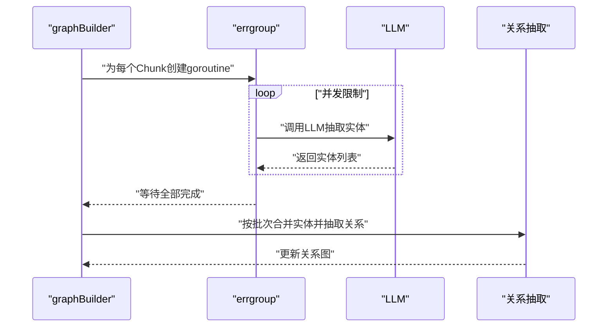
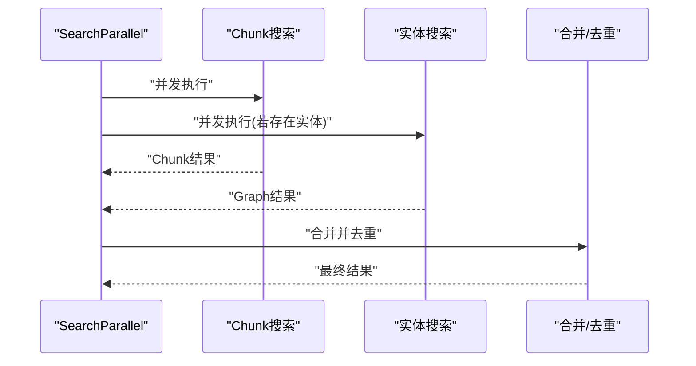
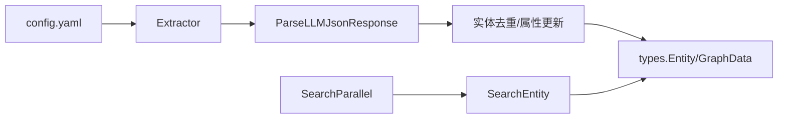

# 实体抽取算法

<cite>
**本文引用的文件**
- [internal/application/service/graph.go](file://internal/application/service/graph.go)
- [internal/application/service/chat_pipline/extract_entity.go](file://internal/application/service/chat_pipline/extract_entity.go)
- [internal/application/service/chat_pipline/search_entity.go](file://internal/application/service/chat_pipline/search_entity.go)
- [internal/application/service/chat_pipline/search_parallel.go](file://internal/application/service/chat_pipline/search_parallel.go)
- [internal/common/tools.go](file://internal/common/tools.go)
- [internal/types/extract_graph.go](file://internal/types/extract_graph.go)
- [internal/types/chunk.go](file://internal/types/chunk.go)
- [internal/types/graph.go](file://internal/types/graph.go)
- [config/config.yaml](file://config/config.yaml)
- [internal/container/container.go](file://internal/container/container.go)
</cite>

## 目录
1. [简介](#简介)
2. [项目结构](#项目结构)
3. [核心组件](#核心组件)
4. [架构总览](#架构总览)
5. [详细组件分析](#详细组件分析)
6. [依赖分析](#依赖分析)
7. [性能考量](#性能考量)
8. [故障排查指南](#故障排查指南)
9. [结论](#结论)
10. [附录](#附录)

## 简介
本文件系统性阐述基于大语言模型（LLM）的命名实体识别与抽取流程，覆盖提示词工程设计、JSON响应解析、实体去重与属性管理、并发抽取实现、质量评估标准以及性能优化建议。文档面向开发者与技术管理者，既提供代码级细节，也提供可操作的实践指导。

## 项目结构
围绕实体抽取的关键模块分布如下：
- 提示词与配置：位于配置文件，定义实体类型、提取规则与示例。
- 实体抽取流水线：聊天插件与提示生成器负责构造结构化提示并调用LLM。
- 实体解析与去重：统一的JSON解析工具与实体映射策略。
- 并发执行：基于errgroup与资源限制的并发控制。
- 数据模型：实体、图节点/关系、Chunk等核心类型定义。



**图表来源**
- [config/config.yaml](file://config/config.yaml#L193-L230)
- [internal/application/service/chat_pipline/extract_entity.go](file://internal/application/service/chat_pipline/extract_entity.go#L152-L198)
- [internal/common/tools.go](file://internal/common/tools.go#L93-L117)
- [internal/application/service/graph.go](file://internal/application/service/graph.go#L112-L181)
- [internal/application/service/chat_pipline/search_parallel.go](file://internal/application/service/chat_pipline/search_parallel.go#L88-L185)
- [internal/application/service/chat_pipline/search_entity.go](file://internal/application/service/chat_pipline/search_entity.go#L50-L89)
- [internal/types/extract_graph.go](file://internal/types/extract_graph.go#L132-L156)
- [internal/types/chunk.go](file://internal/types/chunk.go#L102-L155)
- [internal/types/graph.go](file://internal/types/graph.go#L6-L16)

**章节来源**
- [config/config.yaml](file://config/config.yaml#L193-L230)
- [internal/application/service/chat_pipline/extract_entity.go](file://internal/application/service/chat_pipline/extract_entity.go#L152-L198)
- [internal/common/tools.go](file://internal/common/tools.go#L93-L117)
- [internal/application/service/graph.go](file://internal/application/service/graph.go#L112-L181)
- [internal/application/service/chat_pipline/search_parallel.go](file://internal/application/service/chat_pipline/search_parallel.go#L88-L185)
- [internal/application/service/chat_pipline/search_entity.go](file://internal/application/service/chat_pipline/search_entity.go#L50-L89)
- [internal/types/extract_graph.go](file://internal/types/extract_graph.go#L132-L156)
- [internal/types/chunk.go](file://internal/types/chunk.go#L102-L155)
- [internal/types/graph.go](file://internal/types/graph.go#L6-L16)

## 核心组件
- 提示词工程与模板
  - 在配置中定义实体类型集合、提取规则、字段约束与示例，确保LLM输出严格的JSON数组。
  - 提示词强调“仅输出JSON数组”“禁止HTML标签”“歧义需在描述中说明”等约束，降低解析与噪声风险。
- 实体抽取器（Extractor）
  - 组装结构化提示（系统+用户），调用LLM，解析响应为图结构（节点/关系）。
  - 支持代码块包裹的JSON输出自动提取。
- JSON响应解析
  - 统一解析函数支持裸JSON与带代码块的JSON两种格式，提升鲁棒性。
- 实体去重与属性管理
  - 基于标题去重，新增实体分配唯一ID；已存在实体合并ChunkID并累加频次。
  - 过滤空标题/描述的无效实体，保障质量。
- 并发实体抽取
  - 使用errgroup限制最大并发，按批次处理Chunk，避免资源争用。
- 实体搜索与并行检索
  - 支持跨知识库/文件的实体搜索，并与传统Chunk搜索并行执行，合并结果去重。

**章节来源**
- [config/config.yaml](file://config/config.yaml#L193-L230)
- [internal/application/service/chat_pipline/extract_entity.go](file://internal/application/service/chat_pipline/extract_entity.go#L152-L198)
- [internal/common/tools.go](file://internal/common/tools.go#L93-L117)
- [internal/application/service/graph.go](file://internal/application/service/graph.go#L112-L181)
- [internal/application/service/chat_pipline/search_parallel.go](file://internal/application/service/chat_pipline/search_parallel.go#L88-L185)
- [internal/application/service/chat_pipline/search_entity.go](file://internal/application/service/chat_pipline/search_entity.go#L50-L89)

## 架构总览
下图展示从查询到实体抽取、解析、去重与后续搜索的整体流程。



**图表来源**
- [internal/application/service/chat_pipline/extract_entity.go](file://internal/application/service/chat_pipline/extract_entity.go#L178-L198)
- [internal/common/tools.go](file://internal/common/tools.go#L93-L117)
- [internal/application/service/graph.go](file://internal/application/service/graph.go#L112-L181)

## 详细组件分析

### 组件A：实体抽取流水线（PluginExtractEntity + Extractor + Formater）
- 插件职责
  - 校验NEO4J开关，收集启用抽取配置的知识库ID与文件映射，准备实体搜索上下文。
  - 获取模型实例，构造抽取器，调用LLM抽取实体与关系，写入会话管理器。
- 抽取器
  - 通过提示生成器拼装系统提示（含示例）与用户问题，调用LLM。
  - 使用Formater解析响应，支持代码块包裹的JSON自动提取。
- 解析与重建
  - 解析为节点/关系列表，去重节点、补齐缺失节点、过滤自环关系，得到规范化的GraphData。

```mermaid
classDiagram
class PluginExtractEntity {
+ActivationEvents() []EventType
+OnEvent(ctx, eventType, chatManage, next) *PluginError
}
class Extractor {
-chat Chat
-formater *Formater
-template *PromptTemplateStructured
-chatOpt *ChatOptions
+Extract(ctx, content) (*GraphData, error)
}
class QAPromptGenerator {
+System(ctx) string
+User(ctx, question) string
+Render(ctx, question) []Message
}
class Formater {
+ParseGraph(ctx, text) (*GraphData, error)
-parseOutput(ctx, text) ([]map[string]interface{}, error)
-rebuildGraph(ctx, graph)
}
PluginExtractEntity --> Extractor : "创建并调用"
Extractor --> QAPromptGenerator : "生成提示"
Extractor --> Formater : "解析响应"
```

**图表来源**
- [internal/application/service/chat_pipline/extract_entity.go](file://internal/application/service/chat_pipline/extract_entity.go#L19-L150)
- [internal/application/service/chat_pipline/extract_entity.go](file://internal/application/service/chat_pipline/extract_entity.go#L152-L198)
- [internal/application/service/chat_pipline/extract_entity.go](file://internal/application/service/chat_pipline/extract_entity.go#L218-L291)
- [internal/application/service/chat_pipline/extract_entity.go](file://internal/application/service/chat_pipline/extract_entity.go#L315-L510)

**章节来源**
- [internal/application/service/chat_pipline/extract_entity.go](file://internal/application/service/chat_pipline/extract_entity.go#L19-L150)
- [internal/application/service/chat_pipline/extract_entity.go](file://internal/application/service/chat_pipline/extract_entity.go#L152-L198)
- [internal/application/service/chat_pipline/extract_entity.go](file://internal/application/service/chat_pipline/extract_entity.go#L218-L291)
- [internal/application/service/chat_pipline/extract_entity.go](file://internal/application/service/chat_pipline/extract_entity.go#L315-L510)

### 组件B：JSON响应解析与实体去重（ParseLLMJsonResponse + graph.go）
- JSON解析
  - 先尝试直接解析，失败则提取代码块内的JSON，提升对LLM输出多样性的兼容性。
- 实体去重与属性更新
  - 基于标题去重，新增实体分配UUID作为ID，首次出现记录ChunkID并初始化频次为1。
  - 已存在实体仅追加新的ChunkID并递增频次，保持全局一致性。
  - 过滤空标题/描述的无效实体，避免污染图谱。



**图表来源**
- [internal/common/tools.go](file://internal/common/tools.go#L93-L117)
- [internal/application/service/graph.go](file://internal/application/service/graph.go#L147-L180)

**章节来源**
- [internal/common/tools.go](file://internal/common/tools.go#L93-L117)
- [internal/application/service/graph.go](file://internal/application/service/graph.go#L147-L180)

### 组件C：并发实体抽取与批处理（graph.go + container.go）
- 并发控制
  - 使用errgroup限制实体抽取的最大并发数，避免LLM调用与内存峰值过高。
  - 关系抽取同样设置独立并发上限，按固定批次大小处理，减少长文本上下文带来的开销。
- 资源池管理
  - 应用启动时初始化goroutine池，支持通过环境变量调整池大小，便于在不同部署环境下平衡吞吐与延迟。
- 批处理策略
  - 将Chunk切分为固定大小的批次，合并实体后再进行关系抽取，兼顾准确性与效率。



**图表来源**
- [internal/application/service/graph.go](file://internal/application/service/graph.go#L372-L449)
- [internal/container/container.go](file://internal/container/container.go#L534-L566)

**章节来源**
- [internal/application/service/graph.go](file://internal/application/service/graph.go#L372-L449)
- [internal/container/container.go](file://internal/container/container.go#L534-L566)

### 组件D：实体搜索与并行检索（SearchParallel + SearchEntity）
- 并行搜索
  - 同时执行Chunk搜索与实体搜索，分别收集结果后去重合并，任一成功即返回。
  - 使用独立的会话副本避免并发写冲突，使用互斥锁保护共享状态。
- 实体搜索
  - 支持按知识库ID与文件ID组合搜索，返回节点与关系，便于下游检索与展示。



**图表来源**
- [internal/application/service/chat_pipline/search_parallel.go](file://internal/application/service/chat_pipline/search_parallel.go#L88-L185)
- [internal/application/service/chat_pipline/search_entity.go](file://internal/application/service/chat_pipline/search_entity.go#L50-L89)

**章节来源**
- [internal/application/service/chat_pipline/search_parallel.go](file://internal/application/service/chat_pipline/search_parallel.go#L88-L185)
- [internal/application/service/chat_pipline/search_entity.go](file://internal/application/service/chat_pipline/search_entity.go#L50-L89)

## 依赖分析
- 类型与数据模型
  - 实体、图节点/关系、命名空间等类型定义集中于types包，确保抽取与搜索模块的数据一致性。
- 配置与提示
  - 实体抽取提示词与规则集中于配置文件，抽取器通过模板渲染提示，保证输出格式稳定。
- 工具与解析
  - JSON解析工具对LLM输出具有强兼容性，降低因模型输出差异导致的解析失败。
- 并发与资源
  - errgroup与环境变量控制的goroutine池共同保障并发安全与资源占用可控。



**图表来源**
- [config/config.yaml](file://config/config.yaml#L193-L230)
- [internal/application/service/chat_pipline/extract_entity.go](file://internal/application/service/chat_pipline/extract_entity.go#L178-L198)
- [internal/common/tools.go](file://internal/common/tools.go#L93-L117)
- [internal/application/service/graph.go](file://internal/application/service/graph.go#L147-L180)
- [internal/types/extract_graph.go](file://internal/types/extract_graph.go#L132-L156)
- [internal/types/graph.go](file://internal/types/graph.go#L6-L16)
- [internal/application/service/chat_pipline/search_parallel.go](file://internal/application/service/chat_pipline/search_parallel.go#L88-L185)
- [internal/application/service/chat_pipline/search_entity.go](file://internal/application/service/chat_pipline/search_entity.go#L50-L89)

**章节来源**
- [config/config.yaml](file://config/config.yaml#L193-L230)
- [internal/application/service/chat_pipline/extract_entity.go](file://internal/application/service/chat_pipline/extract_entity.go#L178-L198)
- [internal/common/tools.go](file://internal/common/tools.go#L93-L117)
- [internal/application/service/graph.go](file://internal/application/service/graph.go#L147-L180)
- [internal/types/extract_graph.go](file://internal/types/extract_graph.go#L132-L156)
- [internal/types/graph.go](file://internal/types/graph.go#L6-L16)
- [internal/application/service/chat_pipline/search_parallel.go](file://internal/application/service/chat_pipline/search_parallel.go#L88-L185)
- [internal/application/service/chat_pipline/search_entity.go](file://internal/application/service/chat_pipline/search_entity.go#L50-L89)

## 性能考量
- 并发与限流
  - 使用errgroup限制实体抽取与关系抽取的最大并发，避免LLM调用抖动与内存峰值。
  - 通过环境变量调整goroutine池大小，适配不同硬件资源。
- 批处理与上下文控制
  - 关系抽取按固定批次大小处理，减少长文本上下文带来的延迟与成本。
- 输出稳定性
  - 提示词强制JSON数组输出与字段约束，降低解析失败率与重试成本。
- 日志与可观测性
  - 关键阶段记录实体数量、错误与耗时，便于定位瓶颈与异常。

[本节为通用性能建议，无需特定文件引用]

## 故障排查指南
- LLM响应解析失败
  - 现象：解析函数报错或返回空。
  - 排查：确认提示词是否强制输出JSON数组；检查LLM是否包含代码块包裹；查看日志中的原始响应内容。
  - 参考
    - [internal/common/tools.go](file://internal/common/tools.go#L93-L117)
- 实体为空或缺失
  - 现象：实体标题/描述为空导致被过滤。
  - 排查：检查提示词规则与示例，确保描述字段可选但建议提供；确认LLM遵循“仅输出JSON数组”的约束。
  - 参考
    - [config/config.yaml](file://config/config.yaml#L193-L230)
    - [internal/application/service/graph.go](file://internal/application/service/graph.go#L151-L154)
- 并发超限或资源不足
  - 现象：并发请求阻塞或OOM。
  - 排查：检查环境变量设置的并发池大小；核对errgroup的并发限制；监控内存与CPU使用。
  - 参考
    - [internal/container/container.go](file://internal/container/container.go#L534-L566)
    - [internal/application/service/graph.go](file://internal/application/service/graph.go#L372-L449)
- 实体未去重或ChunkID未合并
  - 现象：相同实体重复出现或ChunkID未追加。
  - 排查：确认标题去重逻辑是否生效；检查是否存在空实体被跳过；核对并发写入是否加锁。
  - 参考
    - [internal/application/service/graph.go](file://internal/application/service/graph.go#L155-L177)

**章节来源**
- [internal/common/tools.go](file://internal/common/tools.go#L93-L117)
- [config/config.yaml](file://config/config.yaml#L193-L230)
- [internal/application/service/graph.go](file://internal/application/service/graph.go#L151-L177)
- [internal/container/container.go](file://internal/container/container.go#L534-L566)

## 结论
本方案通过结构化的提示词工程、稳健的JSON解析与严格的实体去重策略，实现了高质量的实体抽取。配合errgroup并发控制与批处理策略，在保证准确性的同时提升了吞吐与稳定性。建议在生产环境中持续监控实体质量指标与并发资源使用，动态调整提示词与并发参数以获得最佳效果。

[本节为总结性内容，无需特定文件引用]

## 附录

### 实体属性定义与生成策略
- ID生成
  - 新实体分配UUID作为唯一标识，确保全局唯一性。
- 频率统计
  - 已存在实体仅追加ChunkID并递增频次，便于后续排序与筛选。
- ChunkID关联
  - 每个实体维护出现过的ChunkID列表，支持溯源与二次利用。
- 描述信息提取
  - 强制要求提供描述字段，歧义场景需在描述中说明具体指代，提升可读性与可解释性。

**章节来源**
- [internal/application/service/graph.go](file://internal/application/service/graph.go#L157-L177)
- [config/config.yaml](file://config/config.yaml#L193-L230)

### 并发实体抽取实现要点
- goroutine池管理
  - 通过环境变量控制池大小，启动时初始化并注册清理钩子。
- 错误组处理
  - 使用errgroup统一等待与错误聚合，避免部分失败导致整体中断。
- 资源限制控制
  - 实体抽取与关系抽取分别设置最大并发，防止资源争用与超卖。

**章节来源**
- [internal/container/container.go](file://internal/container/container.go#L534-L566)
- [internal/application/service/graph.go](file://internal/application/service/graph.go#L372-L449)

### 实体质量评估标准
- 置信度阈值
  - 建议在下游关系抽取或检索阶段引入置信度阈值，过滤低质量实体。
- 重复实体合并
  - 基于标题去重，保留最高频次或最强描述的实体作为主实体。
- 无效实体过滤
  - 过滤空标题/描述的实体；对明显不符合实体类型的输出进行剔除。

**章节来源**
- [internal/application/service/graph.go](file://internal/application/service/graph.go#L151-L154)
- [config/config.yaml](file://config/config.yaml#L193-L230)