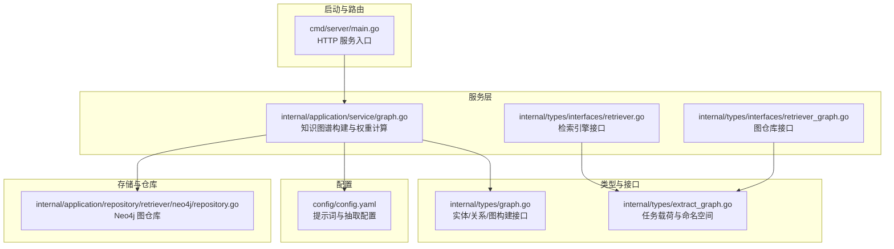
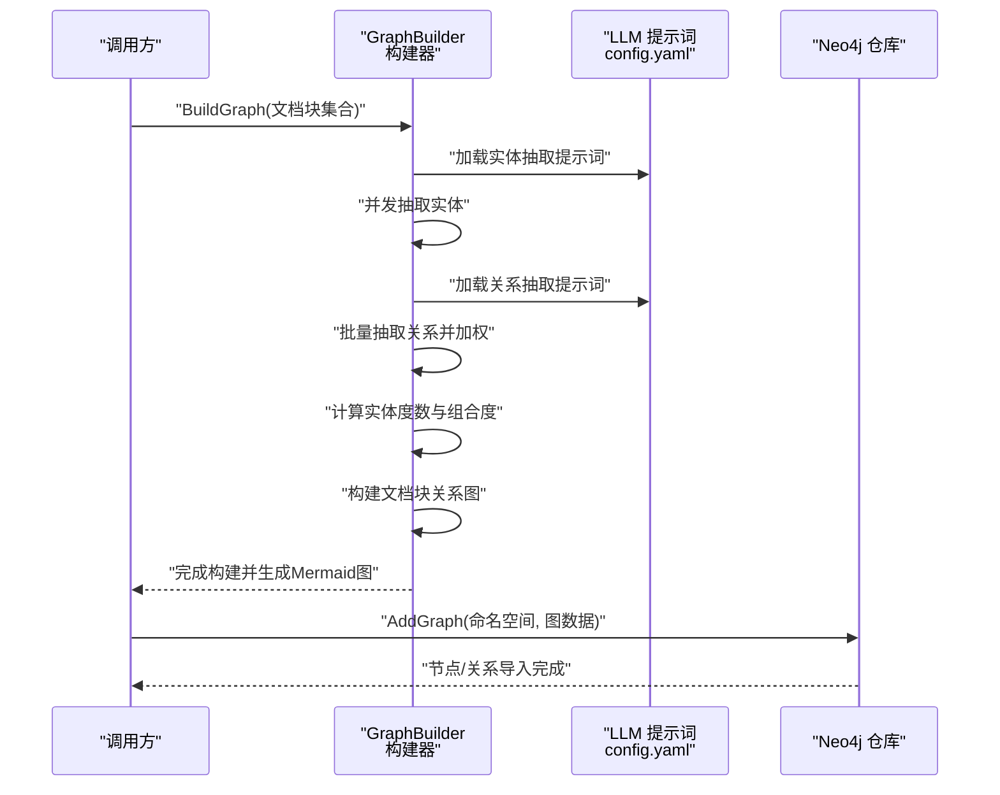
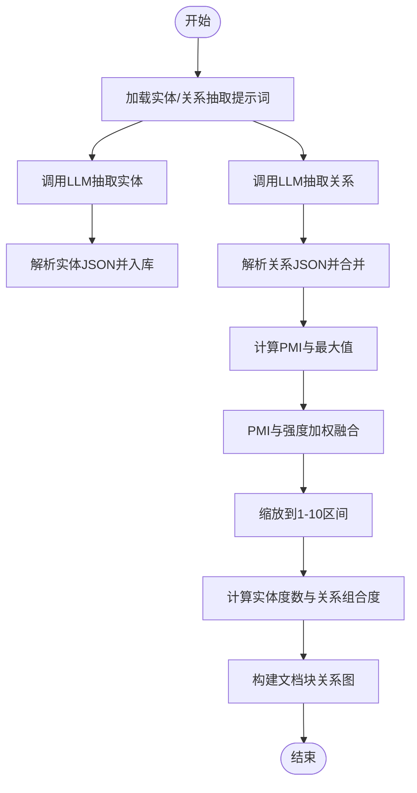
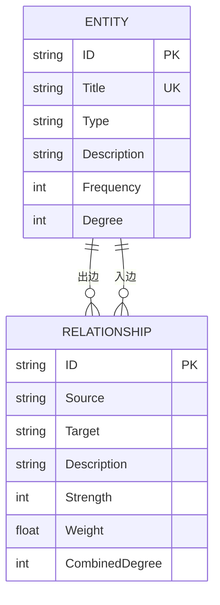
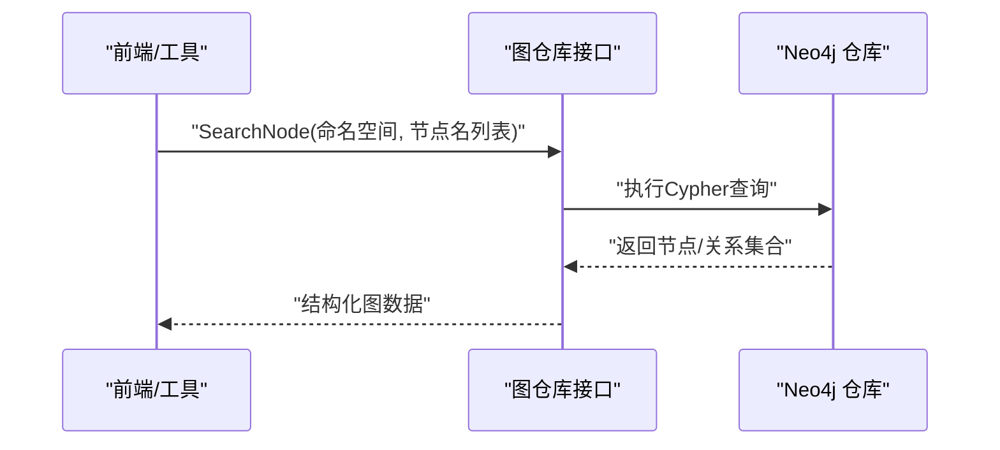
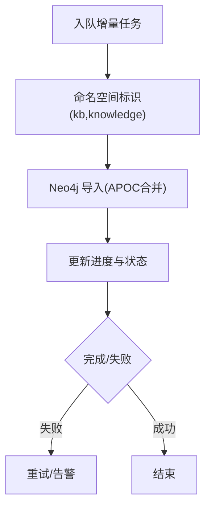
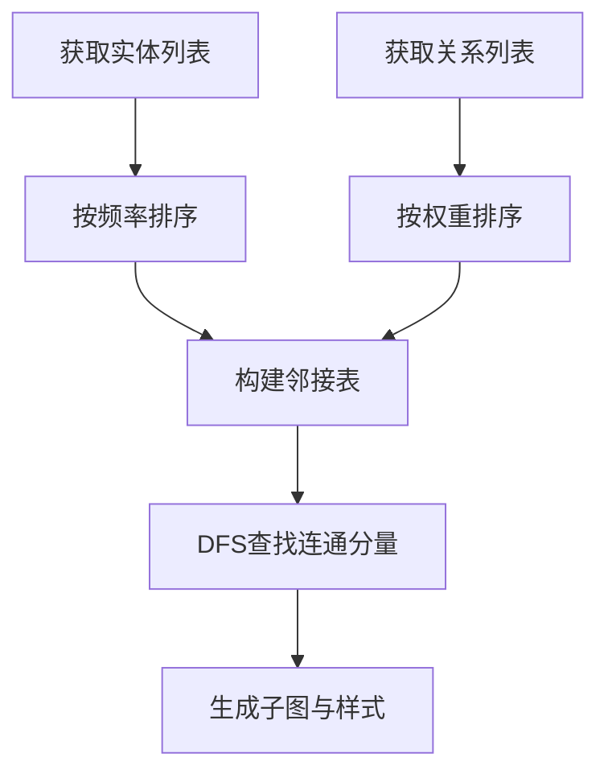
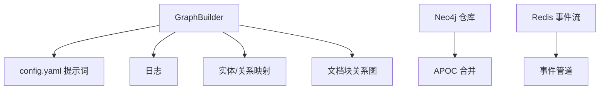

# 知识图谱系统

<cite>
**本文引用的文件**
- [cmd/server/main.go](file://cmd/server/main.go)
- [internal/types/graph.go](file://internal/types/graph.go)
- [internal/types/interfaces/retriever_graph.go](file://internal/types/interfaces/retriever_graph.go)
- [internal/types/interfaces/retriever.go](file://internal/types/interfaces/retriever.go)
- [internal/types/extract_graph.go](file://internal/types/extract_graph.go)
- [internal/application/service/graph.go](file://internal/application/service/graph.go)
- [config/config.yaml](file://config/config.yaml)
- [internal/agent/tools/query_knowledge_graph.go](file://internal/agent/tools/query_knowledge_graph.go)
- [internal/application/repository/retriever/neo4j/repository.go](file://internal/application/repository/retriever/neo4j/repository.go)
- [internal/stream/redis_manager.go](file://internal/stream/redis_manager.go)
</cite>

## 目录
1. [简介](#简介)
2. [项目结构](#项目结构)
3. [核心组件](#核心组件)
4. [架构总览](#架构总览)
5. [详细组件分析](#详细组件分析)
6. [依赖分析](#依赖分析)
7. [性能考量](#性能考量)
8. [故障排查指南](#故障排查指南)
9. [结论](#结论)
10. [附录](#附录)

## 简介
本技术文档面向知识图谱系统，聚焦以下目标：
- 实体关系抽取算法：命名实体识别、关系分类与置信度评估
- 图结构存储设计：节点类型定义、边关系建模与索引优化策略
- 图查询语言实现：Cypher 查询优化、路径查找与聚合计算
- 增量更新机制：实时同步、冲突解决与版本管理
- 图分析与可视化：图遍历、中心性分析与社区发现工具使用

系统通过大模型驱动的实体与关系抽取，构建文档块级图谱，并提供检索增强与可视化能力；同时具备与外部图数据库（Neo4j）集成的能力，支持节点与关系的导入与查询。

## 项目结构
系统采用分层架构，核心模块包括：
- 服务层：知识图谱构建、检索引擎、聊天管线等
- 类型与接口层：统一的数据结构与对外接口
- 配置层：提示词模板与运行参数
- 存储与仓库层：Neo4j 图仓库、向量/倒排等检索仓库
- 启动与路由：HTTP 服务入口与容器装配

图表来源
- [cmd/server/main.go](file://cmd/server/main.go#L88-L193)
- [internal/application/service/graph.go](file://internal/application/service/graph.go#L64-L86)
- [internal/types/graph.go](file://internal/types/graph.go#L31-L53)
- [internal/types/interfaces/retriever.go](file://internal/types/interfaces/retriever.go#L10-L20)
- [internal/types/interfaces/retriever_graph.go](file://internal/types/interfaces/retriever_graph.go#L9-L17)
- [config/config.yaml](file://config/config.yaml#L193-L476)
- [internal/application/repository/retriever/neo4j/repository.go](file://internal/application/repository/retriever/neo4j/repository.go#L45-L115)

章节来源
- [cmd/server/main.go](file://cmd/server/main.go#L88-L193)
- [internal/application/service/graph.go](file://internal/application/service/graph.go#L64-L86)
- [internal/types/graph.go](file://internal/types/graph.go#L31-L53)
- [internal/types/interfaces/retriever.go](file://internal/types/interfaces/retriever.go#L10-L20)
- [internal/types/interfaces/retriever_graph.go](file://internal/types/interfaces/retriever_graph.go#L9-L17)
- [config/config.yaml](file://config/config.yaml#L193-L476)
- [internal/application/repository/retriever/neo4j/repository.go](file://internal/application/repository/retriever/neo4j/repository.go#L45-L115)

## 核心组件
- 实体与关系数据模型：定义实体、关系及其统计指标（频率、度、权重、强度）
- 图构建器：并发抽取实体与关系、计算权重与度、构建文档块关系图
- 提示词模板：实体抽取与关系抽取的系统/用户提示词
- 图仓库接口：统一的图数据增删查能力
- Neo4j 仓库：节点与关系的导入、删除与查询
- 任务载荷与命名空间：知识库与知识维度的标识与进度追踪

章节来源
- [internal/types/graph.go](file://internal/types/graph.go#L6-L29)
- [internal/application/service/graph.go](file://internal/application/service/graph.go#L64-L86)
- [config/config.yaml](file://config/config.yaml#L193-L476)
- [internal/types/interfaces/retriever_graph.go](file://internal/types/interfaces/retriever_graph.go#L9-L17)
- [internal/application/repository/retriever/neo4j/repository.go](file://internal/application/repository/retriever/neo4j/repository.go#L45-L115)
- [internal/types/extract_graph.go](file://internal/types/extract_graph.go#L158-L175)

## 架构总览
系统以“文档块”为最小单元，通过大模型提示词抽取实体与关系，计算 PMI 与强度加权得到关系权重，统计实体度数，构建文档块之间的关系图。随后可将结构化的图数据导入 Neo4j，供 Cypher 查询与可视化使用。

图表来源
- [internal/application/service/graph.go](file://internal/application/service/graph.go#L367-L489)
- [config/config.yaml](file://config/config.yaml#L193-L476)
- [internal/application/repository/retriever/neo4j/repository.go](file://internal/application/repository/retriever/neo4j/repository.go#L45-L115)

## 详细组件分析

### 实体关系抽取算法
- 命名实体识别（NER）
  - 输入：单个文档块内容
  - 流程：构造系统/用户提示词 → 调用 LLM → 解析 JSON 实体数组 → 去重与频率统计
  - 并发：按块并发抽取，互不影响
- 关系分类与强度打分
  - 输入：实体列表与多块拼接后的上下文
  - 流程：构造系统/用户提示词 → 调用 LLM → 解析 JSON 关系数组 → 基于共同文档块集合更新关系
  - 强度：1-10 的整数强度，反映关系明确度
- 置信度评估
  - 权重计算：PMI（点互信息）与强度的加权融合，再缩放到 1-10 区间
  - 度数统计：实体入度/出度之和，关系组合度为两端实体度数之和
  - 文档块关系图：基于实体共同出现的文档块建立双向边，权重与组合度用于检索排序

图表来源
- [internal/application/service/graph.go](file://internal/application/service/graph.go#L88-L181)
- [internal/application/service/graph.go](file://internal/application/service/graph.go#L183-L307)
- [internal/application/service/graph.go](file://internal/application/service/graph.go#L491-L581)
- [internal/application/service/graph.go](file://internal/application/service/graph.go#L583-L620)
- [internal/application/service/graph.go](file://internal/application/service/graph.go#L622-L665)

章节来源
- [internal/application/service/graph.go](file://internal/application/service/graph.go#L88-L181)
- [internal/application/service/graph.go](file://internal/application/service/graph.go#L183-L307)
- [internal/application/service/graph.go](file://internal/application/service/graph.go#L491-L581)
- [internal/application/service/graph.go](file://internal/application/service/graph.go#L583-L620)
- [internal/application/service/graph.go](file://internal/application/service/graph.go#L622-L665)
- [config/config.yaml](file://config/config.yaml#L193-L476)

### 图结构存储设计
- 节点类型定义
  - 实体：唯一 ID、标题、类型、描述、出现的文档块集合、频率、度数
- 边关系建模
  - 关系：唯一 ID、源/目标实体标题、描述、强度、权重、共同文档块集合、组合度
- 索引优化策略
  - 实体与关系均以标题/ID 作为键，便于快速查找与去重
  - 文档块关系图以块 ID 为顶点，权重与组合度用于检索排序
  - Neo4j 导入时使用 APOC 合并节点与关系，自动合并相同属性与块集合

图表来源
- [internal/types/graph.go](file://internal/types/graph.go#L6-L29)
- [internal/application/service/graph.go](file://internal/application/service/graph.go#L622-L665)
- [internal/application/repository/retriever/neo4j/repository.go](file://internal/application/repository/retriever/neo4j/repository.go#L66-L109)

章节来源
- [internal/types/graph.go](file://internal/types/graph.go#L6-L29)
- [internal/application/service/graph.go](file://internal/application/service/graph.go#L622-L665)
- [internal/application/repository/retriever/neo4j/repository.go](file://internal/application/repository/retriever/neo4j/repository.go#L66-L109)

### 图查询语言实现
- Cypher 查询现状
  - 系统当前提供 Neo4j 仓库的节点/关系导入与查询能力，但未内置 Cypher 查询语言的通用执行与优化框架
  - 前端工具提示中指出“完整的图查询语言（Cypher）支持开发中”
- 路径查找与聚合
  - Neo4j 查询支持基于标签与属性的邻域查询，可用于路径探索与聚合统计
  - 可结合前端可视化组件展示子图与关系强度

图表来源
- [internal/types/interfaces/retriever_graph.go](file://internal/types/interfaces/retriever_graph.go#L15-L17)
- [internal/application/repository/retriever/neo4j/repository.go](file://internal/application/repository/retriever/neo4j/repository.go#L163-L198)
- [internal/agent/tools/query_knowledge_graph.go](file://internal/agent/tools/query_knowledge_graph.go#L331-L359)

章节来源
- [internal/types/interfaces/retriever_graph.go](file://internal/types/interfaces/retriever_graph.go#L15-L17)
- [internal/application/repository/retriever/neo4j/repository.go](file://internal/application/repository/retriever/neo4j/repository.go#L163-L198)
- [internal/agent/tools/query_knowledge_graph.go](file://internal/agent/tools/query_knowledge_graph.go#L331-L359)

### 增量更新机制
- 实时同步
  - 通过任务载荷与命名空间标识知识库与知识维度，支持增量任务的排队与进度追踪
- 冲突解决
  - Neo4j 导入使用 APOC 合并节点与关系，自动合并属性与块集合，避免重复
- 版本管理
  - 命名空间包含知识库与知识 ID，便于区分不同版本与来源
  - 任务进度结构体记录状态、进度与错误信息，便于回溯与重试

图表来源
- [internal/types/extract_graph.go](file://internal/types/extract_graph.go#L158-L175)
- [internal/application/repository/retriever/neo4j/repository.go](file://internal/application/repository/retriever/neo4j/repository.go#L45-L115)

章节来源
- [internal/types/extract_graph.go](file://internal/types/extract_graph.go#L158-L175)
- [internal/application/repository/retriever/neo4j/repository.go](file://internal/application/repository/retriever/neo4j/repository.go#L45-L115)

### 图分析与可视化工具
- 图遍历
  - 通过文档块关系图进行直接与间接连接查询，支持权重与度数排序
- 中心性分析
  - 基于实体度数（入度+出度）进行中心性粗略估计
- 社区发现
  - 使用深度优先搜索（DFS）查找连通分量，生成子图
- 可视化
  - 构建器生成 Mermaid 图，按频率与权重排序，区分强/弱关系与高/低频节点

图表来源
- [internal/application/service/graph.go](file://internal/application/service/graph.go#L894-L1050)
- [internal/application/service/graph.go](file://internal/application/service/graph.go#L869-L892)

章节来源
- [internal/application/service/graph.go](file://internal/application/service/graph.go#L894-L1050)
- [internal/application/service/graph.go](file://internal/application/service/graph.go#L869-L892)

## 依赖分析
- 组件耦合
  - GraphBuilder 依赖配置（提示词）、日志、并发控制与实体/关系映射
  - Neo4j 仓库依赖驱动与 APOC，提供节点/关系的合并导入
- 外部依赖
  - LLM 提供实体与关系抽取
  - Redis 用于事件流管理（与图谱构建流程解耦）

图表来源
- [internal/application/service/graph.go](file://internal/application/service/graph.go#L64-L86)
- [config/config.yaml](file://config/config.yaml#L193-L476)
- [internal/application/repository/retriever/neo4j/repository.go](file://internal/application/repository/retriever/neo4j/repository.go#L66-L109)
- [internal/stream/redis_manager.go](file://internal/stream/redis_manager.go#L13-L54)

章节来源
- [internal/application/service/graph.go](file://internal/application/service/graph.go#L64-L86)
- [config/config.yaml](file://config/config.yaml#L193-L476)
- [internal/application/repository/retriever/neo4j/repository.go](file://internal/application/repository/retriever/neo4j/repository.go#L66-L109)
- [internal/stream/redis_manager.go](file://internal/stream/redis_manager.go#L13-L54)

## 性能考量
- 并发与限流
  - 实体抽取与关系抽取分别设置并发上限，避免资源争用
  - 关系抽取按批处理，减少 LLM 调用次数
- 计算复杂度
  - 权重计算与度数统计线性于实体/关系规模
  - 文档块关系图构建线性于实体共同出现的块对数
- I/O 优化
  - 合并相邻文档块内容，避免重复文本
  - Neo4j 导入使用批量与合并，降低写放大

## 故障排查指南
- 实体/关系抽取失败
  - 检查提示词模板是否正确加载
  - 查看 LLM 返回内容是否为合法 JSON
- 权重与度数异常
  - 确认实体/关系映射是否为空或缺失
  - 检查共同文档块集合是否为空导致跳过
- Neo4j 导入失败
  - 确认驱动可用与 APOC 可用
  - 检查命名空间与标签是否一致
- 任务进度与状态
  - 查看任务进度结构体的状态、进度与错误信息，定位失败原因

章节来源
- [config/config.yaml](file://config/config.yaml#L193-L476)
- [internal/application/service/graph.go](file://internal/application/service/graph.go#L123-L129)
- [internal/application/service/graph.go](file://internal/application/service/graph.go#L235-L239)
- [internal/application/repository/retriever/neo4j/repository.go](file://internal/application/repository/retriever/neo4j/repository.go#L45-L115)
- [internal/types/extract_graph.go](file://internal/types/extract_graph.go#L109-L122)

## 结论
本系统以大模型驱动的知识图谱构建为核心，实现了从文档块到实体/关系的自动化抽取与加权，提供了文档块级关系图与 Neo4j 集成能力。未来可在 Cypher 查询语言支持、图分析算法与可视化方面持续增强，以满足更复杂的图谱应用场景。

## 附录
- 使用建议
  - 在生产环境中为实体/关系抽取配置合适的温度与提示词
  - 对大规模文档采用批处理与并发策略，结合 Redis 事件流进行异步处理
  - 在导入 Neo4j 前校验命名空间与标签一致性，确保合并导入生效