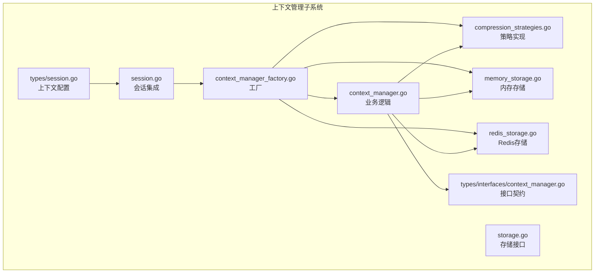
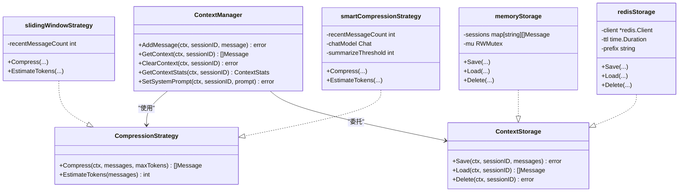
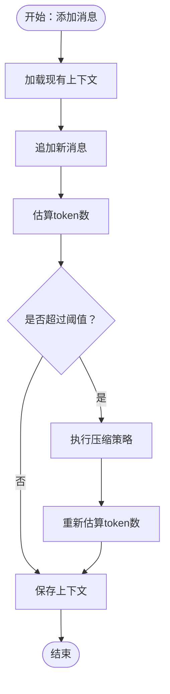
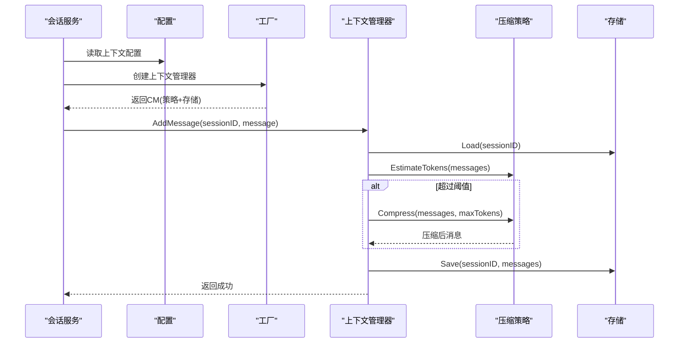
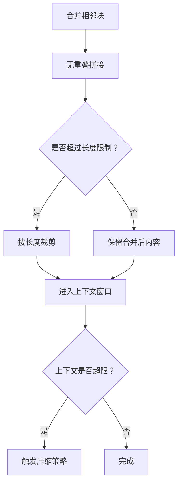
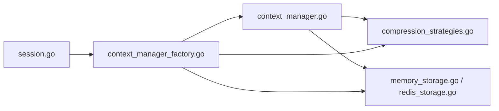

# 上下文窗口管理

<cite>
**本文引用的文件**
- [internal/application/service/llmcontext/context_manager.go](file://internal/application/service/llmcontext/context_manager.go)
- [internal/application/service/llmcontext/compression_strategies.go](file://internal/application/service/llmcontext/compression_strategies.go)
- [internal/application/service/llmcontext/memory_storage.go](file://internal/application/service/llmcontext/memory_storage.go)
- [internal/application/service/llmcontext/redis_storage.go](file://internal/application/service/llmcontext/redis_storage.go)
- [internal/application/service/llmcontext/context_manager_factory.go](file://internal/application/service/llmcontext/context_manager_factory.go)
- [internal/application/service/llmcontext/storage.go](file://internal/application/service/llmcontext/storage.go)
- [internal/types/interfaces/context_manager.go](file://internal/types/interfaces/context_manager.go)
- [internal/application/service/session.go](file://internal/application/service/session.go)
- [internal/types/session.go](file://internal/types/session.go)
- [internal/application/service/chat_pipline/merge.go](file://internal/application/service/chat_pipline/merge.go)
</cite>

## 目录
1. [简介](#简介)
2. [项目结构](#项目结构)
3. [核心组件](#核心组件)
4. [架构总览](#架构总览)
5. [详细组件分析](#详细组件分析)
6. [依赖分析](#依赖分析)
7. [性能考量](#性能考量)
8. [故障排查指南](#故障排查指南)
9. [结论](#结论)
10. [附录](#附录)

## 简介
本文件系统化阐述 WiseDx 项目中的“上下文窗口管理系统”，聚焦以下能力与机制：
- 长度限制与阈值控制：基于字符估算的粗略 token 计算、阈值检查与压缩触发。
- 优先级与排序策略：滑动窗口策略对系统消息与最近消息的保留原则。
- 动态调整算法：滑动窗口与智能压缩（摘要）两种策略的适用场景与切换。
- 内容合并与去重：与检索/合并流程协同，避免重复与冗余。
- 内存管理优化：存储层抽象（内存/Redis）、序列化与清理策略。
- 截断最佳实践与性能调优：参数配置、策略选择与运行时观测。

## 项目结构
上下文窗口管理位于 internal/application/service/llmcontext 子模块，采用“业务逻辑 + 存储抽象 + 策略接口”的分层设计：
- 业务逻辑：context_manager.go 负责消息增删、加载、统计、系统提示注入与压缩触发。
- 策略实现：compression_strategies.go 提供滑动窗口与智能压缩两种策略。
- 存储实现：memory_storage.go 与 redis_storage.go 提供内存与 Redis 两种持久化方案。
- 工厂与接口：context_manager_factory.go 与 storage.go、types/interfaces/context_manager.go 定义创建与契约。
- 集成入口：session.go 与 types/session.go 将上下文配置与会话生命周期集成。

图表来源
- [internal/application/service/llmcontext/context_manager.go](file://internal/application/service/llmcontext/context_manager.go#L1-L208)
- [internal/application/service/llmcontext/compression_strategies.go](file://internal/application/service/llmcontext/compression_strategies.go#L1-L243)
- [internal/application/service/llmcontext/memory_storage.go](file://internal/application/service/llmcontext/memory_storage.go#L1-L66)
- [internal/application/service/llmcontext/redis_storage.go](file://internal/application/service/llmcontext/redis_storage.go#L1-L128)
- [internal/application/service/llmcontext/context_manager_factory.go](file://internal/application/service/llmcontext/context_manager_factory.go#L1-L82)
- [internal/application/service/llmcontext/storage.go](file://internal/application/service/llmcontext/storage.go#L1-L21)
- [internal/types/interfaces/context_manager.go](file://internal/types/interfaces/context_manager.go#L1-L54)
- [internal/application/service/session.go](file://internal/application/service/session.go#L1310-L1336)
- [internal/types/session.go](file://internal/types/session.go#L152-L167)

章节来源
- [internal/application/service/llmcontext/context_manager.go](file://internal/application/service/llmcontext/context_manager.go#L1-L208)
- [internal/application/service/llmcontext/compression_strategies.go](file://internal/application/service/llmcontext/compression_strategies.go#L1-L243)
- [internal/application/service/llmcontext/memory_storage.go](file://internal/application/service/llmcontext/memory_storage.go#L1-L66)
- [internal/application/service/llmcontext/redis_storage.go](file://internal/application/service/llmcontext/redis_storage.go#L1-L128)
- [internal/application/service/llmcontext/context_manager_factory.go](file://internal/application/service/llmcontext/context_manager_factory.go#L1-L82)
- [internal/application/service/llmcontext/storage.go](file://internal/application/service/llmcontext/storage.go#L1-L21)
- [internal/types/interfaces/context_manager.go](file://internal/types/interfaces/context_manager.go#L1-L54)
- [internal/application/service/session.go](file://internal/application/service/session.go#L1310-L1336)
- [internal/types/session.go](file://internal/types/session.go#L152-L167)

## 核心组件
- 上下文管理器（ContextManager）
  - 负责消息的添加、获取、清空、统计与系统提示设置。
  - 在添加消息时先加载现有上下文，追加新消息后估算 token 数，超过阈值则触发压缩策略，最后保存。
- 压缩策略（CompressionStrategy）
  - 滑动窗口策略：保留系统消息与最近 N 条消息，简单高效。
  - 智能压缩策略：当旧消息达到阈值时，通过 LLM 生成摘要，再拼接系统消息与最近消息。
- 存储层（ContextStorage）
  - 内存存储：线程安全的 map + RWMutex，适合单实例或测试。
  - Redis 存储：JSON 序列化 + TTL，支持分布式共享与过期清理。
- 工厂（ContextManagerFactory）
  - 基于配置创建上下文管理器，支持默认值与策略选择。
- 接口契约（Interfaces）
  - 明确 ContextManager、CompressionStrategy 与 ContextStats 的职责边界。

章节来源
- [internal/application/service/llmcontext/context_manager.go](file://internal/application/service/llmcontext/context_manager.go#L12-L103)
- [internal/application/service/llmcontext/compression_strategies.go](file://internal/application/service/llmcontext/compression_strategies.go#L13-L80)
- [internal/application/service/llmcontext/compression_strategies.go](file://internal/application/service/llmcontext/compression_strategies.go#L82-L182)
- [internal/application/service/llmcontext/memory_storage.go](file://internal/application/service/llmcontext/memory_storage.go#L11-L66)
- [internal/application/service/llmcontext/redis_storage.go](file://internal/application/service/llmcontext/redis_storage.go#L14-L128)
- [internal/application/service/llmcontext/context_manager_factory.go](file://internal/application/service/llmcontext/context_manager_factory.go#L24-L81)
- [internal/types/interfaces/context_manager.go](file://internal/types/interfaces/context_manager.go#L9-L53)

## 架构总览
上下文窗口管理遵循“策略 + 存储抽象 + 工厂 + 会话集成”的架构，确保：
- 业务逻辑与存储实现解耦（通过 ContextStorage 接口）。
- 压缩策略可插拔（通过 CompressionStrategy 接口）。
- 配置驱动的上下文行为（通过 ContextManagerFactory）。
- 与会话服务集成，按租户/会话维度生效。

图表来源
- [internal/types/interfaces/context_manager.go](file://internal/types/interfaces/context_manager.go#L9-L53)
- [internal/application/service/llmcontext/context_manager.go](file://internal/application/service/llmcontext/context_manager.go#L12-L18)
- [internal/application/service/llmcontext/compression_strategies.go](file://internal/application/service/llmcontext/compression_strategies.go#L13-L80)
- [internal/application/service/llmcontext/compression_strategies.go](file://internal/application/service/llmcontext/compression_strategies.go#L82-L182)
- [internal/application/service/llmcontext/memory_storage.go](file://internal/application/service/llmcontext/memory_storage.go#L11-L66)
- [internal/application/service/llmcontext/redis_storage.go](file://internal/application/service/llmcontext/redis_storage.go#L14-L128)

## 详细组件分析

### 1) 长度限制机制与阈值控制
- token 估算
  - 采用字符计数粗略估算：每个消息的 Role 与 Content 长度之和作为基础，额外计入 ToolCalls 的函数名与参数长度；最后除以常数得到近似 token 数。
  - 该估算便于快速判断是否超限，但不等同于模型原生分词器。
- 阈值控制
  - maxTokens 由工厂根据配置或默认值设置。
  - 添加消息后立即估算当前 token 数，若超过阈值则触发压缩策略。
- 压缩后的二次估算
  - 压缩完成后再次估算 token 数，记录前后对比，便于观测效果。

图表来源
- [internal/application/service/llmcontext/context_manager.go](file://internal/application/service/llmcontext/context_manager.go#L47-L102)
- [internal/application/service/llmcontext/compression_strategies.go](file://internal/application/service/llmcontext/compression_strategies.go#L67-L80)
- [internal/application/service/llmcontext/compression_strategies.go](file://internal/application/service/llmcontext/compression_strategies.go#L229-L242)

章节来源
- [internal/application/service/llmcontext/context_manager.go](file://internal/application/service/llmcontext/context_manager.go#L47-L102)
- [internal/application/service/llmcontext/compression_strategies.go](file://internal/application/service/llmcontext/compression_strategies.go#L67-L80)
- [internal/application/service/llmcontext/compression_strategies.go](file://internal/application/service/llmcontext/compression_strategies.go#L229-L242)

### 2) 优先级排序与权重分配
- 系统消息优先
  - 两类策略均保留系统消息，确保指令与约束始终在上下文中。
- 最近消息优先
  - 滑动窗口策略直接保留最近 N 条常规消息，强调时效性。
  - 智能压缩策略同样保留最近消息，旧消息通过摘要保留关键信息。
- 权重分配
  - 代码层面未显式引入“显式权重”；优先级体现为“系统消息优先 + 最近消息优先”的保留策略。
  - 若需更精细的权重（如基于消息长度、角色、工具调用等），可在 EstimateTokens 或 Compress 中扩展。

章节来源
- [internal/application/service/llmcontext/compression_strategies.go](file://internal/application/service/llmcontext/compression_strategies.go#L36-L64)
- [internal/application/service/llmcontext/compression_strategies.go](file://internal/application/service/llmcontext/compression_strategies.go#L113-L149)

### 3) 动态调整算法与策略选择
- 滑动窗口策略
  - 适用场景：低开销、强时效性、对历史细节要求不高。
  - 行为：分离系统消息与常规消息，裁剪至最近 N 条常规消息。
- 智能压缩策略
  - 适用场景：需要保留历史关键信息、对话轮次较多。
  - 行为：当旧消息数量超过阈值时，调用 LLM 生成摘要，再拼接系统消息与最近消息；失败时回退为保留全部旧消息。
- 工厂选择
  - 支持“sliding_window”与“smart”两种策略；未提供 chatModel 时自动回退为滑动窗口。

图表来源
- [internal/application/service/session.go](file://internal/application/service/session.go#L1310-L1336)
- [internal/application/service/llmcontext/context_manager_factory.go](file://internal/application/service/llmcontext/context_manager_factory.go#L24-L81)
- [internal/application/service/llmcontext/context_manager.go](file://internal/application/service/llmcontext/context_manager.go#L47-L102)
- [internal/application/service/llmcontext/compression_strategies.go](file://internal/application/service/llmcontext/compression_strategies.go#L102-L182)

章节来源
- [internal/application/service/llmcontext/context_manager_factory.go](file://internal/application/service/llmcontext/context_manager_factory.go#L24-L81)
- [internal/application/service/llmcontext/compression_strategies.go](file://internal/application/service/llmcontext/compression_strategies.go#L82-L182)

### 4) 内容合并与去重机制
- 合并与去重
  - 与检索/合并流程协同，避免重复与冗余。例如在合并相邻块时，采用无重叠拼接与长度裁剪策略，减少重复信息进入上下文。
- 与上下文窗口的衔接
  - 合并后的内容仍受上下文窗口限制；若超出阈值，优先保留系统消息与最近消息，必要时触发压缩。

图表来源
- [internal/application/service/chat_pipline/merge.go](file://internal/application/service/chat_pipline/merge.go#L590-L630)
- [internal/application/service/llmcontext/context_manager.go](file://internal/application/service/llmcontext/context_manager.go#L70-L88)

章节来源
- [internal/application/service/chat_pipline/merge.go](file://internal/application/service/chat_pipline/merge.go#L430-L679)
- [internal/application/service/llmcontext/context_manager.go](file://internal/application/service/llmcontext/context_manager.go#L70-L88)

### 5) 内存管理优化
- 存储抽象
  - 内存存储：适合单实例或测试，使用互斥锁保护并发读写。
  - Redis 存储：支持 TTL 自动过期，JSON 序列化，适合分布式部署。
- 数据校验与修复
  - Redis 加载时对异常内容进行清洗（如空字符串、特殊标记），保证数据一致性。
- 清理与回收
  - TTL 过期自动回收；删除接口支持主动清理。
  - 资源清理器（容器层）提供统一的资源回收钩子，便于应用关闭时释放 goroutine 池等资源。

章节来源
- [internal/application/service/llmcontext/memory_storage.go](file://internal/application/service/llmcontext/memory_storage.go#L11-L66)
- [internal/application/service/llmcontext/redis_storage.go](file://internal/application/service/llmcontext/redis_storage.go#L49-L127)
- [internal/container/cleanup.go](file://internal/container/cleanup.go#L12-L56)
- [internal/container/container.go](file://internal/container/container.go#L534-L566)

## 依赖分析
- 组件耦合
  - ContextManager 依赖 CompressionStrategy 与 ContextStorage，二者通过接口解耦，便于替换与扩展。
  - 工厂负责策略与存储的选择与装配，降低上层调用复杂度。
- 外部依赖
  - Redis 客户端用于分布式存储。
  - LLM Chat 接口用于智能压缩摘要生成。
- 集成点
  - 会话服务根据租户配置选择上下文管理器实例，贯穿整个对话生命周期。

图表来源
- [internal/application/service/session.go](file://internal/application/service/session.go#L1310-L1336)
- [internal/application/service/llmcontext/context_manager_factory.go](file://internal/application/service/llmcontext/context_manager_factory.go#L24-L81)
- [internal/application/service/llmcontext/context_manager.go](file://internal/application/service/llmcontext/context_manager.go#L12-L18)

章节来源
- [internal/application/service/session.go](file://internal/application/service/session.go#L1310-L1336)
- [internal/application/service/llmcontext/context_manager_factory.go](file://internal/application/service/llmcontext/context_manager_factory.go#L24-L81)
- [internal/application/service/llmcontext/context_manager.go](file://internal/application/service/llmcontext/context_manager.go#L12-L18)

## 性能考量
- token 估算成本低，适合高频调用；若对精度敏感，可结合模型侧的分词器或动态估算。
- 滑动窗口策略开销最小，适合高并发与低延迟场景。
- 智能压缩策略引入 LLM 调用，带来额外延迟与成本，建议在旧消息数量达到一定阈值后再触发。
- Redis 存储具备 TTL 与序列化开销，建议合理设置 TTL 与键前缀，避免热键与内存膨胀。
- 并发安全：内存存储使用读写锁；Redis 存储依赖客户端并发模型，注意连接池与超时配置。

## 故障排查指南
- 常见问题
  - 上下文过大导致压缩失败：检查 maxTokens 与 recentMessageCount 设置，确认策略选择是否合适。
  - Redis 连接失败：确认连接参数与网络可达性，查看工厂初始化日志。
  - 内容异常（空字符串/特殊标记）：Redis 加载时已做清洗，若仍异常，检查上游写入逻辑。
- 观测与定位
  - 日志级别：INFO 记录压缩前后统计，DEBUG 记录消息分布与预览。
  - 统计接口：GetContextStats 返回消息数与 token 估算，辅助定位问题。

章节来源
- [internal/application/service/llmcontext/context_manager.go](file://internal/application/service/llmcontext/context_manager.go#L47-L102)
- [internal/application/service/llmcontext/redis_storage.go](file://internal/application/service/llmcontext/redis_storage.go#L21-L42)
- [internal/application/service/llmcontext/redis_storage.go](file://internal/application/service/llmcontext/redis_storage.go#L96-L112)

## 结论
上下文窗口管理系统通过“策略 + 存储抽象 + 工厂 + 会话集成”的架构，在保证易用性的同时提供了可扩展的压缩与存储能力。滑动窗口策略满足大多数场景的低开销需求，智能压缩策略在需要保留历史信息时提供更强的上下文完整性。配合 Redis 存储与 TTL 策略，系统可在分布式环境下稳定运行。建议在生产环境中结合业务对话轮次与内容特性，合理配置 maxTokens、recentMessageCount 与策略类型，并持续监控 token 估算与压缩效果。

## 附录
- 配置项与默认值
  - 默认 maxTokens：较大数值，适配多数模型上下文上限。
  - 默认 recentMessageCount：保留最近若干条消息。
  - 默认压缩策略：滑动窗口。
  - 智能压缩阈值：当旧消息数量低于阈值时不触发摘要。
- 会话集成
  - 会话服务按租户维度选择上下文配置，若租户未配置则使用默认配置。

章节来源
- [internal/application/service/llmcontext/context_manager_factory.go](file://internal/application/service/llmcontext/context_manager_factory.go#L12-L22)
- [internal/application/service/session.go](file://internal/application/service/session.go#L1310-L1336)
- [internal/types/session.go](file://internal/types/session.go#L152-L167)