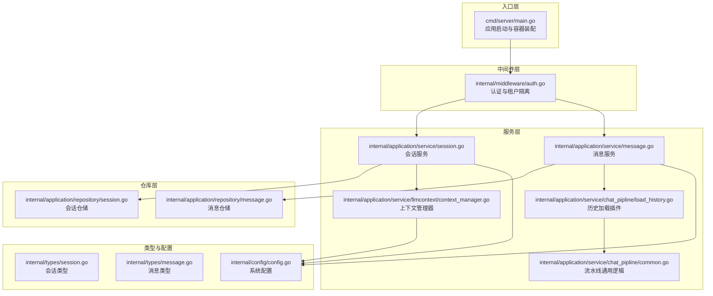
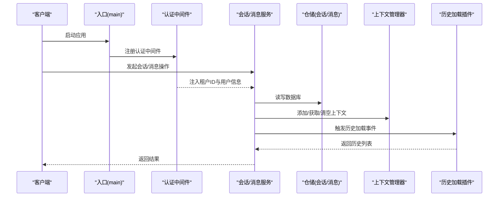
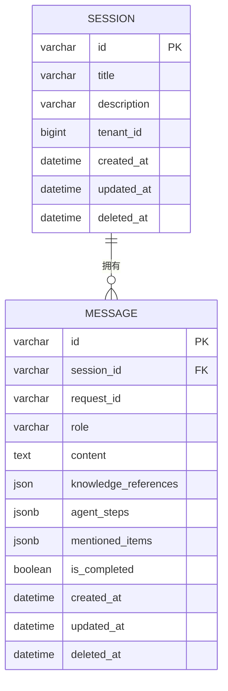
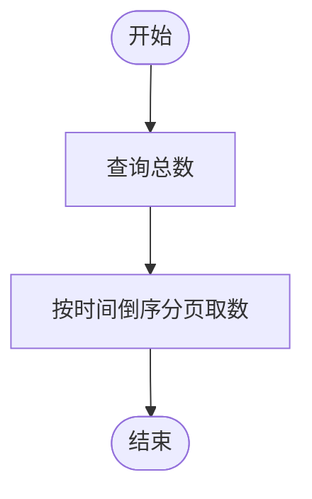
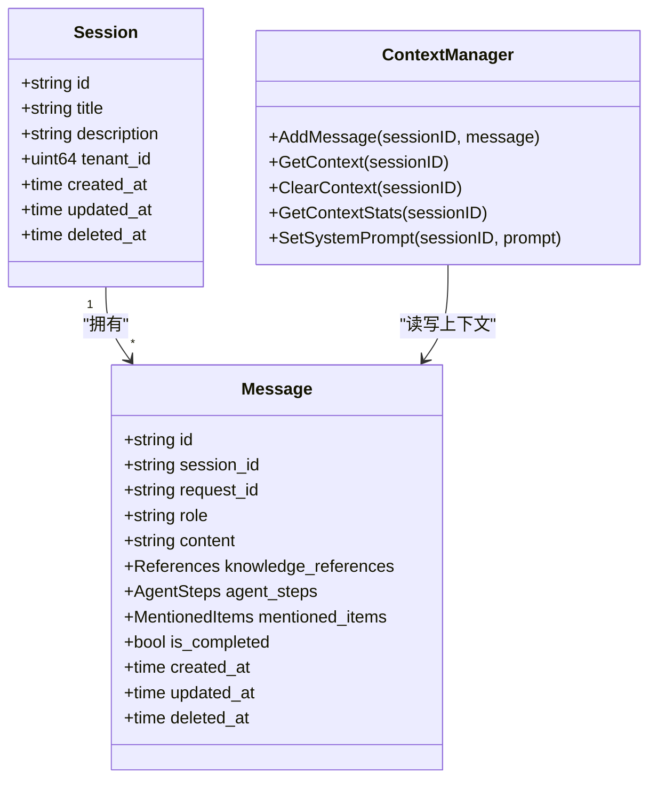
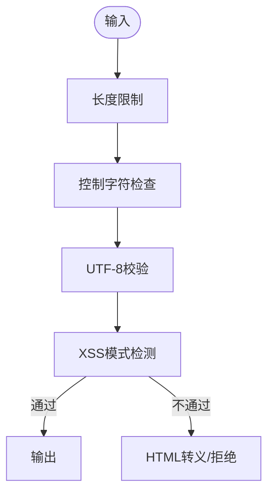
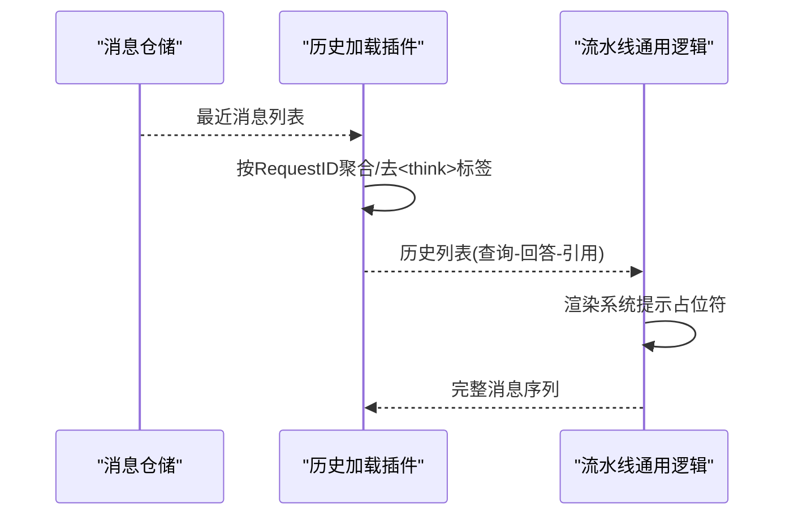
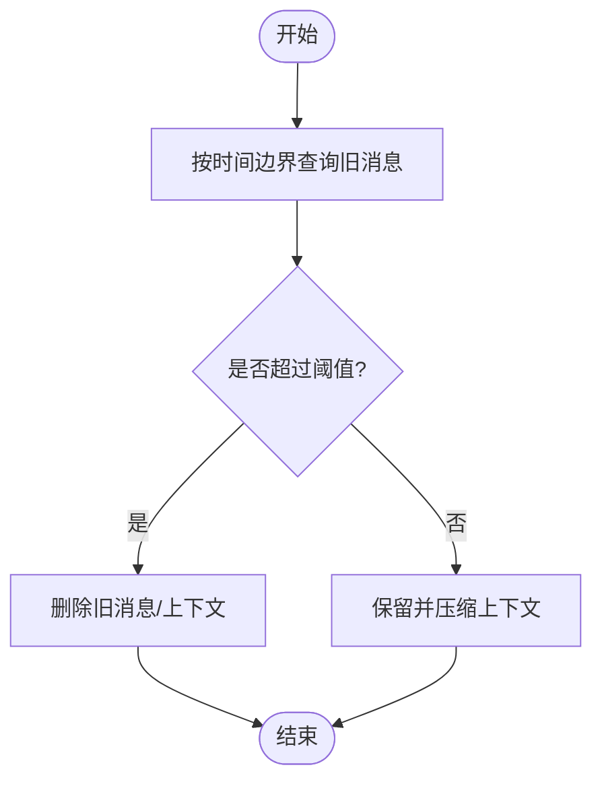
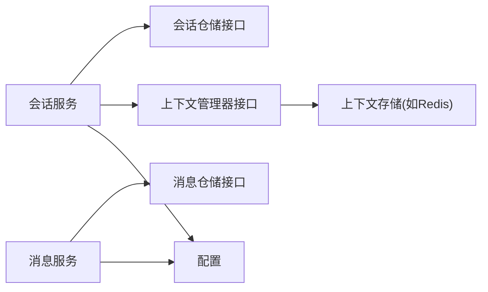

# 对话历史管理

<cite>
**本文引用的文件**
- [cmd/server/main.go](file://cmd/server/main.go)
- [internal/application/repository/session.go](file://internal/application/repository/session.go)
- [internal/application/repository/message.go](file://internal/application/repository/message.go)
- [internal/application/service/session.go](file://internal/application/service/session.go)
- [internal/application/service/message.go](file://internal/application/service/message.go)
- [internal/application/service/chat_pipline/load_history.go](file://internal/application/service/chat_pipline/load_history.go)
- [internal/application/service/chat_pipline/common.go](file://internal/application/service/chat_pipline/common.go)
- [internal/application/service/llmcontext/context_manager.go](file://internal/application/service/llmcontext/context_manager.go)
- [internal/types/session.go](file://internal/types/session.go)
- [internal/types/message.go](file://internal/types/message.go)
- [internal/config/config.go](file://internal/config/config.go)
- [internal/middleware/auth.go](file://internal/middleware/auth.go)
- [internal/utils/security.go](file://internal/utils/security.go)
- [migrations/versioned/000000_init.up.sql](file://migrations/versioned/000000_init.up.sql)
- [migrations/versioned/000005_mentioned_items.up.sql](file://migrations/versioned/000005_mentioned_items.up.sql)
</cite>

## 目录
1. [简介](#简介)
2. [项目结构](#项目结构)
3. [核心组件](#核心组件)
4. [架构总览](#架构总览)
5. [详细组件分析](#详细组件分析)
6. [依赖关系分析](#依赖关系分析)
7. [性能考量](#性能考量)
8. [故障排查指南](#故障排查指南)
9. [结论](#结论)
10. [附录](#附录)

## 简介
本文件系统性梳理对话历史管理系统的实现与设计，覆盖历史消息存储机制（数据库设计、索引策略、查询优化）、会话状态维护算法（序列化、持久化与恢复）、隐私保护措施（敏感信息过滤、访问控制、数据脱敏）、消息格式转换（历史消息到当前格式映射与兼容性处理）、历史清理策略（过期检测、自动删除、存储空间管理），以及数据迁移与备份恢复方案。文档面向技术与非技术读者，提供分层讲解、可视化图表与实操建议。

## 项目结构
系统采用分层架构：入口层负责启动与路由；中间件层负责认证与租户隔离；服务层封装业务逻辑（会话、消息、上下文管理）；仓库层负责数据持久化；配置层统一管理运行参数；工具层提供安全与通用能力。

**图表来源**
- [cmd/server/main.go](file://cmd/server/main.go#L88-L192)
- [internal/middleware/auth.go](file://internal/middleware/auth.go#L59-L196)
- [internal/application/service/session.go](file://internal/application/service/session.go#L47-L75)
- [internal/application/service/message.go](file://internal/application/service/message.go#L19-L32)
- [internal/application/service/llmcontext/context_manager.go](file://internal/application/service/llmcontext/context_manager.go#L20-L43)
- [internal/application/service/chat_pipline/load_history.go](file://internal/application/service/chat_pipline/load_history.go#L25-L37)
- [internal/application/service/chat_pipline/common.go](file://internal/application/service/chat_pipline/common.go#L30-L53)
- [internal/application/repository/session.go](file://internal/application/repository/session.go#L17-L20)
- [internal/application/repository/message.go](file://internal/application/repository/message.go#L19-L24)
- [internal/types/session.go](file://internal/types/session.go#L74-L108)
- [internal/types/message.go](file://internal/types/message.go#L56-L87)
- [internal/config/config.go](file://internal/config/config.go#L171-L230)

**章节来源**
- [cmd/server/main.go](file://cmd/server/main.go#L88-L192)
- [internal/middleware/auth.go](file://internal/middleware/auth.go#L59-L196)

## 核心组件
- 会话仓储与服务：负责会话的创建、查询、分页、更新与删除，支持按租户维度隔离。
- 消息仓储与服务：负责消息的创建、查询、最近消息加载、按时间分页加载、更新与删除。
- 历史加载插件：从消息服务加载历史消息，构建历史结构，供流水线使用。
- 上下文管理器：负责会话上下文的添加、压缩、统计与清空，结合存储后端（如Redis）实现状态持久化。
- 配置系统：集中管理对话轮次、阈值、提示词模板等参数。
- 安全工具：提供输入校验、HTML转义、URL安全校验、SSRF防护等能力。

**章节来源**
- [internal/application/repository/session.go](file://internal/application/repository/session.go#L12-L89)
- [internal/application/service/session.go](file://internal/application/service/session.go#L31-L75)
- [internal/application/repository/message.go](file://internal/application/repository/message.go#L14-L153)
- [internal/application/service/message.go](file://internal/application/service/message.go#L12-L32)
- [internal/application/service/chat_pipline/load_history.go](file://internal/application/service/chat_pipline/load_history.go#L15-L37)
- [internal/application/service/llmcontext/context_manager.go](file://internal/application/service/llmcontext/context_manager.go#L12-L43)
- [internal/config/config.go](file://internal/config/config.go#L171-L230)
- [internal/utils/security.go](file://internal/utils/security.go#L39-L96)

## 架构总览
系统通过依赖注入容器装配各组件，认证中间件确保请求携带有效租户上下文，服务层协调仓储与外部模型服务，流水线插件负责历史加载与消息组装，上下文管理器负责会话状态的内存/缓存持久化。

**图表来源**
- [cmd/server/main.go](file://cmd/server/main.go#L124-L188)
- [internal/middleware/auth.go](file://internal/middleware/auth.go#L64-L143)
- [internal/application/service/session.go](file://internal/application/service/session.go#L77-L97)
- [internal/application/service/message.go](file://internal/application/service/message.go#L41-L66)
- [internal/application/service/chat_pipline/load_history.go](file://internal/application/service/chat_pipline/load_history.go#L47-L126)
- [internal/application/service/llmcontext/context_manager.go](file://internal/application/service/llmcontext/context_manager.go#L47-L103)

## 详细组件分析

### 数据库设计与索引策略
- 会话表（sessions）
  - 主键：字符串ID（UUID）
  - 字段：标题、描述、租户ID（带索引）、软删字段（带索引）、创建/更新时间
  - 索引：租户ID、软删字段
- 消息表（messages）
  - 主键：字符串ID（UUID）
  - 字段：会话ID、请求ID、角色（user/assistant/system）、内容、引用、代理步骤、提及项、完成标记、软删字段（带索引）、创建/更新时间
  - 索引：会话ID、软删字段、创建时间（用于分页与最近消息）

**图表来源**
- [internal/types/session.go](file://internal/types/session.go#L74-L108)
- [internal/types/message.go](file://internal/types/message.go#L56-L87)
- [migrations/versioned/000000_init.up.sql](file://migrations/versioned/000000_init.up.sql#L1-L200)

**章节来源**
- [internal/types/session.go](file://internal/types/session.go#L74-L108)
- [internal/types/message.go](file://internal/types/message.go#L56-L87)
- [migrations/versioned/000000_init.up.sql](file://migrations/versioned/000000_init.up.sql#L1-L200)

### 查询优化与分页
- 会话分页：先计总数，再按创建时间倒序取分页数据，避免跳页成本过高。
- 消息分页：按会话ID过滤，按创建时间升序/降序，限制每页数量。
- 最近消息：按创建时间倒序取N条，并对同时间点的消息按角色排序，保证用户消息优先。
- 时间窗口查询：按会话ID与时间边界查询，用于滚动加载历史。

**图表来源**
- [internal/application/repository/session.go](file://internal/application/repository/session.go#L54-L78)
- [internal/application/repository/message.go](file://internal/application/repository/message.go#L49-L85)
- [internal/application/repository/message.go](file://internal/application/repository/message.go#L87-L108)

**章节来源**
- [internal/application/repository/session.go](file://internal/application/repository/session.go#L54-L78)
- [internal/application/repository/message.go](file://internal/application/repository/message.go#L49-L85)
- [internal/application/repository/message.go](file://internal/application/repository/message.go#L87-L108)

### 会话状态维护算法
- 序列化与反序列化：消息与会话类型实现了数据库值与JSON之间的转换，确保复杂字段（如引用、代理步骤、提及项、上下文配置）可持久化。
- 持久化与恢复：上下文管理器负责将消息追加到存储（如Redis），并在需要时加载、压缩、保存；会话删除时同步清理临时KB与上下文。
- 系统提示词设置：支持在会话上下文中设置或替换系统提示词，保证一致性。

**图表来源**
- [internal/types/session.go](file://internal/types/session.go#L74-L108)
- [internal/types/message.go](file://internal/types/message.go#L56-L87)
- [internal/application/service/llmcontext/context_manager.go](file://internal/application/service/llmcontext/context_manager.go#L45-L103)

**章节来源**
- [internal/types/session.go](file://internal/types/session.go#L110-L168)
- [internal/types/message.go](file://internal/types/message.go#L115-L135)
- [internal/application/service/llmcontext/context_manager.go](file://internal/application/service/llmcontext/context_manager.go#L45-L103)

### 隐私保护与数据脱敏
- 输入校验与HTML转义：对用户输入进行长度、控制字符、UTF-8合法性与XSS模式检测，必要时进行HTML转义。
- URL安全校验：严格限制协议、主机名、IP地址与端口，阻断SSRF风险。
- 日志脱敏：移除换行与制表符，过滤控制字符，防止日志注入。
- 访问控制：认证中间件基于JWT或API Key，支持跨租户访问控制与租户隔离。

**图表来源**
- [internal/utils/security.go](file://internal/utils/security.go#L71-L96)
- [internal/utils/security.go](file://internal/utils/security.go#L39-L60)
- [internal/middleware/auth.go](file://internal/middleware/auth.go#L59-L196)

**章节来源**
- [internal/utils/security.go](file://internal/utils/security.go#L39-L96)
- [internal/utils/security.go](file://internal/utils/security.go#L297-L406)
- [internal/middleware/auth.go](file://internal/middleware/auth.go#L59-L196)

### 消息格式转换与兼容性
- 历史结构映射：历史加载插件将消息按请求ID聚合，去除思考过程标签，生成查询-回答对，并保留知识引用。
- 系统提示占位符渲染：在流水线准备阶段替换系统提示中的占位符（如当前时间）。
- JSON字段兼容：通过自定义Value/Scan方法，确保复杂字段在数据库与Go结构间稳定转换。

**图表来源**
- [internal/application/service/chat_pipline/load_history.go](file://internal/application/service/chat_pipline/load_history.go#L76-L126)
- [internal/application/service/chat_pipline/common.go](file://internal/application/service/chat_pipline/common.go#L76-L89)
- [internal/types/message.go](file://internal/types/message.go#L115-L135)

**章节来源**
- [internal/application/service/chat_pipline/load_history.go](file://internal/application/service/chat_pipline/load_history.go#L76-L126)
- [internal/application/service/chat_pipline/common.go](file://internal/application/service/chat_pipline/common.go#L76-L89)
- [internal/types/message.go](file://internal/types/message.go#L115-L135)

### 历史清理策略
- 过期检测：按时间边界查询旧消息，用于识别可清理的历史片段。
- 自动删除：会话删除时，清理Redis中的临时KB与上下文；消息删除时按主键与会话ID过滤。
- 存储空间管理：上下文压缩策略根据最大Token数动态裁剪消息，减少存储压力。

**图表来源**
- [internal/application/repository/message.go](file://internal/application/repository/message.go#L87-L108)
- [internal/application/service/session.go](file://internal/application/service/session.go#L190-L222)
- [internal/application/service/llmcontext/context_manager.go](file://internal/application/service/llmcontext/context_manager.go#L75-L88)

**章节来源**
- [internal/application/repository/message.go](file://internal/application/repository/message.go#L87-L108)
- [internal/application/service/session.go](file://internal/application/service/session.go#L190-L222)
- [internal/application/service/llmcontext/context_manager.go](file://internal/application/service/llmcontext/context_manager.go#L75-L88)

### 数据迁移与备份恢复
- 初始化迁移：创建会话与消息表结构，定义索引与字段类型。
- 字段增强迁移：新增提及项等JSON/JSONB字段，支持更丰富的历史元数据。
- 备份建议：定期导出数据库结构与数据；针对Redis上下文，建议配合快照或持久化策略；对重要会话与消息建立归档流程。

**章节来源**
- [migrations/versioned/000000_init.up.sql](file://migrations/versioned/000000_init.up.sql#L1-L200)
- [migrations/versioned/000005_mentioned_items.up.sql](file://migrations/versioned/000005_mentioned_items.up.sql#L1-L200)

## 依赖关系分析
- 组件耦合：服务层依赖仓储接口，避免直接依赖具体实现；上下文管理器通过接口抽象存储后端。
- 外部依赖：GORM用于ORM与索引；Redis作为上下文存储后端（通过流管理器配置）；模型服务提供对话能力。
- 循环依赖：未见循环导入；接口分离清晰。

**图表来源**
- [internal/application/service/session.go](file://internal/application/service/session.go#L31-L75)
- [internal/application/service/message.go](file://internal/application/service/message.go#L12-L32)
- [internal/application/service/llmcontext/context_manager.go](file://internal/application/service/llmcontext/context_manager.go#L12-L43)
- [internal/config/config.go](file://internal/config/config.go#L171-L230)

**章节来源**
- [internal/application/service/session.go](file://internal/application/service/session.go#L31-L75)
- [internal/application/service/message.go](file://internal/application/service/message.go#L12-L32)
- [internal/application/service/llmcontext/context_manager.go](file://internal/application/service/llmcontext/context_manager.go#L12-L43)

## 性能考量
- 查询性能
  - 会话分页：先Count再Limit，适合中小规模租户；大规模场景建议引入二级索引或物化视图。
  - 消息分页：按会话ID与时间排序，建议在会话ID与创建时间上建立复合索引。
- 上下文压缩
  - 采用滑动窗口或智能摘要策略，结合最大Token数阈值，动态裁剪消息，降低LLM上下文开销。
- 缓存与并发
  - Redis上下文存储需合理设置TTL与清理策略，避免内存膨胀；流管理器配置可控制清理超时。
- I/O与网络
  - 模型调用与检索链路可能成为瓶颈，建议引入连接池、限流与重试策略。

[本节为通用指导，无需特定文件来源]

## 故障排查指南
- 认证失败
  - 检查请求头是否包含有效的Bearer Token或X-API-Key；确认租户ID与用户权限。
- 会话/消息查询异常
  - 核对租户ID是否正确传入上下文；检查软删字段与时间索引是否生效。
- 历史加载为空
  - 确认消息角色与请求ID是否正确；检查<think>标签清理逻辑与时间排序。
- 上下文异常
  - 检查上下文存储后端连通性与TTL设置；查看压缩策略是否过度裁剪。
- 安全告警
  - 若触发XSS/SSRF拦截，检查输入内容与URL合法性；核对安全规则与白名单。

**章节来源**
- [internal/middleware/auth.go](file://internal/middleware/auth.go#L78-L196)
- [internal/application/repository/session.go](file://internal/application/repository/session.go#L33-L41)
- [internal/application/repository/message.go](file://internal/application/repository/message.go#L36-L47)
- [internal/application/service/chat_pipline/load_history.go](file://internal/application/service/chat_pipline/load_history.go#L89-L95)
- [internal/utils/security.go](file://internal/utils/security.go#L297-L406)

## 结论
该系统通过清晰的分层设计与接口抽象，实现了会话与消息的可靠存储、高效的分页查询、灵活的历史加载与上下文管理，并辅以完善的隐私保护与安全校验。建议在生产环境中进一步完善索引策略、上下文压缩算法与备份恢复流程，以应对更大规模的数据与更高的可用性要求。

## 附录
- 关键配置项参考
  - 对话轮次、阈值、重排与摘要参数：见配置加载与使用处。
  - 流管理器与Redis TTL：见流管理器配置。
- 常用操作路径
  - 创建会话：服务层CreateSession → 仓储Create
  - 加载最近消息：服务层GetRecentMessagesBySession → 仓储GetRecentMessagesBySession
  - 设置系统提示：上下文管理器SetSystemPrompt
  - 删除会话：服务层DeleteSession → 仓储Delete → 清理上下文与临时KB

**章节来源**
- [internal/config/config.go](file://internal/config/config.go#L171-L230)
- [internal/config/config.go](file://internal/config/config.go#L142-L156)
- [internal/application/service/session.go](file://internal/application/service/session.go#L77-L97)
- [internal/application/service/message.go](file://internal/application/service/message.go#L142-L178)
- [internal/application/service/llmcontext/context_manager.go](file://internal/application/service/llmcontext/context_manager.go#L170-L207)