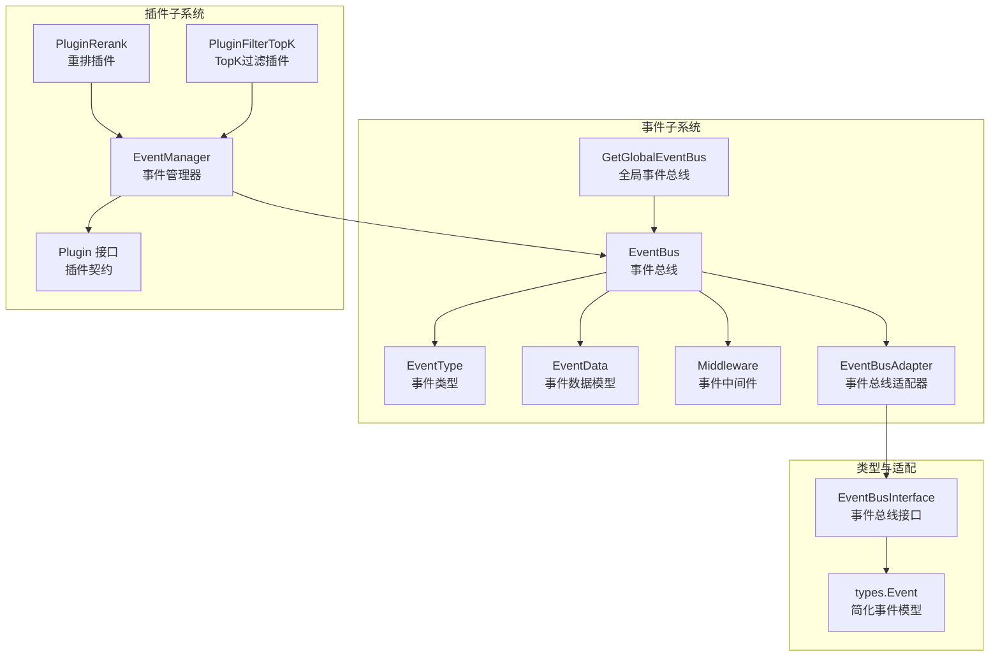
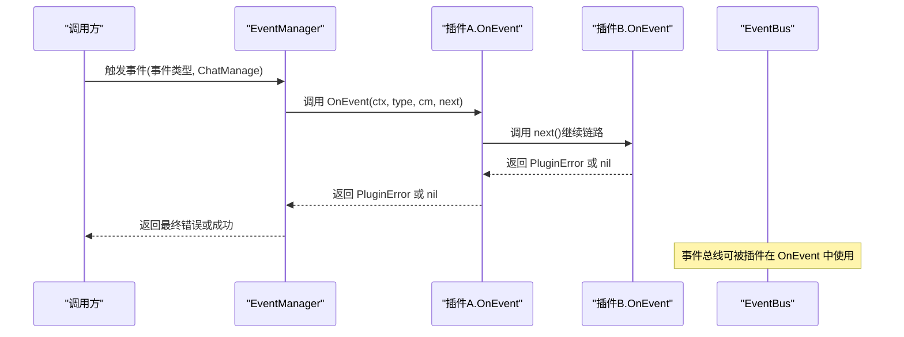
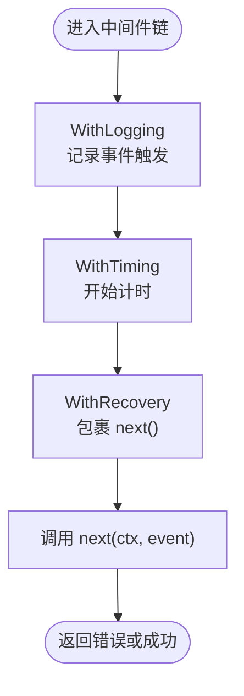
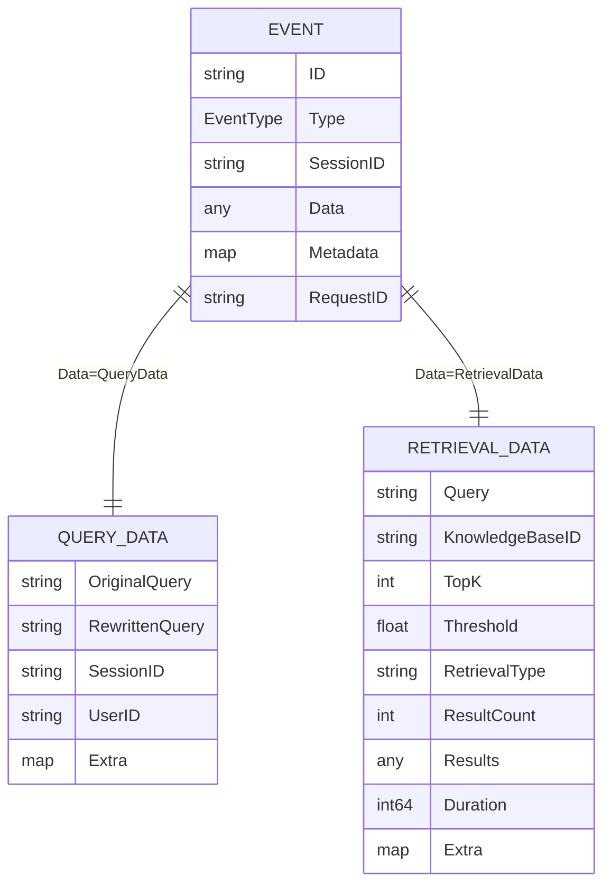
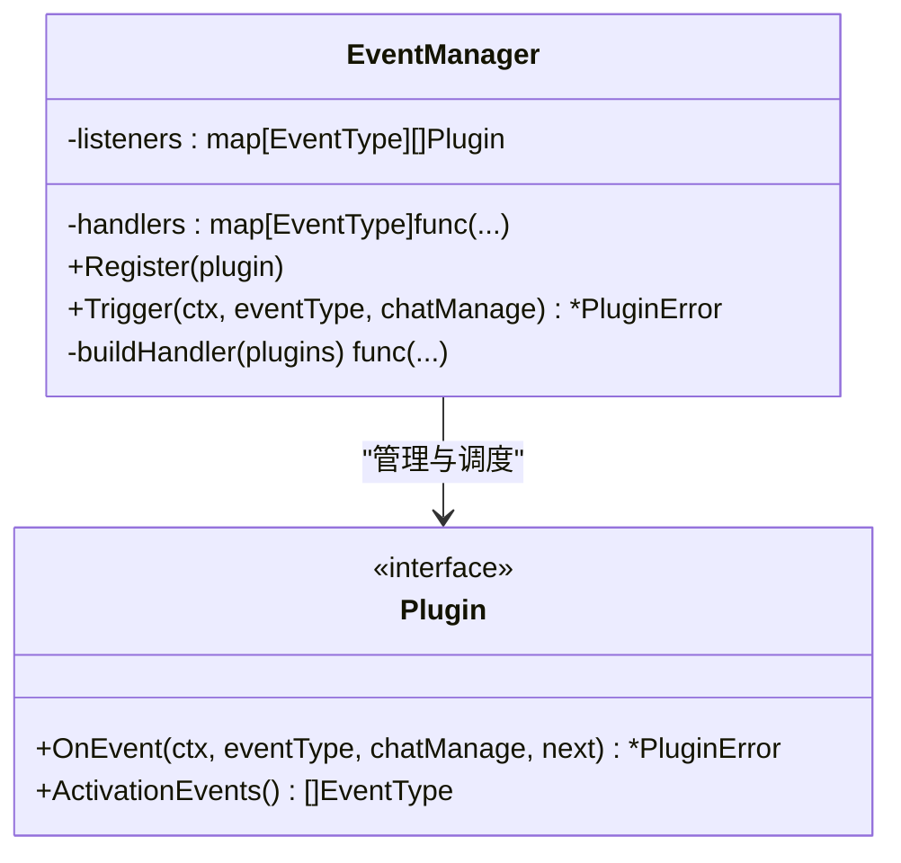
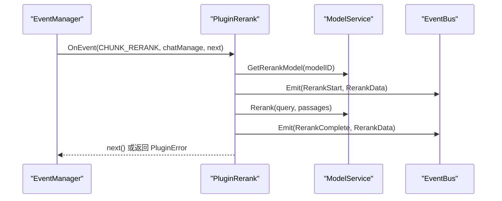
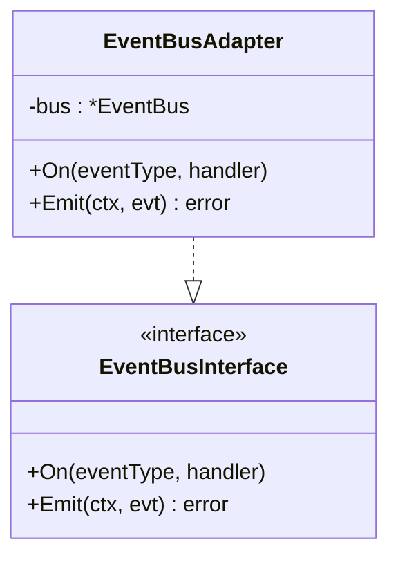
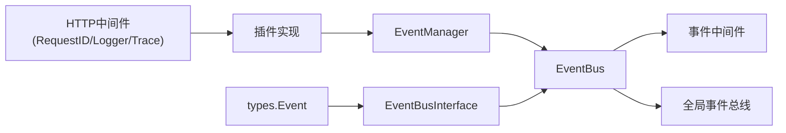

# 插件系统架构

<cite>
**本文档引用的文件**
- [internal/event/event.go](file://internal/event/event.go)
- [internal/event/middleware.go](file://internal/event/middleware.go)
- [internal/event/global.go](file://internal/event/global.go)
- [internal/event/adapter.go](file://internal/event/adapter.go)
- [internal/event/event_data.go](file://internal/event/event_data.go)
- [internal/event/example_test.go](file://internal/event/example_test.go)
- [internal/event/usage_example.md](file://internal/event/usage_example.md)
- [internal/application/service/chat_pipline/chat_pipline.go](file://internal/application/service/chat_pipline/chat_pipline.go)
- [internal/application/service/chat_pipline/rerank.go](file://internal/application/service/chat_pipline/rerank.go)
- [internal/application/service/chat_pipline/filter_top_k.go](file://internal/application/service/chat_pipline/filter_top_k.go)
- [internal/types/event_bus.go](file://internal/types/event_bus.go)
- [internal/middleware/logger.go](file://internal/middleware/logger.go)
- [internal/middleware/trace.go](file://internal/middleware/trace.go)
- [docs/notes/middleware.md](file://docs/notes/middleware.md)
</cite>

## 目录
1. [引言](#引言)
2. [项目结构](#项目结构)
3. [核心组件](#核心组件)
4. [架构总览](#架构总览)
5. [详细组件分析](#详细组件分析)
6. [依赖关系分析](#依赖关系分析)
7. [性能考量](#性能考量)
8. [故障排查指南](#故障排查指南)
9. [结论](#结论)
10. [附录](#附录)

## 引言
本文件面向插件系统架构的技术文档，聚焦以下目标：
- 插件接口设计：Plugin 接口、事件类型与生命周期管理
- 事件管理器实现：事件注册、监听器管理与回调链构建
- 插件错误处理机制：错误传播、异常捕获与状态恢复
- 中间件模式应用：请求拦截、响应处理与链式调用
- 插件开发指南：接口实现、事件处理与最佳实践
- 扩展性与性能优化策略

## 项目结构
插件系统由“事件总线”“事件数据模型”“事件中间件”“事件适配器”“插件接口与事件管理器”“插件实现示例”等模块组成，贯穿服务层与应用层。



图表来源
- [internal/event/event.go](file://internal/event/event.go#L11-L68)
- [internal/event/event_data.go](file://internal/event/event_data.go#L5-L224)
- [internal/event/middleware.go](file://internal/event/middleware.go#L11-L95)
- [internal/event/adapter.go](file://internal/event/adapter.go#L9-L60)
- [internal/event/global.go](file://internal/event/global.go#L8-L27)
- [internal/application/service/chat_pipline/chat_pipline.go](file://internal/application/service/chat_pipline/chat_pipline.go#L9-L21)
- [internal/application/service/chat_pipline/chat_pipline.go](file://internal/application/service/chat_pipline/chat_pipline.go#L23-L78)
- [internal/application/service/chat_pipline/rerank.go](file://internal/application/service/chat_pipline/rerank.go#L16-L33)
- [internal/application/service/chat_pipline/filter_top_k.go](file://internal/application/service/chat_pipline/filter_top_k.go#L9-L35)
- [internal/types/event_bus.go](file://internal/types/event_bus.go#L21-L30)

章节来源
- [internal/event/event.go](file://internal/event/event.go#L11-L68)
- [internal/event/event_data.go](file://internal/event/event_data.go#L5-L224)
- [internal/event/middleware.go](file://internal/event/middleware.go#L11-L95)
- [internal/event/adapter.go](file://internal/event/adapter.go#L9-L60)
- [internal/event/global.go](file://internal/event/global.go#L8-L27)
- [internal/application/service/chat_pipline/chat_pipline.go](file://internal/application/service/chat_pipline/chat_pipline.go#L9-L21)
- [internal/application/service/chat_pipline/chat_pipline.go](file://internal/application/service/chat_pipline/chat_pipline.go#L23-L78)
- [internal/types/event_bus.go](file://internal/types/event_bus.go#L21-L30)

## 核心组件
- 事件类型与事件对象
  - EventType 枚举覆盖查询、检索、重排、合并、聊天、Agent、快速回复、错误、会话、控制等场景
  - Event 结构包含 ID、Type、SessionID、Data、Metadata、RequestID
- 事件总线 EventBus
  - 支持同步/异步两种模式，提供 On、Off、Emit、EmitAndWait、HasHandlers、GetHandlerCount、Clear 等能力
  - 提供全局单例 GetGlobalEventBus 与 SetGlobalEventBus
- 事件中间件 Middleware
  - WithLogging、WithTiming、WithRecovery 组合 Chain 与 ApplyMiddleware 形成可插拔的处理链
- 事件数据模型 EventData
  - QueryData、RetrievalData、RerankData、MergeData、ChatData、ErrorData、Agent*Data、Streaming 数据等
- 插件接口与事件管理器
  - Plugin 接口定义 OnEvent 与 ActivationEvents
  - EventManager 负责注册、构建回调链、触发执行
- 事件总线适配器 EventBusAdapter
  - 将内部 EventBus 暴露为 types.EventBusInterface，避免循环依赖

章节来源
- [internal/event/event.go](file://internal/event/event.go#L11-L68)
- [internal/event/event.go](file://internal/event/event.go#L70-L88)
- [internal/event/event.go](file://internal/event/event.go#L83-L234)
- [internal/event/middleware.go](file://internal/event/middleware.go#L11-L95)
- [internal/event/event_data.go](file://internal/event/event_data.go#L5-L224)
- [internal/application/service/chat_pipline/chat_pipline.go](file://internal/application/service/chat_pipline/chat_pipline.go#L9-L21)
- [internal/application/service/chat_pipline/chat_pipline.go](file://internal/application/service/chat_pipline/chat_pipline.go#L23-L78)
- [internal/event/adapter.go](file://internal/event/adapter.go#L9-L60)
- [internal/types/event_bus.go](file://internal/types/event_bus.go#L21-L30)

## 架构总览
插件系统采用“事件驱动 + 中间件 + 回调链”的组合架构：
- 事件驱动：在服务关键节点发出事件，插件通过 ActivationEvents 订阅感兴趣事件
- 中间件：对事件处理进行统一增强（日志、计时、异常恢复）
- 回调链：EventManager 将多个插件按注册顺序构建链式调用，支持错误短路传播



图表来源
- [internal/application/service/chat_pipline/chat_pipline.go](file://internal/application/service/chat_pipline/chat_pipline.go#L53-L78)
- [internal/application/service/chat_pipline/chat_pipline.go](file://internal/application/service/chat_pipline/chat_pipline.go#L9-L21)
- [internal/event/event.go](file://internal/event/event.go#L123-L160)

## 详细组件分析

### 事件总线与事件类型
- 事件类型覆盖完整检索增强生成（RAG）流水线：查询接收、验证、预处理、改写、检索、实体检索、向量检索、关键词检索、重排、合并、聊天生成、流式输出、Agent 思考/工具调用/结果/反思/引用/最终答案、快速回复、错误、会话标题、停止等
- 事件对象 Event 包含会话与请求追踪字段，便于端到端可观测
- EventBus 支持：
  - 同步模式：顺序执行监听器，任一失败即短路
  - 异步模式：并发执行，不阻塞主流程
  - EmitAndWait：等待所有监听器完成并聚合错误
  - 全局单例：GetGlobalEventBus 提供全局访问入口

```mermaid
classDiagram
class EventBus {
    -mu : Mutex
    -handlers : map[EventType][]EventHandler
    -asyncMode : bool
    +On(eventType, handler)
    +Off(eventType)
    +Emit(ctx, event) error
    +EmitAndWait(ctx, event) error
    +HasHandlers(eventType) bool
    +GetHandlerCount(eventType) int
    +Clear()
}
class Event {
    +ID : string
    +Type : EventType
    +SessionID : string
    +Data : "interface{}"
    +Metadata : "map[string]interface{}"
    +RequestID : string
}
EventBus --> Event : "发布/订阅"
```

图表来源
- [internal/event/event.go](file://internal/event/event.go#L83-L234)
- [internal/event/event.go](file://internal/event/event.go#L70-L88)

章节来源
- [internal/event/event.go](file://internal/event/event.go#L11-L68)
- [internal/event/event.go](file://internal/event/event.go#L83-L234)

### 事件中间件与链式调用
- 中间件函数签名统一为 Middleware func(EventHandler) EventHandler
- 内置中间件：
  - WithLogging：结构化日志记录
  - WithTiming：统计耗时并写入事件 Metadata
  - WithRecovery：捕获 panic 并转换为可传播错误
- Chain 与 ApplyMiddleware 将多个中间件组合为单一处理器，保证执行顺序正确



图表来源
- [internal/event/middleware.go](file://internal/event/middleware.go#L14-L95)

章节来源
- [internal/event/middleware.go](file://internal/event/middleware.go#L11-L95)

### 事件数据模型与使用示例
- 事件数据模型涵盖查询、检索、重排、合并、聊天、错误、Agent 流式输出、会话标题、停止、快速回复等
- 使用示例文档展示了在检索、改写、重排、聊天完成等关键节点如何发送事件，并结合中间件进行监控与日志记录



图表来源
- [internal/event/event_data.go](file://internal/event/event_data.go#L5-L25)
- [internal/event/event_data.go](file://internal/event/event_data.go#L14-L25)

章节来源
- [internal/event/event_data.go](file://internal/event/event_data.go#L5-L224)
- [internal/event/usage_example.md](file://internal/event/usage_example.md#L32-L217)

### 插件接口与事件管理器
- Plugin 接口
  - OnEvent(ctx, eventType, chatManage, next) 返回 *PluginError
  - ActivationEvents() 返回该插件关心的事件类型集合
- EventManager
  - Register(plugin)：按 ActivationEvents 注册插件，维护 listeners 与 handlers 映射
  - buildHandler：将同一事件类型的多个插件逆序构建回调链，形成“外层插件包裹内层插件”的调用链
  - Trigger：根据事件类型查找并执行对应链路，错误短路传播



图表来源
- [internal/application/service/chat_pipline/chat_pipline.go](file://internal/application/service/chat_pipline/chat_pipline.go#L9-L21)
- [internal/application/service/chat_pipline/chat_pipline.go](file://internal/application/service/chat_pipline/chat_pipline.go#L23-L78)

章节来源
- [internal/application/service/chat_pipline/chat_pipline.go](file://internal/application/service/chat_pipline/chat_pipline.go#L9-L21)
- [internal/application/service/chat_pipline/chat_pipline.go](file://internal/application/service/chat_pipline/chat_pipline.go#L23-L78)

### 插件实现示例
- PluginRerank：在重排阶段注册，基于模型服务执行重排，发送开始/完成事件，支持阈值过滤与日志记录
- PluginFilterTopK：在特定事件触发时对搜索/合并/重排结果进行 TopK 过滤



图表来源
- [internal/application/service/chat_pipline/rerank.go](file://internal/application/service/chat_pipline/rerank.go#L35-L215)
- [internal/application/service/chat_pipline/chat_pipline.go](file://internal/application/service/chat_pipline/chat_pipline.go#L39-L68)

章节来源
- [internal/application/service/chat_pipline/rerank.go](file://internal/application/service/chat_pipline/rerank.go#L16-L33)
- [internal/application/service/chat_pipline/rerank.go](file://internal/application/service/chat_pipline/rerank.go#L35-L215)
- [internal/application/service/chat_pipline/filter_top_k.go](file://internal/application/service/chat_pipline/filter_top_k.go#L9-L35)

### 事件总线适配器与接口隔离
- EventBusAdapter 将内部 EventBus 暴露为 types.EventBusInterface，避免 types 与 event 包之间的循环依赖
- 通过 AsEventBusInterface 将具体实现转为接口，供上层模块使用



图表来源
- [internal/event/adapter.go](file://internal/event/adapter.go#L9-L60)
- [internal/types/event_bus.go](file://internal/types/event_bus.go#L21-L30)

章节来源
- [internal/event/adapter.go](file://internal/event/adapter.go#L9-L60)
- [internal/types/event_bus.go](file://internal/types/event_bus.go#L21-L30)

### 全局事件总线与便捷 API
- GetGlobalEventBus 单例模式提供全局访问
- On、Off、Emit、EmitAndWait、HasHandlers、Clear 提供便捷 API

章节来源
- [internal/event/global.go](file://internal/event/global.go#L8-L57)

## 依赖关系分析
- 插件层依赖事件层：插件通过 EventManager 与 EventBus 交互；插件也可直接使用全局事件总线
- 事件层依赖中间件与日志：事件处理可叠加 WithLogging、WithTiming、WithRecovery
- 类型层通过 EventBusInterface 抽象事件总线，避免循环依赖
- 中间件层与 HTTP 中间件协同：RequestID、Logger、Trace 等中间件提供请求级可观测性



图表来源
- [internal/application/service/chat_pipline/chat_pipline.go](file://internal/application/service/chat_pipline/chat_pipline.go#L23-L78)
- [internal/event/event.go](file://internal/event/event.go#L83-L234)
- [internal/event/middleware.go](file://internal/event/middleware.go#L14-L95)
- [internal/event/global.go](file://internal/event/global.go#L14-L27)
- [internal/types/event_bus.go](file://internal/types/event_bus.go#L21-L30)
- [internal/middleware/logger.go](file://internal/middleware/logger.go#L100-L195)
- [internal/middleware/trace.go](file://internal/middleware/trace.go#L90-L118)
- [docs/notes/middleware.md](file://docs/notes/middleware.md#L1-L111)

章节来源
- [internal/application/service/chat_pipline/chat_pipline.go](file://internal/application/service/chat_pipline/chat_pipline.go#L23-L78)
- [internal/event/event.go](file://internal/event/event.go#L83-L234)
- [internal/event/middleware.go](file://internal/event/middleware.go#L14-L95)
- [internal/event/global.go](file://internal/event/global.go#L14-L27)
- [internal/types/event_bus.go](file://internal/types/event_bus.go#L21-L30)
- [internal/middleware/logger.go](file://internal/middleware/logger.go#L100-L195)
- [internal/middleware/trace.go](file://internal/middleware/trace.go#L90-L118)
- [docs/notes/middleware.md](file://docs/notes/middleware.md#L1-L111)

## 性能考量
- 异步事件总线：对不影响主流程的监控、日志等使用异步模式，避免阻塞
- 中间件选择：仅在必要处启用 WithTiming、WithLogging，减少开销
- 事件数据体积：避免在事件中传递大对象，异步场景尤其如此
- 监听器职责单一：每个监听器专注单一职责，降低复杂度与耦合
- 回调链长度控制：合理组织插件注册，避免链过长导致延迟累积

章节来源
- [internal/event/event.go](file://internal/event/event.go#L141-L160)
- [internal/event/usage_example.md](file://internal/event/usage_example.md#L413-L420)

## 故障排查指南
- 错误传播与短路
  - 同步模式下，任一监听器返回错误即短路，返回的错误携带原始错误与描述
  - 插件返回 *PluginError，EventManager 沿链路向上透传
- 异常捕获与恢复
  - WithRecovery 将 panic 转换为可传播的错误类型，便于统一处理
- 日志与追踪
  - WithLogging 记录事件触发与处理结果
  - WithTiming 将耗时写入事件 Metadata，便于分析
  - RequestID 中间件为请求生成唯一 ID，贯穿日志与响应头
  - Trace 中间件记录状态码、响应体与错误，便于链路追踪
- 常见问题定位
  - 事件未触发：检查 EventManager 是否正确注册插件与激活事件
  - 性能瓶颈：确认是否使用异步总线、是否过度使用中间件
  - 错误丢失：确保插件返回 *PluginError 并在上层正确处理

章节来源
- [internal/application/service/chat_pipline/chat_pipline.go](file://internal/application/service/chat_pipline/chat_pipline.go#L80-L141)
- [internal/event/middleware.go](file://internal/event/middleware.go#L55-L95)
- [internal/middleware/logger.go](file://internal/middleware/logger.go#L132-L195)
- [internal/middleware/trace.go](file://internal/middleware/trace.go#L90-L118)
- [docs/notes/middleware.md](file://docs/notes/middleware.md#L1-L111)

## 结论
该插件系统以事件驱动为核心，结合中间件与回调链，实现了高扩展性与强可观测性的架构。通过清晰的插件接口、完善的事件类型体系、灵活的异步与同步模式以及可插拔的中间件，既能满足复杂业务场景的扩展需求，又能在性能与稳定性之间取得良好平衡。

## 附录

### 插件开发指南
- 实现 Plugin 接口
  - 在 ActivationEvents 中声明关心的事件类型
  - 在 OnEvent 中调用 next() 传递控制权，返回 *PluginError 或 nil
- 事件发布
  - 在关键节点使用 EventBus 或全局事件总线发送事件
  - 为事件附加 SessionID、RequestID 以便追踪
- 中间件应用
  - 对需要监控与日志的处理器应用 WithLogging、WithTiming、WithRecovery
  - 使用 Chain 与 ApplyMiddleware 组合中间件
- 错误处理
  - 使用预定义的 PluginError 或自定义错误，附带描述与类型
  - 在上层统一收集与上报错误
- 最佳实践
  - 保持监听器单一职责
  - 控制事件数据体量
  - 对不影响主流程的操作使用异步事件总线

章节来源
- [internal/application/service/chat_pipline/chat_pipline.go](file://internal/application/service/chat_pipline/chat_pipline.go#L9-L21)
- [internal/application/service/chat_pipline/chat_pipline.go](file://internal/application/service/chat_pipline/chat_pipline.go#L80-L141)
- [internal/event/usage_example.md](file://internal/event/usage_example.md#L341-L364)
- [internal/event/example_test.go](file://internal/event/example_test.go#L126-L228)