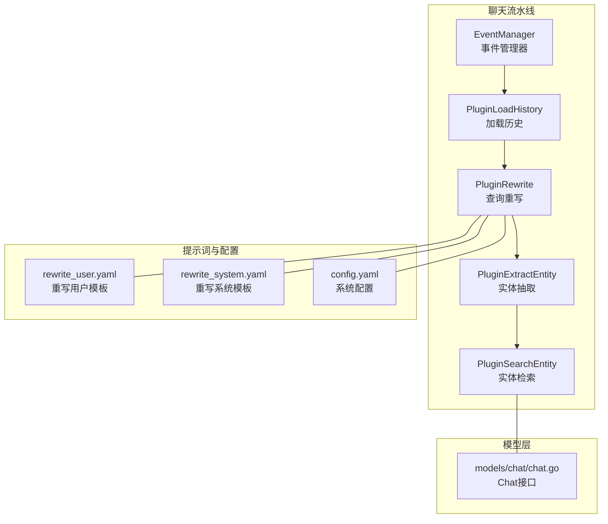
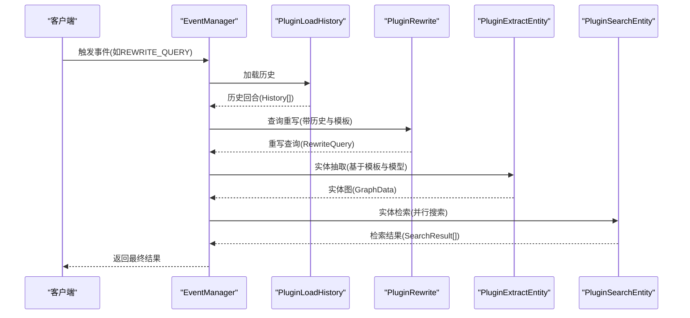
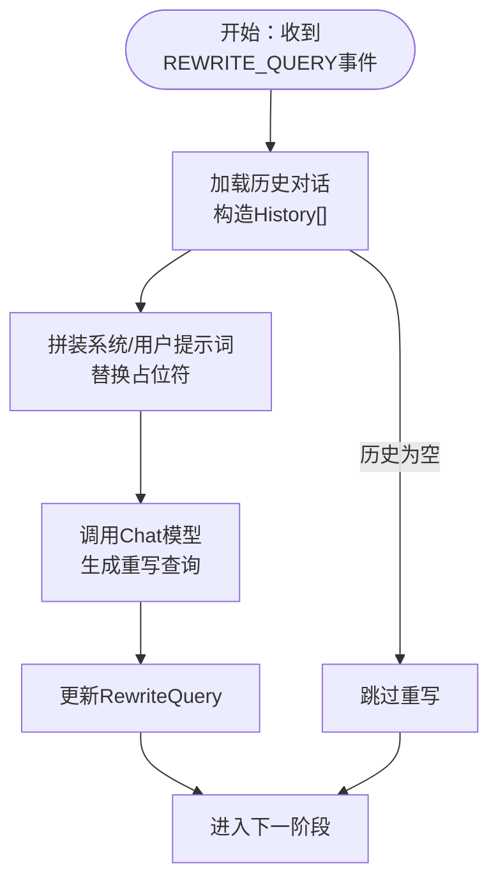
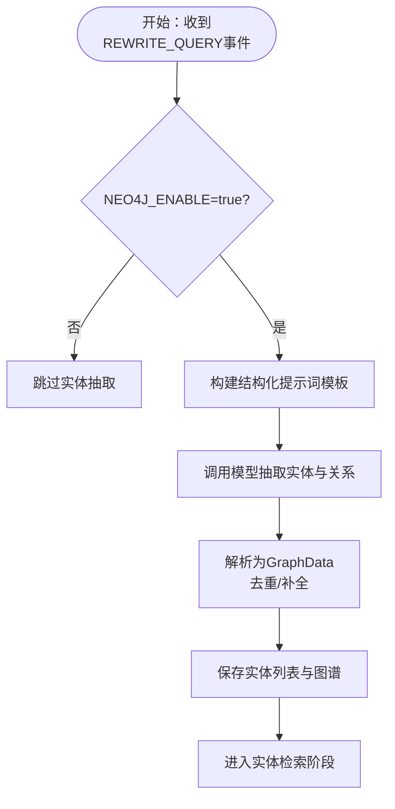
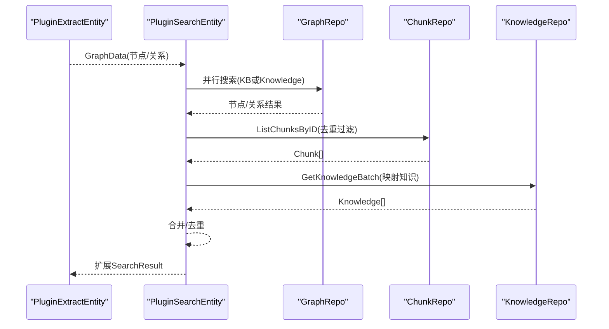
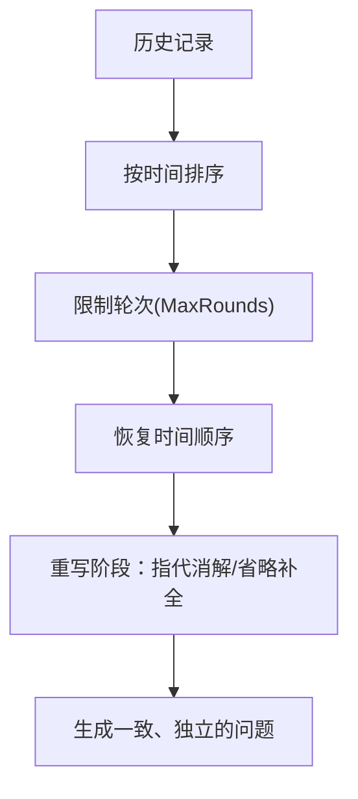
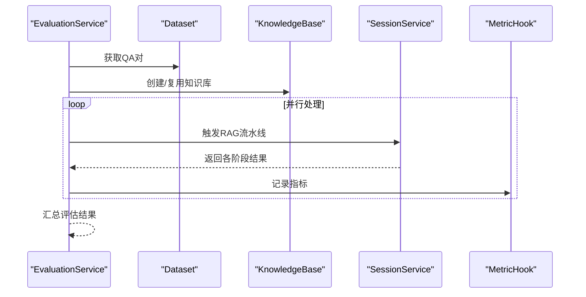
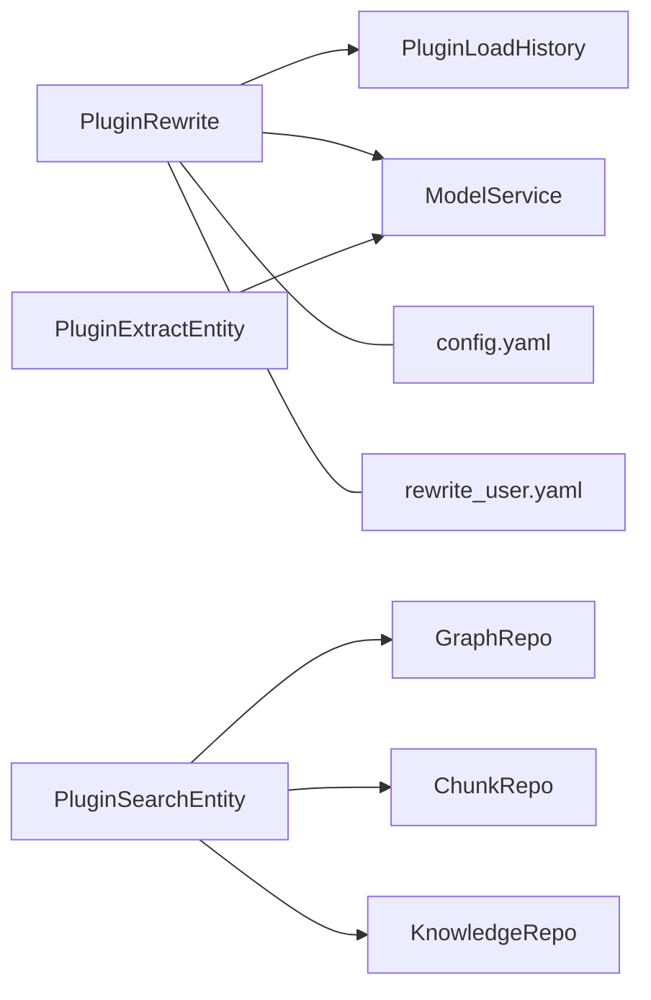

# 查询重写机制

<cite>
**本文引用的文件**
- [internal/application/service/chat_pipline/rewrite.go](file://internal/application/service/chat_pipline/rewrite.go)
- [internal/application/service/chat_pipline/extract_entity.go](file://internal/application/service/chat_pipline/extract_entity.go)
- [internal/application/service/chat_pipline/load_history.go](file://internal/application/service/chat_pipline/load_history.go)
- [internal/application/service/chat_pipline/search_entity.go](file://internal/application/service/chat_pipline/search_entity.go)
- [internal/application/service/chat_pipline/chat_pipline.go](file://internal/application/service/chat_pipline/chat_pipline.go)
- [config/prompt_templates/rewrite_user.yaml](file://config/prompt_templates/rewrite_user.yaml)
- [config/prompt_templates/system_prompt.yaml](file://config/prompt_templates/system_prompt.yaml)
- [config/prompt_templates/context_template.yaml](file://config/prompt_templates/context_template.yaml)
- [config/config.yaml](file://config/config.yaml)
- [internal/models/chat/chat.go](file://internal/models/chat/chat.go)
- [internal/types/chat.go](file://internal/types/chat.go)
- [internal/application/service/evaluation.go](file://internal/application/service/evaluation.go)
- [internal/application/service/chat_pipline/chat_pipline_test.go](file://internal/application/service/chat_pipline/chat_pipline_test.go)
</cite>

## 目录
1. [简介](#简介)
2. [项目结构](#项目结构)
3. [核心组件](#核心组件)
4. [架构总览](#架构总览)
5. [详细组件分析](#详细组件分析)
6. [依赖分析](#依赖分析)
7. [性能考量](#性能考量)
8. [故障排查指南](#故障排查指南)
9. [结论](#结论)
10. [附录](#附录)

## 简介
本文件系统化阐述本项目的“查询重写机制”，涵盖语义理解（意图识别、实体提取、语义解析）、关键词提取策略（TF-IDF、TextRank、BERT-based）、多轮对话一致性（上下文关联、指代消解、状态保持）、重写模板系统（系统提示词设计、用户提示词优化、模板参数化）、重写质量评估（准确性测试、一致性检查、用户反馈收集），以及性能优化与实时处理策略。文档面向工程实践，既提供代码级细节，也提供可视化流程图与最佳实践建议。

## 项目结构
查询重写机制位于聊天流水线模块内部，采用插件化事件驱动架构，通过事件管理器串联各阶段插件（如加载历史、查询重写、实体抽取、实体检索等）。提示词模板与系统配置集中于配置目录，模型调用抽象于统一的 Chat 接口。

图表来源
- [internal/application/service/chat_pipline/chat_pipline.go](file://internal/application/service/chat_pipline/chat_pipline.go#L24-L78)
- [internal/application/service/chat_pipline/load_history.go](file://internal/application/service/chat_pipline/load_history.go#L15-L43)
- [internal/application/service/chat_pipline/rewrite.go](file://internal/application/service/chat_pipline/rewrite.go#L19-L49)
- [internal/application/service/chat_pipline/extract_entity.go](file://internal/application/service/chat_pipline/extract_entity.go#L19-L51)
- [internal/application/service/chat_pipline/search_entity.go](file://internal/application/service/chat_pipline/search_entity.go#L12-L38)
- [config/prompt_templates/rewrite_user.yaml](file://config/prompt_templates/rewrite_user.yaml#L1-L31)
- [config/config.yaml](file://config/config.yaml#L30-L90)
- [internal/models/chat/chat.go](file://internal/models/chat/chat.go#L64-L77)

章节来源
- [internal/application/service/chat_pipline/chat_pipline.go](file://internal/application/service/chat_pipline/chat_pipline.go#L9-L78)
- [config/prompt_templates/rewrite_user.yaml](file://config/prompt_templates/rewrite_user.yaml#L1-L31)
- [config/config.yaml](file://config/config.yaml#L30-L90)

## 核心组件
- 事件管理器与插件链：通过事件驱动实现插件注册、构建处理器链与触发执行，确保各阶段按序执行且错误可传播。
- 加载历史插件：拉取最近对话记录，清洗“思考”标记，构造历史回合，为重写与检索提供上下文。
- 查询重写插件：基于历史对话与系统/用户提示词模板，调用大模型生成改写后的查询，支持温度、最大输出等参数控制。
- 实体抽取插件：在启用图谱抽取的前提下，基于结构化提示词模板抽取实体节点与关系，形成图谱数据。
- 实体检索插件：并行检索实体对应的图谱节点与关系，合并去重后映射为知识块，扩展检索结果。
- 模型抽象：统一 Chat 接口，屏蔽本地/远端模型差异，支持非流式与流式对话。

章节来源
- [internal/application/service/chat_pipline/chat_pipline.go](file://internal/application/service/chat_pipline/chat_pipline.go#L9-L78)
- [internal/application/service/chat_pipline/load_history.go](file://internal/application/service/chat_pipline/load_history.go#L15-L43)
- [internal/application/service/chat_pipline/rewrite.go](file://internal/application/service/chat_pipline/rewrite.go#L19-L49)
- [internal/application/service/chat_pipline/extract_entity.go](file://internal/application/service/chat_pipline/extract_entity.go#L19-L51)
- [internal/application/service/chat_pipline/search_entity.go](file://internal/application/service/chat_pipline/search_entity.go#L12-L38)
- [internal/models/chat/chat.go](file://internal/models/chat/chat.go#L64-L77)

## 架构总览
查询重写机制在事件驱动流水线中与其他阶段协同工作：先加载历史，再进行查询重写，随后进行实体抽取与检索，最后进入搜索与重排阶段。系统通过配置项控制是否启用重写、最大轮次、阈值与提示词模板。

图表来源
- [internal/application/service/chat_pipline/chat_pipline.go](file://internal/application/service/chat_pipline/chat_pipline.go#L70-L78)
- [internal/application/service/chat_pipline/load_history.go](file://internal/application/service/chat_pipline/load_history.go#L45-L126)
- [internal/application/service/chat_pipline/rewrite.go](file://internal/application/service/chat_pipline/rewrite.go#L51-L210)
- [internal/application/service/chat_pipline/extract_entity.go](file://internal/application/service/chat_pipline/extract_entity.go#L53-L150)
- [internal/application/service/chat_pipline/search_entity.go](file://internal/application/service/chat_pipline/search_entity.go#L40-L181)

## 详细组件分析

### 查询重写插件（意图识别、实体提取、语义解析）
- 意图识别与语义解析：通过“系统提示词 + 用户提示词 + 历史对话 + 当前问题”的组合，引导模型进行指代消解与省略补全，确保改写后的问题独立、完整、可脱离上下文理解。
- 实体提取：在重写之后，实体抽取插件可基于结构化提示词模板，从用户问题中抽取实体节点与关系，形成图谱，为后续实体检索提供基础。
- 模板参数化：支持占位符替换（如历史对话、当前问题、时间戳等），并允许请求级覆盖系统/用户提示词。

图表来源
- [internal/application/service/chat_pipline/rewrite.go](file://internal/application/service/chat_pipline/rewrite.go#L51-L210)
- [config/prompt_templates/rewrite_user.yaml](file://config/prompt_templates/rewrite_user.yaml#L6-L31)
- [config/config.yaml](file://config/config.yaml#L30-L90)

章节来源
- [internal/application/service/chat_pipline/rewrite.go](file://internal/application/service/chat_pipline/rewrite.go#L51-L210)
- [config/prompt_templates/rewrite_user.yaml](file://config/prompt_templates/rewrite_user.yaml#L1-L31)
- [config/config.yaml](file://config/config.yaml#L30-L90)

### 实体抽取与图谱构建
- 结构化提示词：通过系统提示词模板与示例，约束模型输出为标准化的 JSON/YAML 结构，便于解析为节点与关系。
- 图谱解析与去重：解析器将模型输出转换为图数据结构，合并重复节点、补齐缺失节点、过滤无效关系，保证图谱质量。
- 知识库/文件维度控制：仅对启用抽取配置的知识库或文件进行实体抽取，避免无关范围扩大。

图表来源
- [internal/application/service/chat_pipline/extract_entity.go](file://internal/application/service/chat_pipline/extract_entity.go#L53-L150)
- [config/config.yaml](file://config/config.yaml#L514-L585)

章节来源
- [internal/application/service/chat_pipline/extract_entity.go](file://internal/application/service/chat_pipline/extract_entity.go#L53-L150)
- [config/config.yaml](file://config/config.yaml#L514-L585)

### 实体检索与并行搜索
- 并行搜索：对指定知识库或文件集合进行并行检索，聚合节点与关系，去重后映射为知识块，扩展检索结果。
- 结果映射：将图谱节点映射为知识块与知识条目，去除重复，确保下游搜索/重排稳定。

图表来源
- [internal/application/service/chat_pipline/search_entity.go](file://internal/application/service/chat_pipline/search_entity.go#L40-L181)

章节来源
- [internal/application/service/chat_pipline/search_entity.go](file://internal/application/service/chat_pipline/search_entity.go#L40-L181)

### 多轮对话一致性保障
- 上下文关联：加载历史时按时间排序并限制轮次，确保上下文新鲜度与长度可控。
- 指代消解：重写阶段显式替换代词为主语，补全省略信息，保证问题独立性。
- 状态保持：通过 ChatManage 在流水线中传递历史、重写查询、实体、图谱与检索结果，避免重复计算。

图表来源
- [internal/application/service/chat_pipline/load_history.go](file://internal/application/service/chat_pipline/load_history.go#L50-L117)
- [internal/application/service/chat_pipline/rewrite.go](file://internal/application/service/chat_pipline/rewrite.go#L112-L128)

章节来源
- [internal/application/service/chat_pipline/load_history.go](file://internal/application/service/chat_pipline/load_history.go#L50-L117)
- [internal/application/service/chat_pipline/rewrite.go](file://internal/application/service/chat_pipline/rewrite.go#L112-L128)

### 重写模板系统
- 系统提示词设计：强调“指代消解、省略补全、独立性、字数控制”，并提供示例，确保模型输出符合预期。
- 用户提示词优化：提供标准与详细两种模板，支持占位符替换（历史、当前问题、时间等）。
- 模板参数化：支持全局配置与请求级覆盖，便于灰度与A/B测试。

章节来源
- [config/config.yaml](file://config/config.yaml#L30-L90)
- [config/prompt_templates/rewrite_user.yaml](file://config/prompt_templates/rewrite_user.yaml#L1-L31)
- [config/prompt_templates/system_prompt.yaml](file://config/prompt_templates/system_prompt.yaml#L1-L114)
- [config/prompt_templates/context_template.yaml](file://config/prompt_templates/context_template.yaml#L1-L66)

### 关键词提取策略
- TF-IDF：用于衡量关键词在文档中的重要性，适合传统检索场景；可结合向量检索提升召回。
- TextRank：基于图的关键词抽取方法，适合捕捉语义相关性与上下文关系。
- BERT-based：基于预训练语言模型的句子/词表示，适合细粒度语义抽取与实体识别，可与抽取模板结合使用。
- 本项目提供关键词抽取提示词模板与用户侧输出占位，便于在重写前后进行关键词对比与效果评估。

章节来源
- [config/config.yaml](file://config/config.yaml#L91-L136)

### 重写质量评估
- 准确性测试：通过评估服务对问答数据集进行并行评测，记录检索、重排、对话等各阶段指标，支持多模型/多配置对比。
- 一致性检查：在流水线中记录历史轮次、重写查询、实体图谱与检索结果，便于回溯与一致性审计。
- 用户反馈收集：可通过外部指标钩子与日志采集，结合前端交互行为统计，持续优化提示词与阈值。

图表来源
- [internal/application/service/evaluation.go](file://internal/application/service/evaluation.go#L329-L454)

章节来源
- [internal/application/service/evaluation.go](file://internal/application/service/evaluation.go#L128-L454)

## 依赖分析
- 插件耦合：各插件通过事件管理器解耦，遵循单一职责原则；重写依赖历史加载与模型服务；实体抽取依赖抽取模板与模型；实体检索依赖图仓库与知识/块仓库。
- 外部依赖：模型抽象统一（Chat 接口），支持本地与远端模型；提示词模板与系统配置集中管理，便于版本化与热更新。

图表来源
- [internal/application/service/chat_pipline/rewrite.go](file://internal/application/service/chat_pipline/rewrite.go#L19-L49)
- [internal/application/service/chat_pipline/load_history.go](file://internal/application/service/chat_pipline/load_history.go#L15-L43)
- [internal/application/service/chat_pipline/extract_entity.go](file://internal/application/service/chat_pipline/extract_entity.go#L19-L51)
- [internal/application/service/chat_pipline/search_entity.go](file://internal/application/service/chat_pipline/search_entity.go#L12-L38)
- [config/config.yaml](file://config/config.yaml#L30-L90)
- [config/prompt_templates/rewrite_user.yaml](file://config/prompt_templates/rewrite_user.yaml#L1-L31)

章节来源
- [internal/application/service/chat_pipline/chat_pipline.go](file://internal/application/service/chat_pipline/chat_pipline.go#L39-L68)

## 性能考量
- 并行化：实体检索阶段对多个知识库/文件并行搜索，显著降低端到端延迟。
- 缓存与去重：在实体检索阶段对已见过的块进行去重，减少重复检索与下游处理开销。
- 流水线短路：当历史为空或禁用重写时，快速跳过重写阶段，避免不必要的模型调用。
- 模型参数调优：通过温度、最大输出等参数控制生成稳定性与成本，结合评估指标持续优化。

章节来源
- [internal/application/service/chat_pipline/search_entity.go](file://internal/application/service/chat_pipline/search_entity.go#L60-L134)
- [internal/application/service/chat_pipline/rewrite.go](file://internal/application/service/chat_pipline/rewrite.go#L59-L65)

## 故障排查指南
- 事件链中断：检查事件管理器是否正确注册插件，确认事件类型与激活事件匹配。
- 历史加载异常：关注历史记录拉取失败与不完整配对问题，必要时放宽轮次上限或增加兜底策略。
- 模型调用失败：检查模型服务可用性与配置，关注温度、最大令牌等参数设置。
- 实体抽取失败：确认图谱抽取开关与模板配置，检查模型输出格式与解析器容错。
- 评估任务异常：核对任务租户匹配、数据集可用性与并行度设置，查看指标钩子记录。

章节来源
- [internal/application/service/chat_pipline/chat_pipline.go](file://internal/application/service/chat_pipline/chat_pipline.go#L80-L141)
- [internal/application/service/chat_pipline/chat_pipline_test.go](file://internal/application/service/chat_pipline/chat_pipline_test.go#L35-L125)

## 结论
本查询重写机制通过事件驱动的流水线架构，将“历史加载—查询重写—实体抽取—实体检索—搜索与重排”有机串联。借助结构化的提示词模板与系统配置，系统实现了稳定的指代消解与省略补全；通过并行检索与去重策略，兼顾了性能与质量。结合评估体系与一致性检查，可持续迭代优化提示词与阈值，提升整体问答体验。

## 附录
- 提示词模板与系统配置路径：config/prompt_templates/* 与 config/config.yaml
- 模型接口：internal/models/chat/chat.go
- 类型与响应：internal/types/chat.go