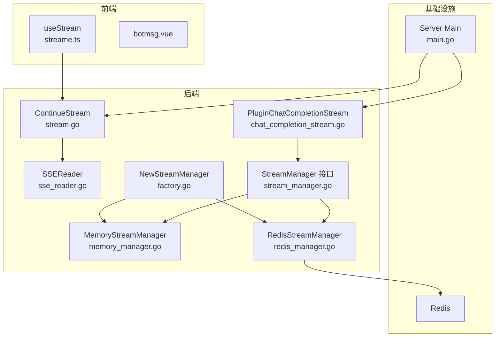
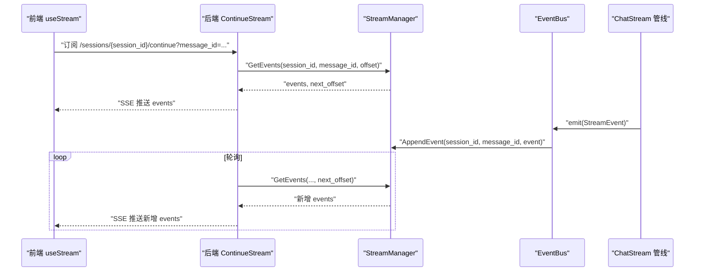
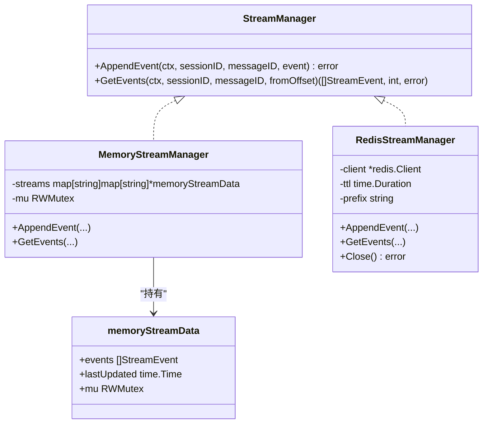
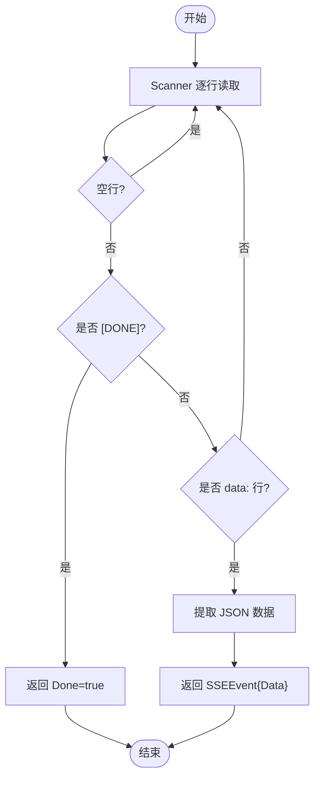
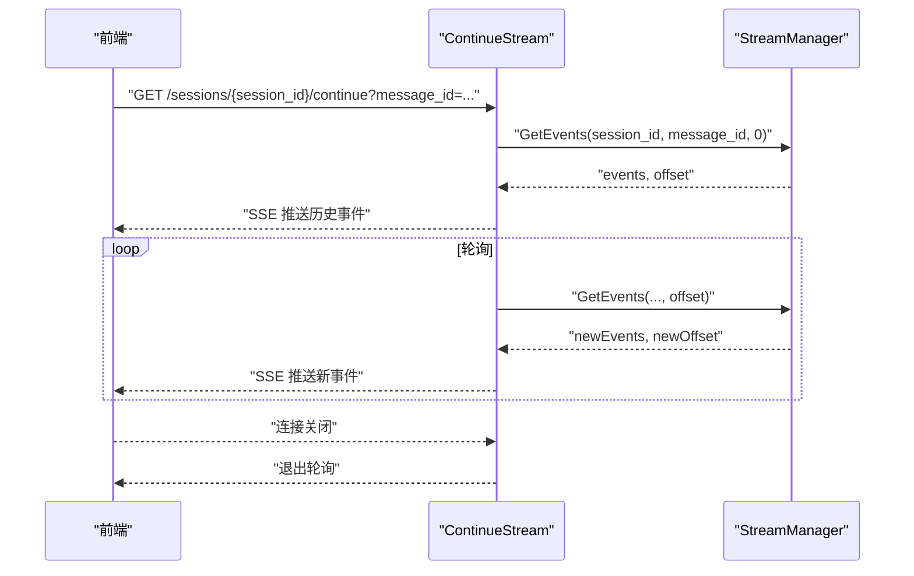
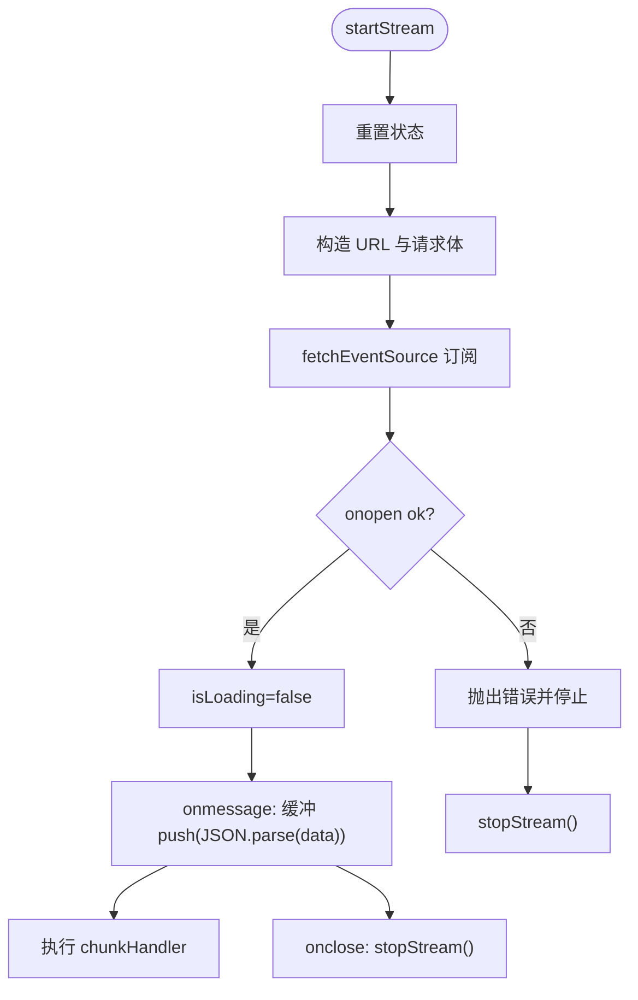
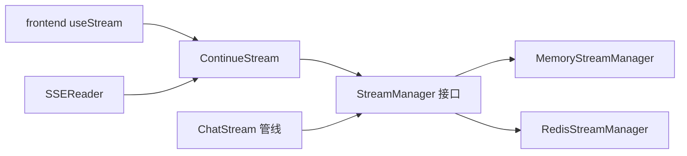

# 流式处理机制

<cite>
**本文引用的文件**
- [internal/stream/factory.go](file://internal/stream/factory.go)
- [internal/stream/memory_manager.go](file://internal/stream/memory_manager.go)
- [internal/stream/redis_manager.go](file://internal/stream/redis_manager.go)
- [internal/types/interfaces/stream_manager.go](file://internal/types/interfaces/stream_manager.go)
- [internal/models/chat/sse_reader.go](file://internal/models/chat/sse_reader.go)
- [internal/handler/session/stream.go](file://internal/handler/session/stream.go)
- [frontend/src/api/chat/streame.ts](file://frontend/src/api/chat/streame.ts)
- [frontend/src/views/chat/components/botmsg.vue](file://frontend/src/views/chat/components/botmsg.vue)
- [internal/application/service/chat_pipline/chat_completion_stream.go](file://internal/application/service/chat_pipline/chat_completion_stream.go)
- [cmd/server/main.go](file://cmd/server/main.go)
</cite>

## 目录
1. [引言](#引言)
2. [项目结构](#项目结构)
3. [核心组件](#核心组件)
4. [架构总览](#架构总览)
5. [详细组件分析](#详细组件分析)
6. [依赖分析](#依赖分析)
7. [性能考虑](#性能考虑)
8. [故障排查指南](#故障排查指南)
9. [结论](#结论)
10. [附录](#附录)

## 引言
本文件系统性梳理本项目的流式处理机制，覆盖 WebSocket/SSE 连接管理、心跳与断线重连、消息分片与顺序一致性、客户端渲染优化、内存与资源管理、以及错误处理与恢复策略。文档面向不同层次读者，既提供高层架构视图，也给出可操作的最佳实践与排障建议。

## 项目结构
围绕流式处理的关键模块分布如下：
- 后端流管理器：内存与 Redis 两种实现，统一接口抽象，支持分布式扩展
- SSE 读取器：解析服务端推送的事件流
- 会话处理器：基于轮询的 SSE 推送，支持断点续传与停止事件
- 前端流钩子：基于 fetch-event-source 的事件消费与缓冲渲染
- 事件管线：模型调用产生的流式事件，经 EventBus 转发至流管理器
- 服务器入口：容器构建与优雅停机，保障流式生命周期

图表来源
- [frontend/src/api/chat/streame.ts](file://frontend/src/api/chat/streame.ts#L1-L182)
- [internal/handler/session/stream.go](file://internal/handler/session/stream.go#L1-L441)
- [internal/models/chat/sse_reader.go](file://internal/models/chat/sse_reader.go#L1-L60)
- [internal/application/service/chat_pipline/chat_completion_stream.go](file://internal/application/service/chat_pipline/chat_completion_stream.go#L1-L198)
- [internal/types/interfaces/stream_manager.go](file://internal/types/interfaces/stream_manager.go#L1-L33)
- [internal/stream/memory_manager.go](file://internal/stream/memory_manager.go#L1-L119)
- [internal/stream/redis_manager.go](file://internal/stream/redis_manager.go#L1-L137)
- [internal/stream/factory.go](file://internal/stream/factory.go#L1-L37)
- [cmd/server/main.go](file://cmd/server/main.go#L1-L193)

章节来源
- [internal/stream/factory.go](file://internal/stream/factory.go#L1-L37)
- [internal/stream/memory_manager.go](file://internal/stream/memory_manager.go#L1-L119)
- [internal/stream/redis_manager.go](file://internal/stream/redis_manager.go#L1-L137)
- [internal/types/interfaces/stream_manager.go](file://internal/types/interfaces/stream_manager.go#L1-L33)
- [internal/models/chat/sse_reader.go](file://internal/models/chat/sse_reader.go#L1-L60)
- [internal/handler/session/stream.go](file://internal/handler/session/stream.go#L1-L441)
- [frontend/src/api/chat/streame.ts](file://frontend/src/api/chat/streame.ts#L1-L182)
- [frontend/src/views/chat/components/botmsg.vue](file://frontend/src/views/chat/components/botmsg.vue#L1-L574)
- [internal/application/service/chat_pipline/chat_completion_stream.go](file://internal/application/service/chat_pipline/chat_completion_stream.go#L1-L198)
- [cmd/server/main.go](file://cmd/server/main.go#L1-L193)

## 核心组件
- 流管理器接口与实现
  - 接口定义了事件追加与按偏移增量读取能力，保证事件驱动的流式状态管理
  - 内存实现适合单实例部署，Redis 实现支持多实例共享与持久化
- SSE 读取器
  - 提供对服务端事件的逐条解析，识别 [DONE] 结束标记
- 会话处理器
  - 提供继续流式响应的接口，基于轮询从流管理器拉取增量事件，并通过 SSE 推送
  - 支持用户主动停止生成，写入停止事件
- 前端流钩子
  - 基于 fetch-event-source 订阅事件源，内置缓冲与定时渲染，支持错误回调与关闭回调
- 事件管线
  - 模型调用返回流式通道，事件经 EventBus 转发，由流管理器持久化

章节来源
- [internal/types/interfaces/stream_manager.go](file://internal/types/interfaces/stream_manager.go#L1-L33)
- [internal/stream/memory_manager.go](file://internal/stream/memory_manager.go#L1-L119)
- [internal/stream/redis_manager.go](file://internal/stream/redis_manager.go#L1-L137)
- [internal/models/chat/sse_reader.go](file://internal/models/chat/sse_reader.go#L1-L60)
- [internal/handler/session/stream.go](file://internal/handler/session/stream.go#L1-L441)
- [frontend/src/api/chat/streame.ts](file://frontend/src/api/chat/streame.ts#L1-L182)
- [internal/application/service/chat_pipline/chat_completion_stream.go](file://internal/application/service/chat_pipline/chat_completion_stream.go#L1-L198)

## 架构总览
整体采用“事件驱动 + SSE 轮询”的流式架构：
- 事件生产：模型服务产生流式事件，经 EventBus 写入流管理器
- 事件存储：内存或 Redis 列表结构，支持 O(1) 追加与 LRange 增量读取
- 事件消费：前端通过 fetch-event-source 订阅，后端通过轮询持续推送
- 断线恢复：前端断开后可重新发起订阅；后端通过偏移量继续推送

图表来源
- [internal/handler/session/stream.go](file://internal/handler/session/stream.go#L31-L176)
- [internal/types/interfaces/stream_manager.go](file://internal/types/interfaces/stream_manager.go#L20-L32)
- [internal/application/service/chat_pipline/chat_completion_stream.go](file://internal/application/service/chat_pipline/chat_completion_stream.go#L38-L198)
- [frontend/src/api/chat/streame.ts](file://frontend/src/api/chat/streame.ts#L113-L148)

## 详细组件分析

### 流管理器与工厂
- 工厂根据环境变量选择内存或 Redis 实现，便于在单机与分布式场景间切换
- Redis 实现提供 TTL 与键前缀，便于多租户隔离与资源回收
- 内存实现提供读写锁保护，避免并发竞态

图表来源
- [internal/types/interfaces/stream_manager.go](file://internal/types/interfaces/stream_manager.go#L10-L32)
- [internal/stream/memory_manager.go](file://internal/stream/memory_manager.go#L11-L119)
- [internal/stream/redis_manager.go](file://internal/stream/redis_manager.go#L13-L137)
- [internal/stream/factory.go](file://internal/stream/factory.go#L17-L36)

章节来源
- [internal/stream/factory.go](file://internal/stream/factory.go#L1-L37)
- [internal/stream/memory_manager.go](file://internal/stream/memory_manager.go#L1-L119)
- [internal/stream/redis_manager.go](file://internal/stream/redis_manager.go#L1-L137)
- [internal/types/interfaces/stream_manager.go](file://internal/types/interfaces/stream_manager.go#L1-L33)

### SSE 读取器与事件模型
- SSE 事件解析器逐行扫描，识别 data 行与 [DONE] 结束标记
- 事件模型包含类型、内容、完成标志、时间戳与附加数据，便于前端区分渲染

图表来源
- [internal/models/chat/sse_reader.go](file://internal/models/chat/sse_reader.go#L30-L59)
- [internal/types/interfaces/stream_manager.go](file://internal/types/interfaces/stream_manager.go#L10-L18)

章节来源
- [internal/models/chat/sse_reader.go](file://internal/models/chat/sse_reader.go#L1-L60)
- [internal/types/interfaces/stream_manager.go](file://internal/types/interfaces/stream_manager.go#L1-L33)

### 会话处理器与断线重连
- 继续流接口支持从任意偏移量增量拉取事件，避免重复发送历史事件
- 轮询周期短（100ms），保证低延迟推送
- 客户端断开时优雅退出，避免资源泄漏
- 支持用户主动停止生成，写入停止事件并触发前端通知

图表来源
- [internal/handler/session/stream.go](file://internal/handler/session/stream.go#L31-L176)

章节来源
- [internal/handler/session/stream.go](file://internal/handler/session/stream.go#L1-L441)

### 前端流钩子与渲染优化
- 使用 fetch-event-source 订阅事件源，自动处理重连与错误
- 内部缓冲与定时渲染，降低频繁渲染带来的性能压力
- 提供 onChunk 回调，便于在块级事件到达时执行自定义逻辑
- 组件卸载时自动清理，防止内存泄漏

图表来源
- [frontend/src/api/chat/streame.ts](file://frontend/src/api/chat/streame.ts#L31-L153)

章节来源
- [frontend/src/api/chat/streame.ts](file://frontend/src/api/chat/streame.ts#L1-L182)

### 客户端渲染优化（Markdown 与增量更新）
- 非 Agent 模式下，AI 回答采用分词渲染，避免一次性大段渲染导致卡顿
- 对图片、链接等元素进行安全校验与渲染，提升安全性与体验
- 思维链内容通过特定标签包裹，保证前后端一致的展示组件

章节来源
- [frontend/src/views/chat/components/botmsg.vue](file://frontend/src/views/chat/components/botmsg.vue#L1-L574)

### 事件管线与模型流式输出
- 模型服务返回流式通道，事件经 EventBus 发布
- 管线将思考与答案事件合并为最终答案事件，确保前端一致渲染
- 错误事件通过 EventBus 上报，便于统一处理

章节来源
- [internal/application/service/chat_pipline/chat_completion_stream.go](file://internal/application/service/chat_pipline/chat_completion_stream.go#L1-L198)

## 依赖分析
- 组件耦合
  - Handler 仅依赖 StreamManager 接口，解耦具体存储实现
  - SSE 读取器独立于业务，仅负责协议解析
  - 前端仅依赖标准事件源 API，便于替换与扩展
- 外部依赖
  - Redis 作为可选持久化后端，提供 TTL 与键空间隔离
  - Gin 路由与中间件提供 HTTP 层能力
- 循环依赖
  - 未发现直接循环依赖；事件通过 EventBus 解耦

图表来源
- [internal/handler/session/stream.go](file://internal/handler/session/stream.go#L1-L441)
- [internal/types/interfaces/stream_manager.go](file://internal/types/interfaces/stream_manager.go#L1-L33)
- [internal/stream/memory_manager.go](file://internal/stream/memory_manager.go#L1-L119)
- [internal/stream/redis_manager.go](file://internal/stream/redis_manager.go#L1-L137)
- [internal/models/chat/sse_reader.go](file://internal/models/chat/sse_reader.go#L1-L60)
- [internal/application/service/chat_pipline/chat_completion_stream.go](file://internal/application/service/chat_pipline/chat_completion_stream.go#L1-L198)

章节来源
- [internal/handler/session/stream.go](file://internal/handler/session/stream.go#L1-L441)
- [internal/types/interfaces/stream_manager.go](file://internal/types/interfaces/stream_manager.go#L1-L33)
- [internal/stream/memory_manager.go](file://internal/stream/memory_manager.go#L1-L119)
- [internal/stream/redis_manager.go](file://internal/stream/redis_manager.go#L1-L137)
- [internal/models/chat/sse_reader.go](file://internal/models/chat/sse_reader.go#L1-L60)
- [internal/application/service/chat_pipline/chat_completion_stream.go](file://internal/application/service/chat_pipline/chat_completion_stream.go#L1-L198)

## 性能考虑
- 存储层
  - 追加复杂度 O(1)，读取使用 LRange，适合高吞吐场景
  - Redis TTL 自动清理，避免无限增长
- 网络层
  - SSE 轮询周期短，延迟低；前端缓冲减少渲染次数
- 渲染层
  - 分词渲染与增量更新，避免一次性大段渲染
  - 图片与链接安全校验，减少恶意内容渲染风险
- 资源管理
  - 服务器优雅停机，注册资源清理器，避免进程退出时资源泄漏

章节来源
- [internal/stream/redis_manager.go](file://internal/stream/redis_manager.go#L56-L128)
- [frontend/src/api/chat/streame.ts](file://frontend/src/api/chat/streame.ts#L26-L28)
- [frontend/src/views/chat/components/botmsg.vue](file://frontend/src/views/chat/components/botmsg.vue#L130-L169)
- [cmd/server/main.go](file://cmd/server/main.go#L128-L192)

## 故障排查指南
- 前端连接失败
  - 检查鉴权头与请求 ID，确认服务端返回 200
  - 观察 onerror 回调中的错误信息，定位网络或权限问题
- 后端无事件返回
  - 确认消息存在且属于当前租户
  - 检查流管理器是否正确写入事件
- 断线重连
  - 前端断开后重新发起订阅，后端通过偏移量继续推送
  - 若出现“无效会话 ID”，需主动断开并重建连接
- 停止生成
  - 用户点击停止后，后端写入停止事件并通过 SSE 通知前端
  - 前端收到 stop 事件后终止渲染

章节来源
- [frontend/src/api/chat/streame.ts](file://frontend/src/api/chat/streame.ts#L141-L143)
- [internal/handler/session/stream.go](file://internal/handler/session/stream.go#L191-L294)
- [internal/mcp/client.go](file://internal/mcp/client.go#L137-L155)

## 结论
本项目通过“事件驱动 + SSE 轮询 + 偏移量增量读取”的组合，实现了稳定、可扩展的流式处理机制。内存与 Redis 双实现满足不同部署形态需求；前端缓冲与分词渲染提升了交互体验；完善的错误处理与优雅停机保障了系统可靠性。建议在生产环境中优先采用 Redis 实现，并结合 TTL 与键前缀进行资源治理。

## 附录
- 最佳实践
  - 服务端：使用流管理器接口抽象，按需切换内存/Redis；合理设置轮询间隔与超时
  - 前端：开启缓冲与定时渲染，提供错误与关闭回调；组件卸载时及时清理
  - 安全：对图片与链接进行安全校验；对 Markdown 内容进行净化
  - 监控：记录事件类型与耗时，便于定位性能瓶颈