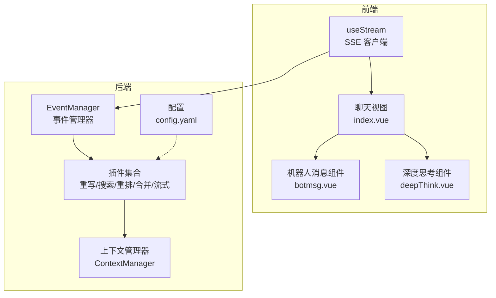
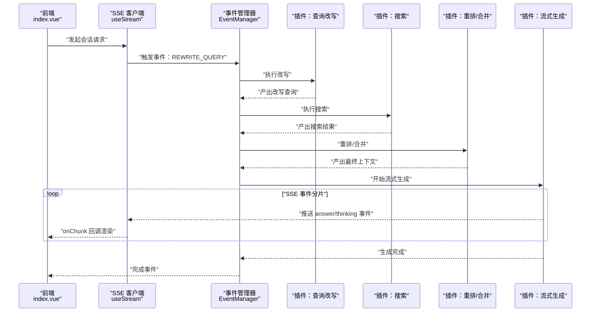
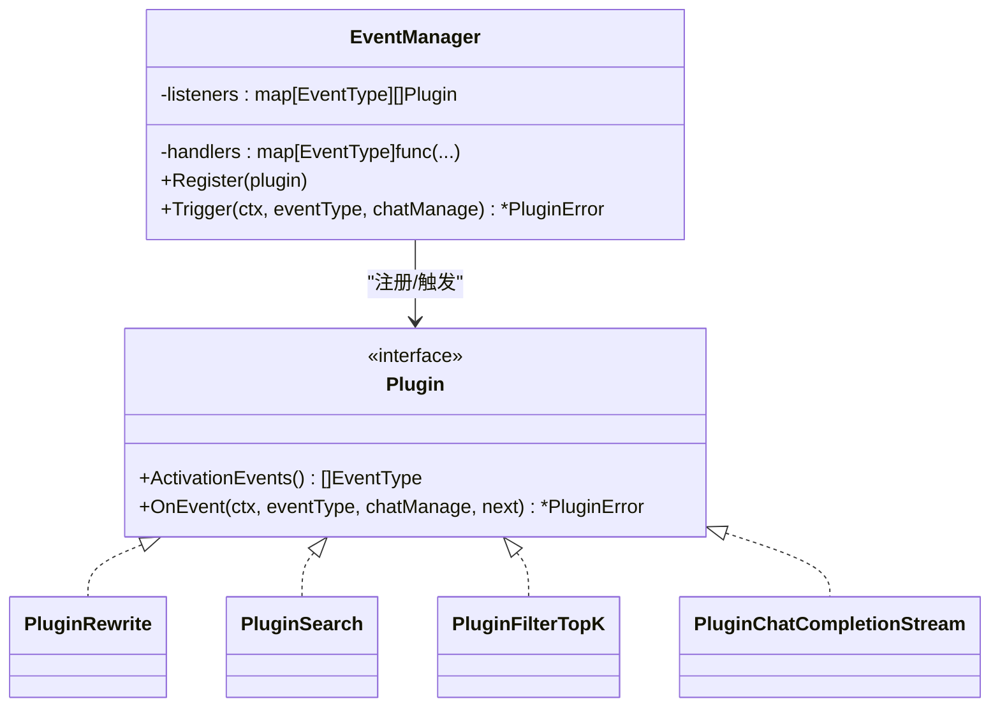
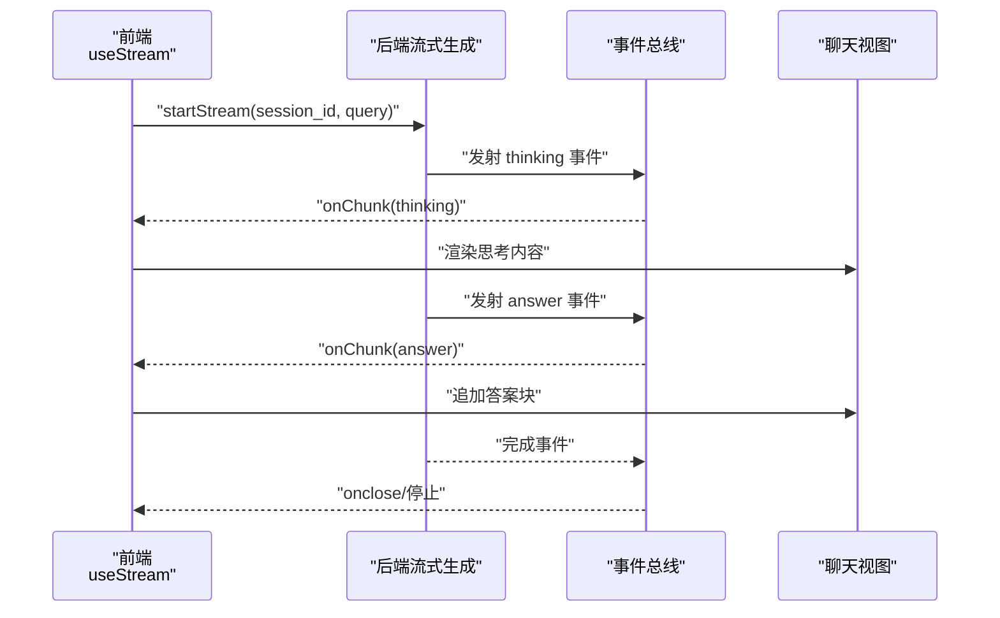
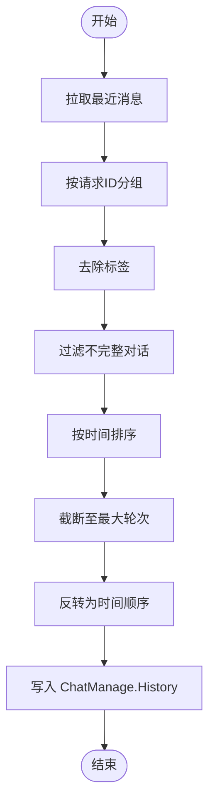
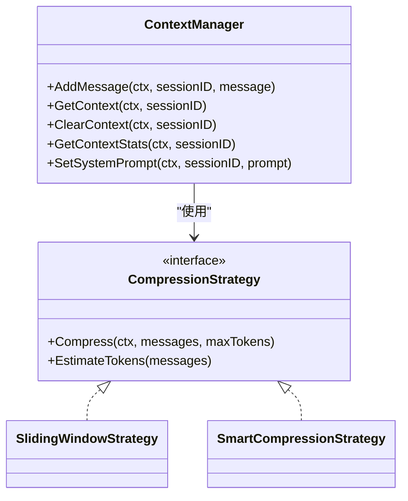
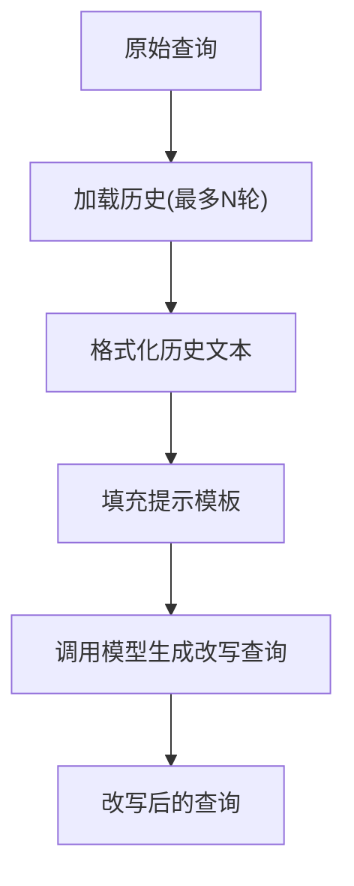
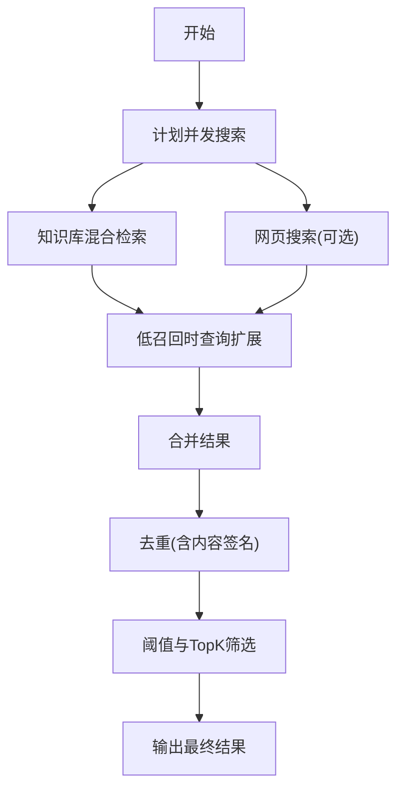
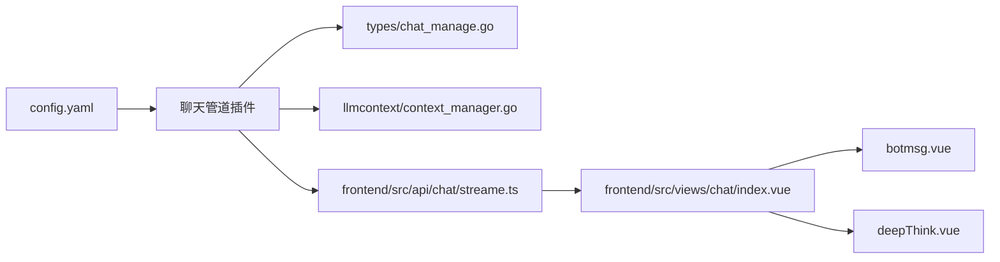

# 聊天管道系统

<cite>
**本文引用的文件**
- [chat_pipline.go](file://internal/application/service/chat_pipline/chat_pipline.go)
- [chat_completion_stream.go](file://internal/application/service/chat_pipline/chat_completion_stream.go)
- [load_history.go](file://internal/application/service/chat_pipline/load_history.go)
- [rewrite.go](file://internal/application/service/chat_pipline/rewrite.go)
- [search.go](file://internal/application/service/chat_pipline/search.go)
- [filter_top_k.go](file://internal/application/service/chat_pipline/filter_top_k.go)
- [context_manager.go](file://internal/application/service/llmcontext/context_manager.go)
- [compression_strategies.go](file://internal/application/service/llmcontext/compression_strategies.go)
- [streame.ts](file://frontend/src/api/chat/streame.ts)
- [index.vue](file://frontend/src/views/chat/index.vue)
- [botmsg.vue](file://frontend/src/views/chat/components/botmsg.vue)
- [deepThink.vue](file://frontend/src/views/chat/components/deepThink.vue)
- [config.yaml](file://config/config.yaml)
- [chat_manage.go](file://internal/types/chat_manage.go)
- [context_manager.go](file://internal/types/interfaces/context_manager.go)
</cite>

## 目录
1. [简介](#简介)
2. [项目结构](#项目结构)
3. [核心组件](#核心组件)
4. [架构总览](#架构总览)
5. [详细组件分析](#详细组件分析)
6. [依赖关系分析](#依赖关系分析)
7. [性能考量](#性能考量)
8. [故障排查指南](#故障排查指南)
9. [结论](#结论)
10. [附录](#附录)

## 简介
本技术文档面向聊天管道系统，系统以“插件化事件驱动”的方式实现从查询改写、检索增强、重排合并、上下文压缩到流式响应的完整链路。后端通过事件管理器编排多个插件（如查询改写、搜索、重排、合并、流式生成等），前端通过 SSE 客户端订阅事件，实现思考过程与答案的分片渲染与即时反馈。系统同时提供对话历史管理、上下文窗口管理与隐私保护机制，并给出性能优化与并发控制建议。

## 项目结构
系统采用分层设计：
- 类型与接口层：定义会话状态、事件类型、上下文管理接口等
- 应用服务层：实现聊天管道插件、检索、重排、合并、上下文管理等
- 前端视图层：负责 WebSocket/SSE 流式事件消费、消息渲染与交互

**图表来源**
- [streame.ts](file://frontend/src/api/chat/streame.ts#L1-L182)
- [index.vue](file://frontend/src/views/chat/index.vue#L1-L800)
- [chat_pipline.go](file://internal/application/service/chat_pipline/chat_pipline.go#L1-L141)
- [context_manager.go](file://internal/application/service/llmcontext/context_manager.go#L1-L208)
- [config.yaml](file://config/config.yaml#L1-L585)

**章节来源**
- [chat_manage.go](file://internal/types/chat_manage.go#L1-L185)
- [context_manager.go](file://internal/types/interfaces/context_manager.go#L1-L54)

## 核心组件
- 事件管理器与插件体系：通过统一的事件类型驱动各阶段处理，插件可按需注册与组合
- 查询改写：基于历史对话与提示模板，生成更利于检索的改写查询
- 检索与融合：并行执行知识库与网页搜索，支持查询扩展与去重
- 上下文压缩：滑动窗口与智能摘要两种策略，保障上下文窗口上限
- 流式响应：SSE 事件分片推送，前端按块渲染，支持思考过程与最终答案
- 历史管理：加载历史、去除思考标签、按轮次截断与排序
- 配置中心：集中管理对话轮次、阈值、重排与回退策略等

**章节来源**
- [chat_pipline.go](file://internal/application/service/chat_pipline/chat_pipline.go#L1-L141)
- [rewrite.go](file://internal/application/service/chat_pipline/rewrite.go#L1-L229)
- [search.go](file://internal/application/service/chat_pipline/search.go#L1-L693)
- [filter_top_k.go](file://internal/application/service/chat_pipline/filter_top_k.go#L1-L67)
- [context_manager.go](file://internal/application/service/llmcontext/context_manager.go#L1-L208)
- [compression_strategies.go](file://internal/application/service/llmcontext/compression_strategies.go#L1-L243)
- [streame.ts](file://frontend/src/api/chat/streame.ts#L1-L182)
- [index.vue](file://frontend/src/views/chat/index.vue#L1-L800)
- [config.yaml](file://config/config.yaml#L1-L585)

## 架构总览
聊天管道以“事件驱动 + 插件化”为核心，前端通过 SSE 订阅后端事件，后端在流水线中按阶段产生事件，前端逐块渲染，实现低延迟、可中断的流式体验。

**图表来源**
- [chat_pipline.go](file://internal/application/service/chat_pipline/chat_pipline.go#L1-L141)
- [rewrite.go](file://internal/application/service/chat_pipline/rewrite.go#L1-L229)
- [search.go](file://internal/application/service/chat_pipline/search.go#L1-L693)
- [chat_completion_stream.go](file://internal/application/service/chat_pipline/chat_completion_stream.go#L1-L198)
- [streame.ts](file://frontend/src/api/chat/streame.ts#L1-L182)
- [index.vue](file://frontend/src/views/chat/index.vue#L740-L800)

## 详细组件分析

### 事件管理器与插件体系
- 事件类型：包含加载历史、查询改写、搜索、重排、合并、进入聊天消息、聊天完成、流式聊天、流式过滤、TopK 过滤等
- 插件注册：通过事件管理器注册插件，构建事件链，按激活事件类型依次执行
- 错误模型：统一的插件错误封装，便于定位阶段与原因

**图表来源**
- [chat_pipline.go](file://internal/application/service/chat_pipline/chat_pipline.go#L1-L141)

**章节来源**
- [chat_pipline.go](file://internal/application/service/chat_pipline/chat_pipline.go#L1-L141)
- [chat_manage.go](file://internal/types/chat_manage.go#L133-L185)

### 流式响应处理机制
- 后端：在流式生成插件中启动独立上下文的模型调用，从通道读取响应，按类型区分思考与答案，持续发射事件
- 前端：SSE 客户端按块接收事件，注册 onChunk 处理器，逐块渲染；支持停止生成、继续流式、错误处理
- 思考渲染：后端将思考内容包裹在标签中，前端通过专用组件渲染与折叠

**图表来源**
- [chat_completion_stream.go](file://internal/application/service/chat_pipline/chat_completion_stream.go#L1-L198)
- [streame.ts](file://frontend/src/api/chat/streame.ts#L1-L182)
- [index.vue](file://frontend/src/views/chat/index.vue#L740-L800)
- [botmsg.vue](file://frontend/src/views/chat/components/botmsg.vue#L1-L574)
- [deepThink.vue](file://frontend/src/views/chat/components/deepThink.vue#L1-L195)

**章节来源**
- [chat_completion_stream.go](file://internal/application/service/chat_pipline/chat_completion_stream.go#L1-L198)
- [streame.ts](file://frontend/src/api/chat/streame.ts#L1-L182)
- [index.vue](file://frontend/src/views/chat/index.vue#L740-L800)
- [botmsg.vue](file://frontend/src/views/chat/components/botmsg.vue#L1-L574)
- [deepThink.vue](file://frontend/src/views/chat/components/deepThink.vue#L1-L195)

### 对话历史管理系统
- 加载历史：按最大轮次拉取最近消息，按请求 ID 分组，去除思考标签，过滤不完整对话，按时间排序并截断
- 隐私保护：在加载历史时移除思考标签，避免将内部推理过程暴露给前端
- 会话状态：通过会话 ID 与消息 ID 维护状态，支持继续流式

**图表来源**
- [load_history.go](file://internal/application/service/chat_pipline/load_history.go#L1-L127)

**章节来源**
- [load_history.go](file://internal/application/service/chat_pipline/load_history.go#L1-L127)
- [index.vue](file://frontend/src/views/chat/index.vue#L617-L686)

### 上下文窗口管理策略
- 上下文管理器：负责消息增删、压缩与持久化，支持多种存储后端
- 压缩策略：
  - 滑动窗口：保留系统消息与最近 N 条消息
  - 智能压缩：对旧消息做摘要，保留系统消息与近期消息
- 令牌估算：按字符粗估令牌数，结合阈值触发压缩

**图表来源**
- [context_manager.go](file://internal/application/service/llmcontext/context_manager.go#L1-L208)
- [compression_strategies.go](file://internal/application/service/llmcontext/compression_strategies.go#L1-L243)
- [context_manager.go](file://internal/types/interfaces/context_manager.go#L1-L54)

**章节来源**
- [context_manager.go](file://internal/application/service/llmcontext/context_manager.go#L1-L208)
- [compression_strategies.go](file://internal/application/service/llmcontext/compression_strategies.go#L1-L243)
- [context_manager.go](file://internal/types/interfaces/context_manager.go#L1-L54)

### 查询重写机制
- 基于历史对话与提示模板，生成更明确、可检索的改写查询
- 支持禁用改写、自定义系统/用户提示、最大轮次限制
- 重写完成后进入搜索阶段，提升召回质量

**图表来源**
- [rewrite.go](file://internal/application/service/chat_pipline/rewrite.go#L1-L229)

**章节来源**
- [rewrite.go](file://internal/application/service/chat_pipline/rewrite.go#L1-L229)
- [config.yaml](file://config/config.yaml#L27-L40)

### 检索与融合（含查询扩展）
- 并行搜索：知识库与网页搜索并发执行，支持本地查询扩展（停用词过滤、短语抽取、分段、去疑问词）
- 去重与合并：基于 ID/父块 ID/内容签名去重，合并历史命中
- TopK 与阈值：按阈值与 TopK 控制结果规模

**图表来源**
- [search.go](file://internal/application/service/chat_pipline/search.go#L1-L693)
- [filter_top_k.go](file://internal/application/service/chat_pipline/filter_top_k.go#L1-L67)

**章节来源**
- [search.go](file://internal/application/service/chat_pipline/search.go#L1-L693)
- [filter_top_k.go](file://internal/application/service/chat_pipline/filter_top_k.go#L1-L67)

## 依赖关系分析
- 类型与接口：会话状态、事件类型、上下文接口定义
- 配置：对话轮次、阈值、重排与回退策略
- 前后端通信：SSE 事件与前端渲染组件

**图表来源**
- [config.yaml](file://config/config.yaml#L1-L585)
- [chat_manage.go](file://internal/types/chat_manage.go#L1-L185)
- [context_manager.go](file://internal/application/service/llmcontext/context_manager.go#L1-L208)
- [streame.ts](file://frontend/src/api/chat/streame.ts#L1-L182)
- [index.vue](file://frontend/src/views/chat/index.vue#L1-L800)
- [botmsg.vue](file://frontend/src/views/chat/components/botmsg.vue#L1-L574)
- [deepThink.vue](file://frontend/src/views/chat/components/deepThink.vue#L1-L195)

**章节来源**
- [chat_manage.go](file://internal/types/chat_manage.go#L1-L185)
- [context_manager.go](file://internal/types/interfaces/context_manager.go#L1-L54)
- [config.yaml](file://config/config.yaml#L1-L585)

## 性能考量
- 并发与限流
  - 搜索阶段使用 WaitGroup 与互斥锁聚合结果，查询扩展阶段使用信号量限制并发作业数
  - 建议：根据 CPU/IO 资源动态调整并发上限，避免过度竞争
- 内存管理
  - 直接加载块数量限制，避免上下文溢出；滑动窗口与智能压缩策略降低内存占用
  - 建议：对大文档采用分页/分块处理，必要时启用智能摘要
- 延迟优化
  - 流式生成按块推送，前端即时渲染；思考与答案分离，减少首屏等待
  - 建议：对热点会话预热检索缓存，优化提示模板与模型参数
- 存储与 IO
  - 上下文存储可切换内存/Redis 等后端，结合压缩策略降低 IO 压力
  - 建议：对历史消息定期归档，清理过期会话

[本节为通用指导，不直接分析具体文件]

## 故障排查指南
- 事件链错误
  - 插件错误封装包含描述与类型，便于定位阶段与原因
- 流式连接
  - 前端捕获 SSE 错误并提示；后端在通道异常时发出错误事件
- 历史加载
  - 加载失败时跳过并继续后续流程；注意思考标签清理
- 搜索无结果
  - 低召回时触发查询扩展；若仍无结果，按回退策略返回默认响应

**章节来源**
- [chat_pipline.go](file://internal/application/service/chat_pipline/chat_pipline.go#L80-L141)
- [chat_completion_stream.go](file://internal/application/service/chat_pipline/chat_completion_stream.go#L110-L127)
- [load_history.go](file://internal/application/service/chat_pipline/load_history.go#L62-L69)
- [search.go](file://internal/application/service/chat_pipline/search.go#L244-L249)

## 结论
本系统通过事件驱动与插件化设计，实现了从查询改写、检索增强、上下文压缩到流式响应的完整闭环。前后端以 SSE 事件协作，前端按块渲染，兼顾低延迟与可读性。配合历史管理、隐私保护与上下文压缩策略，系统在可用性与性能间取得平衡。建议在生产环境中结合业务负载动态调整并发与阈值，并对热点路径进行缓存与预热。

## 附录
- 事件类型与流水线配置可参考类型定义与配置文件
- 前端渲染组件与安全处理逻辑可参考视图与组件文件

**章节来源**
- [chat_manage.go](file://internal/types/chat_manage.go#L152-L185)
- [config.yaml](file://config/config.yaml#L1-L585)
- [botmsg.vue](file://frontend/src/views/chat/components/botmsg.vue#L130-L170)
- [deepThink.vue](file://frontend/src/views/chat/components/deepThink.vue#L80-L92)