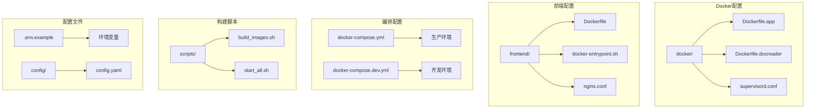
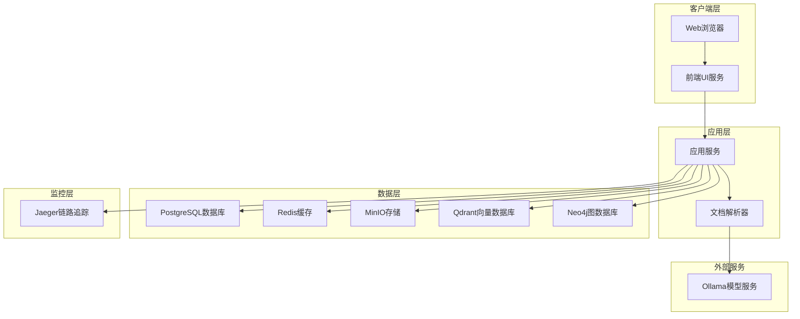
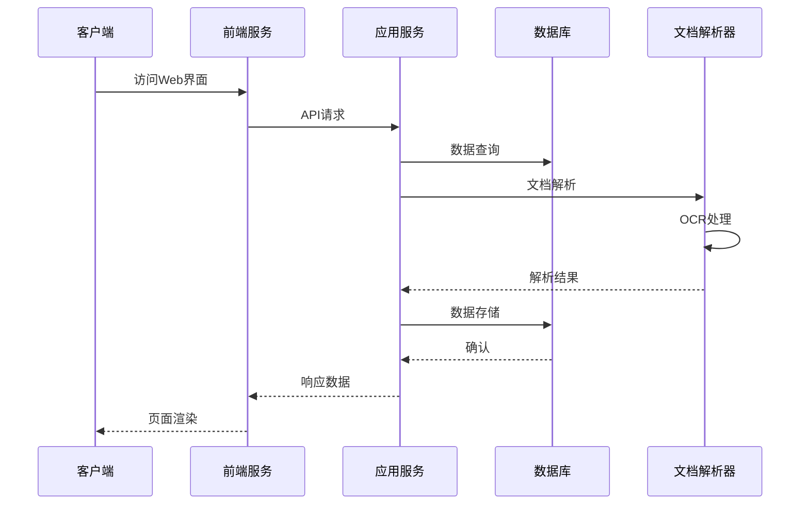
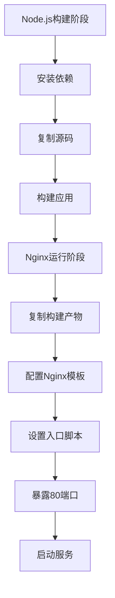
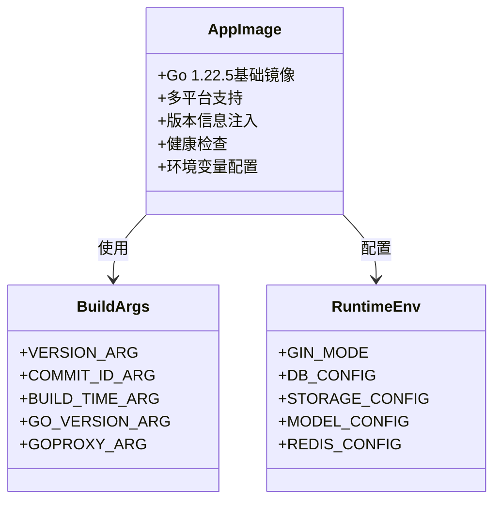
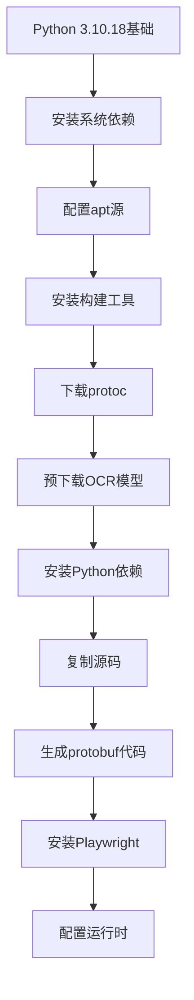
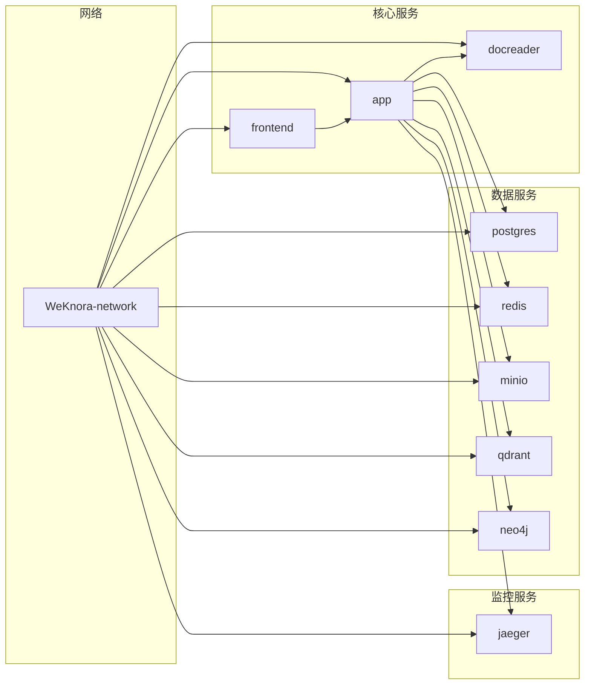
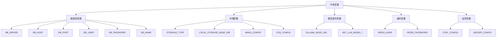
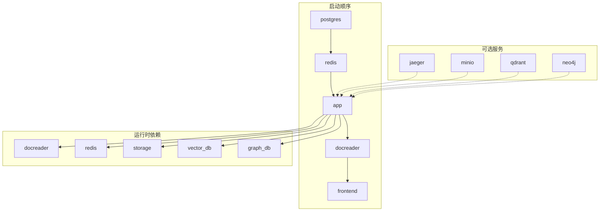

# Docker容器化部署

<cite>
**本文档引用的文件**
- [docker-compose.yml](file://docker-compose.yml)
- [docker-compose.dev.yml](file://docker-compose.dev.yml)
- [.env.example](file://.env.example)
- [frontend/Dockerfile](file://frontend/Dockerfile)
- [frontend/docker-entrypoint.sh](file://frontend/docker-entrypoint.sh)
- [docker/Dockerfile.docreader](file://docker/Dockerfile.docreader)
- [scripts/build_images.sh](file://scripts/build_images.sh)
- [scripts/start_all.sh](file://scripts/start_all.sh)
- [Makefile](file://Makefile)
- [cmd/server/main.go](file://cmd/server/main.go)
- [config/config.yaml](file://config/config.yaml)
</cite>

## 目录
1. [简介](#简介)
2. [项目结构](#项目结构)
3. [核心组件](#核心组件)
4. [架构概览](#架构概览)
5. [详细组件分析](#详细组件分析)
6. [依赖关系分析](#依赖关系分析)
7. [性能考虑](#性能考虑)
8. [故障排除指南](#故障排除指南)
9. [结论](#结论)
10. [附录](#附录)

## 简介

WiseDx是一个基于Docker容器化的智能知识库管理系统，提供了完整的医疗诊断报告分析能力。本指南详细介绍了如何使用Docker和docker-compose进行容器化部署，包括前端UI镜像、应用服务镜像和文档解析器镜像的构建配置。

系统采用微服务架构，包含多个相互协作的容器服务：前端Web界面、后端应用服务、文档解析服务、数据库、缓存系统、文件存储等。所有服务通过Docker网络进行通信，实现了高度的模块化和可扩展性。

## 项目结构

WiseDx的Docker容器化部署主要涉及以下关键目录和文件：



**图表来源**
- [docker-compose.yml](file://docker-compose.yml#L1-L271)
- [frontend/Dockerfile](file://frontend/Dockerfile#L1-L43)
- [docker/Dockerfile.docreader](file://docker/Dockerfile.docreader#L1-L161)

**章节来源**
- [docker-compose.yml](file://docker-compose.yml#L1-L271)
- [docker-compose.dev.yml](file://docker-compose.dev.yml#L1-L157)

## 核心组件

### 前端UI服务 (WeKnora-frontend)

前端服务使用Nginx作为静态文件服务器，提供React构建的应用程序。该服务支持动态配置注入，能够根据环境变量调整运行时行为。

**核心特性：**
- 基于Nginx的静态文件服务
- 动态配置注入机制
- 文件大小限制配置
- 多阶段构建优化

**章节来源**
- [frontend/Dockerfile](file://frontend/Dockerfile#L1-L43)
- [frontend/docker-entrypoint.sh](file://frontend/docker-entrypoint.sh#L1-L16)

### 应用服务 (WeKnora-app)

应用服务是系统的后端核心，基于Go语言开发，提供RESTful API接口和业务逻辑处理。该服务支持多种数据库驱动和存储后端。

**核心特性：**
- Gin框架驱动的HTTP服务
- 多数据库支持 (PostgreSQL, MySQL)
- 多向量存储支持 (PostgreSQL, Elasticsearch, Qdrant)
- 分布式缓存集成 (Redis)
- 链路追踪 (Jaeger)
- 文件存储集成 (MinIO, 腾讯云COS)

**章节来源**
- [cmd/server/main.go](file://cmd/server/main.go#L1-L193)

### 文档解析器服务 (WeKnora-docreader)

文档解析器专门处理各种格式文档的解析和OCR识别，支持PDF、Word、Excel、图像等多种格式。

**核心特性：**
- 多格式文档解析支持
- OCR文字识别 (PaddleOCR)
- 图像处理和分析
- gRPC接口服务
- Playwright浏览器自动化

**章节来源**
- [docker/Dockerfile.docreader](file://docker/Dockerfile.docreader#L1-L161)

## 架构概览

WiseDx采用多层微服务架构，各服务通过Docker网络进行通信：



**图表来源**
- [docker-compose.yml](file://docker-compose.yml#L1-L271)

### 服务间依赖关系



**图表来源**
- [docker-compose.yml](file://docker-compose.yml#L13-L16)
- [docker-compose.yml](file://docker-compose.yml#L108-L114)

## 详细组件分析

### 前端Docker镜像构建

前端服务采用多阶段构建策略，第一阶段使用Node.js构建应用程序，第二阶段使用Nginx提供静态文件服务。



**图表来源**
- [frontend/Dockerfile](file://frontend/Dockerfile#L1-L43)

**构建配置要点：**
- 使用Node.js 24-alpine作为构建基础镜像
- 通过环境变量控制文件大小限制
- Nginx配置模板支持动态替换
- 多阶段构建减少镜像体积

**章节来源**
- [frontend/Dockerfile](file://frontend/Dockerfile#L1-L43)
- [frontend/docker-entrypoint.sh](file://frontend/docker-entrypoint.sh#L1-L16)

### 应用服务Docker镜像构建

应用服务使用Go语言编译，支持多平台构建和版本信息注入。



**图表来源**
- [scripts/build_images.sh](file://scripts/build_images.sh#L126-L155)

**构建流程：**
1. 检测系统平台和架构
2. 获取版本信息 (版本号、提交ID、构建时间)
3. 设置Go代理和构建参数
4. 编译Go应用程序
5. 创建运行时环境

**章节来源**
- [scripts/build_images.sh](file://scripts/build_images.sh#L126-L155)
- [Makefile](file://Makefile#L96-L106)

### 文档解析器Docker镜像构建

文档解析器服务专门处理文档解析和OCR任务，支持多种文档格式和图像处理。



**图表来源**
- [docker/Dockerfile.docreader](file://docker/Dockerfile.docreader#L1-L161)

**核心功能：**
- 支持PDF、Word、Excel、图像等多格式文档
- 集成PaddleOCR进行文字识别
- Playwright支持网页内容抓取
- gRPC接口提供统一服务

**章节来源**
- [docker/Dockerfile.docreader](file://docker/Dockerfile.docreader#L1-L161)

### docker-compose配置详解

docker-compose文件定义了完整的微服务架构，包含所有必要服务的配置。



**图表来源**
- [docker-compose.yml](file://docker-compose.yml#L260-L271)

**网络配置：**
- 创建专用Docker网络 `WeKnora-network`
- 所有服务都在同一网络中通信
- 支持服务发现和内部DNS解析

**健康检查配置：**
- 应用服务: HTTP健康检查 `/health`
- 文档解析器: gRPC健康检查
- PostgreSQL: pg_isready检查
- MinIO: 健康检查端点

**章节来源**
- [docker-compose.yml](file://docker-compose.yml#L1-L271)

## 依赖关系分析

### 环境变量配置

系统通过环境变量实现配置管理，支持多种部署场景：



**图表来源**
- [.env.example](file://.env.example#L1-L175)

### 服务依赖图



**图表来源**
- [docker-compose.yml](file://docker-compose.yml#L13-L16)
- [docker-compose.yml](file://docker-compose.yml#L108-L114)

**章节来源**
- [.env.example](file://.env.example#L1-L175)

## 性能考虑

### 资源优化策略

1. **镜像大小优化**
   - 使用多阶段构建减少最终镜像体积
   - Alpine Linux基础镜像减少系统开销
   - 仅包含运行时必需的依赖

2. **内存和CPU优化**
   - 前端服务使用Nginx静态文件服务
   - 应用服务配置适当的并发池大小
   - 缓存层使用Redis减少数据库压力

3. **存储优化**
   - 文件存储支持本地和云存储
   - 向量数据库配置合适的索引策略
   - 数据库连接池优化

### 性能调优建议

- **并发配置**: 根据硬件资源调整 `CONCURRENCY_POOL_SIZE`
- **缓存策略**: 合理配置Redis连接数和过期时间
- **数据库优化**: 根据查询模式优化索引和连接池
- **存储配置**: 选择合适的存储后端和分片策略

## 故障排除指南

### 常见部署问题

#### 1. Docker环境问题

**问题**: Docker服务无法启动
**解决方案**:
```bash
# 检查Docker状态
sudo systemctl status docker

# 重启Docker服务
sudo systemctl restart docker

# 检查Docker权限
sudo usermod -aG docker $USER
```

#### 2. 端口冲突

**问题**: 端口被占用导致服务启动失败
**解决方案**:
```bash
# 检查端口使用情况
netstat -tulpn | grep ':80\|:8080\|:50051'

# 修改端口配置
export FRONTEND_PORT=8080
export APP_PORT=8081
export DOCREADER_PORT=50052
```

#### 3. 网络连接问题

**问题**: 服务间无法通信
**解决方案**:
```bash
# 检查网络连接
docker network ls
docker inspect weknora_weknoranetwork

# 重启网络
docker-compose down
docker-compose up -d
```

#### 4. 数据库连接问题

**问题**: 应用服务无法连接数据库
**解决方案**:
```bash
# 检查数据库状态
docker-compose ps postgres

# 验证数据库配置
docker-compose exec postgres psql -U postgres -c "SELECT 1;"

# 检查网络连通性
docker-compose exec app ping postgres
```

#### 5. 文档解析器问题

**问题**: 文档解析失败或OCR识别错误
**解决方案**:
```bash
# 检查文档解析器状态
docker-compose ps docreader

# 查看解析器日志
docker-compose logs docreader

# 验证OCR模型
docker-compose exec docreader ls -la /root/.paddleocr/whl/
```

### 调试工具和技巧

1. **查看服务状态**
```bash
docker-compose ps
docker-compose logs --follow app
```

2. **进入容器调试**
```bash
docker-compose exec app bash
docker-compose exec postgres psql -U postgres
```

3. **网络诊断**
```bash
docker-compose exec app ping docreader
docker-compose exec app nslookup postgres
```

**章节来源**
- [scripts/start_all.sh](file://scripts/start_all.sh#L496-L566)

## 结论

WiseDx的Docker容器化部署提供了完整的微服务架构解决方案，具有以下优势：

1. **模块化设计**: 每个服务独立部署，便于维护和扩展
2. **配置灵活**: 通过环境变量实现不同环境的快速切换
3. **监控完善**: 集成Jaeger链路追踪和健康检查
4. **存储多样**: 支持多种存储后端和数据库
5. **开发友好**: 提供开发和生产两种配置模式

通过遵循本指南的部署步骤和最佳实践，可以快速搭建稳定可靠的WiseDx系统。建议在生产环境中根据实际需求调整资源配置和服务规模。

## 附录

### 部署步骤清单

1. **环境准备**
   - 安装Docker和Docker Compose
   - 准备`.env`配置文件
   - 确保端口可用

2. **镜像构建**
   ```bash
   # 方式1: 使用现有镜像
   docker-compose pull
   docker-compose up -d
   
   # 方式2: 从源码构建
   ./scripts/build_images.sh --all
   ```

3. **服务启动**
   ```bash
   ./scripts/start_all.sh --all
   ```

4. **验证部署**
   ```bash
   # 检查服务状态
   docker-compose ps
   
   # 访问Web界面
   http://localhost:80
   
   # 检查API健康
   curl http://localhost:8080/health
   ```

### 快速参考

- **默认端口**: 前端80, 应用8080, 文档解析器50051
- **默认数据库**: PostgreSQL (postgres:5432)
- **默认存储**: 本地存储 (/data/files)
- **默认缓存**: Redis (redis:6379)
- **默认向量数据库**: Qdrant (qdrant:6333)