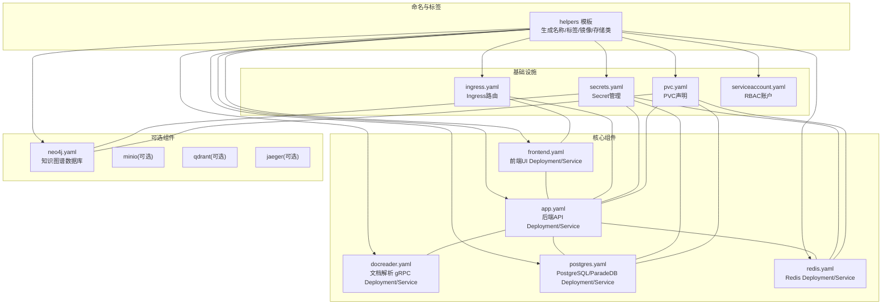
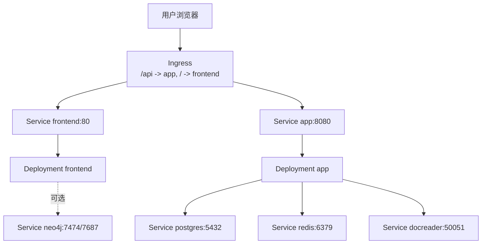
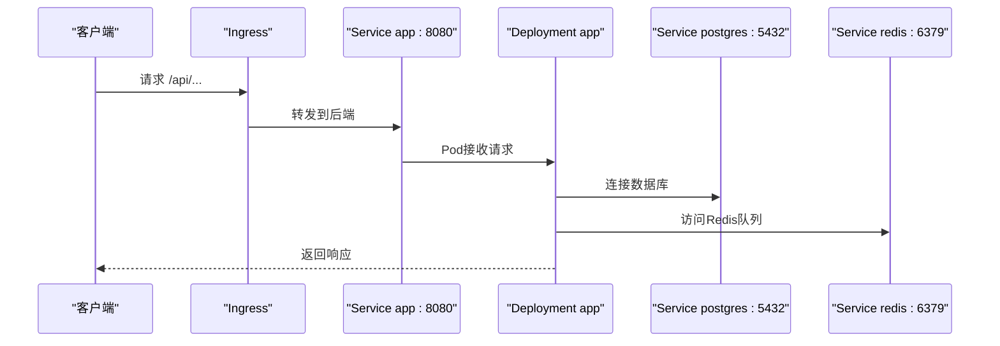
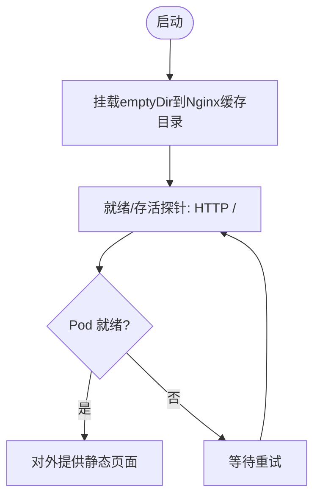
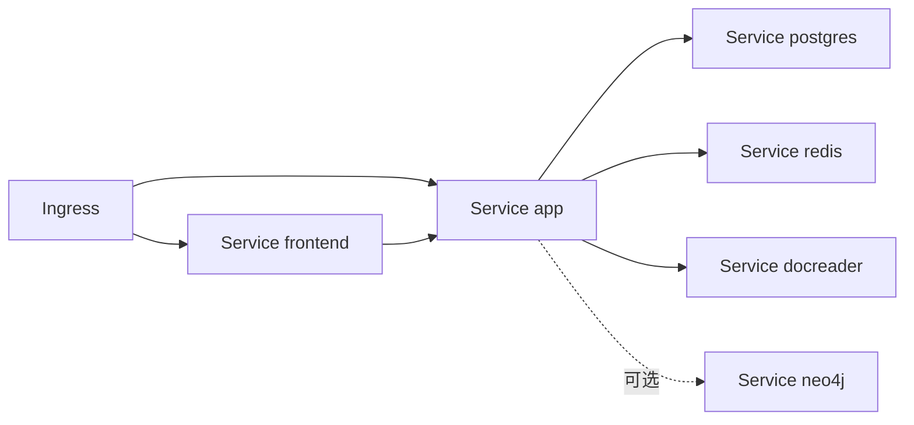

# Kubernetes集群部署

<cite>
**本文引用的文件**
- [Chart.yaml](file://helm/Chart.yaml)
- [values.yaml](file://helm/values.yaml)
- [README.md](file://helm/README.md)
- [_helpers.tpl](file://helm/templates/_helpers.tpl)
- [app.yaml](file://helm/templates/app.yaml)
- [frontend.yaml](file://helm/templates/frontend.yaml)
- [docreader.yaml](file://helm/templates/docreader.yaml)
- [postgres.yaml](file://helm/templates/postgres.yaml)
- [redis.yaml](file://helm/templates/redis.yaml)
- [neo4j.yaml](file://helm/templates/neo4j.yaml)
- [ingress.yaml](file://helm/templates/ingress.yaml)
- [secrets.yaml](file://helm/templates/secrets.yaml)
- [pvc.yaml](file://helm/templates/pvc.yaml)
- [serviceaccount.yaml](file://helm/templates/serviceaccount.yaml)
- [NOTES.txt](file://helm/templates/NOTES.txt)
</cite>

## 目录
1. [简介](#简介)
2. [项目结构](#项目结构)
3. [核心组件](#核心组件)
4. [架构总览](#架构总览)
5. [详细组件分析](#详细组件分析)
6. [依赖关系分析](#依赖关系分析)
7. [性能与资源规划](#性能与资源规划)
8. [部署与配置指南](#部署与配置指南)
9. [环境差异化配置](#环境差异化配置)
10. [滚动更新、回滚与扩缩容](#滚动更新-回滚与扩缩容)
11. [故障排查](#故障排查)
12. [结论](#结论)

## 简介
本指南面向在Kubernetes集群中部署WiseDx（WeKnora）平台，基于Helm Chart完成后端API、前端UI、文档解析器、数据库与缓存等组件的一键安装与运维。文档覆盖Chart元数据、values.yaml参数、各模板文件职责、Ingress与Secret管理、PVC持久化、以及不同环境（开发/测试/生产）的配置策略，并提供滚动更新、回滚与扩缩容的最佳实践。

## 项目结构
Helm Chart位于helm目录，采用“按组件拆分模板”的结构：每个核心组件一个Deployment与Service，配合可选组件（如Neo4j、MinIO、Qdrant、Jaeger）与共享的全局参数、命名约定、安全上下文、PVC声明等。

图表来源
- [Chart.yaml](file://helm/Chart.yaml#L1-L27)
- [_helpers.tpl](file://helm/templates/_helpers.tpl#L1-L196)
- [app.yaml](file://helm/templates/app.yaml#L1-L189)
- [frontend.yaml](file://helm/templates/frontend.yaml#L1-L108)
- [docreader.yaml](file://helm/templates/docreader.yaml#L1-L103)
- [postgres.yaml](file://helm/templates/postgres.yaml#L1-L129)
- [redis.yaml](file://helm/templates/redis.yaml#L1-L125)
- [neo4j.yaml](file://helm/templates/neo4j.yaml#L1-L137)
- [ingress.yaml](file://helm/templates/ingress.yaml#L1-L53)
- [secrets.yaml](file://helm/templates/secrets.yaml#L1-L38)
- [pvc.yaml](file://helm/templates/pvc.yaml#L1-L82)
- [serviceaccount.yaml](file://helm/templates/serviceaccount.yaml#L1-L25)

章节来源
- [Chart.yaml](file://helm/Chart.yaml#L1-L27)
- [values.yaml](file://helm/values.yaml#L1-L489)
- [README.md](file://helm/README.md#L1-L327)

## 核心组件
- 后端API（App）
  - 部署策略：滚动更新；健康检查为HTTP /health
  - 依赖：PostgreSQL（ParadeDB）、Redis、可选Neo4j、本地文件存储PVC
  - 环境变量：数据库、Redis、JWT、存储类型、并发池、GraphRAG开关等
- 前端UI（Frontend）
  - 部署策略：滚动更新；健康检查为HTTP /
  - 通过Nginx对外提供静态页面；需要临时目录写入权限
- 文档解析器（DocReader）
  - gRPC服务；健康检查使用grpc_health_probe
- 数据库（PostgreSQL/ParadeDB）
  - 重建式部署策略，避免数据损坏；健康检查使用pg_isready
- 缓存（Redis）
  - 重建式部署策略；健康检查使用redis-cli ping
- 可选组件
  - Neo4j：GraphRAG知识图谱；MinIO/Qdrant/Jaeger按需启用

章节来源
- [app.yaml](file://helm/templates/app.yaml#L1-L189)
- [frontend.yaml](file://helm/templates/frontend.yaml#L1-L108)
- [docreader.yaml](file://helm/templates/docreader.yaml#L1-L103)
- [postgres.yaml](file://helm/templates/postgres.yaml#L1-L129)
- [redis.yaml](file://helm/templates/redis.yaml#L1-L125)
- [neo4j.yaml](file://helm/templates/neo4j.yaml#L1-L137)

## 架构总览
下图展示从Ingress到各组件的请求路径与依赖关系。

图表来源
- [ingress.yaml](file://helm/templates/ingress.yaml#L1-L53)
- [frontend.yaml](file://helm/templates/frontend.yaml#L1-L108)
- [app.yaml](file://helm/templates/app.yaml#L1-L189)
- [postgres.yaml](file://helm/templates/postgres.yaml#L1-L129)
- [redis.yaml](file://helm/templates/redis.yaml#L1-L125)
- [docreader.yaml](file://helm/templates/docreader.yaml#L1-L103)
- [neo4j.yaml](file://helm/templates/neo4j.yaml#L1-L137)

## 详细组件分析

### 应用部署（后端API）
- 滚动更新策略：maxSurge=1, maxUnavailable=0，确保零停机
- 健康检查：/health（HTTP），初始延迟与周期可调
- 环境变量来源：Secret（DB_USER/PASSWORD/NAME、REDIS_PASSWORD、JWT_SECRET、TENANT_AES_KEY），可选Neo4j凭据
- 存储：挂载PVC /data/files，支持外部S3/本地存储类型切换
- 依赖服务：postgres、redis、docreader（gRPC）

图表来源
- [app.yaml](file://helm/templates/app.yaml#L1-L189)
- [postgres.yaml](file://helm/templates/postgres.yaml#L1-L129)
- [redis.yaml](file://helm/templates/redis.yaml#L1-L125)

章节来源
- [app.yaml](file://helm/templates/app.yaml#L1-L189)
- [values.yaml](file://helm/values.yaml#L53-L140)

### 前端部署（Web UI）
- 滚动更新策略：maxSurge=1, maxUnavailable=0
- 健康检查：/（HTTP）
- 临时目录：/var/cache/nginx、/var/run（emptyDir）
- 服务名固定为frontend，供Ingress引用

图表来源
- [frontend.yaml](file://helm/templates/frontend.yaml#L1-L108)

章节来源
- [frontend.yaml](file://helm/templates/frontend.yaml#L1-L108)
- [values.yaml](file://helm/values.yaml#L144-L187)

### 文档解析器（gRPC）
- gRPC健康检查：grpc_health_probe
- 服务端口：50051
- 仅在后端启用时生效

章节来源
- [docreader.yaml](file://helm/templates/docreader.yaml#L1-L103)
- [values.yaml](file://helm/values.yaml#L191-L237)

### 数据库（PostgreSQL/ParadeDB）
- 部署策略：Recreate，避免多副本同时写入导致数据损坏
- 健康检查：pg_isready
- PVC默认10Gi，可配置storageClass与大小
- 服务名固定为postgres

章节来源
- [postgres.yaml](file://helm/templates/postgres.yaml#L1-L129)
- [values.yaml](file://helm/values.yaml#L241-L283)

### 缓存（Redis）
- 部署策略：Recreate
- 健康检查：redis-cli -a $REDIS_PASSWORD ping
- PVC默认1Gi，支持外部密钥注入

章节来源
- [redis.yaml](file://helm/templates/redis.yaml#L1-L125)
- [values.yaml](file://helm/values.yaml#L287-L329)

### 知识图谱（Neo4j，可选）
- 当启用时，后端自动注入NEO4J_URI/用户名密码
- 健康检查：HTTP /
- PVC默认10Gi

章节来源
- [neo4j.yaml](file://helm/templates/neo4j.yaml#L1-L137)
- [values.yaml](file://helm/values.yaml#L423-L468)

### Ingress（外部访问）
- 默认禁用；启用后将 /api 路由到后端，/ 路由到前端
- 支持TLS与注解（如代理超时、body大小限制）
- 支持自定义ingressClassName

章节来源
- [ingress.yaml](file://helm/templates/ingress.yaml#L1-L53)
- [values.yaml](file://helm/values.yaml#L345-L370)

### Secret管理
- 默认在安装时创建；生产建议使用existingSecret或外部密管
- 包含DB_USER/PASSWORD/NAME、REDIS_PASSWORD、JWT_SECRET、TENANT_AES_KEY、可选NEO4J_USERNAME/PASSWORD

章节来源
- [secrets.yaml](file://helm/templates/secrets.yaml#L1-L38)
- [values.yaml](file://helm/values.yaml#L382-L399)

### PVC持久化
- 自动为PostgreSQL、Redis、Neo4j、数据文件目录创建PVC
- 支持指定storageClass与容量；可复用现有PVC

章节来源
- [pvc.yaml](file://helm/templates/pvc.yaml#L1-L82)
- [values.yaml](file://helm/values.yaml#L266-L341)

### ServiceAccount与RBAC
- 可创建独立SA，支持注解与标签
- 默认不自动挂载API Token

章节来源
- [serviceaccount.yaml](file://helm/templates/serviceaccount.yaml#L1-L25)
- [values.yaml](file://helm/values.yaml#L38-L49)

## 依赖关系分析
- 组件耦合
  - app对postgres、redis、docreader存在硬性依赖
  - frontend依赖app提供的API
  - ingress依赖frontend与app的Service
  - 可选neo4j与app联动（GraphRAG）
- 外部依赖
  - Ingress控制器（nginx-ingress推荐）
  - 存储类（storageClass）与PV提供者
  - 私有镜像仓库的imagePullSecrets

图表来源
- [ingress.yaml](file://helm/templates/ingress.yaml#L1-L53)
- [frontend.yaml](file://helm/templates/frontend.yaml#L1-L108)
- [app.yaml](file://helm/templates/app.yaml#L1-L189)
- [postgres.yaml](file://helm/templates/postgres.yaml#L1-L129)
- [redis.yaml](file://helm/templates/redis.yaml#L1-L125)
- [docreader.yaml](file://helm/templates/docreader.yaml#L1-L103)
- [neo4j.yaml](file://helm/templates/neo4j.yaml#L1-L137)

## 性能与资源规划
- CPU/内存建议
  - 生产环境建议提升后端CPU请求至500m以上、内存至1Gi以上，并根据并发池与模型规模调整上限
  - Redis与PostgreSQL可根据数据量与查询负载适当扩容
- 存储
  - PostgreSQL/Redis/Neo4j默认容量较小，生产建议按数据规模与备份策略提升
  - 数据文件目录PVC建议与业务峰值上传量匹配
- 网络
  - Ingress注解已包含代理超时与body大小限制，满足大文件上传场景
- 安全
  - 全局containerSecurityContext禁止提权；建议结合PodSecurity标准与网络策略

章节来源
- [values.yaml](file://helm/values.yaml#L68-L77)
- [values.yaml](file://helm/values.yaml#L113-L119)
- [values.yaml](file://helm/values.yaml#L251-L259)
- [values.yaml](file://helm/values.yaml#L297-L305)
- [values.yaml](file://helm/values.yaml#L439-L446)
- [ingress.yaml](file://helm/templates/ingress.yaml#L364-L369)

## 部署与配置指南

### 安装前准备
- 准备私有镜像仓库的imagePullSecrets（如适用）
- 准备storageClass（若未设置全局storageClass）
- 准备TLS证书与Secret（如启用Ingress TLS）

### 基础安装（最小可用）
- 创建命名空间并安装，设置数据库、Redis、JWT密钥
- 示例命令参见README快速开始与生产安装章节

章节来源
- [README.md](file://helm/README.md#L23-L34)
- [README.md](file://helm/README.md#L61-L101)
- [README.md](file://helm/README.md#L102-L142)

### Ingress配置
- 启用ingress.enabled，设置host与TLS secretName
- 如需HTTPS，提前创建tls secret

章节来源
- [values.yaml](file://helm/values.yaml#L345-L370)
- [ingress.yaml](file://helm/templates/ingress.yaml#L21-L31)

### Secret管理最佳实践
- 生产环境必须使用existingSecret或外部密管（如External Secrets Operator、Sealed Secrets）
- 不要在Git中提交任何密钥

章节来源
- [secrets.yaml](file://helm/templates/secrets.yaml#L7-L12)
- [values.yaml](file://helm/values.yaml#L373-L381)

### ConfigMap与额外环境变量
- 通过app.extraEnv添加外部LLM（如Ollama）地址与初始化模型名
- 其他运行时参数可通过extraEnv扩展

章节来源
- [values.yaml](file://helm/values.yaml#L102-L106)
- [README.md](file://helm/README.md#L87-L101)

### 扩展组件
- MinIO：启用S3兼容对象存储
- Neo4j：启用GraphRAG，需设置密码并开启ENABLE_GRAPH_RAG
- Qdrant：替代PostgreSQL作为向量存储（需调整检索驱动）
- Jaeger：启用分布式追踪

章节来源
- [values.yaml](file://helm/values.yaml#L406-L420)
- [values.yaml](file://helm/values.yaml#L423-L468)
- [values.yaml](file://helm/values.yaml#L471-L481)
- [values.yaml](file://helm/values.yaml#L483-L489)

## 环境差异化配置

### 开发环境
- 关闭ingress，使用kubectl port-forward访问
- 使用默认资源与较小PVC
- 可启用MinIO/Qdrant进行功能验证

章节来源
- [README.md](file://helm/README.md#L28-L35)
- [values.yaml](file://helm/values.yaml#L345-L370)

### 测试环境
- 启用ingress与TLS
- 设置合理的资源请求/限制与PVC大小
- 可启用Neo4j验证GraphRAG流程

章节来源
- [README.md](file://helm/README.md#L72-L86)
- [values.yaml](file://helm/values.yaml#L121-L131)

### 生产环境
- 使用values-production.yaml示例，提升副本数与资源
- 使用existingSecret集中管理密钥
- 明确storageClass与备份策略

章节来源
- [README.md](file://helm/README.md#L102-L142)
- [values.yaml](file://helm/values.yaml#L108-L134)

## 滚动更新、回滚与扩缩容

### 滚动更新
- 所有工作负载均采用RollingUpdate策略，maxSurge=1，maxUnavailable=0，保证无损升级
- 更新镜像版本或环境变量后，执行helm upgrade即可

章节来源
- [app.yaml](file://helm/templates/app.yaml#L20-L25)
- [frontend.yaml](file://helm/templates/frontend.yaml#L20-L25)
- [docreader.yaml](file://helm/templates/docreader.yaml#L20-L25)

### 回滚
- 使用helm rollback进行快速回滚
- 建议保留历史版本以便回滚

章节来源
- [README.md](file://helm/README.md#L265-L271)

### 扩缩容
- 通过修改replicaCount实现水平扩展
- 对于状态集组件（PostgreSQL/Redis/Neo4j）采用Recreate策略，需评估停机窗口

章节来源
- [values.yaml](file://helm/values.yaml#L57-L58)
- [values.yaml](file://helm/values.yaml#L148-L149)
- [values.yaml](file://helm/values.yaml#L195-L196)
- [postgres.yaml](file://helm/templates/postgres.yaml#L21-L24)
- [redis.yaml](file://helm/templates/redis.yaml#L21-L24)
- [neo4j.yaml](file://helm/templates/neo4j.yaml#L22-L25)

## 故障排查
- Pod处于Pending
  - 检查PVC是否绑定、storageClass是否存在
- 连接被拒绝
  - 等待所有Pod就绪；检查Service Endpoints
- 数据库连接失败
  - 校验Secret中的DB_USER/PASSWORD/NAME是否正确；查看PostgreSQL日志
- 日志查看
  - 后端：-l app.kubernetes.io/component=app
  - 前端：-l app.kubernetes.io/component=frontend

章节来源
- [README.md](file://helm/README.md#L282-L311)
- [NOTES.txt](file://helm/templates/NOTES.txt#L135-L141)

## 结论
本Helm Chart提供了WiseDx在Kubernetes上的标准化部署方案，涵盖核心组件、可选组件、安全与持久化策略。通过values.yaml与模板的组合，可在不同环境中灵活配置，并遵循滚动更新、回滚与扩缩容的最佳实践，确保系统稳定与可维护性。