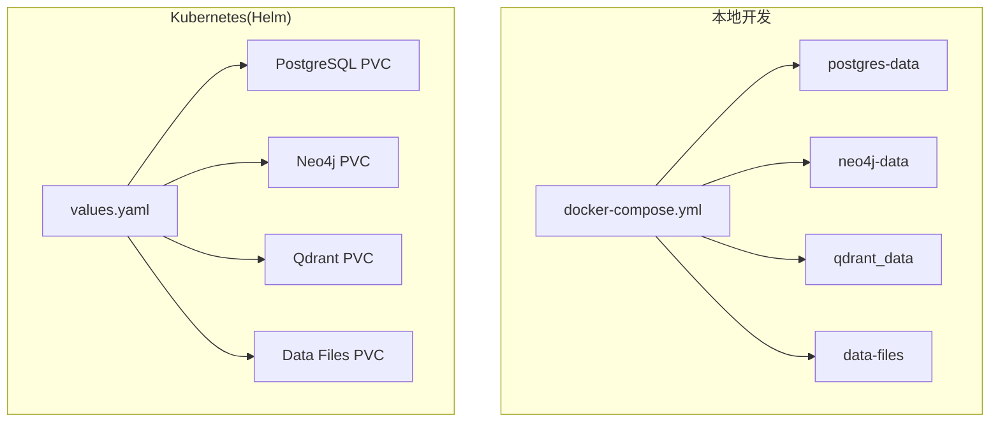
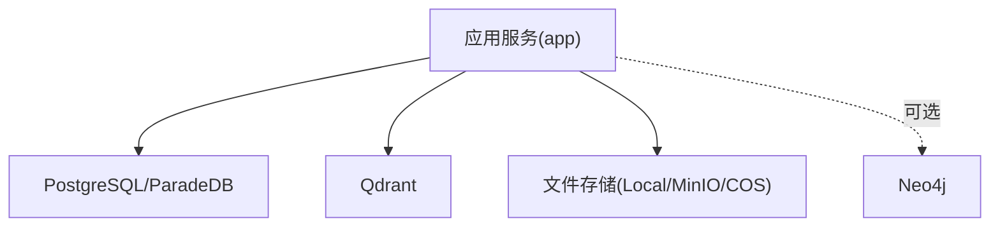
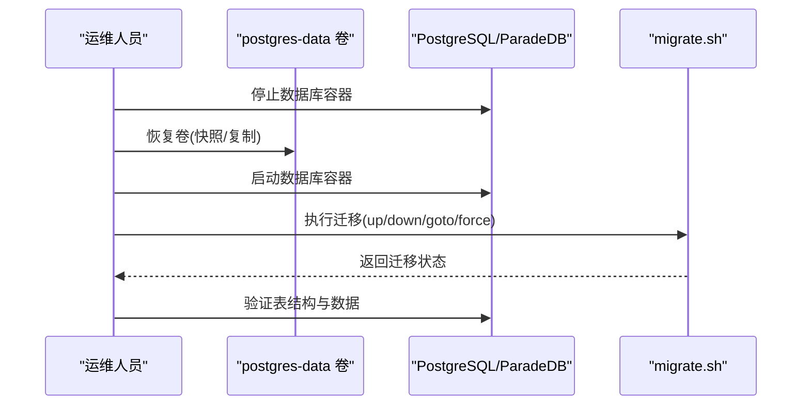
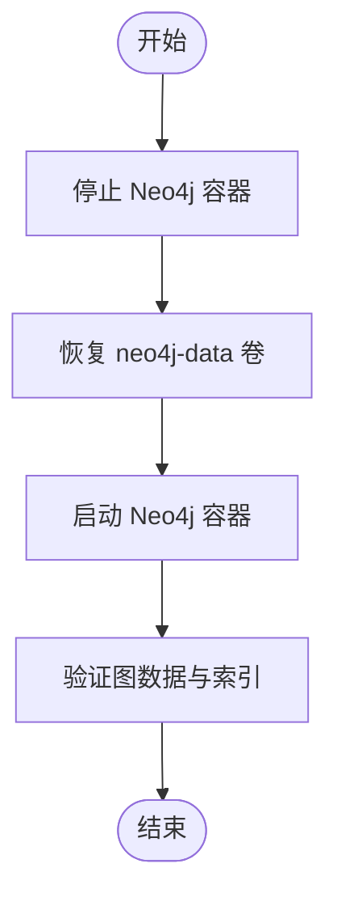
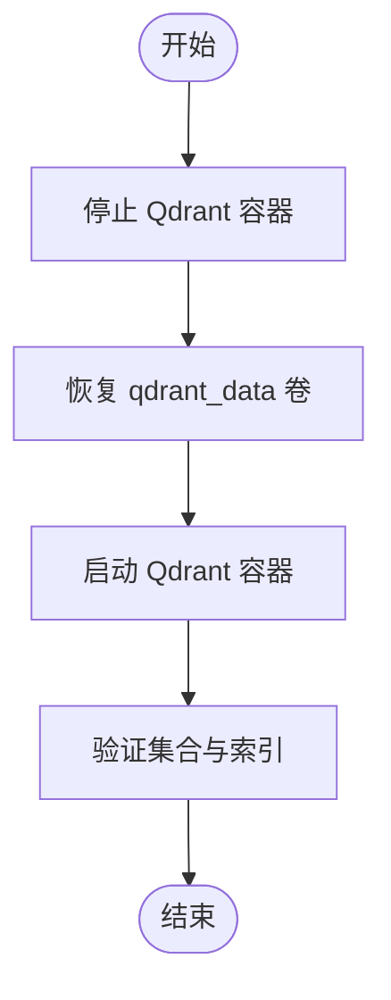
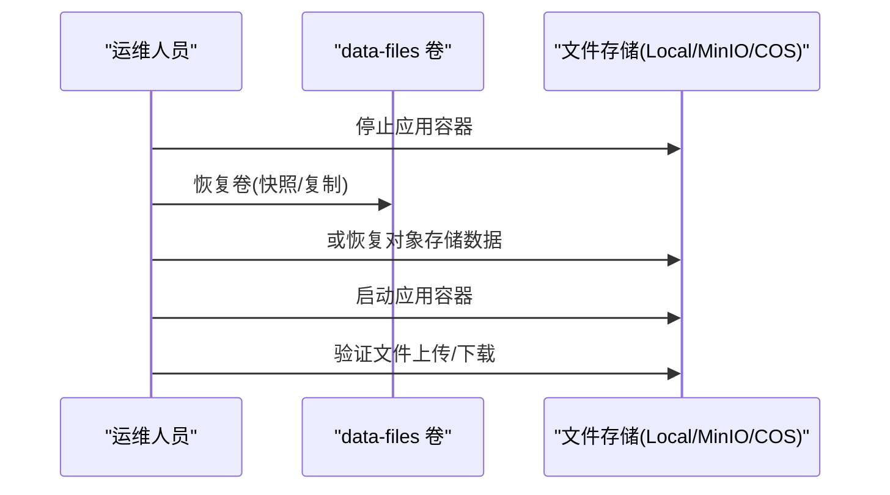
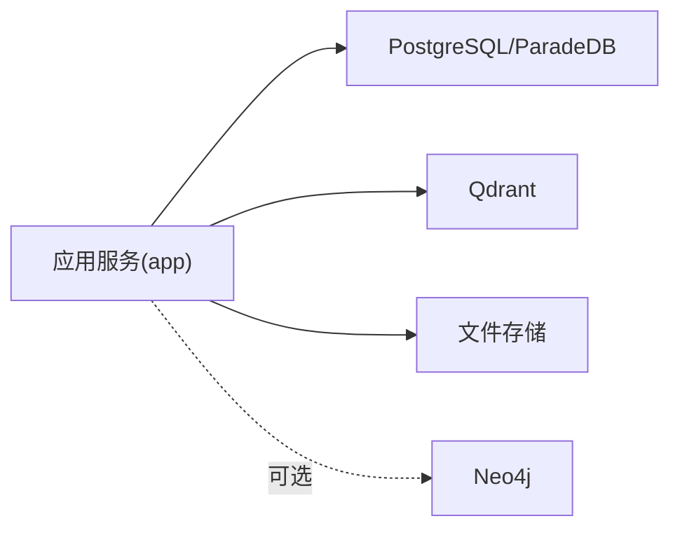

# 备份与恢复

<cite>
**本文引用的文件**
- [docker-compose.yml](file://docker-compose.yml)
- [values.yaml](file://helm/values.yaml)
- [config.go](file://internal/config/config.go)
- [config.yaml](file://config/config.yaml)
- [000000_init.up.sql](file://migrations/versioned/000000_init.up.sql)
- [00-init-db.sql](file://migrations/paradedb/00-init-db.sql)
- [migrate.sh](file://scripts/migrate.sh)
- [container.go](file://internal/container/container.go)
- [local.go](file://internal/application/service/file/local.go)
- [minio.go](file://internal/application/service/file/minio.go)
- [repository.go](file://internal/application/repository/retriever/qdrant/repository.go)
- [structs.go](file://internal/application/repository/retriever/qdrant/structs.go)
- [database.md](file://docs/notes/database.md)
</cite>

## 目录
1. [简介](#简介)
2. [项目结构](#项目结构)
3. [核心组件](#核心组件)
4. [架构总览](#架构总览)
5. [详细组件分析](#详细组件分析)
6. [依赖分析](#依赖分析)
7. [性能考量](#性能考量)
8. [故障排查指南](#故障排查指南)
9. [结论](#结论)
10. [附录](#附录)

## 简介
本指南面向 WiseDx 的运维与平台工程团队，提供一套完整的备份与恢复策略，覆盖数据库（PostgreSQL/ParadeDB）、图数据库（Neo4j）与向量数据库（Qdrant）以及数据卷（文件存储与持久化数据）。文档同时给出灾难恢复计划（RTO/RPO 目标与恢复时间估算）、自动化备份脚本使用与调度配置建议，以及从开发到生产的迁移最佳实践。

## 项目结构
WiseDx 在本地开发与容器编排层面通过 docker-compose 管理服务；在 Kubernetes 环境下通过 Helm Chart 管理部署与持久化资源。关键持久化点包括：
- PostgreSQL/ParadeDB：通过命名卷持久化数据目录
- Neo4j：通过命名卷持久化数据目录
- Qdrant：通过命名卷持久化存储目录
- 数据文件：通过命名卷持久化上传文件

图表来源
- [docker-compose.yml](file://docker-compose.yml#L146-L270)
- [values.yaml](file://helm/values.yaml#L241-L480)

章节来源
- [docker-compose.yml](file://docker-compose.yml#L146-L270)
- [values.yaml](file://helm/values.yaml#L241-L480)

## 核心组件
- 数据库（PostgreSQL/ParadeDB）：负责结构化数据与嵌入索引元数据的持久化，迁移脚本与版本化迁移目录支持数据库演进。
- 图数据库（Neo4j）：负责知识图谱的节点与关系持久化，支持 APOC 导入导出能力。
- 向量数据库（Qdrant）：负责向量嵌入与关键词索引的持久化，按维度动态创建集合。
- 数据文件存储：支持本地文件系统与 S3 兼容存储（MinIO/COS），通过环境变量切换。

章节来源
- [config.go](file://internal/config/config.go#L170-L230)
- [container.go](file://internal/container/container.go#L364-L401)
- [local.go](file://internal/application/service/file/local.go#L1-L147)
- [minio.go](file://internal/application/service/file/minio.go#L1-L170)

## 架构总览
WiseDx 的备份与恢复涉及三个层面：
- 数据库层：结构化数据与索引元数据
- 图数据库层：图结构与属性
- 向量数据库层：向量集合与索引
- 文件存储层：上传文件与导出数据

图表来源
- [docker-compose.yml](file://docker-compose.yml#L20-L117)
- [values.yaml](file://helm/values.yaml#L241-L480)

## 详细组件分析

### PostgreSQL/ParadeDB 备份与恢复
- 持久化卷：postgres-data
- 版本化迁移：migrations/versioned 与 scripts/migrate.sh
- 初始化脚本：migrations/paradedb/00-init-db.sql
- 结构化数据初始化：migrations/versioned/000000_init.up.sql

备份策略
- 逻辑备份：使用数据库客户端工具进行逻辑导出，适合小规模或快速恢复场景
- 物理备份：对 postgres-data 卷进行快照或复制，适合大规模数据与一致性要求高的场景
- 迁移一致性：通过 migrate.sh 控制迁移版本，确保备份恢复后数据库结构一致

恢复流程
- 停止应用与数据库容器
- 恢复物理卷或导入逻辑备份
- 使用 migrate.sh 恢复到目标迁移版本
- 启动服务并验证

图表来源
- [docker-compose.yml](file://docker-compose.yml#L146-L166)
- [migrate.sh](file://scripts/migrate.sh#L63-L120)
- [000000_init.up.sql](file://migrations/versioned/000000_init.up.sql#L1-L204)
- [00-init-db.sql](file://migrations/paradedb/00-init-db.sql#L1-L215)

章节来源
- [docker-compose.yml](file://docker-compose.yml#L146-L166)
- [migrate.sh](file://scripts/migrate.sh#L1-L122)
- [000000_init.up.sql](file://migrations/versioned/000000_init.up.sql#L1-L204)
- [00-init-db.sql](file://migrations/paradedb/00-init-db.sql#L1-L215)

### Neo4j 备份与恢复
- 持久化卷：neo4j-data
- APOC 插件：启用 apoc.export.file.enabled 与 apoc.import.file.enabled，便于导入导出
- 端口：7474(HTTP)/7687(Bolt)

备份策略
- 逻辑备份：使用 APOC 导出 Cypher/CSV，适合增量与跨版本迁移
- 物理备份：对 neo4j-data 卷进行快照或复制，适合全量恢复

恢复流程
- 停止 Neo4j 容器
- 恢复 neo4j-data 卷
- 启动容器并验证图数据
- 如需从逻辑备份恢复，使用 APOC 导入

图表来源
- [docker-compose.yml](file://docker-compose.yml#L224-L243)

章节来源
- [docker-compose.yml](file://docker-compose.yml#L224-L243)

### Qdrant 备份与恢复
- 持久化卷：qdrant_data
- 集合命名：按维度后缀命名（collection_base_name_{dimension}）
- 索引类型：向量 HNSW 与文本 BM25 索引

备份策略
- 逻辑备份：导出集合数据与配置，适合跨版本与跨集群迁移
- 物理备份：对 qdrant_data 卷进行快照或复制，适合全量恢复

恢复流程
- 停止 Qdrant 容器
- 恢复 qdrant_data 卷
- 启动容器并验证集合与索引
- 如需从逻辑备份恢复，重建集合与索引

图表来源
- [docker-compose.yml](file://docker-compose.yml#L245-L258)
- [repository.go](file://internal/application/repository/retriever/qdrant/repository.go#L58-L140)

章节来源
- [docker-compose.yml](file://docker-compose.yml#L245-L258)
- [repository.go](file://internal/application/repository/retriever/qdrant/repository.go#L58-L140)
- [structs.go](file://internal/application/repository/retriever/qdrant/structs.go#L9-L31)

### 数据卷与文件存储备份
- 数据文件卷：data-files（本地开发）
- 文件存储后端：本地文件系统、MinIO、COS（通过环境变量切换）
- PVC：Kubernetes 下通过 values.yaml 配置持久化存储

备份策略
- 本地文件系统：对 data-files 卷进行快照或复制
- MinIO：使用 S3 API 进行对象级备份与恢复
- COS：使用对象存储 API 进行备份与恢复

恢复流程
- 停止应用容器
- 恢复 data-files 卷或对象存储数据
- 启动应用并验证文件读写

图表来源
- [docker-compose.yml](file://docker-compose.yml#L30-L33)
- [values.yaml](file://helm/values.yaml#L333-L341)
- [container.go](file://internal/container/container.go#L364-L401)
- [local.go](file://internal/application/service/file/local.go#L1-L147)
- [minio.go](file://internal/application/service/file/minio.go#L1-L170)

章节来源
- [docker-compose.yml](file://docker-compose.yml#L30-L33)
- [values.yaml](file://helm/values.yaml#L333-L341)
- [container.go](file://internal/container/container.go#L364-L401)
- [local.go](file://internal/application/service/file/local.go#L1-L147)
- [minio.go](file://internal/application/service/file/minio.go#L1-L170)

## 依赖分析
- 应用服务依赖数据库、向量数据库与文件存储
- Neo4j 为可选组件，受 ENABLE_GRAPH_RAG 与环境变量控制
- 文件存储后端通过 STORAGE_TYPE 切换

图表来源
- [docker-compose.yml](file://docker-compose.yml#L20-L117)
- [config.go](file://internal/config/config.go#L170-L230)

章节来源
- [docker-compose.yml](file://docker-compose.yml#L20-L117)
- [config.go](file://internal/config/config.go#L170-L230)

## 性能考量
- 备份窗口与 RPO：物理卷快照通常具备更低的 RPO，但需要更严格的停机窗口；逻辑备份 RPO 更灵活但恢复时间较长
- 并发与一致性：对数据库与向量数据库进行一致性检查，避免在备份过程中写入导致的数据不一致
- 网络与带宽：对象存储备份需考虑网络带宽与延迟，建议在低峰时段执行

## 故障排查指南
- 数据库迁移失败：检查 migrate.sh 的数据库 URL 与 SSL 参数，确认迁移版本与目标状态一致
- 文件存储不可用：检查 STORAGE_TYPE 与后端配置（MinIO/COS），验证桶/目录权限
- Neo4j 导入失败：确认 APOC 配置项已启用，导入路径与权限正确
- Qdrant 集合缺失：确认集合命名规则与维度参数，必要时重建集合与索引

章节来源
- [migrate.sh](file://scripts/migrate.sh#L33-L60)
- [container.go](file://internal/container/container.go#L364-L401)
- [docker-compose.yml](file://docker-compose.yml#L224-L243)
- [repository.go](file://internal/application/repository/retriever/qdrant/repository.go#L58-L140)

## 结论
WiseDx 的备份与恢复策略应结合业务 RPO/RTO 目标，采用“逻辑+物理”混合方案：对数据库与向量数据库进行逻辑备份以支持跨版本迁移，对数据卷进行快照以实现快速恢复；文件存储采用对象存储 API 保障可移植性与可靠性。配合自动化脚本与调度，可显著降低人工干预与恢复风险。

## 附录

### 灾难恢复计划（RTO/RPO）
- RPO 目标：根据业务容忍度设定（如分钟级/小时级）
- RTO 目标：根据 SLA 设定（如数小时内恢复）
- 恢复时间估算：
  - 物理卷快照恢复：分钟级（取决于卷大小与存储性能）
  - 逻辑备份恢复：小时级（取决于数据量与导入效率）

### 自动化备份脚本使用与调度
- 数据库迁移脚本：scripts/migrate.sh
  - 支持 up/down/create/version/force/goto 等命令
  - 通过环境变量控制数据库连接与迁移目录
- 建议调度：
  - 使用 Cron 或 Kubernetes CronJob 定期执行逻辑备份
  - 使用存储快照功能定期执行物理备份

章节来源
- [migrate.sh](file://scripts/migrate.sh#L1-L122)

### 数据迁移最佳实践（开发到生产）
- 结构化数据：使用版本化迁移脚本统一演进，确保生产与开发数据库结构一致
- 图数据：使用 APOC 导出/导入，确保节点与关系完整性
- 向量数据：导出集合配置与数据，重建集合与索引
- 文件数据：统一对象存储后端，确保桶权限与路径一致

章节来源
- [000000_init.up.sql](file://migrations/versioned/000000_init.up.sql#L1-L204)
- [00-init-db.sql](file://migrations/paradedb/00-init-db.sql#L1-L215)
- [docker-compose.yml](file://docker-compose.yml#L224-L243)
- [repository.go](file://internal/application/repository/retriever/qdrant/repository.go#L58-L140)