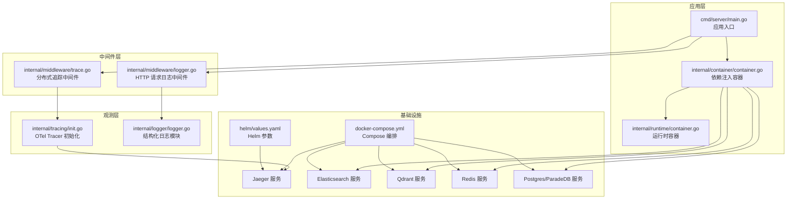
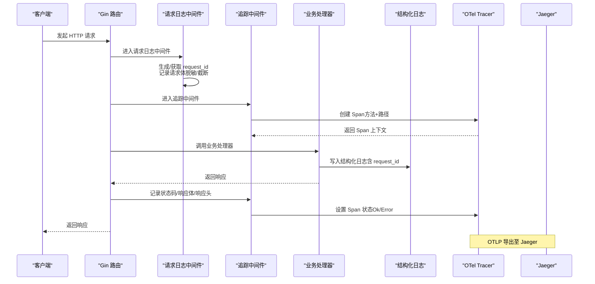
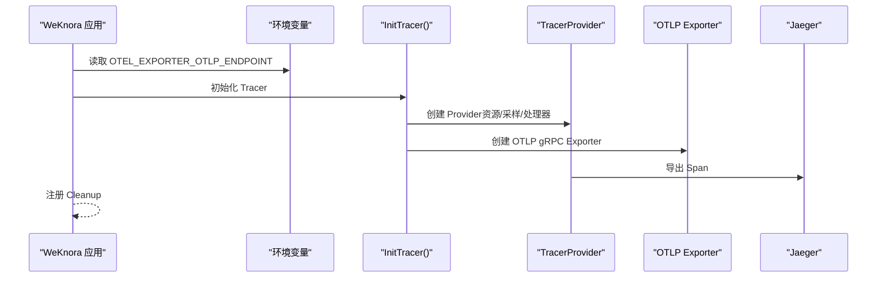
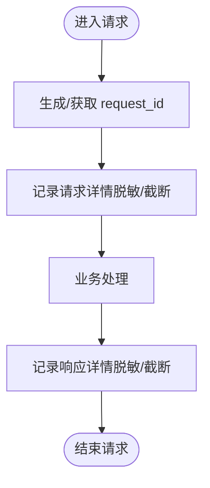
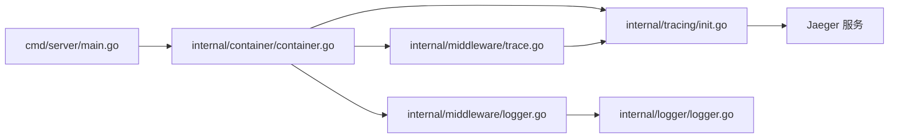

# 监控与日志系统

<cite>
**本文档引用的文件**
- [cmd/server/main.go](file://cmd/server/main.go)
- [internal/logger/logger.go](file://internal/logger/logger.go)
- [internal/middleware/logger.go](file://internal/middleware/logger.go)
- [internal/middleware/trace.go](file://internal/middleware/trace.go)
- [internal/tracing/init.go](file://internal/tracing/init.go)
- [internal/container/container.go](file://internal/container/container.go)
- [internal/runtime/container.go](file://internal/runtime/container.go)
- [.env.example](file://.env.example)
- [docker-compose.yml](file://docker-compose.yml)
- [docker-compose.dev.yml](file://docker-compose.dev.yml)
- [helm/values.yaml](file://helm/values.yaml)
- [internal/application/repository/retriever/elasticsearch/v8/repository.go](file://internal/application/repository/retriever/elasticsearch/v8/repository.go)
- [internal/application/repository/retriever/elasticsearch/v7/repository.go](file://internal/application/repository/retriever/elasticsearch/v7/repository.go)
- [internal/common/tools.go](file://internal/common/tools.go)
</cite>

## 目录
1. [简介](#简介)
2. [项目结构](#项目结构)
3. [核心组件](#核心组件)
4. [架构总览](#架构总览)
5. [详细组件分析](#详细组件分析)
6. [依赖关系分析](#依赖关系分析)
7. [性能考量](#性能考量)
8. [故障排查指南](#故障排查指南)
9. [结论](#结论)
10. [附录](#附录)

## 简介
本指南面向运维与开发人员，系统性阐述 WiseDx（WeKnora）项目的监控与日志体系配置与使用，覆盖以下要点：
- OpenTelemetry 分布式追踪（Jaeger）的配置与使用
- 结构化日志格式、日志级别与日志聚合方案
- Prometheus 监控指标的采集与 Grafana 仪表板配置
- ELK Stack（Elasticsearch、Logstash、Kibana）日志分析配置
- 告警规则设置、性能瓶颈识别与故障诊断工具使用

## 项目结构
WiseDx 的监控与日志能力由多层组件协同实现：
- 应用入口负责环境变量加载、日志输出配置、依赖注入容器构建与 OpenTelemetry Tracer 初始化
- 中间件层提供请求级日志记录与分布式追踪
- 日志模块提供统一的结构化日志格式与上下文字段传递
- 容器层负责服务装配与资源清理
- Compose/Helm 提供 Jaeger、Elasticsearch、Qdrant、Redis、Postgres 等基础设施编排

图表来源
- [cmd/server/main.go](file://cmd/server/main.go#L88-L192)
- [internal/container/container.go](file://internal/container/container.go#L65-L209)
- [internal/middleware/logger.go](file://internal/middleware/logger.go#L132-L221)
- [internal/middleware/trace.go](file://internal/middleware/trace.go#L28-L119)
- [internal/tracing/init.go](file://internal/tracing/init.go#L31-L95)
- [internal/logger/logger.go](file://internal/logger/logger.go#L137-L196)
- [docker-compose.yml](file://docker-compose.yml#L199-L222)
- [helm/values.yaml](file://helm/values.yaml#L481-L488)

章节来源
- [cmd/server/main.go](file://cmd/server/main.go#L88-L192)
- [internal/container/container.go](file://internal/container/container.go#L65-L209)
- [docker-compose.yml](file://docker-compose.yml#L1-L271)
- [helm/values.yaml](file://helm/values.yaml#L481-L488)

## 核心组件
- OpenTelemetry Tracer 与 Jaeger
  - 应用通过环境变量配置 OTLP 导出端点，自动初始化 TracerProvider、批量处理器与传播器
  - 默认导出到 Jaeger（OTLP gRPC 端口），便于集中查看链路
- HTTP 请求日志中间件
  - 记录请求路径、方法、状态码、延迟、客户端 IP、请求/响应体（脱敏与截断）
  - 为每条请求生成唯一 request_id，并注入到日志上下文
- 结构化日志模块
  - 统一格式输出，优先显示 request_id，其余字段按字母序排列
  - 支持彩色输出、调用者信息、全局文件输出
- 依赖注入容器
  - 负责 Tracer 初始化、数据库连接、检索引擎注册、资源清理等
- 环境变量与编排
  - .env.example 提供关键配置项；docker-compose.yml/helm/values.yaml 提供 Jaeger/Elasticsearch/Qdrant 等服务编排

章节来源
- [internal/tracing/init.go](file://internal/tracing/init.go#L31-L95)
- [internal/middleware/logger.go](file://internal/middleware/logger.go#L132-L221)
- [internal/logger/logger.go](file://internal/logger/logger.go#L137-L196)
- [internal/container/container.go](file://internal/container/container.go#L221-L231)
- [.env.example](file://.env.example#L1-L175)
- [docker-compose.yml](file://docker-compose.yml#L57-L62)

## 架构总览
WiseDx 的监控与日志架构如下：

图表来源
- [internal/middleware/logger.go](file://internal/middleware/logger.go#L132-L221)
- [internal/middleware/trace.go](file://internal/middleware/trace.go#L28-L119)
- [internal/tracing/init.go](file://internal/tracing/init.go#L31-L95)
- [docker-compose.yml](file://docker-compose.yml#L57-L62)

## 详细组件分析

### OpenTelemetry 分布式追踪与 Jaeger
- 初始化流程
  - 通过环境变量判断是否配置 OTLP 导出端点，优先使用 gRPC 导出器连接 Jaeger
  - 设置批量处理器、AlwaysSample 采样策略、TraceContext/Baggage 传播器
  - 提供 Cleanup 函数用于优雅关闭 TracerProvider
- 中间件集成
  - 追踪中间件从请求头提取上下文，创建 Span，记录请求/响应关键属性
  - 将错误状态码映射为 Span 错误状态，并记录错误
- Jaeger 集成
  - Compose/Helm 提供 Jaeger 服务，支持 OTLP gRPC/HTTP 接收器与 Web UI
  - 应用侧通过 OTEL_EXPORTER_OTLP_ENDPOINT 指向 jaeger:4317

图表来源
- [internal/tracing/init.go](file://internal/tracing/init.go#L31-L95)
- [docker-compose.yml](file://docker-compose.yml#L199-L222)
- [helm/values.yaml](file://helm/values.yaml#L481-L488)

章节来源
- [internal/tracing/init.go](file://internal/tracing/init.go#L31-L95)
- [internal/middleware/trace.go](file://internal/middleware/trace.go#L28-L119)
- [docker-compose.yml](file://docker-compose.yml#L57-L62)
- [helm/values.yaml](file://helm/values.yaml#L481-L488)

### 结构化日志系统
- 日志格式
  - 输出包含级别、时间戳、字段（request_id 优先）、调用者信息与消息正文
  - 字段按键名排序，便于机器解析与 Kibana 展示
- 上下文传递
  - RequestID 中间件为每个请求生成 request_id 并注入到上下文
  - 日志模块从上下文读取并输出，支持 WithField/WithFields 扩展
- 文件输出
  - 支持通过 LOG_FILE 环境变量将日志同时输出到文件与标准输出
- 脱敏与截断
  - 请求/响应体仅记录 JSON/text 类型，超过阈值截断
  - 敏感字段（如 password/token/authorization 等）统一脱敏

图表来源
- [internal/middleware/logger.go](file://internal/middleware/logger.go#L132-L221)
- [internal/logger/logger.go](file://internal/logger/logger.go#L137-L196)

章节来源
- [internal/logger/logger.go](file://internal/logger/logger.go#L137-L196)
- [internal/middleware/logger.go](file://internal/middleware/logger.go#L132-L221)

### 日志聚合与 ELK Stack
- Elasticsearch 集成
  - 容器层支持注册 Elasticsearch V7/V8 检索引擎，用于向量与关键词检索
  - 日志中包含检索操作的索引、查询与错误信息，便于定位问题
- Kibana 配置建议
  - 基于统一结构化日志格式（包含 request_id、level、timestamp、fields 等），在 Kibana 中建立索引模式
  - 使用 request_id 进行跨服务关联查询，结合 Trace ID（如需）进行端到端追踪
- Logstash（可选）
  - 可通过 Logstash 对日志进行进一步解析、过滤与标准化，再写入 Elasticsearch

章节来源
- [internal/container/container.go](file://internal/container/container.go#L425-L531)
- [internal/application/repository/retriever/elasticsearch/v8/repository.go](file://internal/application/repository/retriever/elasticsearch/v8/repository.go#L412-L517)
- [internal/application/repository/retriever/elasticsearch/v7/repository.go](file://internal/application/repository/retriever/elasticsearch/v7/repository.go#L286-L621)

### Prometheus 监控与 Grafana 仪表板
- 指标采集现状
  - 当前代码未显式注册 Prometheus 导出器（OTEL_METRICS_EXPORTER=none）
- 建议配置
  - 在应用侧引入 Prometheus 导出器，暴露 HTTP metrics 端点
  - 在 Prometheus 中配置抓取目标，抓取应用指标
  - 在 Grafana 中创建仪表板，展示请求量、延迟、错误率、资源使用等关键指标
- 指标建议
  - HTTP 请求总量与错误计数
  - 请求延迟分布（p50/p90/p99）
  - 检索引擎查询耗时与命中率
  - 数据库连接池使用情况
  - Redis/存储服务可用性与延迟

章节来源
- [docker-compose.yml](file://docker-compose.yml#L57-L62)

### 告警规则与故障诊断
- 告警规则建议
  - HTTP 错误率（如 5xx 占比）超过阈值持续 N 分钟
  - 请求 P95/P99 延迟超过阈值
  - 检索引擎查询失败率上升
  - 数据库连接池耗尽或超时
  - 关键下游服务（Elasticsearch/Qdrant/Redis/Postgres）不可用
- 故障诊断工具
  - 使用 Jaeger 查看端到端链路，定位慢调用与错误根因
  - 使用 Kibana 查看结构化日志，结合 request_id 进行关联分析
  - 使用 Prometheus/Grafana 监控指标趋势，识别异常波动
  - 使用容器编排工具（Compose/Helm）检查各服务健康状态与资源占用

章节来源
- [internal/middleware/trace.go](file://internal/middleware/trace.go#L28-L119)
- [internal/middleware/logger.go](file://internal/middleware/logger.go#L132-L221)
- [docker-compose.yml](file://docker-compose.yml#L199-L222)

## 依赖关系分析
- 应用入口依赖容器层构建服务，容器层依赖 Tracer 初始化与基础设施（数据库/检索引擎/缓存/文件存储）
- 中间件层依赖日志模块与 Tracer 模块
- 追踪导出依赖 Jaeger 服务

图表来源
- [cmd/server/main.go](file://cmd/server/main.go#L124-L145)
- [internal/container/container.go](file://internal/container/container.go#L65-L209)
- [internal/middleware/logger.go](file://internal/middleware/logger.go#L132-L221)
- [internal/middleware/trace.go](file://internal/middleware/trace.go#L28-L119)
- [internal/tracing/init.go](file://internal/tracing/init.go#L31-L95)

章节来源
- [cmd/server/main.go](file://cmd/server/main.go#L124-L145)
- [internal/container/container.go](file://internal/container/container.go#L65-L209)

## 性能考量
- 日志开销
  - 请求/响应体仅记录 JSON/text 类型并限制大小，避免过大日志影响性能
  - 字段按键名排序，减少解析成本
- 追踪采样
  - 默认 AlwaysSample，便于开发调试；生产环境建议调整采样策略以降低开销
- 检索性能
  - Elasticsearch/Qdrant 等检索引擎的查询参数与索引设计直接影响性能
  - 建议结合指标监控与 Jaeger 链路分析定位慢查询

章节来源
- [internal/middleware/logger.go](file://internal/middleware/logger.go#L18-L98)
- [internal/tracing/init.go](file://internal/tracing/init.go#L64-L71)
- [internal/application/repository/retriever/elasticsearch/v8/repository.go](file://internal/application/repository/retriever/elasticsearch/v8/repository.go#L412-L517)

## 故障排查指南
- 无法连接 Jaeger
  - 检查 OTEL_EXPORTER_OTLP_ENDPOINT 是否指向 jaeger:4317
  - 确认 Compose/Helm 中 jaeger 服务已启动并开放端口
- 日志缺失或格式异常
  - 检查 LOG_FILE 环境变量与文件权限
  - 确认日志中间件已注册到路由
- 请求无 request_id
  - 确认 RequestID 中间件在 Logger 中间件之前执行
- 检索失败
  - 查看 Elasticsearch/Qdrant 日志与指标，确认索引与连接配置
  - 使用 Kibana 搜索相关日志条目，结合 request_id 定位

章节来源
- [docker-compose.yml](file://docker-compose.yml#L57-L62)
- [internal/middleware/logger.go](file://internal/middleware/logger.go#L100-L130)
- [internal/application/repository/retriever/elasticsearch/v8/repository.go](file://internal/application/repository/retriever/elasticsearch/v8/repository.go#L412-L517)

## 结论
WiseDx 已具备完善的日志与分布式追踪基础：统一结构化日志、请求级上下文与 request_id、OpenTelemetry Tracer 与 Jaeger 集成。建议在生产环境中：
- 启用 Prometheus 导出器并配置 Grafana 仪表板
- 建立基于 Kibana 的日志聚合与检索体系
- 设定合理的告警阈值与升级流程
- 结合链路追踪与日志进行端到端故障定位

## 附录
- 环境变量关键项
  - OTEL_EXPORTER_OTLP_ENDPOINT、OTEL_SERVICE_NAME、OTEL_TRACES_EXPORTER、OTEL_METRICS_EXPORTER、OTEL_LOGS_EXPORTER、OTEL_PROPAGATORS
  - LOG_FILE、GIN_MODE、DB_DRIVER、RETRIEVE_DRIVER、ELASTICSEARCH_*、QDRANT_*、REDIS_*、STORAGE_TYPE、LOCAL_STORAGE_BASE_DIR 等
- Compose/Helm 服务
  - jaeger、elasticsearch、qdrant、redis、postgres/paradedb、minio、docreader、frontend 等

章节来源
- [.env.example](file://.env.example#L1-L175)
- [docker-compose.yml](file://docker-compose.yml#L1-L271)
- [helm/values.yaml](file://helm/values.yaml#L481-L488)