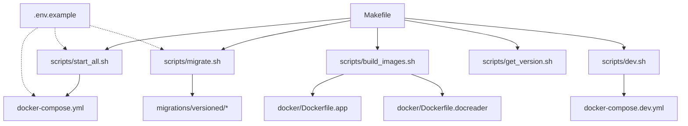
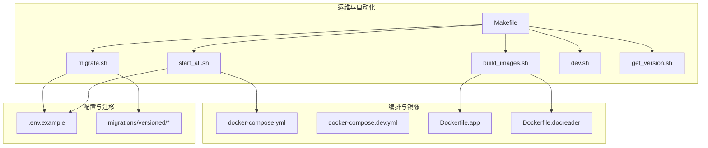
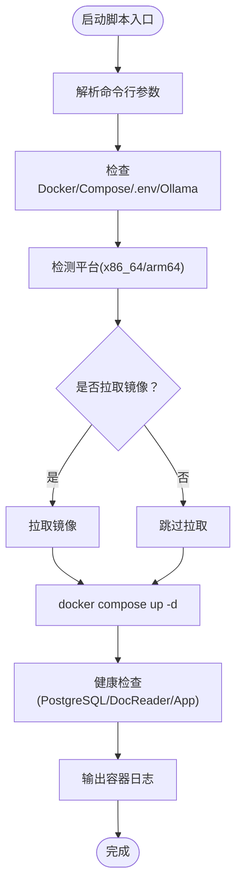
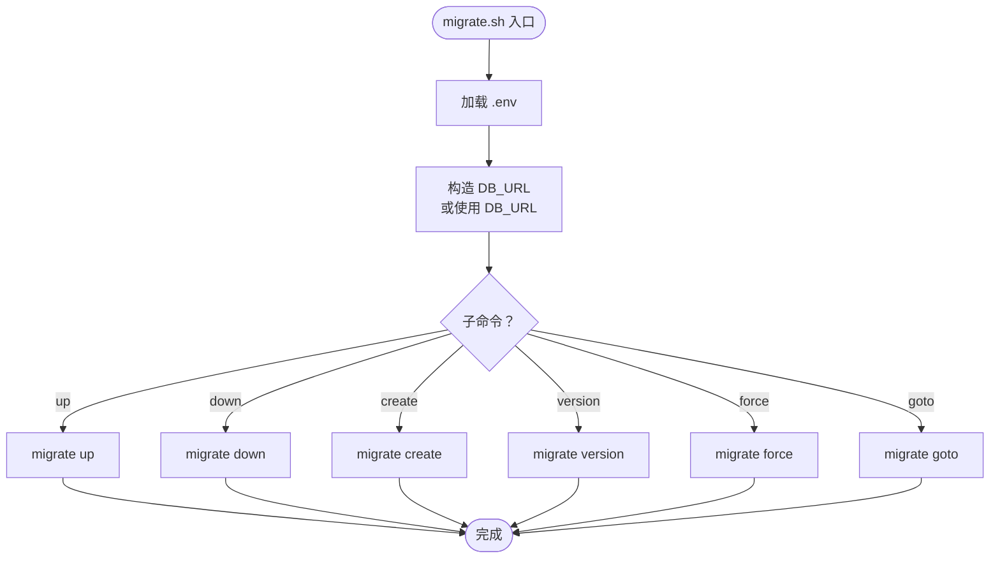
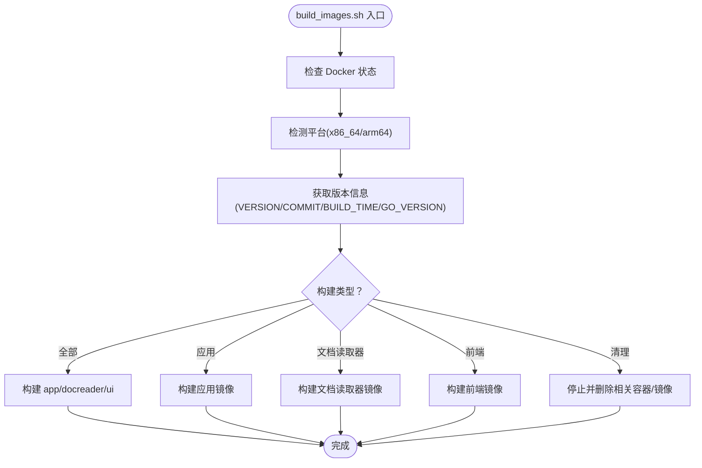
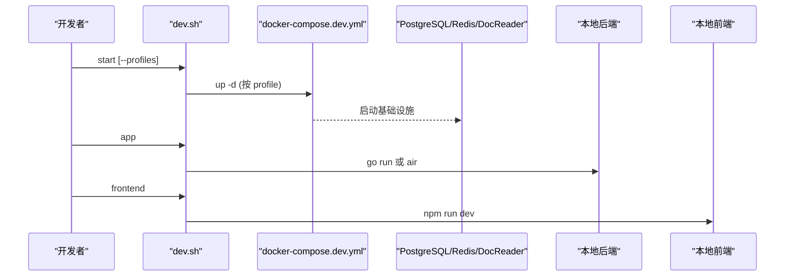
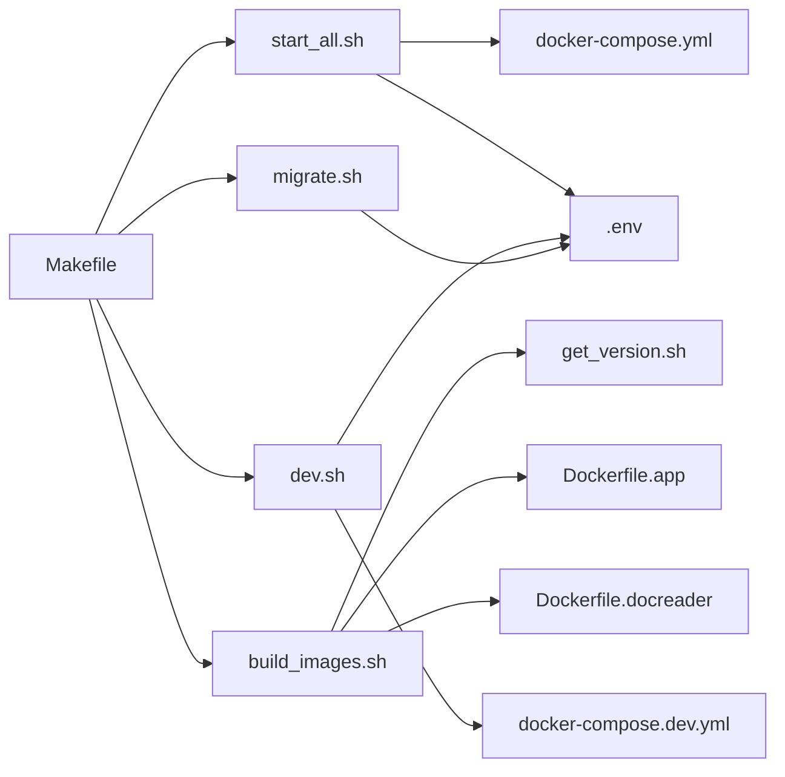

# 运维脚本与自动化

<cite>
**本文引用的文件列表**
- [README.md](file://README.md)
- [Makefile](file://Makefile)
- [scripts/start_all.sh](file://scripts/start_all.sh)
- [scripts/migrate.sh](file://scripts/migrate.sh)
- [scripts/build_images.sh](file://scripts/build_images.sh)
- [scripts/dev.sh](file://scripts/dev.sh)
- [scripts/get_version.sh](file://scripts/get_version.sh)
- [.env.example](file://.env.example)
- [docker-compose.yml](file://docker-compose.yml)
- [docker-compose.dev.yml](file://docker-compose.dev.yml)
- [docker/Dockerfile.app](file://docker/Dockerfile.app)
- [docker/Dockerfile.docreader](file://docker/Dockerfile.docreader)
</cite>

## 目录
1. [简介](#简介)
2. [项目结构](#项目结构)
3. [核心组件](#核心组件)
4. [架构总览](#架构总览)
5. [详细组件分析](#详细组件分析)
6. [依赖关系分析](#依赖关系分析)
7. [性能与可靠性考量](#性能与可靠性考量)
8. [故障排查指南](#故障排查指南)
9. [结论](#结论)
10. [附录](#附录)

## 简介
本指南面向运维与开发团队，系统讲解 WiseDx 的运维脚本与自动化部署方案，涵盖：
- 启动脚本 start_all.sh 的启动流程与参数说明
- 数据库迁移脚本 migrate.sh 的使用与最佳实践
- 镜像构建脚本 build_images.sh 的构建策略与参数
- Makefile 中常用目标与构建流程
- CI/CD 流水线配置思路（含自动化测试、部署与回滚）
- 环境切换与配置管理最佳实践
- 运维任务自动化与监控告警集成建议

## 项目结构
围绕运维与自动化，项目中与之相关的关键文件与目录如下：
- scripts/：运维脚本集中地，包含启动、迁移、镜像构建、开发辅助等脚本
- docker-compose.yml / docker-compose.dev.yml：生产与开发环境的容器编排
- docker/：Dockerfile 定义（应用、文档读取器）
- Makefile：统一的构建、测试、部署、运维目标入口
- .env.example：环境变量模板，指导配置管理
- README.md：快速入门与前置条件

图表来源
- [Makefile](file://Makefile#L1-L285)
- [scripts/start_all.sh](file://scripts/start_all.sh#L1-L729)
- [scripts/migrate.sh](file://scripts/migrate.sh#L1-L122)
- [scripts/build_images.sh](file://scripts/build_images.sh#L1-L350)
- [scripts/dev.sh](file://scripts/dev.sh#L1-L347)
- [scripts/get_version.sh](file://scripts/get_version.sh#L1-L87)
- [docker-compose.yml](file://docker-compose.yml#L1-L271)
- [docker-compose.dev.yml](file://docker-compose.dev.yml#L1-L157)
- [docker/Dockerfile.app](file://docker/Dockerfile.app#L1-L200)
- [docker/Dockerfile.docreader](file://docker/Dockerfile.docreader#L1-L161)

章节来源
- [README.md](file://README.md#L64-L87)
- [Makefile](file://Makefile#L1-L285)

## 核心组件
- 启动脚本：负责检测环境、准备 .env、选择 Compose 命令、拉取/构建镜像、启动容器、日志输出与健康检查
- 迁移脚本：封装 golang-migrate，支持 up/down/create/version/force/goto 等命令
- 镜像构建脚本：统一构建应用、文档读取器、前端镜像，支持清理与平台检测
- Makefile：统一入口，将脚本与 Docker、测试、文档生成、开发模式等串联
- 编排文件：docker-compose.yml（生产/完整）、docker-compose.dev.yml（开发）
- 配置模板：.env.example，定义数据库、存储、服务端口、可观测性等关键变量

章节来源
- [scripts/start_all.sh](file://scripts/start_all.sh#L1-L729)
- [scripts/migrate.sh](file://scripts/migrate.sh#L1-L122)
- [scripts/build_images.sh](file://scripts/build_images.sh#L1-L350)
- [Makefile](file://Makefile#L1-L285)
- [.env.example](file://.env.example#L1-L175)
- [docker-compose.yml](file://docker-compose.yml#L1-L271)
- [docker-compose.dev.yml](file://docker-compose.dev.yml#L1-L157)

## 架构总览
下图展示运维自动化在系统中的位置与交互关系。

图表来源
- [Makefile](file://Makefile#L1-L285)
- [scripts/start_all.sh](file://scripts/start_all.sh#L1-L729)
- [scripts/migrate.sh](file://scripts/migrate.sh#L1-L122)
- [scripts/build_images.sh](file://scripts/build_images.sh#L1-L350)
- [scripts/dev.sh](file://scripts/dev.sh#L1-L347)
- [scripts/get_version.sh](file://scripts/get_version.sh#L1-L87)
- [docker-compose.yml](file://docker-compose.yml#L1-L271)
- [docker-compose.dev.yml](file://docker-compose.dev.yml#L1-L157)
- [docker/Dockerfile.app](file://docker/Dockerfile.app#L1-L200)
- [docker/Dockerfile.docreader](file://docker/Dockerfile.docreader#L1-L161)
- [.env.example](file://.env.example#L1-L175)

## 详细组件分析

### 启动脚本：start_all.sh
- 功能概览
  - 自动检测 Docker 与 Compose，选择 docker compose 或 docker-compose
  - 自动创建 .env（基于 .env.example），并校验必要变量
  - 支持本地/远程 Ollama：自动安装、启动、健康检查
  - 支持拉取镜像、构建镜像、启动/停止/重启容器、列出容器、查看日志
  - 支持按需启动 Ollama 或 Docker，或同时启动；支持跳过拉取镜像
- 关键流程
  - 环境检查：Docker、Compose、.env、Ollama（本地/远程）
  - 平台检测：x86_64/arm64
  - 容器启动：根据 NO_PULL 决定是否拉取镜像
  - 健康检查：PostgreSQL、DocReader、App
  - 日志输出：启动完成后持续输出 app/docreader/postgres 日志
- 常用参数
  - -o/--ollama：仅启动 Ollama
  - -d/--docker：仅启动 Docker 容器
  - -a/--all：默认，同时启动两者
  - -s/--stop：停止所有服务
  - -c/--check：环境诊断
  - -l/--list：列出运行中的容器
  - -p/--pull：拉取最新镜像
  - --no-pull：不拉取镜像，直接启动
  - -r/--restart 容器名：重建并重启指定容器
  - -v/--version：显示版本
- 访问地址
  - 前端：http://localhost:FRONTEND_PORT（默认 80）
  - API：http://localhost:APP_PORT（默认 8080）
  - Jaeger：http://localhost:16686

图表来源
- [scripts/start_all.sh](file://scripts/start_all.sh#L62-L358)

章节来源
- [scripts/start_all.sh](file://scripts/start_all.sh#L1-L729)
- [docker-compose.yml](file://docker-compose.yml#L1-L271)

### 数据库迁移：migrate.sh
- 功能概览
  - 通过 golang-migrate 执行 up/down/create/version/force/goto
  - 自动加载 .env，构造 DB_URL（支持 sslmode=disable 或替换 require/prefer）
  - 支持从 DB_URL 或 DB_HOST/DB_PORT/DB_USER/DB_PASSWORD/DB_NAME 组合构造
- 常用命令
  - up：向上迁移
  - down：向下迁移
  - create <name>：生成新的迁移文件
  - version：查看当前版本
  - force <version>：强制设置版本（-1 表示清空版本）
  - goto <version>：迁移到指定版本
- 最佳实践
  - 生产环境建议先备份数据库
  - 先在测试环境验证迁移后再执行生产
  - 使用 create 生成迁移文件，确保语句幂等与可逆
  - 使用 version/goto/force 时谨慎，配合备份与回滚计划

图表来源
- [scripts/migrate.sh](file://scripts/migrate.sh#L63-L120)

章节来源
- [scripts/migrate.sh](file://scripts/migrate.sh#L1-L122)
- [Makefile](file://Makefile#L164-L196)

### 镜像构建：build_images.sh
- 功能概览
  - 统一构建应用、文档读取器、前端镜像
  - 支持清理本地镜像与相关容器
  - 自动检测平台（x86_64/arm64），注入版本信息（VERSION、COMMIT_ID、BUILD_TIME、GO_VERSION）
  - 支持仅构建某类镜像或全部
- 关键参数
  - -a/--all：构建全部镜像（默认）
  - -p/--app：仅构建应用镜像
  - -d/--docreader：仅构建文档读取器镜像
  - -f/--frontend：仅构建前端镜像
  - -c/--clean：清理本地镜像与相关容器
  - -v/--version：显示版本
- 平台与版本
  - 通过 get_version.sh 注入版本信息
  - Dockerfile.app/Dockerfile.docreader 分别构建对应镜像

图表来源
- [scripts/build_images.sh](file://scripts/build_images.sh#L57-L350)
- [scripts/get_version.sh](file://scripts/get_version.sh#L1-L87)
- [docker/Dockerfile.app](file://docker/Dockerfile.app#L1-L200)
- [docker/Dockerfile.docreader](file://docker/Dockerfile.docreader#L1-L161)

章节来源
- [scripts/build_images.sh](file://scripts/build_images.sh#L1-L350)
- [scripts/get_version.sh](file://scripts/get_version.sh#L1-L87)
- [Makefile](file://Makefile#L143-L158)

### 开发模式：dev.sh 与 docker-compose.dev.yml
- 功能概览
  - 仅启动基础设施（PostgreSQL、Redis、DocReader、可选 MinIO/Qdrant/Neo4j/Jaeger）
  - 支持通过 profile 控制启用的服务
  - 本地启动后端/前端（非容器内），便于热重载与调试
- 常用命令
  - start [--minio|--qdrant|--neo4j|--jaeger|--full]
  - stop/restart/logs/status
  - app：本地启动后端（优先 Air 热重载）
  - frontend：本地启动前端（Vite）

图表来源
- [scripts/dev.sh](file://scripts/dev.sh#L103-L347)
- [docker-compose.dev.yml](file://docker-compose.dev.yml#L1-L157)

章节来源
- [scripts/dev.sh](file://scripts/dev.sh#L1-L347)
- [docker-compose.dev.yml](file://docker-compose.dev.yml#L1-L157)

### Makefile 常用目标与构建流程
- 基础命令
  - build/run/test/clean：Go 应用构建、运行、测试、清理
  - deps/lint/fmt：依赖安装、代码检查、格式化
  - docs/install-swagger：生成 Swagger 文档与安装工具
- Docker 命令
  - docker-build-app/docreader/frontend/all：构建对应镜像
  - docker-run/docker-stop/docker-restart：容器运行/停止/重启
- 服务管理
  - start-all/start-ollama/stop-all：通过 start_all.sh 管理服务
- 镜像构建
  - build-images/build-images-app/docreader/frontend/clean-images：通过 build_images.sh 管理镜像
- 数据库
  - migrate-up/migrate-down/version/create/force/goto：通过 migrate.sh 管理迁移
- 环境检查
  - check-env/list-containers/pull-images/show-platform：通过 start_all.sh 执行
- 开发模式
  - dev-start/dev-stop/dev-restart/dev-logs/dev-status/dev-app/dev-frontend：通过 dev.sh 管理

章节来源
- [Makefile](file://Makefile#L1-L285)

## 依赖关系分析
- 脚本与编排
  - start_all.sh 依赖 docker-compose.yml，按需拉取/构建镜像并启动服务
  - dev.sh 依赖 docker-compose.dev.yml，仅启动基础设施
- 脚本与配置
  - start_all.sh/migrate.sh 依赖 .env（或 .env.example）中的环境变量
  - build_images.sh 依赖 get_version.sh 注入版本信息
- 脚本与工具
  - migrate.sh 依赖 golang-migrate
  - build_images.sh 依赖 Docker
  - start_all.sh 依赖 Docker、Compose、curl、systemctl/pgrep 等

图表来源
- [scripts/start_all.sh](file://scripts/start_all.sh#L1-L729)
- [scripts/migrate.sh](file://scripts/migrate.sh#L1-L122)
- [scripts/build_images.sh](file://scripts/build_images.sh#L1-L350)
- [scripts/dev.sh](file://scripts/dev.sh#L1-L347)
- [scripts/get_version.sh](file://scripts/get_version.sh#L1-L87)
- [docker-compose.yml](file://docker-compose.yml#L1-L271)
- [docker-compose.dev.yml](file://docker-compose.dev.yml#L1-L157)
- [docker/Dockerfile.app](file://docker/Dockerfile.app#L1-L200)
- [docker/Dockerfile.docreader](file://docker/Dockerfile.docreader#L1-L161)

章节来源
- [Makefile](file://Makefile#L1-L285)

## 性能与可靠性考量
- 启动与健康检查
  - start_all.sh 对 PostgreSQL、DocReader、App 进行健康检查，减少“假启动”风险
  - 建议在生产环境增加更严格的探针与重试策略
- 平台与镜像
  - build_images.sh 与 Makefile 均支持 x86_64/arm64，确保跨平台一致性
  - 使用 --no-pull 可加速本地开发启动，但需确保镜像一致
- 迁移安全
  - migrate.sh 支持 goto/force，务必配合备份与回滚策略
  - 建议在非高峰时段执行迁移，并提前演练回滚
- 日志与可观测性
  - start_all.sh 启动后持续输出关键容器日志，便于快速定位问题
  - 生产环境建议接入集中式日志与指标采集（如 Jaeger、Prometheus）

[本节为通用建议，不直接分析具体文件]

## 故障排查指南
- Docker/Compose 未安装或未运行
  - 现象：脚本报错“未检测到 Docker Compose”
  - 处理：安装 docker compose 插件或 docker-compose(v1)，并确保 docker 服务运行
- .env 缺失或变量不全
  - 现象：启动失败或服务无法连接数据库
  - 处理：复制 .env.example 为 .env，补齐 DB_*、STORAGE_TYPE、OLLAMA_BASE_URL 等
- Ollama 本地/远程不可用
  - 现象：Ollama 服务不可达
  - 处理：检查 OLLAMA_BASE_URL，远程服务需确保网络可达；本地服务需确认端口占用与 systemd 状态
- 迁移失败
  - 现象：migrate.sh 报错
  - 处理：检查 DB_URL/DB_* 变量；必要时使用 force/-1 重置版本；先在测试环境验证
- 镜像构建失败
  - 现象：Docker 构建报错
  - 处理：检查网络与代理、平台匹配、Docker daemon 状态；必要时清理缓存后重试

章节来源
- [scripts/start_all.sh](file://scripts/start_all.sh#L268-L566)
- [scripts/migrate.sh](file://scripts/migrate.sh#L26-L60)
- [scripts/build_images.sh](file://scripts/build_images.sh#L57-L92)

## 结论
通过 start_all.sh、migrate.sh、build_images.sh 与 Makefile 的协同，WiseDx 提供了从开发到生产的完整自动化运维能力。结合 .env 配置模板与 docker-compose 编排，团队可以快速、可靠地部署与维护系统。建议在生产环境中强化迁移回滚、日志与监控体系，并将上述脚本纳入 CI/CD 流水线，实现自动化测试、构建、部署与回滚。

[本节为总结，不直接分析具体文件]

## 附录

### CI/CD 流水线配置示例（思路）
- 触发条件
  - push 到 main 分支触发构建与测试
  - PR 触发单元测试
- 步骤建议
  - 安装依赖：Go、Docker、golang-migrate、swag
  - 代码检查：golangci-lint
  - 单元测试：go test ./...
  - 生成文档：make docs
  - 构建镜像：make docker-build-all 或 make build-images
  - 部署：docker-compose up -d 或 k8s 部署
  - 回滚：migrate-down + docker-compose rollback
- 安全与审计
  - 使用只读令牌与最小权限
  - 镜像扫描与漏洞检测
  - 迁移与部署变更记录

[本节为概念性内容，不直接映射到具体源码文件]

### 环境切换与配置管理最佳实践
- 使用 .env.example 作为模板，禁止将 .env 提交到仓库
- 通过环境变量区分开发/测试/生产，必要时使用多套 .env
- 将敏感信息（DB 密码、存储密钥、JWT_SECRET）放入 CI/CD 密钥管理
- 使用 profiles 控制可选服务（MinIO/Qdrant/Neo4j/Jaeger），按需启用
- 在 start_all.sh 中统一检查 .env，避免遗漏关键变量

章节来源
- [.env.example](file://.env.example#L1-L175)
- [scripts/start_all.sh](file://scripts/start_all.sh#L86-L111)
- [docker-compose.yml](file://docker-compose.yml#L1-L271)

### 运维任务自动化与监控告警建议
- 自动化
  - 定期备份：PostgreSQL/MinIO/Qdrant/Neo4j 数据卷
  - 健康巡检：定时 curl /health 与 grpc_health_probe
  - 日志轮转：容器日志持久化与归档
- 监控告警
  - 指标：CPU/内存/磁盘/容器重启次数
  - 链路：Jaeger Traces（OTLP）
  - 告警：阈值告警 + 健康检查失败告警

[本节为通用建议，不直接分析具体文件]