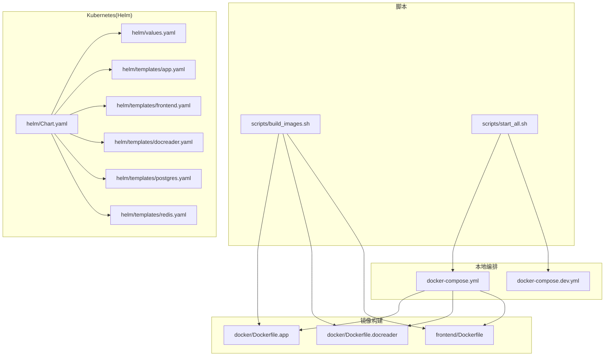
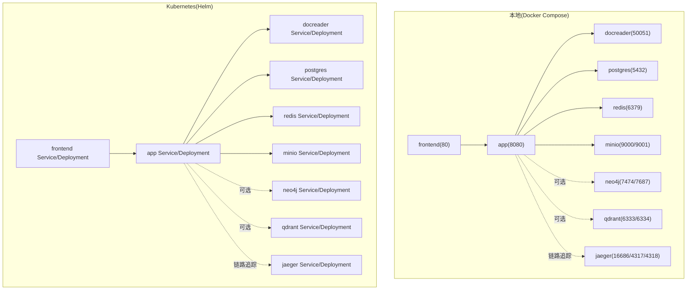
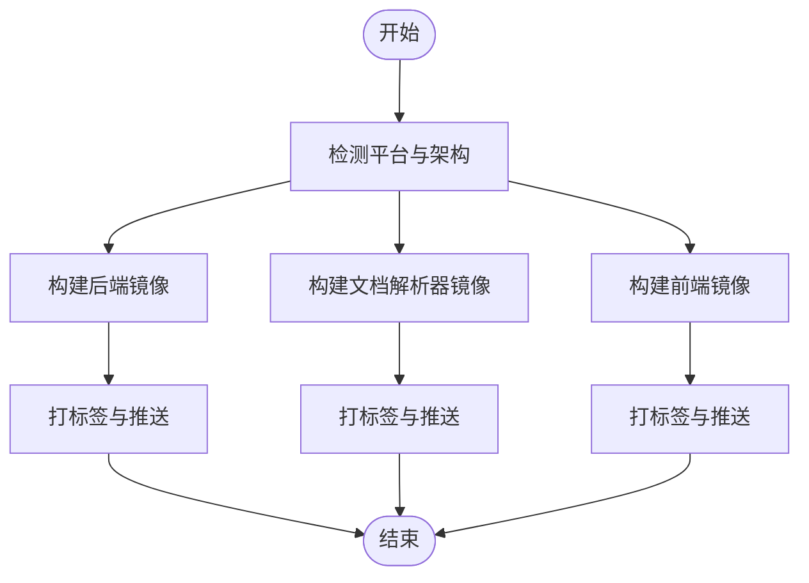
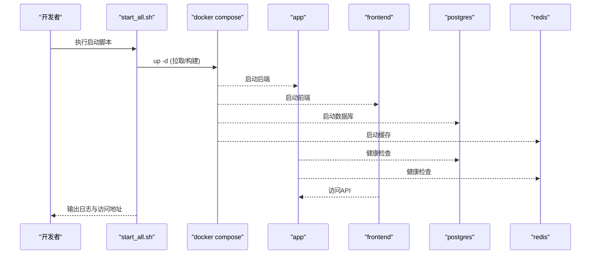
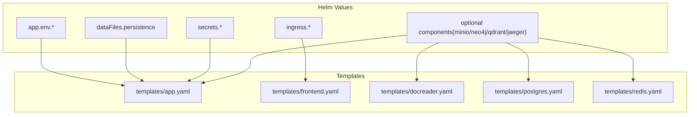
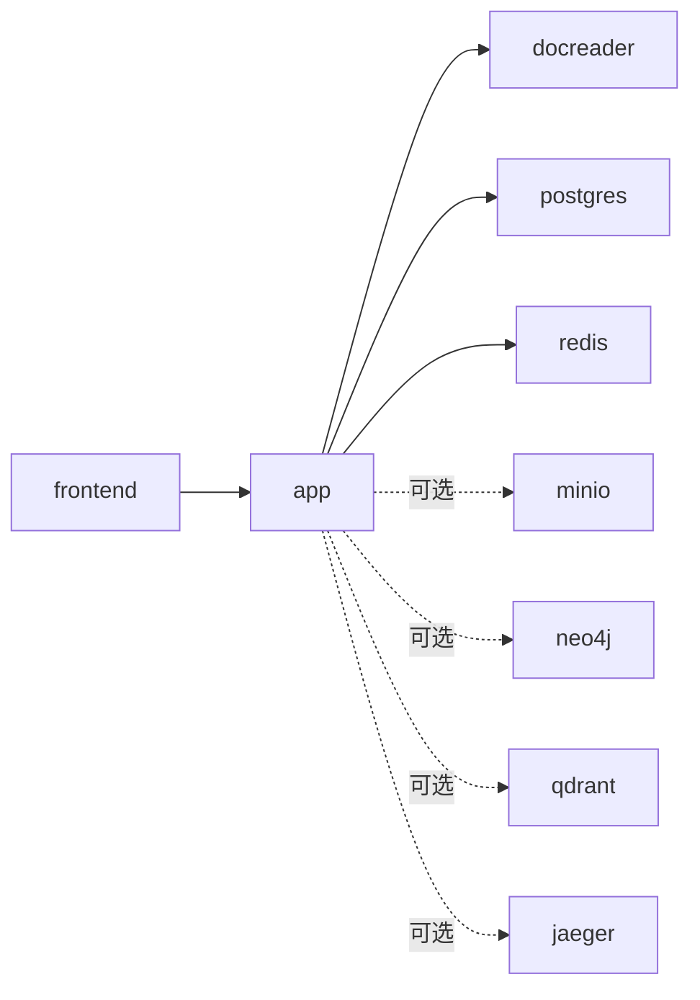
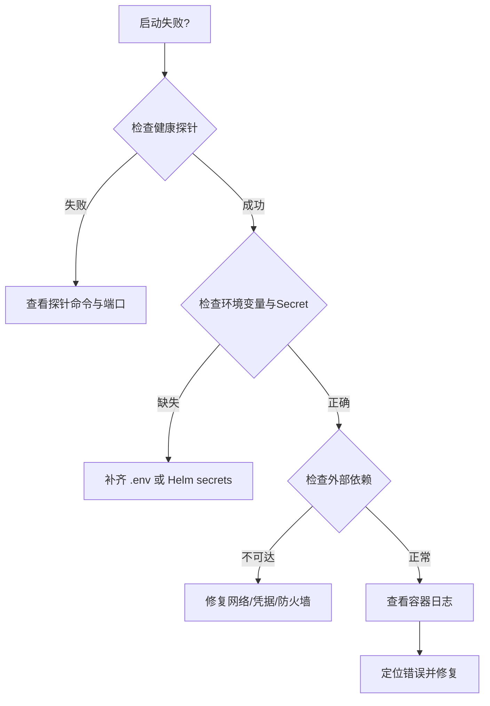

# 部署运维

<cite>
**本文引用的文件**
- [docker-compose.yml](file://docker-compose.yml)
- [docker-compose.dev.yml](file://docker-compose.dev.yml)
- [docker/Dockerfile.docreader](file://docker/Dockerfile.docreader)
- [frontend/Dockerfile](file://frontend/Dockerfile)
- [scripts/build_images.sh](file://scripts/build_images.sh)
- [scripts/start_all.sh](file://scripts/start_all.sh)
- [config/config.yaml](file://config/config.yaml)
- [docker/config/supervisord.conf](file://docker/config/supervisord.conf)
- [helm/Chart.yaml](file://helm/Chart.yaml)
- [helm/values.yaml](file://helm/values.yaml)
- [helm/templates/app.yaml](file://helm/templates/app.yaml)
- [helm/templates/frontend.yaml](file://helm/templates/frontend.yaml)
- [helm/templates/docreader.yaml](file://helm/templates/docreader.yaml)
- [helm/templates/postgres.yaml](file://helm/templates/postgres.yaml)
- [helm/templates/redis.yaml](file://helm/templates/redis.yaml)
</cite>

## 目录
1. [简介](#简介)
2. [项目结构](#项目结构)
3. [核心组件](#核心组件)
4. [架构总览](#架构总览)
5. [详细组件分析](#详细组件分析)
6. [依赖分析](#依赖分析)
7. [性能考虑](#性能考虑)
8. [故障排查指南](#故障排查指南)
9. [结论](#结论)
10. [附录](#附录)

## 简介
本指南面向运维工程师与平台管理员，提供 WiseDx 的部署与运维实践，涵盖：
- Docker 容器化部署与镜像构建
- 本地编排与开发环境快速启动
- Kubernetes 集群部署（Helm Charts）与配置
- 生产环境配置优化与安全加固
- 监控与日志体系（链路追踪、健康检查）
- 备份与恢复策略、灾难恢复计划
- 运维脚本使用与自动化部署流程
- 常见部署问题与性能调优方法

## 项目结构
WiseDx 采用多模块、多语言混合架构，包含 Go 后端、Python 文档解析子系统、React 前端与 Helm/Kubernetes 编排。关键部署相关目录与文件如下：
- docker/：容器镜像构建文件（后端、文档解析器）
- frontend/：前端构建与运行配置
- docker-compose.yml / docker-compose.dev.yml：本地编排与开发环境
- scripts/：镜像构建与一键启动脚本
- helm/：Kubernetes 部署清单与配置模板
- config/：后端运行时配置模板

图表来源
- [docker-compose.yml](file://docker-compose.yml#L1-L271)
- [docker-compose.dev.yml](file://docker-compose.dev.yml#L1-L157)
- [docker/Dockerfile.docreader](file://docker/Dockerfile.docreader#L1-L161)
- [frontend/Dockerfile](file://frontend/Dockerfile#L1-L43)
- [scripts/build_images.sh](file://scripts/build_images.sh#L1-L350)
- [scripts/start_all.sh](file://scripts/start_all.sh#L1-L729)
- [helm/Chart.yaml](file://helm/Chart.yaml#L1-L27)
- [helm/values.yaml](file://helm/values.yaml#L1-L489)
- [helm/templates/app.yaml](file://helm/templates/app.yaml#L1-L189)
- [helm/templates/frontend.yaml](file://helm/templates/frontend.yaml#L1-L108)
- [helm/templates/docreader.yaml](file://helm/templates/docreader.yaml#L1-L103)
- [helm/templates/postgres.yaml](file://helm/templates/postgres.yaml#L1-L129)
- [helm/templates/redis.yaml](file://helm/templates/redis.yaml#L1-L125)

章节来源
- [docker-compose.yml](file://docker-compose.yml#L1-L271)
- [docker-compose.dev.yml](file://docker-compose.dev.yml#L1-L157)
- [docker/Dockerfile.docreader](file://docker/Dockerfile.docreader#L1-L161)
- [frontend/Dockerfile](file://frontend/Dockerfile#L1-L43)
- [scripts/build_images.sh](file://scripts/build_images.sh#L1-L350)
- [scripts/start_all.sh](file://scripts/start_all.sh#L1-L729)
- [helm/Chart.yaml](file://helm/Chart.yaml#L1-L27)
- [helm/values.yaml](file://helm/values.yaml#L1-L489)
- [helm/templates/app.yaml](file://helm/templates/app.yaml#L1-L189)
- [helm/templates/frontend.yaml](file://helm/templates/frontend.yaml#L1-L108)
- [helm/templates/docreader.yaml](file://helm/templates/docreader.yaml#L1-L103)
- [helm/templates/postgres.yaml](file://helm/templates/postgres.yaml#L1-L129)
- [helm/templates/redis.yaml](file://helm/templates/redis.yaml#L1-L125)

## 核心组件
- 应用服务（后端 API）：提供聊天、知识库、检索、流式处理等能力；支持健康检查与探针。
- 文档解析器（docreader）：Python gRPC 服务，负责文档解析与多模态处理。
- 前端 UI：Nginx 托管的静态站点，提供用户交互界面。
- 数据存储与检索：
  - PostgreSQL（ParadeDB）：向量检索与全文检索
  - Redis：流管理与异步任务队列
  - 可选：MinIO（S3）、Qdrant、Neo4j（图谱）
- 链路追踪：Jaeger（OTLP/HTTP/UDP）

章节来源
- [docker-compose.yml](file://docker-compose.yml#L20-L117)
- [docker-compose.yml](file://docker-compose.yml#L121-L144)
- [docker-compose.yml](file://docker-compose.yml#L146-L271)
- [helm/values.yaml](file://helm/values.yaml#L53-L140)
- [helm/values.yaml](file://helm/values.yaml#L189-L237)
- [helm/values.yaml](file://helm/values.yaml#L241-L283)
- [helm/values.yaml](file://helm/values.yaml#L287-L329)
- [helm/values.yaml](file://helm/values.yaml#L404-L489)

## 架构总览
下图展示了本地与 Kubernetes 两种部署形态的组件关系与交互。

图表来源
- [docker-compose.yml](file://docker-compose.yml#L1-L271)
- [helm/templates/app.yaml](file://helm/templates/app.yaml#L1-L189)
- [helm/templates/frontend.yaml](file://helm/templates/frontend.yaml#L1-L108)
- [helm/templates/docreader.yaml](file://helm/templates/docreader.yaml#L1-L103)
- [helm/templates/postgres.yaml](file://helm/templates/postgres.yaml#L1-L129)
- [helm/templates/redis.yaml](file://helm/templates/redis.yaml#L1-L125)

## 详细组件分析

### Docker 容器化与镜像构建
- 后端应用镜像：基于 Go 应用，通过 Dockerfile 构建，支持多平台（amd64/arm64）。
- 文档解析器镜像：基于 Python，包含 OCR 模型与 Playwright 依赖，使用多阶段构建减少体积。
- 前端镜像：基于 Nginx，静态站点托管，支持运行时环境变量注入。

图表来源
- [scripts/build_images.sh](file://scripts/build_images.sh#L76-L92)
- [scripts/build_images.sh](file://scripts/build_images.sh#L126-L155)
- [scripts/build_images.sh](file://scripts/build_images.sh#L157-L178)
- [scripts/build_images.sh](file://scripts/build_images.sh#L180-L199)

章节来源
- [docker/Dockerfile.docreader](file://docker/Dockerfile.docreader#L1-L161)
- [frontend/Dockerfile](file://frontend/Dockerfile#L1-L43)
- [scripts/build_images.sh](file://scripts/build_images.sh#L1-L350)

### 本地编排与开发环境
- docker-compose.yml：定义应用、前端、文档解析器、数据库、缓存、对象存储、链路追踪、图数据库、向量库等服务，含健康检查与持久化卷。
- docker-compose.dev.yml：开发模式仅启动基础设施，便于本地调试后端与前端。

图表来源
- [scripts/start_all.sh](file://scripts/start_all.sh#L313-L359)
- [docker-compose.yml](file://docker-compose.yml#L1-L271)

章节来源
- [docker-compose.yml](file://docker-compose.yml#L1-L271)
- [docker-compose.dev.yml](file://docker-compose.dev.yml#L1-L157)
- [scripts/start_all.sh](file://scripts/start_all.sh#L1-L729)

### Kubernetes 部署（Helm Charts）
- Chart.yaml：声明 Chart 元数据与版本约束。
- values.yaml：集中配置全局安全上下文、各组件副本数、镜像仓库与标签、资源请求/限制、环境变量、持久化、Ingress 与可选组件开关。
- 模板：
  - app.yaml：后端 Deployment/Service，含探针、卷挂载、环境变量（从 Secret 注入）。
  - frontend.yaml：前端 Deployment/Service，含 Nginx 缓存与就绪探针。
  - docreader.yaml：文档解析器 Deployment/Service，gRPC 健康检查。
  - postgres.yaml：ParadeDB Deployment/Service，含持久化与探针。
  - redis.yaml：Redis Deployment/Service，含持久化与认证。

图表来源
- [helm/Chart.yaml](file://helm/Chart.yaml#L1-L27)
- [helm/values.yaml](file://helm/values.yaml#L1-L489)
- [helm/templates/app.yaml](file://helm/templates/app.yaml#L1-L189)
- [helm/templates/frontend.yaml](file://helm/templates/frontend.yaml#L1-L108)
- [helm/templates/docreader.yaml](file://helm/templates/docreader.yaml#L1-L103)
- [helm/templates/postgres.yaml](file://helm/templates/postgres.yaml#L1-L129)
- [helm/templates/redis.yaml](file://helm/templates/redis.yaml#L1-L125)

章节来源
- [helm/Chart.yaml](file://helm/Chart.yaml#L1-L27)
- [helm/values.yaml](file://helm/values.yaml#L1-L489)
- [helm/templates/app.yaml](file://helm/templates/app.yaml#L1-L189)
- [helm/templates/frontend.yaml](file://helm/templates/frontend.yaml#L1-L108)
- [helm/templates/docreader.yaml](file://helm/templates/docreader.yaml#L1-L103)
- [helm/templates/postgres.yaml](file://helm/templates/postgres.yaml#L1-L129)
- [helm/templates/redis.yaml](file://helm/templates/redis.yaml#L1-L125)

### 配置与运行时要点
- 后端配置模板：包含服务端口、对话参数、提示词模板、知识库切分策略、租户策略等。
- 运行时环境变量：数据库、缓存、存储、文档解析器、链路追踪、并发池、图谱开关等。
- Supervisor（历史遗留）：通过 supervisord 管理进程，便于日志与自动重启。

章节来源
- [config/config.yaml](file://config/config.yaml#L1-L585)
- [docker-compose.yml](file://docker-compose.yml#L40-L107)
- [docker/config/supervisord.conf](file://docker/config/supervisord.conf#L1-L31)

## 依赖分析
- 组件耦合：
  - app 依赖 postgres、redis、docreader、(可选) neo4j/qdrant、(可选) minio
  - frontend 依赖 app Service
  - 可选组件（minio、neo4j、qdrant、jaeger）通过 values 控制启用
- 外部依赖：
  - Docker 与 Compose
  - Kubernetes 集群与 Helm
  - 可选：Ollama（本地或远程）

图表来源
- [docker-compose.yml](file://docker-compose.yml#L1-L271)
- [helm/values.yaml](file://helm/values.yaml#L404-L489)

章节来源
- [docker-compose.yml](file://docker-compose.yml#L1-L271)
- [helm/values.yaml](file://helm/values.yaml#L404-L489)

## 性能考虑
- 并发与资源：
  - app.concurrency_pool_size：控制并发处理上限
  - 各组件 resources.requests/limits：建议按负载压测结果调整
- 存储与 I/O：
  - data-files 挂载与持久化卷大小
  - MinIO/本地存储的吞吐与延迟
- 数据库：
  - PostgreSQL（ParadeDB）的查询与索引策略
  - Redis 内存与持久化策略
- 文档解析器：
  - OCR 模型与 Playwright 依赖的内存占用
- 前端：
  - Nginx 缓存与静态资源压缩

章节来源
- [docker-compose.yml](file://docker-compose.yml#L93-L107)
- [helm/values.yaml](file://helm/values.yaml#L68-L77)
- [helm/values.yaml](file://helm/values.yaml#L159-L167)
- [helm/values.yaml](file://helm/values.yaml#L207-L214)
- [helm/values.yaml](file://helm/values.yaml#L252-L259)
- [helm/values.yaml](file://helm/values.yaml#L298-L305)
- [helm/templates/frontend.yaml](file://helm/templates/frontend.yaml#L66-L77)

## 故障排查指南
- 健康检查失败：
  - app/readinessProbe：检查 /health
  - docreader：grpc_health_probe
  - postgres/redis：内置探针命令
- 环境检查脚本：
  - start_all.sh 提供环境自检、容器状态、日志输出与远程/本地 Ollama 检测
- 常见问题定位：
  - 端口冲突、镜像拉取失败、卷权限、网络连通性、外部服务可达性

图表来源
- [docker-compose.yml](file://docker-compose.yml#L34-L39)
- [docker-compose.yml](file://docker-compose.yml#L134-L139)
- [docker-compose.yml](file://docker-compose.yml#L158-L163)
- [scripts/start_all.sh](file://scripts/start_all.sh#L496-L566)

章节来源
- [docker-compose.yml](file://docker-compose.yml#L34-L39)
- [docker-compose.yml](file://docker-compose.yml#L134-L139)
- [docker-compose.yml](file://docker-compose.yml#L158-L163)
- [scripts/start_all.sh](file://scripts/start_all.sh#L496-L566)

## 结论
本指南提供了从本地 Docker Compose 到 Kubernetes Helm 的全栈部署路径，结合配置优化、安全加固、监控与日志、备份与恢复、自动化脚本与常见问题排查，帮助团队在不同环境中稳定交付 WiseDx 平台。

## 附录

### A. 生产环境配置优化与安全加固建议
- 安全上下文与权限：
  - 启用 PodSecurityContext 与容器安全上下文，禁用特权提升
  - 使用专用 ServiceAccount 并最小权限授权
- 密钥与敏感信息：
  - 使用 Kubernetes Secret 管理 DB/Redis/JWT/Tenant AES 等密钥
  - 禁止在 values 中硬编码敏感值，生产使用外部密管（如 External Secrets Operator）
- 网络与 Ingress：
  - 启用 TLS 与限流，设置代理超时与上传大小限制
- 资源与弹性：
  - 为各组件设置合理的 requests/limits 与 HPA（如适用）
  - 使用 Recreate 策略部署数据库，避免数据损坏风险

章节来源
- [helm/values.yaml](file://helm/values.yaml#L13-L35)
- [helm/values.yaml](file://helm/values.yaml#L372-L400)
- [helm/values.yaml](file://helm/values.yaml#L344-L370)
- [helm/templates/postgres.yaml](file://helm/templates/postgres.yaml#L21-L24)

### B. 监控与日志系统设置
- 链路追踪：
  - Jaeger（OTLP/HTTP/UDP）用于分布式追踪，建议在 values 中启用
- 健康检查：
  - app/docreader 使用 HTTP/gRPC 健康探针
  - postgres/redis 使用内置命令探针
- 日志：
  - 使用 start_all.sh 持续输出容器日志
  - 前端 Nginx 日志目录挂载至 emptyDir 或持久化卷

章节来源
- [docker-compose.yml](file://docker-compose.yml#L57-L63)
- [docker-compose.yml](file://docker-compose.yml#L134-L139)
- [helm/templates/app.yaml](file://helm/templates/app.yaml#L142-L149)
- [helm/templates/docreader.yaml](file://helm/templates/docreader.yaml#L53-L71)
- [helm/templates/postgres.yaml](file://helm/templates/postgres.yaml#L70-L89)
- [helm/templates/redis.yaml](file://helm/templates/redis.yaml#L66-L85)
- [scripts/start_all.sh](file://scripts/start_all.sh#L709-L726)

### C. 备份与恢复策略、灾难恢复计划
- 数据持久化：
  - postgres、redis、data-files、minio、qdrant 等均配置 PVC 或持久化卷
- 备份范围：
  - 关键：数据库（PostgreSQL/ParadeDB）快照/逻辑导出
  - 配置：Helm values 与 Secret 备份
  - 文件：MinIO/本地存储的数据文件
- 恢复演练：
  - 定期进行最小化恢复测试，验证数据一致性与服务可用性
- DR 计划：
  - 跨可用区/多集群部署，结合 Ingress 与外部 DNS 实现故障切换

章节来源
- [docker-compose.yml](file://docker-compose.yml#L264-L271)
- [helm/values.yaml](file://helm/values.yaml#L266-L274)
- [helm/values.yaml](file://helm/values.yaml#L312-L320)
- [helm/values.yaml](file://helm/values.yaml#L334-L341)
- [helm/values.yaml](file://helm/values.yaml#L416-L419)
- [helm/values.yaml](file://helm/values.yaml#L452-L459)

### D. 运维脚本使用说明与自动化部署流程
- build_images.sh：
  - 支持构建全部/单个镜像、清理本地镜像、多平台检测
- start_all.sh：
  - 启动/停止 Ollama 与 Docker 服务、拉取镜像、重启指定容器、环境检查、列出容器、输出日志

章节来源
- [scripts/build_images.sh](file://scripts/build_images.sh#L1-L350)
- [scripts/start_all.sh](file://scripts/start_all.sh#L1-L729)

### E. 常见部署问题与性能调优方法
- 问题：容器启动后立即退出
  - 检查环境变量、Secret、卷挂载与权限
- 问题：健康检查失败
  - 核对探针命令与端口映射
- 问题：前端无法访问后端
  - 检查 Service 名称与端口、Ingress 配置
- 性能调优：
  - 调整 app.concurrency_pool_size
  - 为各组件增加 CPU/内存资源
  - 优化数据库索引与查询计划
  - 启用合适的存储后端与缓存策略

章节来源
- [docker-compose.yml](file://docker-compose.yml#L93-L107)
- [helm/values.yaml](file://helm/values.yaml#L68-L77)
- [scripts/start_all.sh](file://scripts/start_all.sh#L496-L566)