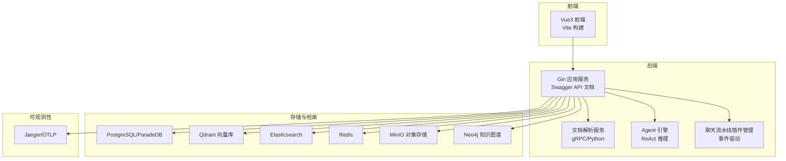
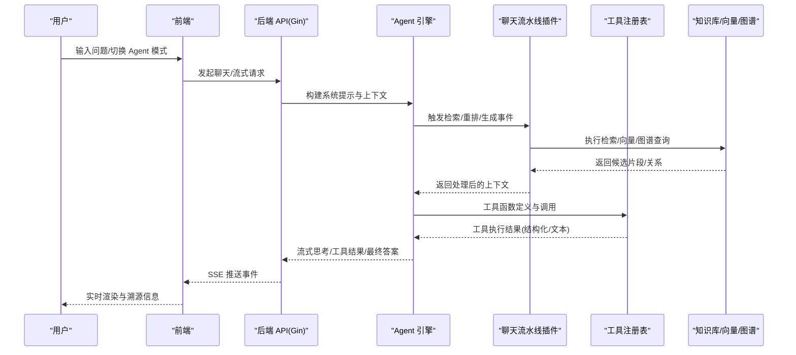
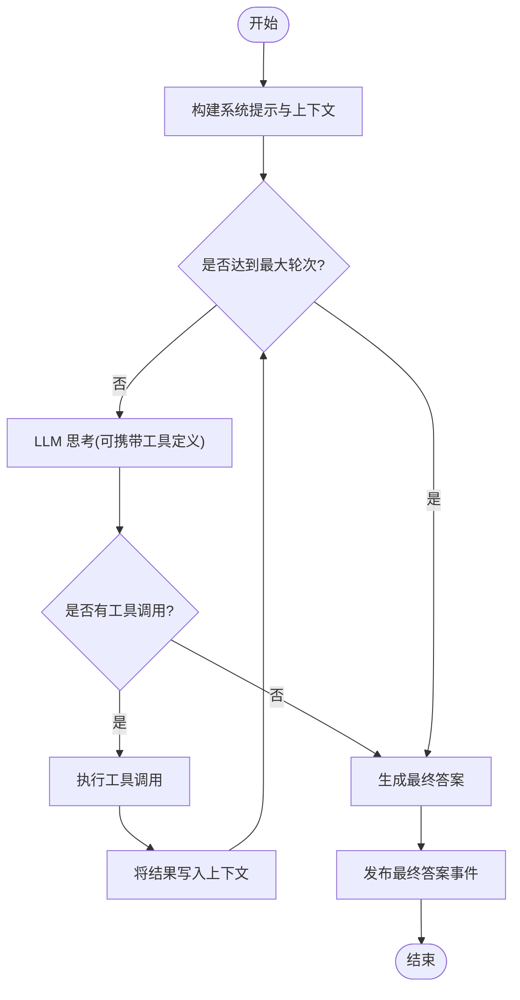
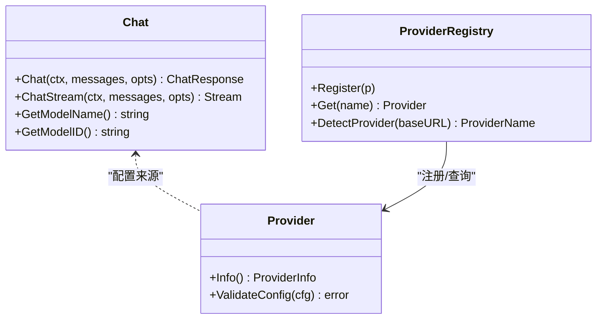
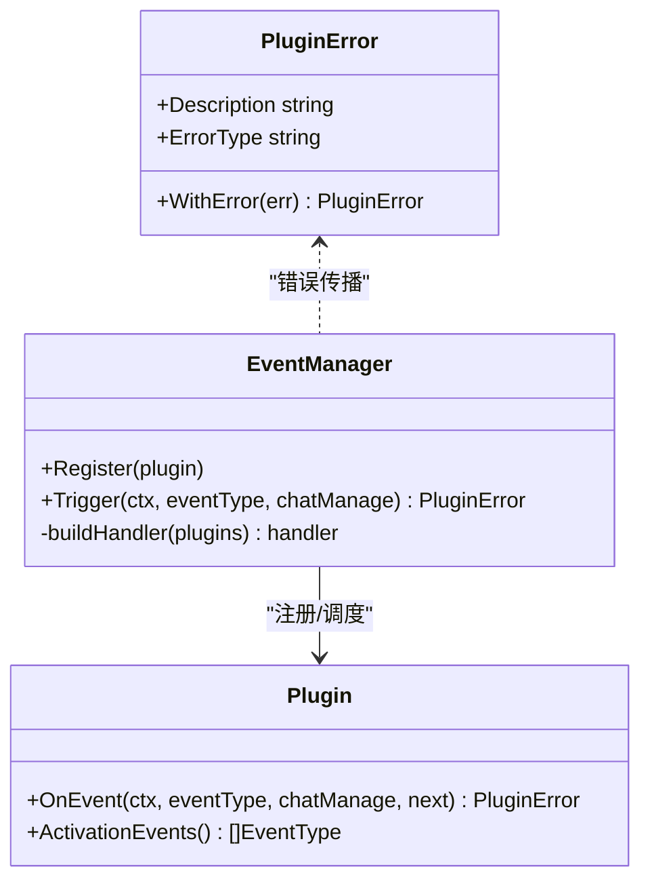
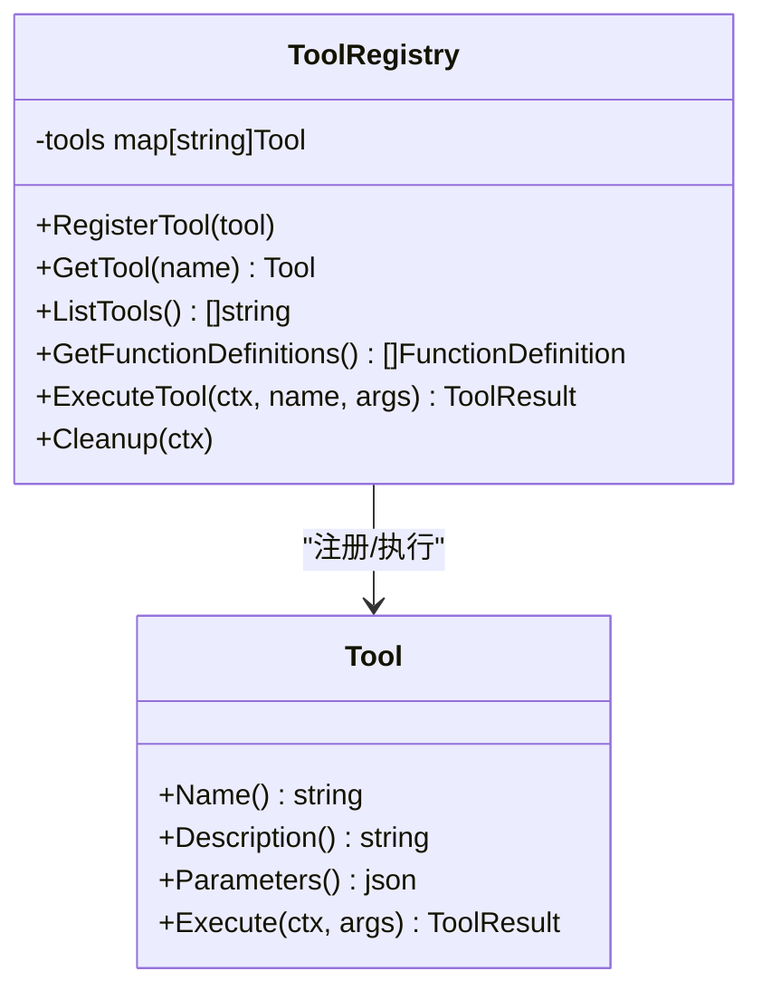
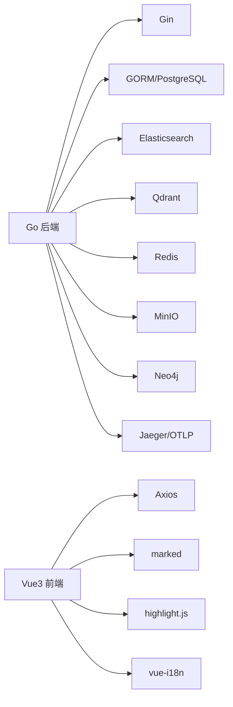

# 项目概述

<cite>
**本文引用的文件**   
- [README.md](file://README.md)
- [README_CN.md](file://README_CN.md)
- [cmd/server/main.go](file://cmd/server/main.go)
- [internal/agent/engine.go](file://internal/agent/engine.go)
- [internal/agent/tools/registry.go](file://internal/agent/tools/registry.go)
- [internal/application/service/chat_pipline/chat_pipline.go](file://internal/application/service/chat_pipline/chat_pipline.go)
- [internal/models/chat/chat.go](file://internal/models/chat/chat.go)
- [internal/models/provider/provider.go](file://internal/models/provider/provider.go)
- [config/config.yaml](file://config/config.yaml)
- [docker-compose.yml](file://docker-compose.yml)
- [go.mod](file://go.mod)
- [VERSION](file://VERSION)
- [CHANGELOG.md](file://CHANGELOG.md)
- [client/client.go](file://client/client.go)
- [frontend/package.json](file://frontend/package.json)
</cite>

## 目录
1. [简介](#简介)
2. [项目结构](#项目结构)
3. [核心组件](#核心组件)
4. [架构总览](#架构总览)
5. [详细组件分析](#详细组件分析)
6. [依赖分析](#依赖分析)
7. [性能考量](#性能考量)
8. [故障排查指南](#故障排查指南)
9. [结论](#结论)
10. [附录](#附录)

## 简介
WiseDx 是一款面向医疗健康领域的专业级 RAG（检索增强生成）问答与智能代理框架，旨在解决医学文档结构复杂、术语专业性强、知识更新快等挑战。项目融合多模态医学文档解析、医学领域语义向量索引、循证医学知识图谱增强以及 Agent 推理机制，为临床医生、研究人员与医疗信息化从业者提供专业、精准、可溯源的医学知识服务。

- 核心价值与定位
  - 以“循证医学”为核心理念，将检索结果与临床逻辑对齐，确保回答具备权威性与可追溯性。
  - 提供医学 Agent 模式，支持 ReAct 架构下的自主规划与推理，结合工具调用（知识库检索、网络搜索、计算器等）生成深度报告。
  - 支持多模态医学文档解析（PDF、Word、医学影像报告等），并具备术语映射与多模态理解能力。
  - 提供混合检索引擎，结合 MeSH 等医学词表、语义向量与关系召回，显著提升召回准确率。
  - 支持私有化与本地化部署，满足医疗数据安全与隐私保护要求。

- 应用场景示例
  - 临床决策支持：快速检索指南、辅助鉴别诊断、减少误诊风险。
  - 医学科研辅助：海量文献语义检索、综述生成、前沿追踪。
  - 药学知识服务：药物相互作用查询、禁忌核对、说明书检索。
  - 医疗合规审查：质量指标核查、病历规范性建议、法规查询。

- 版本与许可
  - 当前版本：0.2.10
  - 许可协议：MIT

**章节来源**
- file://README.md#L32-L98
- file://README_CN.md#L32-L98
- file://VERSION#L1-L2
- file://CHANGELOG.md#L5-L42

## 项目结构
WiseDx 采用前后端分离与多服务编排的架构，后端以 Go 语言实现，前端采用 Vue3 + TypeScript，服务通过 Docker Compose 编排，支持 PostgreSQL/ParadeDB、Redis、MinIO、Qdrant、Neo4j、Jaeger 等基础设施。

**图表来源**
- [docker-compose.yml](file://docker-compose.yml#L1-L271)
- [cmd/server/main.go](file://cmd/server/main.go#L1-L193)

**章节来源**
- file://docker-compose.yml#L1-L271
- file://cmd/server/main.go#L1-L193

## 核心组件
- 服务入口与容器
  - 后端服务入口负责加载环境变量、构建依赖注入容器、初始化路由与中间件、启动 HTTP 服务与优雅关停流程。
- Agent 引擎
  - 基于 ReAct 的推理循环，支持工具注册与调用、事件总线驱动、上下文管理与最终答案合成。
- 聊天与模型适配
  - 统一的 Chat 接口抽象，支持本地 Ollama 与多家远程模型提供商（OpenAI、阿里云 DashScope、智谱、Google Gemini 等）。
- 提供商注册与检测
  - 内置多家模型提供商注册表，支持按 BaseURL 自动检测与配置校验。
- 聊天流水线插件
  - 事件驱动的插件体系，支持在检索、重排、生成等阶段插入处理逻辑。
- 配置系统
  - YAML 配置集中管理对话策略、提示模板、分块策略、知识图谱开关等。
- 前端与客户端
  - 前端基于 Vue3 + TypeScript，提供多语言、知识库管理、会话交互与工具结果渲染；Go 客户端封装 API 调用与鉴权头。

**章节来源**
- file://cmd/server/main.go#L47-L193
- file://internal/agent/engine.go#L25-L155
- file://internal/models/chat/chat.go#L64-L129
- file://internal/models/provider/provider.go#L12-L278
- file://internal/application/service/chat_pipline/chat_pipline.go#L9-L141
- file://config/config.yaml#L1-L585
- file://client/client.go#L16-L105
- file://frontend/package.json#L1-L58

## 架构总览
WiseDx 的整体架构围绕“文档解析—索引—检索—重排—生成—Agent 推理—前端交互”的闭环展开。后端通过 Gin 提供 REST/SSE 接口，Agent 引擎负责 ReAct 推理与工具调用，聊天流水线插件在关键节点注入处理逻辑，前端通过 SSE 实时渲染思考过程与工具结果。

**图表来源**
- [internal/agent/engine.go](file://internal/agent/engine.go#L75-L521)
- [internal/agent/tools/registry.go](file://internal/agent/tools/registry.go#L47-L114)
- [internal/application/service/chat_pipline/chat_pipline.go](file://internal/application/service/chat_pipline/chat_pipline.go#L23-L78)

**章节来源**
- file://internal/agent/engine.go#L75-L521
- file://internal/agent/tools/registry.go#L47-L114
- file://internal/application/service/chat_pipline/chat_pipline.go#L23-L78

## 详细组件分析

### Agent 引擎与 ReAct 推理
- 执行流程
  - 初始化系统提示、工具列表与消息上下文，进入多轮迭代的“思考-行动-观察-反思”循环。
  - 支持工具重复调用限制、用户输入等待（如选项展示）、最终答案合成与溯源引用。
- 事件驱动
  - 通过 EventBus 发布思考、工具调用、工具结果、最终答案等事件，前端通过 SSE 实时渲染。
- 上下文持久化
  - 将工具调用与结果写入上下文管理器，确保多轮对话的连贯性与可回溯性。

**图表来源**
- [internal/agent/engine.go](file://internal/agent/engine.go#L157-L521)

**章节来源**
- file://internal/agent/engine.go#L75-L521

### 聊天模型与多提供商适配
- 抽象与工厂
  - Chat 接口统一本地与远程模型调用；NewChat 根据模型来源选择 Ollama 或远程 API 实现。
- 提供商检测与配置
  - DetectProvider 基于 BaseURL 自动识别提供商；Provider 注册表支持多种厂商与默认 URL 映射。
- 特殊处理
  - 针对 LKEAP、Qwen3、DeepSeek 等提供者进行参数与行为适配。

**图表来源**
- [internal/models/chat/chat.go](file://internal/models/chat/chat.go#L64-L129)
- [internal/models/provider/provider.go](file://internal/models/provider/provider.go#L121-L278)

**章节来源**
- file://internal/models/chat/chat.go#L64-L129
- file://internal/models/provider/provider.go#L121-L278

### 聊天流水线插件与事件管理
- 插件接口
  - Plugin 定义 OnEvent 与激活事件集合；EventManager 负责注册、链式构建与触发。
- 错误模型
  - 预定义多种 PluginError，便于在检索、重排、模板解析、模型调用等环节统一错误处理与上报。

**图表来源**
- [internal/application/service/chat_pipline/chat_pipline.go](file://internal/application/service/chat_pipline/chat_pipline.go#L9-L141)

**章节来源**
- file://internal/application/service/chat_pipline/chat_pipline.go#L9-L141

### 工具注册表与工具调用
- 注册与发现
  - ToolRegistry 维护工具名称到实现的映射，提供函数定义导出与执行。
- 执行与清理
  - 执行时记录管道日志；支持特定工具的清理逻辑（如数据分析工具）。

**图表来源**
- [internal/agent/tools/registry.go](file://internal/agent/tools/registry.go#L12-L114)

**章节来源**
- file://internal/agent/tools/registry.go#L12-L114

### 配置系统与提示模板
- 对话策略
  - 控制最大轮次、阈值、重排策略、改写与查询扩展、回退策略与提示等。
- 提示模板
  - 系统提示、改写提示、关键词抽取、摘要生成、实体抽取与关系抽取等模板集中管理。
- 知识库与提取
  - 分块大小与重叠、图像处理开关、实体/关系抽取示例与描述模板。

**章节来源**
- file://config/config.yaml#L6-L585

### 前端与客户端
- 前端
  - Vue3 + TypeScript，支持多语言、知识库管理、会话界面、工具结果渲染与 SSE 流式显示。
- Go 客户端
  - 封装 HTTP 请求、鉴权头（Bearer Token 与 X-API-Key）、请求 ID 传递与响应解析。

**章节来源**
- file://frontend/package.json#L1-L58
- file://client/client.go#L16-L105

## 依赖分析
- 后端依赖
  - Web 框架：Gin
  - ORM/数据库：GORM + PostgreSQL/ParadeDB
  - 搜索与向量：Elasticsearch v7/v8、Qdrant
  - 图谱：Neo4j
  - 缓存与消息：Redis
  - 对象存储：MinIO
  - 日志与追踪：OpenTelemetry(Jaeger)
  - 解析与 OCR：chromedp、DuckDB、goquery、jieba
- 前端依赖
  - Vue3、Axios、marked、highlight.js、Swiper、Pinia、Vue Router、i18n 等。

**图表来源**
- [go.mod](file://go.mod#L7-L55)
- [frontend/package.json](file://frontend/package.json#L14-L34)

**章节来源**
- file://go.mod#L7-L55
- file://frontend/package.json#L14-L34

## 性能考量
- 检索与重排
  - 合理设置关键词阈值、向量 top_k、重排阈值与 top_k，平衡召回与速度。
  - 启用并行搜索与结果融合策略，缩短响应时间。
- 流式输出
  - 使用 SSE 流式传输，前端逐步渲染，降低首屏等待。
- 并发与资源
  - 合理配置并发池大小与数据库连接池，避免过载。
- 模型与提供商
  - 选择合适的模型与提供商，关注延迟与成本；对长上下文模型启用思考模式时注意 token 限制。

[本节为通用指导，无需列出具体文件来源]

## 故障排查指南
- 环境变量缺失
  - 启动时会校验数据库等关键环境变量，缺失会导致启动失败。请检查 .env 或系统环境变量。
- 服务健康检查
  - 应用服务健康检查路径为 /health，确保数据库、文档解析服务健康。
- 日志与追踪
  - 启用 LOG_FILE 可将日志输出到文件；Jaeger/OTLP 用于分布式追踪与性能分析。
- 常见问题
  - Docker 端口冲突、MinIO/Neo4j/Qdrant 配置错误、模型提供商鉴权失败等。请查看对应容器日志与配置文件。

**章节来源**
- file://cmd/server/main.go#L47-L193
- file://docker-compose.yml#L34-L140

## 结论
WiseDx 以“循证医学”为核心，结合多模态解析、语义向量索引、知识图谱增强与 ReAct Agent 推理，构建了面向医疗领域的专业 RAG 框架。其模块化设计、事件驱动的流水线插件体系与完善的可观测性，使其在准确性、可追溯性与可维护性方面具备显著优势。通过 Docker Compose 一键编排，可快速搭建本地或私有云部署环境，满足医疗场景对安全性与隐私性的严格要求。

[本节为总结性内容，无需列出具体文件来源]

## 附录

### 版本与变更
- 当前版本：0.2.10
- 近期新增：Google 搜索提供商、GPUStack 多模型支持、AgentQA 字段、FAQ 批量导入预演、并发索引优化、任务 ID 生成器升级等。

**章节来源**
- file://VERSION#L1-L2
- file://CHANGELOG.md#L5-L42

### 许可与致谢
- 许可协议：MIT
- 致谢 WeKnora 开源框架，为其在 RAG 与 Agent 能力上的模块化设计与多向量库支持奠定了基础。

**章节来源**
- file://README.md#L95-L98
- file://README_CN.md#L95-L98