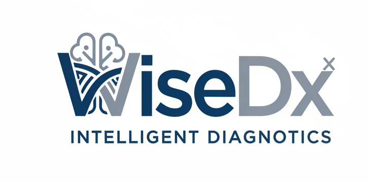

<p align="center">
  <picture>
    
  </picture>
</p>

<p align="center">
    <a href="https://github.com/Tencent/WeKnora/blob/main/LICENSE">
        
    </a>
    <a href="./CHANGELOG.md">
        
    </a>
</p>

<p align="center">
| <a href="./README.md"><b>English</b></a> | <b>简体中文</b> |
</p>

<p align="center">
  <h4 align="center">

  [项目介绍](#-项目介绍) • [核心特性](#-核心特性) • [医学能力](#-医学能力) • [快速开始](#-快速开始) • [致谢](#-致谢)

  </h4>
</p>

# 💡 WiseDx - 专业医学 RAG 智能问答与检索框架

## 📌 项目介绍

**WiseDx (慧诊)** 是一款专为医疗健康领域打造的、基于大语言模型（LLM）的医学知识理解与检索增强生成（RAG）框架。它致力于解决医学文档结构复杂（如临床指南、病历记录、医学论文等）、术语专业性强、知识更新快等挑战。

通过融合多模态医学文档解析、医学领域语义向量索引、循证医学知识图谱增强及 Agent 推理机制，WiseDx 能够为医疗工作者和科研人员提供专业、精准、可溯源的医学知识服务。

## ✨ 核心特性

- **🤖 医学 Agent 模式**：基于 ReACT 架构，支持自主规划推理，可调用医学指南检索、网络学术搜索、专业计算工具等，提供深度医学总结报告。
- **🔍 多模态医学解析**：深度支持 PDF、Word、医疗影像报告等格式，精准提取医学表格、图表说明及专业术语。
- **🧠 循证医学增强**：在 RAG 流程中引入医学知识图谱，确保检索结果符合临床逻辑，提升回答的专业性与权威性。
- **⚡ 混合检索引擎**：结合医学 MeSH 词表支持的关键词检索、临床语义向量检索与关系召回，极大提升召回准确率。
- **🔒 私有化安全部署**：支持本地化及私有云部署，确保患者隐私与医疗敏感数据的绝对安全。

## 📊 医学应用场景

| 应用场景 | 具体应用 | 核心价值 |
|---------|----------|----------|
| **临床决策支持** | 诊疗指南查询、复杂病例分析建议、鉴别诊断辅助 | 辅助临床医生快速获取循证证据，降低误诊风险 |
| **医学科研辅助** | 海量文献语义检索、研究综述生成、学术前沿追踪 | 加速文献调研效率，发现潜在的研究关联 |
| **药学知识服务** | 药物相互作用查询、用药禁忌核对、新药说明书检索 | 提升临床用药安全，提供实时药学咨询 |
| **医疗合规审查** | 医疗质量指标核查、病历规范性建议、法律法规查询 | 提高医疗质量管理自动化水平，降低合规风险 |

## 🧩 医学专业能力

- **✅ 术语映射**：支持 ICD-10、MeSH、SNOMED CT 等标准医学术语集的映射与检索。
- **✅ 文献溯源**：生成的每一个回答均可精确追溯至原始医学文献、指南或病历片段。
- **✅ 多模态理解**：支持对包含心电图、医学影像描述及化验单图像的文档进行深度解析。
- **✅ 临床逻辑推理**：Agent 具备初步的临床思维，能根据观察到的症状-体征进行链式推理。

## 🚀 快速开始

### 🛠 环境要求

确保本地已安装以下工具：
* [Docker](https://www.docker.com/)
* [Docker Compose](https://docs.docker.com/compose/)
* [Git](https://git-scm.com/)

### 📦 安装步骤

```bash
# 克隆代码仓库
git clone https://github.com/Tencent/WeKnora.git
cd WeKnora

# 配置环境变量
cp .env.example .env

# 启动服务
./scripts/start_all.sh
```

更多详细安装说明请参考 [开发指南](./docs/开发指南.md)。

## 🙏 致谢

**WiseDx** 的核心架构与技术实现深度参考并采用了 [**WeKnora**](https://github.com/Tencent/WeKnora) 开源框架。

WeKnora 是由腾讯微信对话开放平台团队开发的优秀 RAG 框架，其模块化的设计、强大的 Agent 能力以及对多种向量数据库的支持，为 WiseDx 在医学领域的垂直化落地提供了坚实的技术支撑。在此对 WeKnora 团队及全体贡献者的开源精神表示诚挚感谢。

## 📄 许可证

本项目基于 [MIT](./LICENSE) 协议发布。
